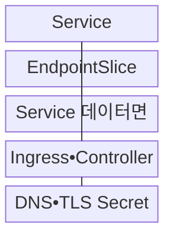
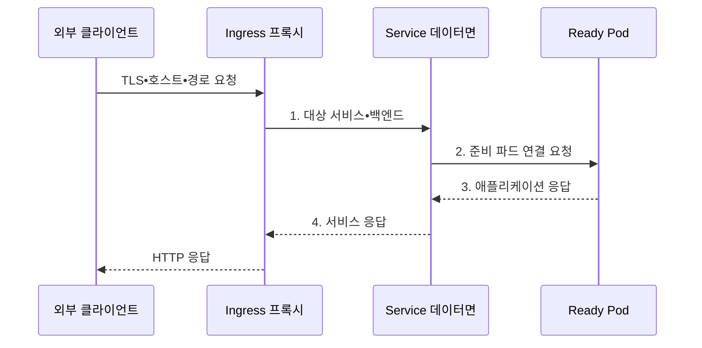

---
sidebar:
  order: 155
  label: "155. 쿠버네티스 서비스•인그레스 (Kubernetes Service Ingress)"
  badge:
    text: "기출 • 70%"
    variant: note
title: "쿠버네티스 서비스•인그레스 (Kubernetes Service Ingress)"
date: "2026-08-03T08:48:47+09:00"
tags:
  - "notes-software"
weight: 155
extra:
  question_no: "155"
  source_status: "기출"
  source_history: "137회"
  priority: 70
  priority_note: "서비스 노출과 경로 제어가 최근 설계축임"
---

## Ⅰ. 개요

핵심 용어

- **쿠버네티스 서비스•인그레스(Kubernetes Service•Ingress)**: 서비스는 변하는 파드 집합에 고정 접점과 부하 분산을 제공하고, 인그레스는 외부 HTTP•HTTPS 요청의 호스트•경로를 서비스로 연결한다.

- 정의/개념: 서비스가 파드의 고정 접점을 제공하고 인그레스가 **외부 HTTP•HTTPS 경로** 를 서비스로 분기하는 노출 구조
- 배경/필요성: 파드 주소 변화로 클라이언트 직접 접속과 **외부 경로 유지 불가**

#### 한줄 요약
- 파드가 교체돼 주소가 바뀌어도 Service라는 대표번호는 유지되고 Ingress는 외부 요청의 주소와 경로를 보고 대표번호를 선택한다.

## Ⅱ. 특징

핵심 용어

- **준비 엔드포인트**: 서비스는 준비 상태인 파드의 주소를 엔드포인트로 구성해 정상 대상에만 트래픽을 전달한다.
- **가상 인터넷 프로토콜 주소(Virtual Internet Protocol Address, Virtual IP)**: 파드 주소가 바뀌어도 서비스가 유지하는 안정적인 논리 접점이다.
- **전송 계층 보안(Transport Layer Security, TLS) 기반 응용 계층(Layer 7, L7) 라우팅**: 암호화된 웹 요청의 호스트•경로를 기준으로 백엔드를 선택하는 방식이다.

- **고정 이름•가상 IP** 기반 안정 접점
- **준비 엔드포인트** 기반 트래픽 전달
- 호스트•경로와 **TLS 기반 L7 라우팅**

#### 한줄 요약
- Service는 준비된 파드 목록을 한 주소 뒤에 모으고 인그레스 컨트롤러는 선언된 웹 규칙을 실제 프록시 설정으로 바꾼다.

## Ⅲ. 구조 및 구성요소

핵심 용어

- **EndpointSlice**: EndpointSlice는 서비스가 사용할 백엔드 네트워크 주소와 준비 상태를 분산 저장하는 리소스다.
- **서비스 데이터면**: 가상 인터넷 프로토콜 주소와 포트를 준비된 백엔드로 전달하는 실행 경로이다.
- **인그레스 컨트롤러(Ingress Controller)**: 인그레스 규칙을 실제 프록시•로드밸런서 설정으로 구현하는 구성요소이다.
- **도메인 이름 시스템(Domain Name System, DNS)•TLS 시크릿**: 외부 서비스 이름과 암호화 통신용 인증서를 제공하는 구성요소이다.

| 구성요소 | 책임 |
|:---|:---|
| Service | 선택자•포트•**가상 IP 선언** |
| EndpointSlice | 파드 주소•**준비 상태 저장** |
| Service 데이터면 | 가상 IP•**백엔드 L4 전달** |
| Ingress•Controller | **호스트•경로 규칙** 구현 |
| DNS•TLS Secret | **외부 이름•인증서** 제공 |

#### 한줄 요약

- DNS와 인증서가 건물 이름과 신분을 보장하면 인그레스가 안내하고 Service가 준비된 파드 중 한 곳으로 연결한다.

## Ⅳ. 흐름도

핵심 용어

- **2. 준비 파드 연결 요청**: 서비스 선택자와 준비 상태를 기준으로 요청을 전달할 파드 엔드포인트가 연결된다.
- **1. 대상 서비스•백엔드**: 인그레스의 호스트•경로 규칙으로 내부 서비스와 포트를 선택한 결과이다.
- **3. 애플리케이션 응답**: 파드가 처리 결과를 서비스 데이터면으로 반환하는 단계이다.
- **4. 서비스 응답**: 백엔드 처리 결과를 인그레스 프록시에 전달하는 단계이다.

**동작 원리**

1. **대상 서비스•백엔드**: 인그레스 규칙과 서비스 접점 대조
2. **준비 파드 연결 요청**: EndpointSlice에서 준비된 목적지 선택
3. **애플리케이션 응답**: 파드의 처리 결과를 서비스 경로로 반환
4. **서비스 응답**: 인그레스 프록시에 백엔드 결과 전달

#### 한줄 요약

- 외부 요청은 인그레스에서 호스트와 경로로 서비스가 정해지고 그 서비스의 준비된 파드에만 전달된다.

## Ⅴ. 종류 및 비교

핵심 용어

- **Ingress**: Ingress는 호스트와 경로 규칙에 따라 외부 L7 요청을 내부 서비스로 라우팅하는 API 리소스다.
- **서비스(Service)**: 변하는 파드 집합에 고정 이름•가상 주소와 전송 계층(Layer 4, L4) 부하 분산을 제공하는 리소스이다.
- **인그레스(Ingress)**: 호스트와 경로 규칙에 따라 외부 응용 계층(Layer 7, L7) 요청을 내부 서비스로 라우팅하는 응용 프로그래밍 인터페이스(Application Programming Interface, API) 리소스이다.

| 노출 객체 | Service | Ingress |
|:---|:---|:---|
| 적용 기준 | **내부 발견•안정 L4 접점** | **외부 HTTP•L7 분기** |
| 핵심 특징 | **선택자•EndpointSlice** 기반 포트 전달 | **호스트•경로•TLS** 기반 백엔드 분기 |
| 한계 | 선택자•포트 불일치로 **엔드포인트 누락** | 컨트롤러•클래스별 **경로•인증서 의존** |

#### 한줄 요약
- Service는 파드 교체를 숨기는 내부 접점이고 Ingress는 여러 접점을 하나의 외부 주소와 인증서 뒤에 배치하는 규칙이다.

## Ⅵ. 실무 고려사항 및 대책

핵심 용어

- **백엔드 누락**: 백엔드 누락은 선택자 불일치나 준비 실패로 서비스에 연결할 엔드포인트가 없는 문제다.
- **연결 배출•유예**: 종료 파드를 준비 대상에서 제외하고 진행 중인 연결이 끝날 시간을 보장하는 절차이다.
- **네트워크 정책(NetworkPolicy)•웹 애플리케이션 방화벽(Web Application Firewall, WAF)**: 파드 간 네트워크와 외부 웹 요청의 비인가 접근을 제한하는 통제이다.

| 문제 | 대책 | 효과 |
|:---|:---|:---|
| **선택자•포트 불일치** | 레이블•targetPort•**목록 대조** | **백엔드 누락** 방지 |
| 종료 파드 **요청 유입** | 준비 검사•**연결 배출•유예** 적용 | 처리 중 **연결 단절 감소** |
| **인증서•DNS 불일치** | 자동 갱신•**만료 경보•대상 검증** | 외부 **접속 실패 예방** |
| 컨트롤러별 **경로 차이** | **명시 경로•통합 시험** 적용 | 재작성•**우선순위 오류 감소** |
| 관리 경로 **외부 노출** | 인증•**NetworkPolicy•WAF** 적용 | **비인가 관리 접근** 차단 |

#### 한줄 요약
- 배포 중 파드가 바뀌어도 내부 호출은 Service 이름을 사용하고 준비 해제와 연결 배출을 묶어 기존 요청이 끝날 시간을 확보해야 한다.

## Ⅶ. 결론

핵심 용어

- **외부 L7•TLS 진입**: Ingress와 컨트롤러는 외부 L7 라우팅과 TLS 종료 지점을 제공한다.

- **내부 호출** 은 Service, **외부 L7•TLS 진입** 은 Ingress로 분리

#### 한줄 요약
- 내부 통신은 Service 이름을 기준으로 하고 외부 웹 진입만 Ingress에 모아 주소 안정성과 경로 정책을 분리해야 한다.
