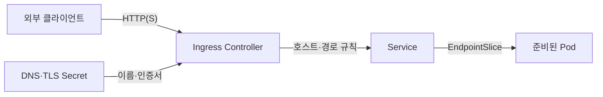
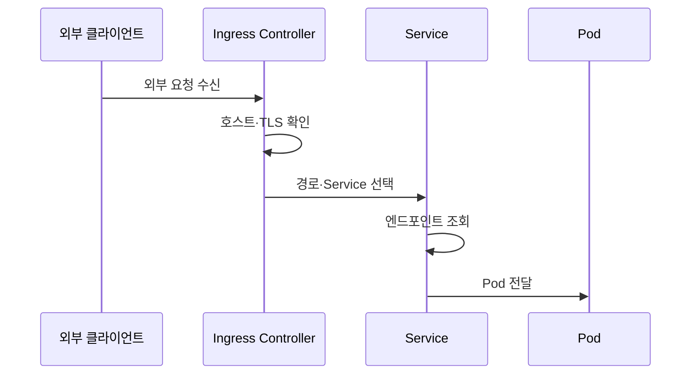

---
sidebar:
  order: 155
  label: "155. 쿠버네티스 서비스·인그레스 (Kubernetes Service Ingress)"
  badge:
    text: "기출 · 70%"
    variant: note
title: "쿠버네티스 서비스·인그레스 (Kubernetes Service Ingress)"
date: "2026-07-25T00:40:00+09:00"
tags:
  - "notes-software"
weight: 155
extra:
  question_no: "155"
  source_status: "기출"
  source_history: "137회"
  priority: 70
  priority_note: "서비스 노출과 경로 제어가 최근 설계축임"
---

## 미리 알고가기

- **서비스(Service)**: 교체되는 포드 집합에 고정 인터넷 프로토콜 주소·도메인 이름·포트를 제공하는 쿠버네티스 네트워크 객체
- **파드(Pod)**: 같은 노드에 배치되어 네트워크를 공유하는 최소 컨테이너 실행 단위
- **도메인 이름 시스템(Domain Name System, DNS)**: ‘디엔에스’로 읽고 세 영문 단어의 머리글자를 딴 표기이며 호스트 이름을 네트워크 주소로 변환하는 이름 서비스
- **인터넷 프로토콜(Internet Protocol, IP)**: ‘아이피’로 읽고 두 영문 단어의 머리글자를 딴 표기이며 서비스와 포드의 네트워크 주소를 식별하는 통신 규약
- **엔드포인트 슬라이스(EndpointSlice)**: Service가 전달할 준비된 Pod IP·포트를 분할 저장하는 객체
- **ClusterIP·NodePort·LoadBalancer**: 클러스터 내부 가상 IP, 모든 노드의 고정 포트, 외부 로드밸런서로 Service를 각각 노출하는 유형
- **하이퍼텍스트 전송 프로토콜·보안형 HTTP(Hypertext Transfer Protocol·HTTP Secure, HTTP·HTTPS)**: 각각 ‘에이치티티피·에이치티티피에스’로 읽고 영문 머리글자와 보안을 뜻하는 S를 붙인 표기이며 인그레스가 호스트·경로를 판정하고 암호화하는 응용 계층 규약
- **인그레스(Ingress)**: HTTP(S) 호스트·경로 규칙을 서비스 백엔드에 연결하는 API 객체
- **인그레스 컨트롤러(Ingress Controller)**: Ingress를 감시해 프록시·로드밸런서의 실제 라우팅 설정으로 구현하는 소프트웨어
- **인그레스 클래스(IngressClass)**: Ingress를 처리할 컨트롤러와 설정 종류를 지정하는 객체
- **전송 계층 보안(Transport Layer Security, TLS)**: 인증서로 서버 신원을 확인하고 HTTP 통신을 암호화하는 규약
- **시크릿(Secret)**: 인증서·토큰 같은 민감 설정을 저장하는 Kubernetes 객체
- **게이트웨이 API(Gateway API)**: ‘게이트웨이 에이피아이’로 읽으며 인프라·라우팅 역할을 객체별로 분리해 HTTP와 확장 경로를 구성하는 후속 API
- **계층 4·계층 7(Layer 4·Layer 7, L4·L7)**: ‘엘포·엘세븐’으로 읽고 Layer의 머리글자 뒤에 계층 번호를 붙인 표기이며 L4는 포트·전송 연결, L7은 HTTP 호스트·경로로 전달 대상을 판정함
- **통합 자원 식별자(Uniform Resource Locator, URL)**: ‘유알엘’로 읽고 세 영문 단어의 머리글자를 딴 관례 표기이며 인그레스가 서비스 백엔드를 고를 때 사용하는 요청 경로를 포함함

## Ⅰ. 개요

- **정의/개념**: Service는 접점, Ingress는 경로 규칙
- **배경/필요성**: Pod 주소 교체로 안정된 서비스 경로 필요

### 쉽게 이해하기 (학습용)
- 서비스는 고정 접점이고 인그레스는 연결 규칙임

## Ⅱ. 특징

- Service가 Pod 교체와 고정 접근 주소를 분리한다.
- Ingress는 여러 Service를 외부 접점에서 분기한다.

### 쉽게 이해하기 (학습용)
- 서비스가 내부 목적지를, 인그레스가 규칙을 반영함

## Ⅲ. 아키텍처 및 구성요소

| 설계 요소 | 설명 |
|:---|:---|
| Service·EndpointSlice | 가상 IP를 선언하고 준비된 포트를 연결함 |
| 서비스 데이터 경로 | 트래픽을 가상 IP 등을 통해 백엔드로 전달함 |
| Ingress 객체 | 호스트와 경로 및 서비스 백엔드를 선언함 |
| IngressClass·Controller | 규칙 구현을 선택하고 프록시 설정에 반영함 |
| Secret·DNS | TLS 인증서·외부 호스트 이름 제공 |

> 요약: 외부 요청은 인그레스를 거쳐 서비스로 전달됨

### 쉽게 이해하기 (학습용)
- 인그레스와 서비스가 외부 요청을 파드까지 연결함

## Ⅳ. 원리 및 절차 흐름도

| 절차 | 설명 |
|:---|:---|
| 외부 요청 수신 | 외부 HTTP(S)가 컨트롤러에 도달 |
| 호스트·TLS 확인 | 호스트 규칙·인증서 선택 |
| 경로·Service 선택 | URL 경로와 백엔드 Service 연결 |
| 엔드포인트 조회 | 준비된 Pod IP·포트 선택 |
| Pod 전달 | 선택한 Pod로 요청 전달 |

> 요약: 판정 결과가 서비스와 준비된 파드 선택의 입력임

### 쉽게 이해하기 (학습용)
- 호스트 선택 후 서비스가 백엔드로 요청 전달

## Ⅴ. 종류 및 비교

| 비교축 | Service | Ingress |
|:---|:---|:---|
| 핵심 특징 | 포트 중심으로 L4 수준에서 접근함 | HTTP 호스트와 경로 기준으로 접근함 |
| 적용 기준 | 내부 Pod 통신·단순 L4 접근 | 도메인 경로·TLS 종단 필요 |
| 주요 위험 | 셀렉터 오류·엔드포인트 누락 | 라우팅·TLS 설정 오류 |

> 요약: 서비스는 내부 접점이고 인그레스는 L7 분기임

### 쉽게 이해하기 (학습용)
- 서비스는 내부 대표번호, 인그레스는 안내 데스크임

## Ⅵ. 실무 사례

1. 내부 API는 ClusterIP로 준비된 Pod만 연결
2. 웹 서비스는 Ingress에서 호스트별 TLS·경로 분기

### 쉽게 이해하기 (학습용)
- 내부 API는 바뀌는 Pod 대신 고정 Service 주소를 사용한다.
- 외부 웹 요청은 도메인과 경로에 따라 알맞은 Service로 보낸다.

## Ⅶ. 결론

- 내부 접점은 Service, 외부 분기는 Ingress

### 쉽게 이해하기 (학습용)
- 고정 내부 주소와 외부 웹 규칙을 한 객체에 섞지 않는다.
