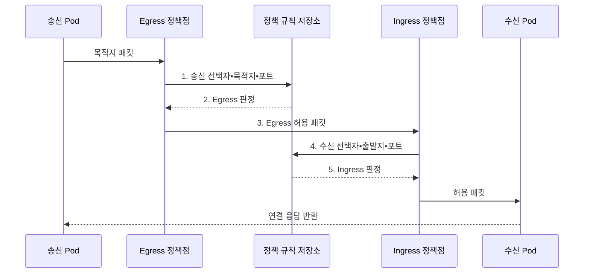

---
sidebar:
  order: 156
  label: "156. 쿠버네티스 NetworkPolicy•CNI (Kubernetes NetworkPolicy CNI)"
  badge:
    text: "기출 • 70%"
    variant: note
title: "쿠버네티스 NetworkPolicy•CNI (Kubernetes NetworkPolicy CNI)"
date: "2026-08-05T00:00:00+09:00"
tags:
  - "notes-software"
weight: 156
extra:
  question_no: "156"
  source_status: "기출"
  source_history: "137회"
  priority: 70
  priority_note: "통신 연결과 정책 집행 구조가 최근 출제됨"
---

## Ⅰ. 개요

<details>
<summary>핵심 용어</summary>

- **컨테이너 네트워크 인터페이스(Container Network Interface, CNI)**: 파드 인터페이스와 연결성을 구현하는 플러그인 규격이다.
- **네트워크 정책(NetworkPolicy)**: 선택한 파드의 허용 송수신 통신을 선언하는 리소스이다.

</details>

- 정의/개념: 파드 연결과 허용 통신을 분리한 **CNI•NetworkPolicy** 체계
- 배경/필요성: 평면 네트워크는 침해 파드의 **불필요한 횡적 이동** 허용

#### 한줄 요약
- CNI가 모든 파드 사이에 길을 놓은 뒤 NetworkPolicy가 출발지와 도착지의 허용 목록을 적용해 필요한 통신만 남긴다.

## Ⅱ. 특징

<details>
<summary>핵심 용어</summary>

- **송신•수신 양방향 허용**: 통신은 송신 측 Egress와 수신 측 Ingress 정책이 각각 허용해야 성립할 수 있다.
- **연결 구성**: 파드 주소와 네트워크 경로를 생성하는 책임이다.
- **정책 통제**: 패킷의 허용과 차단을 판정하는 책임이다.
- **선택 방향 격리**: 네트워크 정책이 선택한 파드와 지정한 송신•수신 방향에만 기본 격리가 적용되는 특성이다.

</details>

- **연결 구성•정책 통제 분리** 기반 집행
- **선택 방향 격리** 기반 허용 합집합
- **송신•수신 양방향 허용** 기반 통신

#### 한줄 요약
- 정책 객체만 작성하고 CNI가 그 기능을 집행하지 않으면 문서상의 출입 명단만 있고 실제 문에는 잠금장치가 없는 상태가 된다.

## Ⅲ. 구조 및 구성요소

<details>
<summary>핵심 용어</summary>

- **정책 제어기**: NetworkPolicy를 해석해 집행 규칙으로 변환하는 구성요소이다.
- **데이터면**: 실제 패킷의 허용과 차단을 집행하는 구성요소이다.
- **인터넷 프로토콜 주소 관리(Internet Protocol Address Management, IPAM)**: 파드에 인터넷 프로토콜 주소를 할당•회수하고 주소 풀을 관리하는 기능이다.
- **파드•네임스페이스 레이블**: 보호 대상과 허용 상대를 선택하는 키•값 메타데이터이다.

</details>

```text
[컨테이너 런타임] ----- [CNI•IPAM] ----- [파드•네임스페이스 레이블]
                                                |
                                      [NetworkPolicy]
                                                |
                                    [정책 제어기•데이터면]
```

선의 의미: 컨테이너 런타임과 CNI•IPAM은 파드 네트워크 및 레이블 자원에 결합되고, 레이블 아래에는 허용 통신을 선언하는 NetworkPolicy와 이를 집행하는 정책 제어기•데이터면이 놓이는 정적 정책 계층을 뜻한다.

| 구성요소 | 책임 |
|:---|:---|
| 컨테이너 런타임 | CNI **생성•삭제 요청 전달** |
| CNI•IPAM | 인터페이스•**주소•경로 구성** |
| 파드•네임스페이스 레이블 | **보호 대상•허용 상대** 선택 |
| NetworkPolicy | **방향•상대•포트** 선언 |
| 정책 제어기•데이터면 | 정책 변환•**패킷 경로 집행** |

#### 한줄 요약

- 런타임과 CNI가 파드에 주소와 경로를 만들면 정책 제어기가 선택자 규칙을 실제 패킷 검사 지점에 배포한다.

## Ⅳ. 흐름도

<details>
<summary>핵심 용어</summary>

- **5. Ingress 판정**: 수신 파드에 적용되는 Ingress 규칙이 출발지와 포트를 허용하는지 판정한다.
- **1. 송신 선택자•목적지•포트 평가**: 송신(Egress) 규칙과 패킷의 목적지•포트를 대조하는 단계이다.
- **2. 송신(Egress) 판정**: 송신 파드에 적용되는 허용 규칙의 합집합으로 통과 여부를 결정하는 단계이다.
- **3. Egress 허용 패킷**: 송신 측 검사를 통과해 수신 측 정책 지점으로 전달되는 패킷이다.
- **4. 수신 선택자•출발지•포트 평가**: 수신(Ingress) 규칙과 패킷의 출발지•포트를 대조하는 단계이다.

</details>



**동작 원리**

1. **송신 선택자•목적지•포트**: Egress 규칙과 패킷 속성 대조
2. **Egress 판정**: 송신 측 허용 규칙 합집합 적용
3. **Egress 허용 패킷**: 수신 측 정책 지점으로 전달
4. **수신 선택자•출발지•포트**: Ingress 규칙과 패킷 속성 대조
5. **Ingress 판정**: 수신 측도 허용할 때만 파드로 전달

#### 한줄 요약

- API 파드에서 데이터베이스 파드로 가는 요청은 송신 측 출구 규칙과 수신 측 입구 규칙을 모두 통과해야 실제 업무 처리까지 도달한다.

## Ⅴ. 종류 및 비교

<details>
<summary>핵심 용어</summary>

- **인터넷 프로토콜 블록(Internet Protocol Block, IPBlock)**: 허용하거나 제외할 외부 인터넷 프로토콜 주소 대역을 표현하는 선택 조건이다.
- **최대 전송 단위(Maximum Transmission Unit, MTU)**: 네트워크 경로에서 분할 없이 전달할 수 있는 최대 패킷 크기이다.

</details>

| 네트워크 기능 | CNI | NetworkPolicy |
|:---|:---|:---|
| 적용 기준 | **Pod 네트워크 연결 구성** | **Pod 허용 통신 제한** |
| 핵심 특징 | 인터페이스•**IPAM•경로** | **Selector•IPBlock**•포트•방향 |
| 한계 | **IP 고갈•라우팅**•MTU 오류 | 구현 미지원•**선택자•방향 오해** |

#### 한줄 요약
- CNI 장애는 주소와 경로 자체를 끊고 NetworkPolicy 오류는 길이 있는 상태에서 특정 통신만 허용하거나 차단한다.

## Ⅵ. 실무 고려사항 및 대책

<details>
<summary>핵심 용어</summary>

- **우회 통신 경로**: 우회 통신 경로는 정책이 예상한 지점 밖의 호스트 네트워크나 미지원 경로로 트래픽이 흐르는 문제다.
- **양방향 기본 거부**: 명시적으로 허용하지 않은 모든 송신•수신 통신을 차단하는 기준 정책이다.
- **도메인 이름 시스템(Domain Name System, DNS)**: 서비스 이름을 네트워크 주소로 변환하는 기반 서비스이다.
- **흐름 로그**: 통신의 출발지•목적지•포트와 허용•차단 판정을 기록한 네트워크 추적 자료이다.

</details>

| 문제 | 대책 | 효과 |
|:---|:---|:---|
| CNI가 정책 집행을 지원하지 않아 **선언만 저장** | 허용•차단 **통합 시험** 적용 | 정책 **미집행** 방지 |
| 선택되지 않은 파드의 **기본 허용** 으로 우회 경로 잔존 | 영역별 **양방향 기본 거부** | **우회 통신 경로** 제거 |
| 기본 거부에서 DNS•API까지 **동시 차단** | 필수 흐름을 **단계별 허용** | 기반 서비스 **연결 단절** 예방 |
| 레이블 변경•오타로 **선택자 오지정** | 표준 레이블•**정책 시험** 적용 | 전체 **허용•차단 오판** 방지 |
| 다중 정책 합집합으로 **차단 원인 불명** | 판정 기록•**흐름 로그** 수집 | **실패 정책•경로** 식별 |

#### 한줄 요약
- 기본 거부를 먼저 적용한 뒤 DNS, API, DB 순서로 한 흐름씩 열어 보면 어느 정책이 업무 통신을 막았는지 즉시 찾을 수 있다.

## Ⅶ. 결론

<details>
<summary>핵심 용어</summary>

- **통신 의존성•CNI 집행 범위**: 정책 설계 전 애플리케이션 통신 의존성과 사용 중인 CNI의 정책 집행 범위를 확인해야 한다.

</details>

- **통신 의존성•CNI 집행 범위** 로 기본 거부와 예외 흐름 결정

#### 한줄 요약
- 업무 호출 관계를 기준으로 양방향 기본 거부를 세우고 사용하는 CNI의 실제 집행 결과까지 시험해야 정책이 통제로 완성된다.
