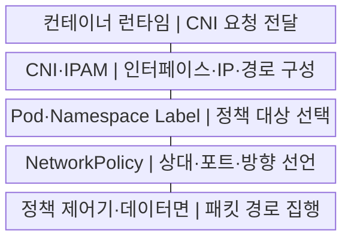
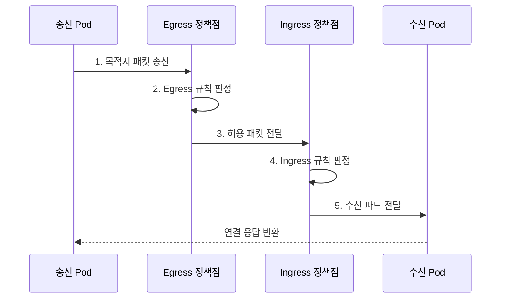

---
sidebar:
  order: 156
  label: "156. 쿠버네티스 NetworkPolicy·CNI (Kubernetes NetworkPolicy CNI)"
  badge:
    text: "기출 · 70%"
    variant: note
title: "쿠버네티스 NetworkPolicy·CNI (Kubernetes NetworkPolicy CNI)"
date: "2026-07-29T16:00:00+09:00"
tags:
  - "notes-software"
weight: 156
extra:
  question_no: "156"
  source_status: "기출"
  source_history: "137회"
  priority: 70
  priority_note: "통신 연결과 정책 집행 구조가 최근 출제됨"
---

## 미리 알고가기

- **컨테이너 네트워크 인터페이스(Container Network Interface, CNI)**: 런타임이 플러그인에 네트워크 추가·삭제·검사를 요청하는 규약
- **CNI 플러그인**: 파드 네트워크 인터페이스·주소·경로를 구성하는 구현체
- **네트워크 정책(NetworkPolicy)**: Pod 선택자와 통신 상대·포트 규칙으로 허용할 Ingress·Egress 트래픽을 선언하는 객체
- **Ingress·Egress**: Ingress는 Pod로 들어오는 트래픽, Egress는 Pod에서 나가는 트래픽 방향
- **선택자·레이블(Selector·Label)**: 레이블은 객체의 키·값 속성이고 선택자는 조건과 일치하는 Pod·Namespace를 선택하는 규칙
- **네임스페이스(Namespace)**: Kubernetes 객체 이름과 정책 적용 범위를 논리적으로 나누는 영역
- **선택된 Pod**: 지정 방향에서 격리되고 여러 NetworkPolicy의 허용 규칙은 합집합으로 적용됨
- **Pod 간 통신**: 송신 Pod의 Egress와 수신 Pod의 Ingress 정책이 모두 허용해야 함
- **응용 프로그래밍 인터페이스(Application Programming Interface, API)**: 쿠버네티스 객체를 선언·조회·변경하는 요청 규약
- **인터넷 프로토콜 주소 관리(IP Address Management, IPAM)**: 파드 주소를 할당·회수하고 중복을 관리하는 기능
- **클래스 없는 도메인 간 라우팅(Classless Inter-Domain Routing, CIDR)**: 주소와 접두사 길이로 연속 IP 범위를 표현하는 방식
- **IP 블록(IPBlock)**: NetworkPolicy가 CIDR 형식으로 허용·제외할 외부 주소 범위

## Ⅰ. 개요

- 정의/개념: CNI·정책 기반 **연결·허용 통신 제어**
- 배경/필요성: 평면 네트워크의 **불필요한 횡적 이동 차단**

### 쉽게 이해하기 (학습용)
- CNI가 모든 파드 사이에 길을 놓은 뒤 NetworkPolicy가 출발지와 도착지의 허용 목록을 적용해 필요한 통신만 남긴다.

## Ⅱ. 특징

- **연결 구성·정책 통제 분리** 기반 집행
- **선택 방향 격리** 기반 허용 합집합
- **송신·수신 양방향 허용** 기반 통신

### 쉽게 이해하기 (학습용)
- 정책 객체만 작성하고 CNI가 그 기능을 집행하지 않으면 문서상의 출입 명단만 있고 실제 문에는 잠금장치가 없는 상태가 된다.

## Ⅲ. 구조 및 구성요소

| 구성요소 | 책임 |
|:---|:---|
| 컨테이너 런타임 | CNI **생성·삭제 요청 전달** |
| CNI·IPAM | 인터페이스·**주소·경로 구성** |
| Pod·Namespace Label | **보호 대상·허용 상대** 선택 |
| NetworkPolicy | **방향·상대·포트** 선언 |
| 정책 제어기·데이터면 | 정책 변환·**패킷 경로 집행** |

### 쉽게 이해하기 (학습용)

- 런타임과 CNI가 파드에 주소와 경로를 만들면 정책 제어기가 선택자 규칙을 실제 패킷 검사 지점에 배포한다.

## Ⅳ. 흐름도

**동작 원리**

1. **목적지 패킷 송신**: CNI 인터페이스로 요청 전달
2. **Egress 규칙 판정**: 송신 대상·포트 허용 여부 검사
3. **허용 패킷 전달**: 수신 측 정책 지점으로 이동
4. **Ingress 규칙 판정**: 출발지·포트 허용 여부 검사
5. **수신 파드 전달**: 양방향 허용 패킷의 업무 처리

### 쉽게 이해하기 (학습용)

- API 파드에서 DB 파드로 가는 요청은 API의 출구 규칙과 DB의 입구 규칙을 모두 통과해야 실제 업무 처리까지 도달한다.

## Ⅴ. 종류 및 비교

| 네트워크 기능 | CNI | NetworkPolicy |
|:---|:---|:---|
| 적용 기준 | **Pod 네트워크 연결 구성** | **Pod 허용 통신 제한** |
| 핵심 특징 | 인터페이스·**IPAM·경로** | **Selector·IPBlock**·포트·방향 |
| 한계 | **IP 고갈·라우팅**·MTU 오류 | 구현 미지원·**선택자·방향 오해** |

### 쉽게 이해하기 (학습용)
- CNI 장애는 주소와 경로 자체를 끊고 NetworkPolicy 오류는 길이 있는 상태에서 특정 통신만 허용하거나 차단한다.

## Ⅵ. 실무 고려사항 및 대책

| 고려사항 | 대책 | 효과 |
|:---|:---|:---|
| CNI **정책 기능 미지원** | 허용·차단 **통합 시험** 적용 | 선언 **미집행 방지** |
| **기본 허용 상태** | 영역별 **양방향 기본 거부** | **우회 통신 제거** |
| DNS·API **동시 차단** | 필수 흐름 **단계별 허용** | 기반 서비스 **단절 예방** |
| **선택자 오지정** | 표준 레이블·**정책 시험** 적용 | 전체 **허용·차단 방지** |
| **차단 원인 불명** | 판정 기록·**흐름 로그 수집** | **실패 지점 식별** |

### 쉽게 이해하기 (학습용)
- 기본 거부를 먼저 적용한 뒤 DNS, API, DB 순서로 한 흐름씩 열어 보면 어느 정책이 업무 통신을 막았는지 즉시 찾을 수 있다.

## Ⅶ. 결론

- **통신 의존성·CNI 집행 범위**로 기본 거부와 예외 흐름 결정

### 쉽게 이해하기 (학습용)
- 업무 호출 관계를 기준으로 양방향 기본 거부를 세우고 사용하는 CNI의 실제 집행 결과까지 시험해야 정책이 통제로 완성된다.
