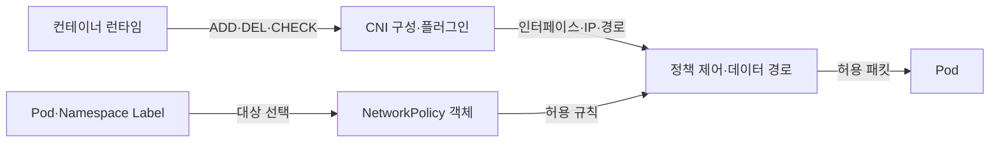
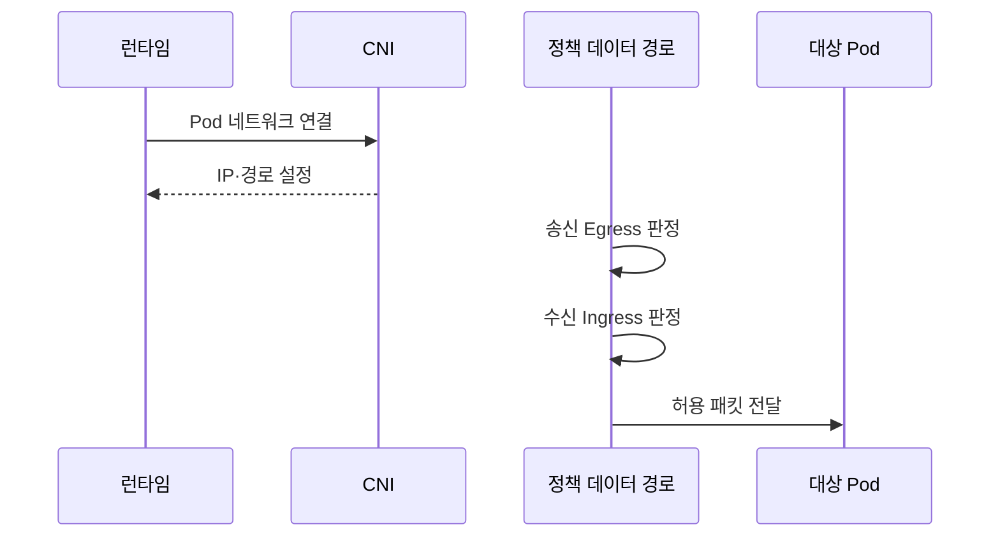

---
sidebar:
  order: 156
  label: "156. 쿠버네티스 NetworkPolicy·CNI (Kubernetes NetworkPolicy CNI)"
  badge:
    text: "기출 · 70%"
    variant: note
title: "쿠버네티스 NetworkPolicy·CNI (Kubernetes NetworkPolicy CNI)"
date: "2026-07-27T23:59:59+09:00"
tags:
  - "notes-software"
weight: 156
extra:
  question_no: "156"
  source_status: "기출"
  source_history: "137회"
  priority: 70
  priority_note: "통신 연결과 정책 집행 구조가 최근 출제됨"
---

## 미리 알고가기

- **컨테이너 네트워크 인터페이스(Container Network Interface, CNI)**: ‘시엔아이’로 읽고 세 영문 단어의 머리글자를 딴 표기이며 런타임이 플러그인에 추가(ADD)·삭제(DEL)·검사(CHECK)를 요청하는 규약
- **CNI 플러그인**: Pod 네트워크 인터페이스·IP·경로를 구성함
- **네트워크 정책(NetworkPolicy)**: Pod 선택자와 통신 상대·포트 규칙으로 허용할 Ingress·Egress 트래픽을 선언하는 객체
- **Ingress·Egress**: Ingress는 Pod로 들어오는 트래픽, Egress는 Pod에서 나가는 트래픽 방향
- **선택자·레이블(Selector·Label)**: 레이블은 객체의 키·값 속성이고 선택자는 조건과 일치하는 Pod·Namespace를 선택하는 규칙
- **네임스페이스(Namespace)**: Kubernetes 객체 이름과 정책 적용 범위를 논리적으로 나누는 영역
- **선택된 Pod**: 지정 방향에서 격리되고 여러 NetworkPolicy의 허용 규칙은 합집합으로 적용됨
- **Pod 간 통신**: 송신 Pod의 Egress와 수신 Pod의 Ingress 정책이 모두 허용해야 함
- **응용 프로그래밍 인터페이스(Application Programming Interface, API)**: ‘에이피아이’로 읽고 세 영문 단어의 머리글자를 딴 표기이며 쿠버네티스 객체를 선언·조회·변경하는 공통 요청 규약
- **인터넷 프로토콜 주소 관리(IP Address Management, IPAM)**: ‘아이팸’으로 읽고 영문 핵심어의 머리글자를 딴 표기이며 포드 네트워크 주소를 할당·회수하고 중복을 관리하는 기능
- **클래스 없는 도메인 간 라우팅(Classless Inter-Domain Routing, CIDR)**: ‘사이더’로 읽고 네 영문 단어의 머리글자를 딴 표기이며 IP 주소와 접두사 길이를 빗금으로 이어 연속 주소 범위를 나타냄
- **IP 블록(IPBlock)**: NetworkPolicy가 CIDR 형식으로 허용·제외할 외부 주소 범위

## Ⅰ. 개요

- 정의/개념: CNI는 **파드 연결**, 정책은 **허용 통신 선언**
- 기존 한계: 평면 네트워크의 **불필요한 상호 접근**

### 쉽게 이해하기 (학습용)
- CNI는 통신 길을 만들고 정책은 허용 대상을 정함

## Ⅱ. 특징

- 송신 Egress·수신 Ingress가 모두 허용돼야 전달한다.

### 쉽게 이해하기 (학습용)
- 정책을 작성해도 네트워크 구현이 집행해야 유효함

## Ⅲ. 아키텍처 및 구성요소

| 설계 요소 | 설명 |
|:---|:---|
| 컨테이너 런타임 | 격리 공간 생성 후 CNI 명령과 공간을 전달함 |
| CNI 구성·플러그인 | 주소와 경로 및 포트 매핑을 순서대로 적용함 |
| Pod·Namespace Label | 정책이 보호 대상과 통신 대상을 선택하게 함 |
| NetworkPolicy 객체 | 방향별 통신 상대와 허용 포트 조건을 선언함 |
| 정책 제어·데이터 경로 | 변경을 규칙으로 변환하고 허용 패킷만 전달함 |

> 요약: CNI 연결 위에 정책 제어기가 허용 규칙을 반영함

### 쉽게 이해하기 (학습용)
- 런타임과 CNI 및 제어기가 판정까지 함께 이어짐

## Ⅳ. 원리 및 절차 흐름도

| 절차 | 설명 |
|:---|:---|
| Pod 네트워크 연결 | 런타임이 격리 공간과 CNI 명령 전달 |
| IP·경로 설정 | 인터페이스·주소·노드 간 경로 구성 |
| 송신 Egress 판정 | 송신 Pod 선택자·대상·포트 검사 |
| 수신 Ingress 판정 | 수신 Pod 선택자·출발지·포트 검사 |
| 허용 패킷 전달 | 두 방향 허용 시만 대상에 전달 |

> 요약: 연결 구성 후 양방향 정책을 통과해야 전달함

### 쉽게 이해하기 (학습용)
- 파드 연결 후 송신측과 수신측 허용을 모두 확인함

## Ⅴ. 종류 및 비교

| 네트워크 역할 | CNI | NetworkPolicy |
|:---|:---|:---|
| 적용 기준 | 파드 연결·**IPAM 구성** | 파드 간 **최소 허용 통신** |
| 핵심 특징 | 인터페이스·IP·**경로 구성** | 선택 파드의 **허용 흐름 선언** |
| 한계 | 주소 충돌·**플러그인 실패** | 미지원 CNI·**방향 누락** |

> 요약: CNI는 연결을 만들고 정책은 패킷 범위를 정함

### 쉽게 이해하기 (학습용)
- 연결 구성과 통제 정책은 서로 다른 역할을 수행함

## Ⅵ. 실무 사례

1. 업무 네임스페이스: API에서 DB 포트만 허용

### 쉽게 이해하기 (학습용)
- 업무 포드는 지정 API에서 오는 데이터베이스 포트만 받는다.

## Ⅶ. 결론

- Pod 연결성과 최소권한 통신을 함께 확보하기 위해 **CNI 기능·정책 집행 지원·네임스페이스 경계·필수 흐름**을 검토하고, 기본 거부 후 필요한 통신만 NetworkPolicy로 허용한다

### 쉽게 이해하기 (학습용)
- Pod가 연결돼도 정책 집행 플러그인이 없으면 통신이 차단되지 않는다.
