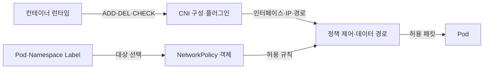
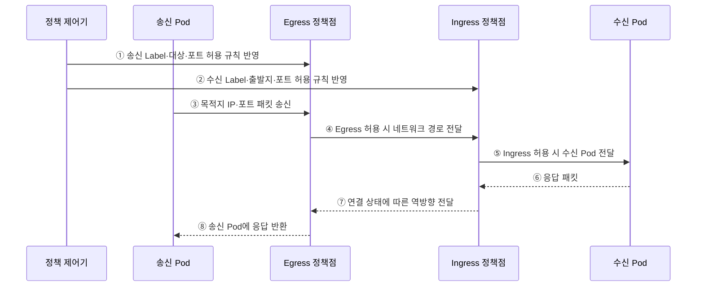

---
sidebar:
  order: 156
  label: "156. 쿠버네티스 NetworkPolicy·CNI (Kubernetes NetworkPolicy CNI)"
  badge:
    text: "기출 · 70%"
    variant: note
title: "쿠버네티스 NetworkPolicy·CNI (Kubernetes NetworkPolicy CNI)"
date: "2026-07-27T23:59:59+09:00"
tags:
  - "notes-software"
weight: 156
extra:
  question_no: "156"
  source_status: "기출"
  source_history: "137회"
  priority: 70
  priority_note: "통신 연결과 정책 집행 구조가 최근 출제됨"
---

## 미리 알고가기

- **컨테이너 네트워크 인터페이스(Container Network Interface, CNI)**: ‘시엔아이’로 읽고 세 영문 단어의 머리글자를 딴 표기이며 런타임이 플러그인에 추가(ADD)·삭제(DEL)·검사(CHECK)를 요청하는 규약
- **CNI 플러그인**: Pod 네트워크 인터페이스·IP·경로를 구성함
- **네트워크 정책(NetworkPolicy)**: Pod 선택자와 통신 상대·포트 규칙으로 허용할 Ingress·Egress 트래픽을 선언하는 객체
- **Ingress·Egress**: Ingress는 Pod로 들어오는 트래픽, Egress는 Pod에서 나가는 트래픽 방향
- **선택자·레이블(Selector·Label)**: 레이블은 객체의 키·값 속성이고 선택자는 조건과 일치하는 Pod·Namespace를 선택하는 규칙
- **네임스페이스(Namespace)**: Kubernetes 객체 이름과 정책 적용 범위를 논리적으로 나누는 영역
- **선택된 Pod**: 지정 방향에서 격리되고 여러 NetworkPolicy의 허용 규칙은 합집합으로 적용됨
- **Pod 간 통신**: 송신 Pod의 Egress와 수신 Pod의 Ingress 정책이 모두 허용해야 함
- **응용 프로그래밍 인터페이스(Application Programming Interface, API)**: ‘에이피아이’로 읽고 세 영문 단어의 머리글자를 딴 표기이며 쿠버네티스 객체를 선언·조회·변경하는 공통 요청 규약
- **인터넷 프로토콜 주소 관리(IP Address Management, IPAM)**: ‘아이팸’으로 읽고 영문 핵심어의 머리글자를 딴 표기이며 포드 네트워크 주소를 할당·회수하고 중복을 관리하는 기능
- **클래스 없는 도메인 간 라우팅(Classless Inter-Domain Routing, CIDR)**: ‘사이더’로 읽고 네 영문 단어의 머리글자를 딴 표기이며 IP 주소와 접두사 길이를 빗금으로 이어 연속 주소 범위를 나타냄
- **IP 블록(IPBlock)**: NetworkPolicy가 CIDR 형식으로 허용·제외할 외부 주소 범위

## Ⅰ. 개요

- CNI는 런타임과 네트워크 플러그인 사이에서 Pod 인터페이스·IP·경로의 생성·삭제·검사를 표준화하고 NetworkPolicy는 선택한 Pod의 허용 Ingress·Egress를 선언한다.
- 모든 Pod가 서로 통신할 수 있는 평면 연결에서 불필요한 이동 경로를 줄이려면 정책을 실제 데이터면에 구현하는 CNI와 기본 거부·명시 허용 규칙이 필요하다.

### 쉽게 이해하기 (학습용)
- CNI는 길을 만들고 NetworkPolicy는 그 길에서 누구를 통과시킬지 정한다.

## Ⅱ. 특징

- **연결과 통제 분리**: CNI 규약은 Pod 네트워크 구성, NetworkPolicy API는 허용 흐름 선언을 담당한다.
- **선택 시 격리**: 특정 방향의 Policy가 Pod를 선택하면 그 방향은 기본적으로 격리되고 명시한 허용 규칙의 합집합만 통과한다.
- **양쪽 허용**: 송신 Pod가 Egress 격리되고 수신 Pod가 Ingress 격리되면 두 방향의 규칙을 모두 만족해야 한다.
- **레이블 기반 동적 적용**: Pod·Namespace Selector가 워크로드 교체·확장에도 논리 대상을 따라간다.
- **구현 의존성**: NetworkPolicy 객체를 저장하는 것만으로 차단되지 않으며 선택한 CNI/정책 엔진이 해당 규칙을 지원·집행해야 한다.

### 쉽게 이해하기 (학습용)
- 출입 규칙을 적어도 실제 길목의 경비 장치가 집행해야 효과가 있다.

## Ⅲ. 아키텍처 및 구성요소

**도표안 A — 구조도**

**도표안 B — sequenceDiagram**

| 설계 요소 | 설명 |
|:---|:---|
| 컨테이너 런타임 | 네트워크 Namespace와 CNI ADD·DEL·CHECK 요청 전달 |
| CNI·IPAM 플러그인 | 인터페이스·IP·경로·노드 간 연결 생성·회수 |
| Pod·Namespace Label | 보호 대상과 허용 통신 상대를 논리적으로 선택 |
| NetworkPolicy | 선택 Pod의 Ingress·Egress 상대·포트·IPBlock 선언 |
| 정책 제어기·데이터면 | 객체·Label을 규칙으로 변환해 노드 패킷 경로에 집행 |

**동작 원리**

- ① 정책 제어기가 송신 Pod의 Label과 Egress 대상·포트 규칙을 송신 측 정책점에 반영한다.
- ② 수신 Pod의 Label과 허용 출발지·포트 규칙을 수신 측 정책점에 반영한다.
- ③ 송신 Pod가 CNI로 구성된 인터페이스를 통해 목적지 IP·포트로 패킷을 보낸다.
- ④ Egress 정책점이 송신 Pod가 격리 대상인지와 허용 규칙을 판정하고 통과한 패킷만 네트워크 경로로 전달한다.
- ⑤ Ingress 정책점도 수신 Pod 선택 여부와 출발지·포트를 판정해 허용한 패킷만 수신 Pod에 전달한다.
- ⑥ 수신 Pod가 요청 처리 결과를 응답 패킷으로 보낸다.
- ⑦ 정책 데이터면이 연결 상태를 인식하는 구현에서는 허용된 연결의 응답을 역방향으로 전달한다.
- ⑧ 송신 측 데이터면이 응답 패킷을 원래 Pod에 반환한다.

### 쉽게 이해하기 (학습용)

- 출발 문과 도착 문이 모두 허용해야 요청이 지나가고 그 연결의 응답이 돌아온다.

## Ⅳ. 종류 및 비교

| 비교 항목 | CNI | NetworkPolicy |
|:---|:---|:---|
| 역할 | Pod 인터페이스·IPAM·경로 구성 규약 | 선택 Pod의 허용 통신 선언 API |
| 실행 시점 | Pod Sandbox 생성·삭제·검사 | 객체·Label 변경 때 규칙 조정, 패킷마다 집행 |
| 핵심 입력 | 네트워크 Namespace·CNI 설정·Pod 정보 | Pod/Namespace Selector·IPBlock·포트·방향 |
| 구현 주체 | 런타임이 호출하는 CNI 플러그인 | 지원 CNI·정책 제어기·노드 데이터면 |
| 대표 실패 | IP 고갈·중복·라우팅·MTU·플러그인 오류 | 선택자·방향·DNS·미지원 기능·기본 허용 오해 |

> NetworkPolicy는 허용 목록 모델이며 명시적 거부 우선순위나 모든 L7 규칙을 표준 API로 제공하지 않으므로 구현 확장 기능과 구분해야 한다.

### 쉽게 이해하기 (학습용)
- CNI는 길을 만들고 NetworkPolicy는 허용 목록을 선언한다.

## Ⅴ. 실무 고려사항 및 대책

| 고려사항 | 위험 | 대책 |
|:---|:---|:---|
| 지원 범위 | 객체는 있으나 CNI가 집행하지 않음 | 기능 행렬·실제 허용/차단 통합 시험 |
| 기본 거부 | 한 방향만 막아 우회 흐름 잔존 | Namespace별 Ingress·Egress 기본 거부 |
| 필수 통신 | DNS·API·관측·시간 동기화 차단 | 흐름 목록·단계 적용·거부 로그 |
| 선택자 | Label 변경·오타로 전체 허용/차단 | 표준 Label·정책 테스트·변경 검토 |
| 외부 주소 | NAT 후 IP·동적 SaaS 주소로 오판 | 집행 지점 확인·Egress Gateway·도메인 대안 |
| 관찰성 | 차단 원인을 앱 장애로 오인 | Policy Verdict·Flow Log·패킷/경로 진단 |

> **적용 사례**: 업무 Namespace를 양방향 기본 거부한 뒤 API Pod에서 DB 포트로 가는 Egress와 DB가 API에서 받는 Ingress를 모두 허용하고 DNS·관측 흐름도 시험한다.

### 쉽게 이해하기 (학습용)
- DB 문은 지정 API의 포트만 받고 API의 출발 문도 DB로 나가도록 허용해야 한다.

## Ⅵ. 결론

- CNI의 핵심은 Pod 연결 구성이고 NetworkPolicy의 핵심은 그 연결에서 선택한 Pod의 허용 흐름을 선언하는 것이다.
- 정책 지원 여부·양방향 기본 거부·필수 DNS/API 흐름·Label·실제 집행 로그를 검증해 필요한 통신만 열어야 한다.

### 쉽게 이해하기 (학습용)
- 길이 있어도 경비 장치가 없으면 출입 규칙은 실제로 작동하지 않는다.
