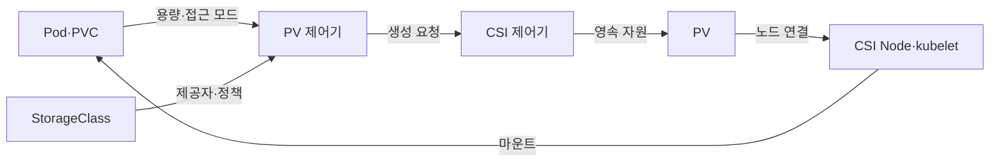
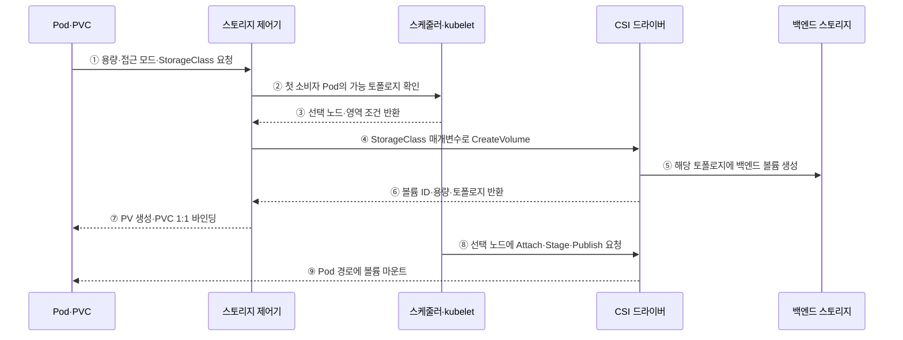

---
sidebar:
  order: 157
  label: "157. 쿠버네티스 스토리지 — PVC·PV·StorageClass (Kubernetes Storage)"
  badge:
    text: "미출제 · 50%"
    variant: note
title: "쿠버네티스 스토리지 — PVC·PV·StorageClass (Kubernetes Storage)"
date: "2026-07-25T00:40:00+09:00"
tags:
  - "notes-software"
weight: 157
extra:
  question_no: "157"
  source_status: "미출제"
  source_history: ""
  priority: 50
  priority_note: "영속 볼륨의 요청·자원·정책 관계가 독립적임"
---

## 미리 알고가기

- **영구 볼륨(Persistent Volume, PV)**: ‘피브이’로 읽고 두 영문 단어의 머리글자를 딴 표기이며 포드와 수명이 분리된 클러스터 스토리지 자원임
- **영구 볼륨 요청(Persistent Volume Claim, PVC)**: ‘피브이시’로 읽고 세 영문 단어의 머리글자를 딴 표기이며 용량·접근 모드·스토리지 클래스를 요청함
- **스토리지 클래스(StorageClass, SC)**: ‘에스시’로 읽고 합성 객체 이름의 머리글자를 딴 표기이며 프로비저너·매개변수·회수 정책·바인딩 방식을 정의하는 정책 객체
- **프로비저너(Provisioner)**: 스토리지 클래스에 따라 백엔드 볼륨과 PV를 생성하는 CSI 드라이버
- **동적 프로비저닝(Dynamic Provisioning)**: 일치하는 PV가 없을 때 StorageClass와 CSI로 실제 볼륨·PV를 자동 생성하는 방식
- **접근 모드(Access Mode)**: 볼륨을 단일·다중 노드에서 읽기·쓰기 할 수 있는 방식을 나타내는 조건
- **회수 정책(Reclaim Policy)**: PVC 해제 뒤 Retain은 데이터를 보존하고 Delete는 백엔드 볼륨 삭제를 요청하는 정책
- **첫 소비자 대기(WaitForFirstConsumer)**: Pod 배치 토폴로지를 확인한 뒤 볼륨을 프로비저닝·바인딩하는 방식
- **컨테이너 스토리지 인터페이스(Container Storage Interface, CSI)**: ‘시에스아이’로 읽고 세 영문 단어의 머리글자를 딴 표기이며 볼륨 생성·연결·마운트의 드라이버 규약
- **바인딩·요청 참조(ClaimRef)**: ‘클레임 레프’로 읽고 Claim Reference를 줄여 붙인 필드 표기이며 바인딩은 PVC와 PV를 일대일로 연결하고 이 필드는 PV에 연결된 PVC를 기록함
- **일대일 표기(1:1)**: ‘일 대 일’로 읽고 대응 수를 쌍점(:) 양쪽에 놓는 비율 표기이며 하나의 PVC가 하나의 PV에만 바인딩됨을 나타냄
- **마운트(Mount)**: 볼륨의 파일시스템을 Pod가 접근할 수 있는 디렉터리에 연결하는 동작
- **토폴로지(Topology)**: 볼륨을 접근할 수 있는 영역·노드 같은 물리 배치 조건

## Ⅰ. 개요

- 쿠버네티스 영속 스토리지는 애플리케이션의 저장 요구인 PVC, 클러스터 자원 표현인 PV, 동적 생성 정책인 StorageClass를 분리해 Pod 수명과 데이터를 독립시킨다.
- 제어기와 CSI가 용량·접근 모드·토폴로지 조건을 맞춰 백엔드 볼륨을 생성·바인딩·연결·마운트한다.

### 쉽게 이해하기 (학습용)
- PVC는 요청서, PV는 자원표, StorageClass는 자동 생성 규칙이다.

## Ⅱ. 특징

- **요구와 구현 분리**: Pod는 저장 제품의 세부 API 대신 PVC로 용량·접근 모드·StorageClass를 요청한다.
- **1:1 바인딩**: PV 제어기가 조건에 맞는 PV와 PVC를 하나씩 연결하고 ClaimRef로 소유 관계를 기록한다.
- **동적 프로비저닝**: 일치하는 기존 PV가 없으면 StorageClass의 CSI 프로비저너가 백엔드 볼륨과 PV를 생성한다.
- **토폴로지 조정**: WaitForFirstConsumer는 Pod의 실행 가능 영역을 먼저 정해 접근할 수 없는 위치에 볼륨이 만들어지는 일을 막는다.
- **수명주기 분리**: Pod 교체와 PVC·PV·백엔드 볼륨의 삭제는 별개이며 Reclaim Policy와 백업이 실제 데이터 보존을 결정한다.

### 쉽게 이해하기 (학습용)
- 요청 조건과 실행 위치, 삭제 정책이 데이터의 배치와 보존을 정한다.

## Ⅲ. 아키텍처 및 구성요소

**도표안 A — 구조도**

**도표안 B — sequenceDiagram**

| 설계 요소 | 설명 |
|:---|:---|
| PVC·PV 제어기 | 요청 조건과 PV를 탐색·바인딩하고 상태 조정 |
| StorageClass | 프로비저너·매개변수·Reclaim Policy·Binding Mode 정의 |
| CSI Controller | 백엔드 볼륨 생성·삭제·스냅숏·노드 연결 수행 |
| PV | 볼륨 ID·용량·접근 모드·토폴로지·ClaimRef·상태 표현 |
| CSI Node·kubelet | 선택 노드에서 Stage·Publish해 Pod 경로에 마운트 |
| 백엔드 스토리지 | 실제 블록·파일 자원과 내구성·복제·성능 제공 |

**동작 원리**

- ① Pod가 PVC로 필요한 용량·접근 모드·StorageClass를 선언한다.
- ② WaitForFirstConsumer에서는 스토리지 제어기가 스케줄러에 Pod를 실행할 수 있는 토폴로지 판단을 기다린다.
- ③ 스케줄러가 Pod 조건과 스토리지 가능 영역을 함께 평가해 선택 노드·영역을 반환한다.
- ④ 제어기가 StorageClass 프로비저너와 매개변수로 CSI CreateVolume을 요청한다.
- ⑤ CSI 드라이버가 선택 토폴로지에서 접근 가능한 실제 백엔드 볼륨을 생성한다.
- ⑥ 드라이버가 볼륨 ID·실제 용량·접근 가능한 토폴로지를 제어기에 반환한다.
- ⑦ 제어기가 해당 정보를 담은 PV를 만들고 PVC와 1:1로 바인딩한다.
- ⑧ kubelet이 CSI 드라이버에 선택 노드의 볼륨 연결·준비·게시를 요청한다.
- ⑨ CSI Node 구성요소가 볼륨을 Pod의 지정 경로에 마운트해 컨테이너에 제공한다.

### 쉽게 이해하기 (학습용)

- 실행할 장소를 먼저 보고 그곳에 맞는 창고를 만든 뒤 요청서와 자원표를 묶어 Pod에 연결한다.

## Ⅳ. 종류 및 비교

| 비교 항목 | PVC | PV | StorageClass |
|:---|:---|:---|:---|
| 역할 | 애플리케이션 저장 요구 | 실제 볼륨의 클러스터 자원 표현 | 동적 생성·수명주기 정책 |
| 주요 내용 | 용량·접근 모드·Class·Selector | 용량·접근·볼륨 ID·토폴로지·ClaimRef | 프로비저너·매개변수·Reclaim·Binding Mode |
| 생성 주체 | 사용자·워크로드 템플릿 | 관리자 또는 동적 프로비저너/제어기 | 클러스터 관리자 |
| 관계 | 조건에 맞는 PV 하나와 바인딩 | PVC 하나에 바인딩 | 여러 PVC가 같은 정책을 참조 |
| 대표 위험 | 조건 불일치·Class 오타로 Pending | 잘못된 ClaimRef·토폴로지·접근 모드 | Delete·Immediate·매개변수 오설정 |

> PV는 실제 데이터 자체가 아니라 백엔드 볼륨을 가리키는 API 자원이며, PVC나 PV 객체가 남아 있어도 백엔드·복구 정책이 부실하면 데이터는 안전하지 않다.

### 쉽게 이해하기 (학습용)
- 요청서·자원표·생성 규칙을 분리해 실제 저장 제품을 바꿀 수 있게 한다.

## Ⅴ. 실무 고려사항 및 대책

| 고려사항 | 위험 | 대책 |
|:---|:---|:---|
| Binding Mode | 볼륨과 Pod가 다른 영역에 생성 | 지역 스토리지에 WaitForFirstConsumer |
| 접근 모드 | 다중 노드 쓰기를 지원한다고 오해 | CSI·백엔드의 실제 기능·동시 쓰기 시험 |
| 용량·성능 | 용량만 맞고 IOPS·처리량 부족 | StorageClass 계층·성능 SLO·부하 시험 |
| Reclaim | PVC 삭제가 실제 데이터 삭제로 전파 | 중요 데이터 Retain·보호 정책·승인 |
| 백업·복구 | PV 존재를 백업으로 오해 | 애플리케이션 일관 스냅숏·별도 복사·복원 시험 |
| 노드 종료 | Attach 잔존·강제 분리·파일 손상 | 종료 유예·Fence·Multi-Attach 처리·Runbook |

> **적용 사례**: 단일 영역 DB는 WaitForFirstConsumer로 Pod 영역을 정한 뒤 볼륨을 만들고, PVC 삭제·노드 손실·다른 영역 복원을 별도로 시험한다.

### 쉽게 이해하기 (학습용)
- DB 창고는 Pod가 실제 놓일 영역에 만들고 다른 영역 복구도 따로 준비한다.

## Ⅵ. 결론

- 쿠버네티스 스토리지의 핵심은 저장 요구·자원 표현·생성 정책을 분리하고 Pod 토폴로지와 실제 볼륨 수명주기를 조정하는 데 있다.
- 접근 모드·성능·Binding Mode·Reclaim Policy·백업·복원·노드 장애를 CSI와 백엔드의 실제 보장 범위로 검증해야 한다.

### 쉽게 이해하기 (학습용)
- 크기뿐 아니라 위치·동시 접근·삭제·복구까지 정해야 한다.
