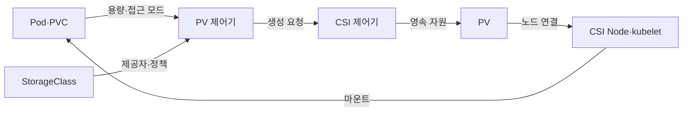
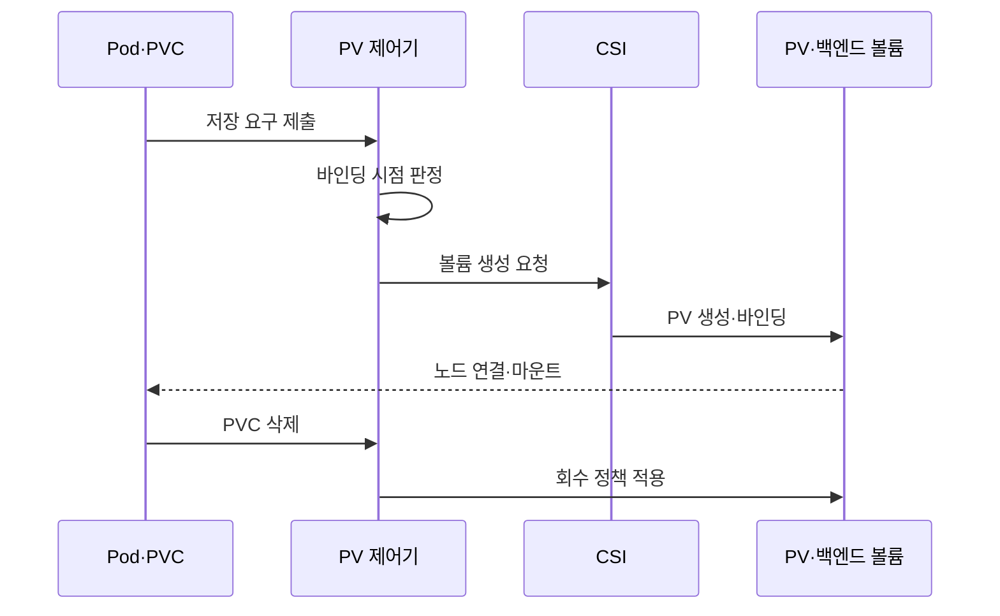

---
sidebar:
  order: 157
  label: "157. 쿠버네티스 스토리지 — PVC·PV·StorageClass (Kubernetes Storage)"
  badge:
    text: "미출제 · 50%"
    variant: note
title: "쿠버네티스 스토리지 — PVC·PV·StorageClass (Kubernetes Storage)"
date: "2026-07-25T00:40:00+09:00"
tags:
  - "notes-software"
weight: 157
extra:
  question_no: "157"
  source_status: "미출제"
  source_history: ""
  priority: 50
  priority_note: "영속 볼륨의 요청·자원·정책 관계가 독립적임"
---

## 미리 알고가기

- **영구 볼륨(Persistent Volume, PV)**: ‘피브이’로 읽고 두 영문 단어의 머리글자를 딴 표기이며 포드와 수명이 분리된 클러스터 스토리지 자원임
- **영구 볼륨 요청(Persistent Volume Claim, PVC)**: ‘피브이시’로 읽고 세 영문 단어의 머리글자를 딴 표기이며 용량·접근 모드·스토리지 클래스를 요청함
- **스토리지 클래스(StorageClass, SC)**: ‘에스시’로 읽고 합성 객체 이름의 머리글자를 딴 표기이며 프로비저너·매개변수·회수 정책·바인딩 방식을 정의하는 정책 객체
- **프로비저너(Provisioner)**: 스토리지 클래스에 따라 백엔드 볼륨과 PV를 생성하는 CSI 드라이버
- **동적 프로비저닝(Dynamic Provisioning)**: 일치하는 PV가 없을 때 StorageClass와 CSI로 실제 볼륨·PV를 자동 생성하는 방식
- **접근 모드(Access Mode)**: 볼륨을 단일·다중 노드에서 읽기·쓰기 할 수 있는 방식을 나타내는 조건
- **회수 정책(Reclaim Policy)**: PVC 해제 뒤 Retain은 데이터를 보존하고 Delete는 백엔드 볼륨 삭제를 요청하는 정책
- **첫 소비자 대기(WaitForFirstConsumer)**: Pod 배치 토폴로지를 확인한 뒤 볼륨을 프로비저닝·바인딩하는 방식
- **컨테이너 스토리지 인터페이스(Container Storage Interface, CSI)**: ‘시에스아이’로 읽고 세 영문 단어의 머리글자를 딴 표기이며 볼륨 생성·연결·마운트의 드라이버 규약
- **바인딩·요청 참조(ClaimRef)**: ‘클레임 레프’로 읽고 Claim Reference를 줄여 붙인 필드 표기이며 바인딩은 PVC와 PV를 일대일로 연결하고 이 필드는 PV에 연결된 PVC를 기록함
- **일대일 표기(1:1)**: ‘일 대 일’로 읽고 대응 수를 쌍점(:) 양쪽에 놓는 비율 표기이며 하나의 PVC가 하나의 PV에만 바인딩됨을 나타냄
- **마운트(Mount)**: 볼륨의 파일시스템을 Pod가 접근할 수 있는 디렉터리에 연결하는 동작
- **토폴로지(Topology)**: 볼륨을 접근할 수 있는 영역·노드 같은 물리 배치 조건

## Ⅰ. 개요

- **정의/개념**: 요청·영속 자원·생성 정책을 분리한 저장 구조
- **배경/필요성**: Pod 교체 시 데이터 손실로 영속 볼륨 필요

### 쉽게 이해하기 (학습용)
- PVC는 요청서, PV는 자원, SC는 생성 정책임

## Ⅱ. 특징

- 첫 소비자 대기가 Pod 위치에 맞춰 볼륨 생성한다.

### 쉽게 이해하기 (학습용)
- 위치와 정책이 파드 배치와 데이터 보존을 정함

## Ⅲ. 아키텍처 및 구성요소

| 설계 요소 | 설명 |
|:---|:---|
| PV 제어기 | PVC 조건과 PV 바인딩 조정 |
| StorageClass | 제공자와 매개변수 및 회수 정책을 제공함 |
| CSI 제어기 | 백엔드 볼륨 생성·노드 연결 관리 |
| PV | 생성된 볼륨의 용량·접근·토폴로지와 상태를 표현함 |
| CSI Node·kubelet | 선택 노드에 볼륨을 마운트해 파드에 제공함 |

> 요약: PVC는 기존 PV와 묶이거나 새 PV를 생성함

### 쉽게 이해하기 (학습용)
- 제어기와 인터페이스가 조건에 맞춰 볼륨을 연결함

## Ⅳ. 원리 및 절차 흐름도

| 절차 | 설명 |
|:---|:---|
| 저장 요구 제출 | 용량·접근 모드·StorageClass 선언 |
| 바인딩 시점 판정 | 즉시 또는 Pod 토폴로지 확정 뒤 처리 |
| 볼륨 생성 요청 | 기존 PV 탐색 또는 CSI 동적 생성 |
| PV 생성·바인딩 | PVC와 PV를 1:1로 연결 |
| 노드 연결·마운트 | 선택 노드에 볼륨을 붙여 Pod에 제공 |
| PVC 삭제 | Pod 저장 요구와 바인딩을 해제 |
| 회수 정책 적용 | PVC 삭제 뒤 Retain·Delete 수행 |

> 요약: 요청이 자원 생성과 파드 배치를 거쳐 마운트됨

### 쉽게 이해하기 (학습용)
- 요청이 자원과 묶이고 위치에 맞춰 볼륨을 연결함

## Ⅴ. 종류 및 비교

| 판단 기준 | PVC | PV | StorageClass |
|:---|:---|:---|:---|
| 핵심 특징 | 용량·접근 모드 요구 선언 | 실제 영속 볼륨 자원 표현 | 동적 생성·회수 정책 정의 |
| 적용 기준 | Pod가 영속 저장소를 요청 | 기존·동적 볼륨을 클러스터에 제공 | 저장 유형별 자동 생성 정책 제공 |
| 주요 위험 | 조건 불일치로 Pending | 토폴로지·접근 모드 불일치 | 잘못된 회수 정책으로 데이터 삭제 |

> 요약: PVC는 요구, PV는 자원, SC는 정책을 담당함

### 쉽게 이해하기 (학습용)
- 요청, 자원, 정책을 분리해 내부 구현을 감춤

## Ⅵ. 실무 사례

1. DB Pod: 노드 토폴로지 확정 후 볼륨 생성
2. 백업 볼륨: Retain으로 PVC 삭제 뒤 데이터 보존

### 쉽게 이해하기 (학습용)
- DB 볼륨은 Pod가 실행될 영역에 맞춰 생성한다
- 백업 PVC를 지워도 Retain 볼륨의 데이터는 남긴다

## Ⅶ. 결론

- 용량·토폴로지·회수 정책으로 PVC·PV 연결 설계

### 쉽게 이해하기 (학습용)
- 용량과 위치 및 삭제 후 처리까지 정해야 함
