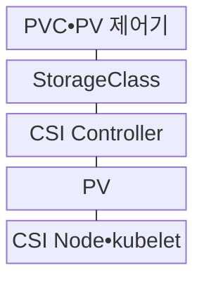
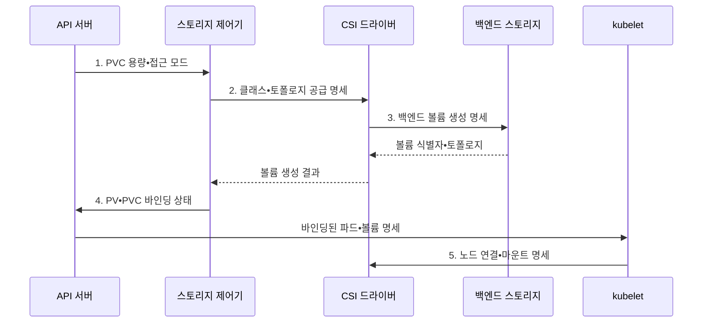

---
sidebar:
  order: 157
  label: "157. 쿠버네티스 스토리지: PVC•PV•StorageClass (Kubernetes Storage)"
  badge:
    text: "미출 • 50%"
    variant: note
title: "쿠버네티스 스토리지: PVC•PV•StorageClass (Kubernetes Storage)"
date: "2026-08-03T09:14:20+09:00"
tags:
  - "notes-software"
weight: 157
extra:
  question_no: "157"
  source_status: "미출"
  source_history: ""
  priority: 50
  priority_note: "영속 볼륨의 요청•자원•정책 관계가 독립적임"
---

## Ⅰ. 개요

핵심 용어

- **쿠버네티스 영속 스토리지(Kubernetes Persistent Storage)**: PVC가 워크로드의 저장 요구를 선언하고 PV가 실제 저장 자원을 제공하며 StorageClass가 동적 프로비저닝 정책을 정의하는 구조이다.

- 정의/개념: **영속 볼륨 요청(Persistent Volume Claim, PVC)•영속 볼륨(Persistent Volume, PV)•스토리지 클래스(StorageClass)** 기반으로 워크로드 저장 요구와 인프라 구현을 분리하는 쿠버네티스 영속 스토리지 구조
- 배경/필요성: 파드 로컬 저장은 재생성•노드 장애 시 **데이터 소실**

#### 한줄 요약
- 애플리케이션은 저장 제품을 직접 고르지 않고 PVC에 필요한 크기와 접근 방법만 적어 인프라 변경과 데이터 수명을 분리한다.

## Ⅱ. 특징

핵심 용어

- **회수 정책**: 회수 정책은 PVC 해제 뒤 PV와 실제 저장 데이터를 삭제할지 보존할지 결정한다.
- **영속 볼륨 요청(Persistent Volume Claim, PVC)•영속 볼륨(Persistent Volume, PV) 분리**: 애플리케이션의 저장 요구와 실제 저장 자원 구현을 분리하는 추상화이다.
- **컨테이너 스토리지 인터페이스(Container Storage Interface, CSI)**: 쿠버네티스가 저장소 공급자별 볼륨 생성•연결•마운트를 호출하는 표준 인터페이스이다.

- **PVC•PV 분리** 기반 요구 추상화
- **StorageClass•CSI** 기반 동적 생성
- **회수 정책** 기반 삭제 후 보존

#### 한줄 요약
- PVC는 창고 요청서, PV는 배정된 창고, StorageClass는 창고를 만드는 표준으로 보면 세 객체의 책임이 구분된다.

## Ⅲ. 구조 및 구성요소

핵심 용어

- **StorageClass**: StorageClass는 동적 프로비저닝에 사용할 저장 유형, 프로비저너, 매개변수를 정의한다.
- **영속 볼륨 요청•영속 볼륨(Persistent Volume Claim•Persistent Volume, PVC•PV) 제어기**: 저장 요청과 조건이 맞는 볼륨을 찾아 바인딩하는 구성요소이다.
- **컨테이너 스토리지 인터페이스 제어기(Container Storage Interface Controller, CSI Controller)**: 백엔드 볼륨의 생성•삭제•연결을 수행하는 구성요소이다.
- **CSI 노드•큐블릿(CSI Node•kubelet)**: 볼륨을 노드에 게시하고 파드 경로에 마운트하는 구성요소이다.

| 구성요소 | 책임 |
|:---|:---|
| PVC•PV 제어기 | 요청 탐색•**볼륨 바인딩** |
| StorageClass | **생성•회수•바인딩** 정책 |
| CSI Controller | **볼륨 생성•삭제•연결** |
| PV | 용량•접근•**토폴로지 표현** |
| CSI Node•kubelet | **노드 게시•파드 마운트** |

#### 한줄 요약

- 제어기가 요청서에 맞는 창고를 찾고 없으면 StorageClass와 CSI로 새 창고를 만든 뒤 PV 자원표로 연결한다.

## Ⅳ. 흐름도

핵심 용어

- **4. PV•PVC 바인딩 상태**: 용량, 접근 모드, 클래스 조건이 맞으면 PV와 PVC가 바인딩 상태가 된다.
- **응용 프로그래밍 인터페이스(Application Programming Interface, API) 서버**: 저장 객체의 선언과 바인딩 상태를 보존하는 제어면 접점이다.
- **1. PVC 용량•접근 모드**: 애플리케이션이 필요한 저장 크기와 읽기•쓰기 방식을 선언한 조건이다.
- **2. 클래스•토폴로지 공급 명세**: 사용할 프로비저너와 볼륨 배치 영역을 확정한 명세이다.
- **3. 백엔드 볼륨 생성 명세**: 조건에 맞는 실제 저장 자원을 공급자에게 요청하는 명세이다.
- **5. 노드 연결•마운트 명세**: 바인딩한 볼륨을 실행 노드와 파드 파일 경로에 연결하는 명세이다.

**동작 원리**

1. **PVC 용량•접근 모드**: 애플리케이션의 저장 조건 선언
2. **클래스•토폴로지 공급 명세**: 프로비저너와 배치 영역 확정
3. **백엔드 볼륨 생성 명세**: 접근 가능한 실제 저장소 생성 요청
4. **PV•PVC 바인딩 상태**: 볼륨 자원과 요청의 일대일 연결 기록
5. **노드 연결•마운트 명세**: 파드 경로에 파일시스템 게시

#### 한줄 요약

- 첫 소비자 대기를 사용하면 파드가 놓일 영역을 먼저 정하고 같은 영역에 볼륨을 만들어 지역 불일치로 인한 배치 실패를 막는다.

## Ⅴ. 종류 및 비교

핵심 용어

- **PV**: PV는 클러스터가 제공하는 지속성 저장 자원을 나타내는 API 리소스다.
- **영속 볼륨 요청(Persistent Volume Claim, PVC)**: 애플리케이션이 용량•접근 모드•스토리지 클래스를 선언하는 저장 요청이다.
- **영속 볼륨(Persistent Volume, PV)**: 클러스터가 제공하는 지속성 저장 자원을 나타내는 리소스이다.
- **스토리지 클래스(StorageClass)**: 동적 볼륨의 프로비저너•회수•바인딩 정책을 정의하는 리소스이다.

| 저장 객체 | PVC | PV | StorageClass |
|:---|:---|:---|:---|
| 적용 기준 | **애플리케이션 저장 요구** | **실제 볼륨 자원 표현** | **동적 생성•수명 정책** |
| 핵심 특징 | 용량•**접근 모드•StorageClass** | 볼륨 식별자•**토폴로지•ClaimRef** | 프로비저너•**회수•바인딩 정책** |
| 한계 | **조건 불일치•StorageClass 오타** | **토폴로지•접근 모드 오류** | **삭제•즉시 바인딩 오설정** |

#### 한줄 요약
- PVC는 소비자의 요구, PV는 공급된 자원, StorageClass는 공급 방식을 나타내므로 저장 제품 변경을 파드 명세에서 숨길 수 있다.

## Ⅵ. 실무 고려사항 및 대책

핵심 용어

- **삭제 전파**: 삭제 전파는 PVC나 PV 삭제가 실제 스토리지와 데이터 제거로 이어지는 범위를 뜻한다.

| 문제 | 대책 | 효과 |
|:---|:---|:---|
| 파드•볼륨의 **영역 불일치** 로 스케줄링 실패 | **첫 소비자 대기** 적용 | 지역 **배치 실패** 방지 |
| 다중 노드 쓰기 요구와 백엔드 접근 모드 불일치 | CSI•백엔드 **접근 모드 시험** | 지원 범위 **오판** 방지 |
| 저장 성능 등급이 업무 부하보다 낮아 지연 증가 | 성능 등급별 **부하 시험** 적용 | **처리량•저장 지연** 사전 확인 |
| PVC 오삭제가 백엔드 볼륨 삭제로 전파 | 중요 데이터 **Retain•삭제 승인** | 백엔드 **삭제 전파** 방지 |
| 스냅숏만 보관해 애플리케이션 데이터 관계 불일치 | **일관 백업•별도 복사•복원 시험** | 실제 **복구 가능성** 검증 |

#### 한줄 요약
- 데이터베이스 파드의 영역과 볼륨 영역을 맞추고 PVC 삭제와 별개인 백업을 복원해 봐야 노드 손실과 오삭제를 모두 견딜 수 있다.

## Ⅶ. 결론

핵심 용어

- **복구 목표**: 복구 목표는 장애 시 허용 가능한 데이터 손실량과 서비스 복구 시간을 기준으로 백업•복제 전략을 정한다.

- **접근 방식** 으로 StorageClass를, 데이터 중요도•**복구 목표** 로 회수 정책•백업 결정

#### 한줄 요약
- 용량만 요청하지 말고 파드 위치, 동시 접근, 삭제 후 보존, 다른 환경 복원까지 기준으로 저장 수명주기를 선택해야 한다.
