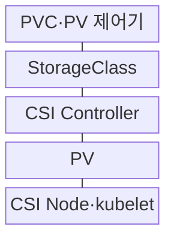
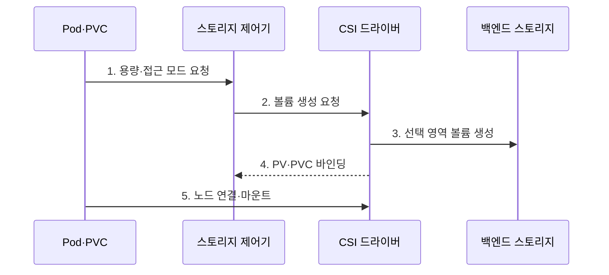

---
sidebar:
  order: 157
  label: "157. 쿠버네티스 스토리지: PVC·PV·StorageClass (Kubernetes Storage)"
  badge:
    text: "미출 · 50%"
    variant: note
title: "쿠버네티스 스토리지: PVC·PV·StorageClass (Kubernetes Storage)"
date: "2026-07-30T20:00:00+09:00"
tags:
  - "notes-software"
weight: 157
extra:
  question_no: "157"
  source_status: "미출"
  source_history: ""
  priority: 50
  priority_note: "영속 볼륨의 요청·자원·정책 관계가 독립적임"
---

## 미리 알고가기

- **영구 볼륨(Persistent Volume, PV)**: 파드와 수명이 분리된 클러스터 스토리지 자원
- **영구 볼륨 요청(Persistent Volume Claim, PVC)**: 용량·접근 모드·스토리지 클래스를 선언하는 저장 요청
- **스토리지 클래스(StorageClass)**: 프로비저너·매개변수·회수 정책·바인딩 방식을 정의하는 객체
- **프로비저너(Provisioner)**: 스토리지 클래스에 따라 백엔드 볼륨과 PV를 생성하는 CSI 드라이버
- **동적 프로비저닝(Dynamic Provisioning)**: 일치하는 PV가 없을 때 StorageClass와 CSI로 실제 볼륨·PV를 자동 생성하는 방식
- **접근 모드(Access Mode)**: 볼륨을 단일·다중 노드에서 읽기·쓰기 할 수 있는 방식을 나타내는 조건
- **회수 정책(Reclaim Policy)**: PVC 해제 뒤 Retain은 데이터를 보존하고 Delete는 백엔드 볼륨 삭제를 요청하는 정책
- **첫 소비자 대기(WaitForFirstConsumer)**: Pod 배치 토폴로지를 확인한 뒤 볼륨을 프로비저닝·바인딩하는 방식
- **컨테이너 스토리지 인터페이스(Container Storage Interface, CSI)**: 볼륨 생성·연결·마운트의 드라이버 규약
- **요청 참조(ClaimRef)**: PV에 바인딩된 PVC 정보를 기록하는 필드
- **마운트(Mount)**: 볼륨의 파일시스템을 Pod가 접근할 수 있는 디렉터리에 연결하는 동작
- **토폴로지(Topology)**: 볼륨을 접근할 수 있는 영역·노드 같은 물리 배치 조건

## Ⅰ. 개요

- 정의/개념: PVC·PV·Class 기반 **저장 요구·구현 분리**
- 배경/필요성: 파드 교체와 무관한 **데이터 수명·복구 보장**

### 쉽게 이해하기 (학습용)
- 애플리케이션은 저장 제품을 직접 고르지 않고 PVC에 필요한 크기와 접근 방법만 적어 인프라 변경과 데이터 수명을 분리한다.

## Ⅱ. 특징

- **PVC·PV 분리** 기반 요구 추상화
- **StorageClass·CSI** 기반 동적 생성
- **회수 정책** 기반 삭제 후 보존

### 쉽게 이해하기 (학습용)
- PVC는 창고 요청서, PV는 배정된 창고, StorageClass는 창고를 만드는 표준으로 보면 세 객체의 책임이 구분된다.

## Ⅲ. 구조 및 구성요소

| 구성요소 | 책임 |
|:---|:---|
| PVC·PV 제어기 | 요청 탐색·**볼륨 바인딩** |
| StorageClass | **생성·회수·바인딩** 정책 |
| CSI Controller | **볼륨 생성·삭제·연결** |
| PV | 용량·접근·**토폴로지 표현** |
| CSI Node·kubelet | **노드 게시·파드 마운트** |

### 쉽게 이해하기 (학습용)

- 제어기가 요청서에 맞는 창고를 찾고 없으면 StorageClass와 CSI로 새 창고를 만든 뒤 PV 자원표로 연결한다.

## Ⅳ. 흐름도

**동작 원리**

1. **용량·접근 모드 요청**: PVC 저장 조건 선언
2. **볼륨 생성 요청**: 클래스·토폴로지 조건 전달
3. **선택 영역 볼륨 생성**: 접근 가능한 실제 저장소 확보
4. **PV·PVC 바인딩**: 볼륨 자원과 요청의 일대일 연결
5. **노드 연결·마운트**: 파드 경로에 파일시스템 게시

### 쉽게 이해하기 (학습용)

- 첫 소비자 대기를 사용하면 파드가 놓일 영역을 먼저 정하고 같은 영역에 볼륨을 만들어 지역 불일치로 인한 배치 실패를 막는다.

## Ⅴ. 종류 및 비교

| 저장 객체 | PVC | PV | StorageClass |
|:---|:---|:---|:---|
| 적용 기준 | **애플리케이션 저장 요구** | **실제 볼륨 자원 표현** | **동적 생성·수명 정책** |
| 핵심 특징 | 용량·**접근 모드·Class** | 볼륨 ID·**토폴로지·ClaimRef** | 프로비저너·**Reclaim·Binding** |
| 한계 | **조건 불일치·Class 오타** | **토폴로지·접근 모드 오류** | **Delete·Immediate 오설정** |

### 쉽게 이해하기 (학습용)
- PVC는 소비자의 요구, PV는 공급된 자원, StorageClass는 공급 방식을 나타내므로 저장 제품 변경을 파드 명세에서 숨길 수 있다.

## Ⅵ. 실무 고려사항 및 대책

| 고려사항 | 대책 | 효과 |
|:---|:---|:---|
| 파드·볼륨 **영역 불일치** | **첫 소비자 대기** 적용 | 지역 **배치 실패 방지** |
| 다중 노드 **쓰기 요구** | CSI·백엔드 **접근 모드 시험** | 지원 범위 **오판 방지** |
| **처리량 부족** | 성능 등급·**부하 시험** 적용 | 저장 지연 **사전 확인** |
| **PVC 오삭제** | 중요 데이터 **Retain·삭제 승인** | 백엔드 **삭제 전파 방지** |
| 스냅숏 **복원 실패** | 일관 백업·**별도 복사·복원 시험** | 실제 **복구 가능성 확보** |

### 쉽게 이해하기 (학습용)
- 데이터베이스 파드의 영역과 볼륨 영역을 맞추고 PVC 삭제와 별개인 백업을 복원해 봐야 노드 손실과 오삭제를 모두 견딜 수 있다.

## Ⅶ. 결론

- **접근 방식·데이터 중요도·복구 목표**로 클래스·회수·백업 결정

### 쉽게 이해하기 (학습용)
- 용량만 요청하지 말고 파드 위치, 동시 접근, 삭제 후 보존, 다른 환경 복원까지 기준으로 저장 수명주기를 선택해야 한다.
