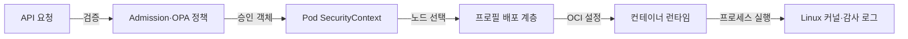
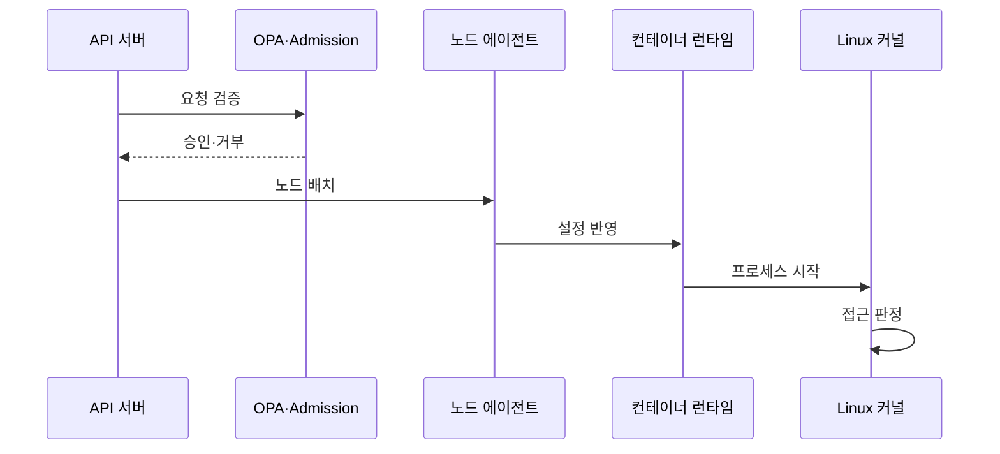

---
sidebar:
  order: 158
  label: "158. 컨테이너 보안 — Seccomp·AppArmor·OPA (Container Security)"
  badge:
    text: "미출제 · 70%"
    variant: note
title: "컨테이너 보안 — Seccomp·AppArmor·OPA (Container Security)"
date: "2026-07-25T00:40:00+09:00"
tags:
  - "notes-software"
weight: 158
extra:
  question_no: "158"
  source_status: "미출제"
  source_history: ""
  priority: 70
  priority_note: "배포 정책과 커널 통제를 잇는 보안 설계가 중요함"
---

## 미리 알고가기

- **보안 컴퓨팅 모드(Secure Computing Mode, Seccomp·세크컴프)**: Secure Computing을 줄인 Linux 공식 기능명이며, 프로세스가 호출할 수 있는 시스템 호출을 허용 목록으로 제한하는 커널 기능
- **앱아머(AppArmor)·보안 강화 리눅스(Security-Enhanced Linux, SELinux·에스이리눅스)**: AppArmor는 Application Armor를 결합한 제품명으로 경로를, SELinux는 Security-Enhanced와 Linux를 결합한 표기로 보안 레이블을 기준 삼아 자원 접근을 제한하는 Linux 보안 모듈
- **오픈 정책 에이전트(Open Policy Agent, OPA·오피에이)·게이트키퍼(Gatekeeper)**: OPA는 영문 머리글자를 딴 정책 판정 엔진이고, Gatekeeper는 문지기라는 이름처럼 Kubernetes 어드미션·감사에 OPA 정책을 적용하는 구성요소
- **쿠버네티스(Kubernetes)**: 그리스어로 조타수·항해사를 뜻하는 공식 프로젝트명이며, 컨테이너 배포·확장·복구를 선언적으로 자동화하는 플랫폼
- **제어 그룹(Control Group, cgroup·씨그룹)**: Control Group을 줄인 Linux 표기이며, 프로세스 집합의 CPU·메모리·입출력 사용량을 제한·계측하는 커널 기능
- **루트리스 컨테이너(Rootless Container)**: 호스트 관리자 권한 없이 사용자 네임스페이스 안에서 실행하는 컨테이너
- **컨테이너 이미지 스캔(Image Scanning)**: 배포 전에 이미지의 패키지·취약점·비밀·설정을 검사하는 절차
- **팔코(Falco)**: 공식 도구명을 한글로 읽은 표기이며, 시스템 호출 사건을 규칙과 비교해 실행 중 이상 행동을 탐지하는 역할
- **응용 프로그래밍 인터페이스(Application Programming Interface, API·에이피아이)**: 영문 각 단어의 머리글자를 딴 표기이며, Kubernetes 객체를 생성·조회·변경하는 공통 요청 규약
- **개방형 컨테이너 이니셔티브(Open Container Initiative, OCI·오시아이)**: 영문 각 단어의 머리글자를 딴 표준 단체명이며, 컨테이너 이미지와 런타임 실행 형식을 정의하는 역할
- **어드미션 제어(Admission Control)**: API 객체 저장 전에 생성·수정 요청을 검증하거나 변경하는 제어 단계
- **특권 컨테이너(Privileged Container)**: 호스트 장치와 광범위한 커널 권한을 받아 일반 격리 제한이 약화된 컨테이너
- **보안 컨텍스트(SecurityContext)**: Pod·컨테이너의 사용자·권한·Seccomp·AppArmor 설정을 선언하는 항목
- **런타임디폴트·로컬호스트 프로필(RuntimeDefault·Localhost Profile)**: Kubernetes가 정한 영문 프로필 유형 표기이며, RuntimeDefault는 런타임 기본 정책이고 Localhost는 노드에 미리 배포한 정책 파일
- **리눅스 세부 권한(Linux Capability)**: 관리자 권한을 네트워크·파일·프로세스 같은 세부 커널 권한으로 나눈 단위

## Ⅰ. 개요

- 정의/개념: 배포 정책 검증과 실행 중 커널 접근 제한
- **배경/필요성**: 공유 커널 침해 확산으로 다층 격리 필요

### 쉽게 이해하기 (학습용)
- 잘못된 설정은 배포 전에 거부하고 실행 권한은 커널에서 제한한다.

## Ⅱ. 특징

- Admission은 배포를, 커널 프로필은 실행을 통제한다.
- 이미지 스캔은 알려진 위험, Falco는 실행 사건 탐지한다.
- 루트리스·세부 권한 축소로 침해 시 호스트 확산 범위 제한한다.
- 프로필 누락·오탐은 배포 실패와 실행 장애를 유발한다.

### 쉽게 이해하기 (학습용)
- OPA는 배포 요청, 나머지는 커널 행동을 통제함

## Ⅲ. 아키텍처 및 구성요소

| 설계 요소 | 설명 |
|:---|:---|
| Admission·OPA 정책 | 요청을 전달하고 정책 논리와 변수로 판정함 |
| Pod SecurityContext | 보안 프로필 유형과 권한 설정을 지정함 |
| 프로필 배포 계층 | 프로필을 파드가 실행될 모든 노드에 배포함 |
| 컨테이너 런타임 | 승인된 프로필을 OCI 실행 설정에 반영함 |
| Linux 커널·감사 로그 | 호출·자원 접근 판정과 결과 기록 |

> 요약: 승인 후 프로필을 적용하고 실행 중 접근을 판정함

### 쉽게 이해하기 (학습용)
- 승인 계층, 런타임 설정, 커널 집행이 경로를 이룸

## Ⅳ. 원리 및 절차 흐름도

| 절차 | 설명 |
|:---|:---|
| 요청 검증 | 특권·프로필·이미지 정책 판정 |
| 승인·거부 | 정책 결과에 따라 객체 저장 여부 결정 |
| 노드 배치 | Localhost 프로필 보유 노드 선택 |
| 설정 반영 | SecurityContext를 OCI 설정에 변환 |
| 프로세스 시작 | 선택 프로필로 주 프로세스 실행 |
| 접근 판정 | 호출·파일·Capability 허용 여부 결정 |

> 요약: 배포 객체는 OPA를, 프로세스는 프로필을 통과함

### 쉽게 이해하기 (학습용)
- 배포 요청을 검사하고 실행 시 자원 접근을 판정함

## Ⅴ. 종류 및 비교

| 판단 기준 | Seccomp | AppArmor | OPA·Gatekeeper |
|:---|:---|:---|:---|
| 핵심 특징 | 프로세스의 시스템 호출 시점에 통제함 | 프로세스의 자원 접근 시점에 통제함 | 객체 생성 및 수정 시점에 통제함 |
| 적용 기준 | 불필요한 시스템 호출 제한에 적합함 | 애플리케이션별 자원 접근 제한에 적합함 | 클러스터 공통 배포 정책 적용에 적합함 |
| 주요 위험 | 허용 호출 누락·프로세스 실패 | 프로파일 누락·경로 우회 | 정책 오탐·배포 차단 |

> 요약: OPA는 구성을 검증하고 나머지는 접근을 제한함

### 쉽게 이해하기 (학습용)
- 구성 검사와 행동 제한을 계층적으로 적용함

## Ⅵ. 실무 사례

1. 배포 파이프라인은 서명 없는 이미지를 Admission에서 거부
2. API Pod는 Seccomp·AppArmor 최소 권한 적용

### 쉽게 이해하기 (학습용)
- 승인되지 않은 이미지는 실행 객체가 저장되기 전에 거부한다.
- API는 필요한 시스템 호출과 파일 경로만 열어 침해 범위를 줄인다.

## Ⅶ. 결론

- 배포 구성은 OPA, 실행 권한은 샌드박스로 제한

### 쉽게 이해하기 (학습용)
- 배포 승인은 실행 중 커널 접근 허용을 대신하지 않는다.
