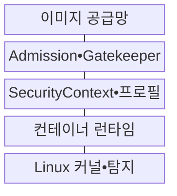
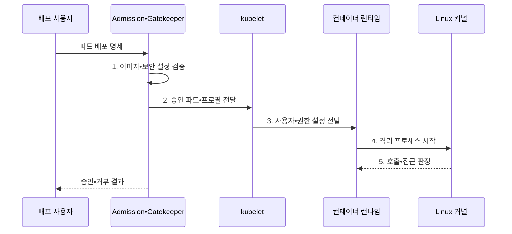

---
sidebar:
  order: 158
  label: "158. 컨테이너 보안: Seccomp•AppArmor•OPA (Container Security)"
  badge:
    text: "미출 • 70%"
    variant: note
title: "컨테이너 보안: Seccomp•AppArmor•OPA (Container Security)"
date: "2026-08-03T09:14:20+09:00"
tags:
  - "notes-software"
weight: 158
extra:
  question_no: "158"
  source_status: "미출"
  source_history: ""
  priority: 70
  priority_note: "배포 정책과 커널 통제를 잇는 보안 설계가 중요함"
---

## Ⅰ. 개요

핵심 용어

- **컨테이너 보안(Container Security)**: 이미지 공급망부터 배포•실행•네트워크•관찰 단계까지 권한과 공유 커널 위험을 여러 통제로 제한하는 생명주기 다층 보안 체계이다.

- 정의/개념: 이미지 공급망•실행 권한•커널 격리•네트워크 정책으로 생명주기 위험을 제한하는 **컨테이너 다층 보안 체계**
- 배경/필요성: 단일 격리 경계로는 공유 커널의 **권한 남용 차단 불가**

#### 한줄 요약
- 이미지 반입, 배포 승인, 실행 권한, 실행 중 행동을 서로 다른 지점에서 검사해야 한 통제가 뚫려도 다음 통제가 피해를 막는다.

## Ⅱ. 특징

핵심 용어

- **Seccomp•AppArmor**: Seccomp는 시스템 호출을 제한하고 AppArmor는 프로세스의 파일•기능 접근을 정책으로 통제한다.
- **보안 컴퓨팅 모드(Secure Computing Mode, Seccomp)**: 컨테이너 프로세스가 사용할 수 있는 리눅스 시스템 호출을 제한하는 커널 보안 기능이다.
- **앱아머(AppArmor)**: 프로세스별 프로필로 파일•장치•기능 접근을 제한하는 리눅스 강제 접근 통제 기능이다.

- **이미지•어드미션 제어** 기반 위험 배포 차단
- **Seccomp•AppArmor** 기반 커널 강제
- **감사•행위 신호** 기반 런타임 탐지

#### 한줄 요약
- Gatekeeper가 특권 설정을 입구에서 거부하고 Seccomp와 AppArmor가 승인된 컨테이너의 시스템 호출과 파일 접근을 실행 중에 제한한다.

## Ⅲ. 구조 및 구성요소

핵심 용어

- **SecurityContext•프로필**: SecurityContext와 보안 프로필은 사용자 권한, 기능, 파일 시스템, 시스템 호출 제한을 실행 시점에 적용한다.
- **소프트웨어 자재 명세서(Software Bill of Materials, SBOM)**: 이미지에 포함된 소프트웨어 구성요소와 버전을 기록한 목록이다.
- **승인 제어(Admission Control)•게이트키퍼(Gatekeeper)**: 배포 객체를 저장하기 전에 정책 위반 여부를 검사•차단하는 구성요소이다.
- **오픈 컨테이너 이니셔티브(Open Container Initiative, OCI) 실행 명세**: 런타임이 컨테이너 프로세스를 만들 때 사용할 표준 설정 형식이다.

| 구성요소 | 책임 |
|:---|:---|
| 이미지 공급망 | 서명•**SBOM•취약점 검사** |
| Admission•Gatekeeper | **배포 객체 정책** 판정 |
| SecurityContext•프로필 | 사용자•권한•**커널 정책 설정** |
| 컨테이너 런타임 | **OCI 실행 명세** 변환 |
| Linux 커널•탐지 | **접근 강제•사건 기록** |

#### 한줄 요약

- 서명된 이미지가 입장권이라면 Admission은 복장 검사, SecurityContext는 지급 권한, Linux 커널은 실제 행동을 막는 잠금장치다.

## Ⅳ. 흐름도

핵심 용어

- **5. 호출•접근 판정**: Seccomp와 AppArmor 프로필이 시스템 호출과 자원 접근의 허용 여부를 판정한다.
- **1. 이미지•보안 설정 검증**: 이미지 출처•서명과 특권•보안 프로필의 정책 위반 여부를 판정하는 단계이다.
- **2. 승인 파드•프로필 전달**: 승인된 파드 명세와 커널 보안 프로필을 실행 노드에 제공하는 단계이다.
- **3. 사용자•권한 설정 전달**: 사용자•기능 권한을 오픈 컨테이너 이니셔티브 실행 명세로 변환하는 단계이다.
- **4. 격리 프로세스 시작**: 제어 그룹과 커널 프로필을 적용해 컨테이너 프로세스를 시작하는 단계이다.

**동작 원리**

1. **이미지•보안 설정 검증**: 출처•특권•정책 위반 판정
2. **승인 파드•프로필 전달**: 대상 노드의 실행 정책 제공
3. **사용자•권한 설정 전달**: OCI 실행 명세 생성
4. **격리 프로세스 시작**: cgroup•커널 프로필 적용
5. **호출•접근 판정**: 시스템 호출•파일 접근 강제

#### 한줄 요약

- 배포 전에 특권과 이미지 출처를 검사하고 실행 시에는 런타임이 전달한 프로필을 커널이 매 호출과 접근마다 강제한다.

## Ⅴ. 종류 및 비교

핵심 용어

- **OPA•Gatekeeper**: OPA•Gatekeeper는 쿠버네티스 승인 단계에서 정책 위반 리소스의 생성을 차단한다.
- **오픈 정책 에이전트(Open Policy Agent, OPA)•게이트키퍼(Gatekeeper)**: 쿠버네티스 승인 단계에서 정책 위반 리소스의 생성을 차단하는 통제이다.
- **보안 강화 리눅스(Security-Enhanced Linux, SELinux)**: 보안 레이블과 정책으로 프로세스의 자원 접근을 강제 통제하는 기능이다.

| 보안 통제 | Seccomp | AppArmor•SELinux | OPA•Gatekeeper |
|:---|:---|:---|:---|
| 적용 기준 | **시스템 호출 제한** | **파일•장치 접근 제한** | **배포 객체 사전 검증** |
| 핵심 특징 | 커널 **Seccomp 판정** | **AppArmor 경로•SELinux 레이블** | **어드미션•OPA 정책** |
| 한계 | **호출 차단•프로필 노후** | **프로필 누락•규칙 오설정** | 오탐•Webhook 장애•**예외 남용** |

#### 한줄 요약
- OPA는 위험한 배포 명세를 막고 Seccomp는 호출 종류를, AppArmor와 SELinux는 파일•장치 접근 범위를 줄인다.

## Ⅵ. 실무 고려사항 및 대책

핵심 용어

- **루트 권한 실행**: 루트 권한 실행은 컨테이너 침해가 호스트나 다른 자원에 더 큰 영향으로 이어질 수 있게 한다.

| 문제 | 대책 | 효과 |
|:---|:---|:---|
| 이미지 **태그 교체** | 다이제스트•**서명 검증** 강제 | 미승인 이미지 **반입 차단** |
| **루트 권한 실행** | 비루트•Capability 제거•**읽기 전용** | 호스트 **접근 범위 축소** |
| 프로필의 **정상 호출 차단** | 관찰 모드•**통합 시험•버전 배포** | 업무 중단•**노드 차이 완화** |
| **정책 엔진 장애** | 이중화•위험별 **실패 정책** 적용 | 전체 중단•**미검증 배포 허용** 방지 |
| **장기 예외 방치** | 소유자•범위•**만료•보완 통제** | **영구 특권 방지** |

#### 한줄 요약
- 새 프로필은 관찰 모드에서 정상 호출을 수집한 뒤 단계 배포하고 예외에는 소유자와 만료일을 붙여 통제 공백을 제한해야 한다.

## Ⅶ. 결론

핵심 용어

- **공급망•권한•업무 호출**: 이미지 공급망 검증, 최소 권한, 업무에 필요한 호출만 허용하는 정책을 함께 적용해야 한다.

- **공급망•권한•업무 호출** 로 배포 정책•커널 프로필 결정

#### 한줄 요약
- 신뢰 이미지만 승인하고 비Root를 기본값으로 삼되 실제 업무 호출을 시험한 커널 프로필과 감사 사건을 함께 운영해야 한다.
