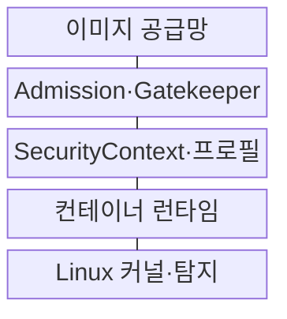
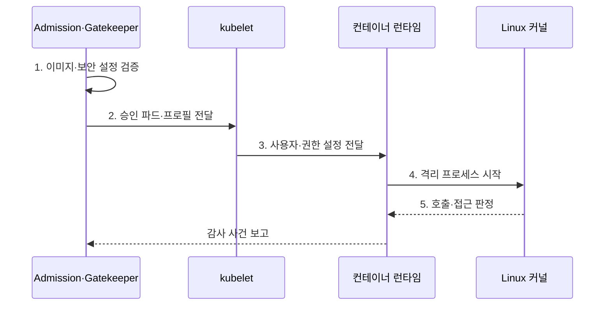

---
sidebar:
  order: 158
  label: "158. 컨테이너 보안: Seccomp·AppArmor·OPA (Container Security)"
  badge:
    text: "미출 · 70%"
    variant: note
title: "컨테이너 보안: Seccomp·AppArmor·OPA (Container Security)"
date: "2026-07-30T20:00:00+09:00"
tags:
  - "notes-software"
weight: 158
extra:
  question_no: "158"
  source_status: "미출"
  source_history: ""
  priority: 70
  priority_note: "배포 정책과 커널 통제를 잇는 보안 설계가 중요함"
---

## 미리 알고가기

- **보안 컴퓨팅 모드(Secure Computing Mode, Seccomp)**: 프로세스가 호출할 수 있는 시스템 호출을 제한하는 커널 기능
- **AppArmor·SELinux**: 경로 또는 보안 레이블을 기준으로 자원 접근을 제한하는 Linux 보안 모듈
- **오픈 정책 에이전트(Open Policy Agent, OPA)·Gatekeeper**: 쿠버네티스 객체의 배포 정책을 판정·감사하는 구성요소
- **쿠버네티스(Kubernetes)**: 컨테이너 배포·확장·복구를 선언적으로 자동화하는 플랫폼
- **제어 그룹(Control Group, cgroup)**: 프로세스 집합의 CPU·메모리·입출력을 제한·계측하는 커널 기능
- **컨테이너 이미지 스캔(Image Scanning)**: 배포 전에 이미지의 패키지·취약점·비밀·설정을 검사하는 절차
- **응용 프로그래밍 인터페이스(Application Programming Interface, API)**: 쿠버네티스 객체를 생성·조회·변경하는 요청 규약
- **개방형 컨테이너 이니셔티브(Open Container Initiative, OCI)**: 컨테이너 이미지와 런타임 실행 형식을 정의하는 표준
- **소프트웨어 자재 명세서(Software Bill of Materials, SBOM)**: 이미지에 포함된 구성요소와 버전을 기록한 목록
- **어드미션 제어(Admission Control)**: API 객체 저장 전에 생성·수정 요청을 검증하거나 변경하는 제어 단계
- **특권 컨테이너(Privileged Container)**: 호스트 장치와 광범위한 커널 권한을 받아 일반 격리 제한이 약화된 컨테이너
- **보안 컨텍스트(SecurityContext)**: Pod·컨테이너의 사용자·권한·Seccomp·AppArmor 설정을 선언하는 항목
- **리눅스 세부 권한(Linux Capability)**: 관리자 권한을 네트워크·파일·프로세스 같은 세부 커널 권한으로 나눈 단위

## Ⅰ. 개요

- 정의/개념: 이미지·배포·커널·탐지를 연결한 **다층 보안 통제**
- 배경/필요성: 공유 커널의 **오구성·권한 남용·이상 행위 제한**

### 쉽게 이해하기 (학습용)
- 이미지 반입, 배포 승인, 실행 권한, 실행 중 행동을 서로 다른 지점에서 검사해야 한 통제가 뚫려도 다음 통제가 피해를 막는다.

## Ⅱ. 특징

- **이미지·Admission** 기반 위험 배포 차단
- **Seccomp·AppArmor** 기반 커널 강제
- **감사·행위 신호** 기반 런타임 탐지

### 쉽게 이해하기 (학습용)
- Gatekeeper가 특권 설정을 입구에서 거부하고 Seccomp와 AppArmor가 승인된 컨테이너의 시스템 호출과 파일 접근을 실행 중에 제한한다.

## Ⅲ. 구조 및 구성요소

| 구성요소 | 책임 |
|:---|:---|
| 이미지 공급망 | 서명·**SBOM·취약점 검사** |
| Admission·Gatekeeper | **배포 객체 정책** 판정 |
| SecurityContext·프로필 | 사용자·권한·**커널 정책 설정** |
| 컨테이너 런타임 | **OCI 실행 명세** 변환 |
| Linux 커널·탐지 | **접근 강제·사건 기록** |

### 쉽게 이해하기 (학습용)

- 서명된 이미지가 입장권이라면 Admission은 복장 검사, SecurityContext는 지급 권한, Linux 커널은 실제 행동을 막는 잠금장치다.

## Ⅳ. 흐름도

**동작 원리**

1. **이미지·보안 설정 검증**: 출처·특권·정책 위반 판정
2. **승인 파드·프로필 전달**: 대상 노드의 실행 정책 제공
3. **사용자·권한 설정 전달**: OCI 실행 명세 생성
4. **격리 프로세스 시작**: cgroup·커널 프로필 적용
5. **호출·접근 판정**: 시스템 호출·파일 접근 강제

### 쉽게 이해하기 (학습용)

- 배포 전에 특권과 이미지 출처를 검사하고 실행 시에는 런타임이 전달한 프로필을 커널이 매 호출과 접근마다 강제한다.

## Ⅴ. 종류 및 비교

| 보안 통제 | Seccomp | AppArmor·SELinux | OPA·Gatekeeper |
|:---|:---|:---|:---|
| 적용 기준 | **시스템 호출 제한** | **파일·장치 접근 제한** | **배포 객체 사전 검증** |
| 핵심 특징 | 커널 **Seccomp 판정** | **AppArmor 경로·SELinux Label** | **Admission·OPA 정책** |
| 한계 | **호출 차단·프로필 노후** | **프로필 누락·규칙 오설정** | 오탐·Webhook 장애·**예외 남용** |

### 쉽게 이해하기 (학습용)
- OPA는 위험한 배포 명세를 막고 Seccomp는 호출 종류를, AppArmor와 SELinux는 파일·장치 접근 범위를 줄인다.

## Ⅵ. 실무 고려사항 및 대책

| 고려사항 | 대책 | 효과 |
|:---|:---|:---|
| 이미지 **태그 교체** | 다이제스트·**서명 검증** 강제 | 미승인 이미지 **반입 차단** |
| **관리자 권한 실행** | 비Root·Capability 제거·**읽기 전용** | 호스트 **접근 범위 축소** |
| 프로필의 **정상 호출 차단** | 관찰 모드·**통합 시험·버전 배포** | 업무 중단·**노드 차이 완화** |
| **정책 엔진 장애** | 이중화·위험별 **실패 정책** 적용 | 전체 배포 중단·**우회 방지** |
| **장기 예외 방치** | 소유자·범위·**만료·보완 통제** | **영구 특권 방지** |

### 쉽게 이해하기 (학습용)
- 새 프로필은 관찰 모드에서 정상 호출을 수집한 뒤 단계 배포하고 예외에는 소유자와 만료일을 붙여 통제 공백을 제한해야 한다.

## Ⅶ. 결론

- **공급망·권한·업무 호출**로 배포 정책·커널 프로필 결정

### 쉽게 이해하기 (학습용)
- 신뢰 이미지만 승인하고 비Root를 기본값으로 삼되 실제 업무 호출을 시험한 커널 프로필과 감사 사건을 함께 운영해야 한다.
