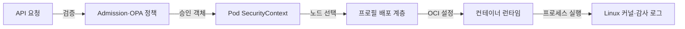
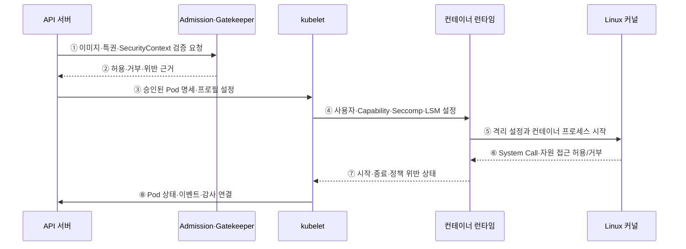

---
sidebar:
  order: 158
  label: "158. 컨테이너 보안 — Seccomp·AppArmor·OPA (Container Security)"
  badge:
    text: "미출제 · 70%"
    variant: note
title: "컨테이너 보안 — Seccomp·AppArmor·OPA (Container Security)"
date: "2026-07-25T00:40:00+09:00"
tags:
  - "notes-software"
weight: 158
extra:
  question_no: "158"
  source_status: "미출제"
  source_history: ""
  priority: 70
  priority_note: "배포 정책과 커널 통제를 잇는 보안 설계가 중요함"
---

## 미리 알고가기

- **보안 컴퓨팅 모드(Secure Computing Mode, Seccomp·세크컴프)**: Secure Computing을 줄인 Linux 공식 기능명이며, 프로세스가 호출할 수 있는 시스템 호출을 허용 목록으로 제한하는 커널 기능
- **앱아머(AppArmor)·보안 강화 리눅스(Security-Enhanced Linux, SELinux·에스이리눅스)**: AppArmor는 Application Armor를 결합한 제품명으로 경로를, SELinux는 Security-Enhanced와 Linux를 결합한 표기로 보안 레이블을 기준 삼아 자원 접근을 제한하는 Linux 보안 모듈
- **오픈 정책 에이전트(Open Policy Agent, OPA·오피에이)·게이트키퍼(Gatekeeper)**: OPA는 영문 머리글자를 딴 정책 판정 엔진이고, Gatekeeper는 문지기라는 이름처럼 Kubernetes 어드미션·감사에 OPA 정책을 적용하는 구성요소
- **쿠버네티스(Kubernetes)**: 그리스어로 조타수·항해사를 뜻하는 공식 프로젝트명이며, 컨테이너 배포·확장·복구를 선언적으로 자동화하는 플랫폼
- **제어 그룹(Control Group, cgroup·씨그룹)**: Control Group을 줄인 Linux 표기이며, 프로세스 집합의 CPU·메모리·입출력 사용량을 제한·계측하는 커널 기능
- **루트리스 컨테이너(Rootless Container)**: 호스트 관리자 권한 없이 사용자 네임스페이스 안에서 실행하는 컨테이너
- **컨테이너 이미지 스캔(Image Scanning)**: 배포 전에 이미지의 패키지·취약점·비밀·설정을 검사하는 절차
- **팔코(Falco)**: 공식 도구명을 한글로 읽은 표기이며, 시스템 호출 사건을 규칙과 비교해 실행 중 이상 행동을 탐지하는 역할
- **응용 프로그래밍 인터페이스(Application Programming Interface, API·에이피아이)**: 영문 각 단어의 머리글자를 딴 표기이며, Kubernetes 객체를 생성·조회·변경하는 공통 요청 규약
- **개방형 컨테이너 이니셔티브(Open Container Initiative, OCI·오시아이)**: 영문 각 단어의 머리글자를 딴 표준 단체명이며, 컨테이너 이미지와 런타임 실행 형식을 정의하는 역할
- **어드미션 제어(Admission Control)**: API 객체 저장 전에 생성·수정 요청을 검증하거나 변경하는 제어 단계
- **특권 컨테이너(Privileged Container)**: 호스트 장치와 광범위한 커널 권한을 받아 일반 격리 제한이 약화된 컨테이너
- **보안 컨텍스트(SecurityContext)**: Pod·컨테이너의 사용자·권한·Seccomp·AppArmor 설정을 선언하는 항목
- **런타임디폴트·로컬호스트 프로필(RuntimeDefault·Localhost Profile)**: Kubernetes가 정한 영문 프로필 유형 표기이며, RuntimeDefault는 런타임 기본 정책이고 Localhost는 노드에 미리 배포한 정책 파일
- **리눅스 세부 권한(Linux Capability)**: 관리자 권한을 네트워크·파일·프로세스 같은 세부 커널 권한으로 나눈 단위

## Ⅰ. 개요

- 컨테이너 보안은 이미지 공급망·Kubernetes Admission·런타임 설정·Linux 커널 접근·행위 탐지를 연결해 빌드부터 실행까지 위험을 줄이는 다층 통제이다.
- 컨테이너가 호스트 커널을 공유하므로 배포 전 오구성을 막는 정책과 실행 중 시스템 호출·파일·권한을 제한하는 커널 통제를 함께 적용한다.

### 쉽게 이해하기 (학습용)
- 위험한 상자는 들이기 전에 막고 들어온 상자의 행동은 커널에서 제한한다.

## Ⅱ. 특징

- **예방 계층**: 서명·SBOM·취약점·비밀 검사와 Admission 정책으로 신뢰하지 못한 이미지와 위험 설정을 배포 전에 차단한다.
- **최소 권한 실행**: 비Root·읽기 전용 RootFS·Capability 제거·특권 금지·자원 한도로 침해 범위를 줄인다.
- **커널 강제 통제**: Seccomp는 System Call, AppArmor/SELinux는 파일·프로세스·자원 접근을 커널에서 판정한다.
- **런타임 탐지**: 감사 로그와 행위 탐지 도구가 비정상 System Call·Shell·파일·네트워크 사건을 찾아 대응을 시작한다.
- **정책 수명주기**: 프로필 배포·호환성 시험·예외 만료·오탐 조정이 없으면 보안 정책이 배포와 실행 장애를 만든다.

### 쉽게 이해하기 (학습용)
- Gatekeeper는 배포 설정을 검사하고 Seccomp·AppArmor는 실행 행동을 제한한다.

## Ⅲ. 아키텍처 및 구성요소

**도표안 A — 구조도**

**도표안 B — sequenceDiagram**

| 설계 요소 | 설명 |
|:---|:---|
| 이미지 공급망 통제 | 신뢰 원본·서명·SBOM·취약점·비밀·구성 검사 |
| Admission·Gatekeeper | API 저장 전 특권·이미지·SecurityContext 정책 판정 |
| Pod SecurityContext | 사용자·그룹·Capability·RootFS·Seccomp·AppArmor 설정 |
| 프로필 배포 계층 | Localhost Profile을 대상 노드에 동일 버전으로 배포 |
| 컨테이너 런타임 | 승인된 보안 설정을 OCI 실행 명세로 변환 |
| Linux 커널·탐지 | System Call·자원 접근을 강제하고 사건·위반을 기록 |

**동작 원리**

- ① API 서버가 Pod의 이미지 출처·특권·사용자·SecurityContext를 Admission과 Gatekeeper 정책에 전달한다.
- ② 정책 엔진이 Constraint와 예외 범위에 따라 허용·거부 결과와 위반 근거를 반환한다.
- ③ 승인된 Pod가 노드에 배정되면 API 서버가 kubelet에 명세와 참조할 보안 프로필을 제공한다.
- ④ kubelet이 사용자·그룹·Capability·Seccomp·AppArmor/SELinux 설정을 컨테이너 런타임에 전달한다.
- ⑤ 런타임이 Namespace·cgroup과 보안 프로필을 OCI 설정에 반영해 커널에 프로세스 시작을 요청한다.
- ⑥ 커널이 각 System Call과 파일·프로세스·장치 접근을 프로필에 따라 허용하거나 거부한다.
- ⑦ 런타임이 시작 실패·강제 종료·정책 위반으로 나타난 상태를 kubelet에 반환한다.
- ⑧ kubelet이 Pod 상태와 이벤트를 API에 보고하고 감사·런타임 탐지 신호와 연결한다.

### 쉽게 이해하기 (학습용)

- 문 앞에서 설정을 검사하고 들어온 프로세스의 행동은 커널 규칙으로 매번 판정한다.

## Ⅳ. 종류 및 비교

| 비교 항목 | Seccomp | AppArmor·SELinux | OPA·Gatekeeper |
|:---|:---|:---|:---|
| 판정 시점 | 프로세스의 System Call 실행 | 파일·프로세스·장치 등 자원 접근 | Kubernetes 객체 생성·수정·감사 |
| 판정 대상 | System Call 번호·인수 조건·동작 | AppArmor 경로 또는 SELinux 보안 Label 규칙 | 이미지·특권·Label·SecurityContext 등 API 데이터 |
| 집행 위치 | Linux 커널 Seccomp | Linux Security Module | Admission Webhook·OPA 정책 엔진 |
| 주요 목적 | 커널 공격면 축소 | 프로세스별 자원 접근 최소화 | 클러스터 배포 기준의 사전 예방 |
| 대표 위험 | 필요한 호출 차단·Profile 노후화 | 노드 Profile 누락·경로/Label 오설정 | 정책 오탐·Webhook 가용성·예외 남용 |

> 세 통제는 대체 관계가 아니며 Admission이 허용한 설정도 런타임 커널 정책을 통과해야 한다.

### 쉽게 이해하기 (학습용)
- 설계 검사는 입구에서, 행동 제한은 실행 현장에서 적용한다.

## Ⅴ. 실무 고려사항 및 대책

| 고려사항 | 위험 | 대책 |
|:---|:---|:---|
| 이미지 신뢰 | 스캔 후 태그 교체·서명 우회 | 다이제스트·서명 검증·Admission 강제 |
| 권한 | Root·Privileged·Host Mount·과도 Capability | 비Root·권한 제거·읽기 전용·예외 승인 |
| 프로필 | 필요한 호출/경로 차단·노드별 불일치 | 관찰 모드·통합 시험·버전 배포·점진 적용 |
| 정책 엔진 | 장애 때 전체 배포 차단 또는 우회 | Failure Policy 위험별 설정·HA·Break-glass 감사 |
| 런타임 탐지 | 경보 폭주·컨테이너 맥락 부족 | 워크로드·이미지·사용자 정보 연결·튜닝 |
| 예외 | 영구 특권·광범위 Namespace 제외 | 소유자·사유·범위·만료·보완 통제 |

> **적용 사례**: 배포 파이프라인이 서명한 이미지 다이제스트만 Admission에서 허용하고 RuntimeDefault Seccomp·비Root·Capability 제거를 기본값으로 강제한다.

### 쉽게 이해하기 (학습용)
- 승인되지 않은 상자는 들어오기 전에 막고 승인된 상자도 최소 권한으로 실행한다.

## Ⅵ. 결론

- 컨테이너 보안의 핵심은 Admission 한 번이 아니라 신뢰 이미지·안전한 배포 설정·최소 권한·커널 강제·런타임 탐지를 연속된 경계로 만드는 데 있다.
- 정책과 프로필의 호환성·노드 배포·예외 만료·오탐·탐지 대응을 함께 운영해야 공유 커널의 침해 확산을 줄일 수 있다.

### 쉽게 이해하기 (학습용)
- 입장 승인은 실행 중 모든 행동의 허가가 아니다.
