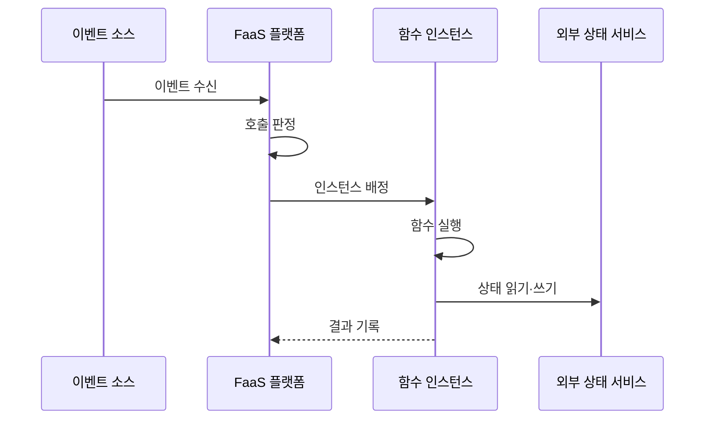

---
sidebar:
  order: 159
  label: "159. 서버리스 컴퓨팅·FaaS (Serverless Computing·FaaS)"
  badge:
    text: "기출 · 30%"
    variant: note
title: "서버리스 컴퓨팅·FaaS (Serverless Computing·FaaS)"
date: "2026-07-27T23:59:59+09:00"
tags:
  - "notes-software"
weight: 159
extra:
  question_no: "159"
  source_status: "기출"
  source_history: "120회, 122회"
  priority: 30
  priority_note: "이벤트 실행과 콜드 스타트는 기존 출제 범위임"
---

## 미리 알고가기

- **서버리스 컴퓨팅(Serverless Computing)**: 인프라 프로비저닝·확장·회수를 플랫폼에 맡기고 실행량만큼 자원을 쓰는 모델
- **서비스형 함수(Function as a Service, FaaS·에프에이에스)**: 영문 핵심 단어의 머리글자를 딴 표기이며, 이벤트를 함수에 연결하고 호출량에 따라 실행 인스턴스를 배정하는 서버리스 유형
- **콜드·웜 스타트(Cold·Warm Start)**: 콜드 스타트는 새 런타임 초기화 지연이고 웜 스타트는 남은 인스턴스를 재사용하는 실행
- **트리거(Trigger)**: 에이치티티피로 읽는 HTTP(Hypertext Transfer Protocol, 하이퍼텍스트 전송 규약)·메시지·파일·스케줄 사건을 특정 함수 호출로 연결하는 규칙
- **함수 인스턴스(Function Instance)**: 함수 코드와 런타임을 격리해 한 개 이상의 호출을 처리하는 실행 환경
- **동시성(Concurrency)**: 같은 시점에 실행하거나 한 인스턴스가 함께 처리하는 함수 호출 수
- **무상태(Stateless)**: 실행 인스턴스 내부에 다음 호출이 반드시 필요로 하는 상태를 남기지 않는 성질
- **멱등성(Idempotency)**: 같은 이벤트를 여러 번 처리해도 업무 결과가 한 번 처리한 것과 같은 성질
- **외부 상태 서비스(External State Service)**: 데이터베이스·객체 저장소처럼 함수 수명과 분리해 상태를 보존하는 서비스
- **서비스형 백엔드(Backend as a Service, BaaS·비에이에스)**: 영문 핵심 단어의 머리글자를 딴 표기이며, 인증·데이터 API 같은 백엔드 기능을 관리형으로 제공하는 서비스
- **응용 프로그래밍 인터페이스(Application Programming Interface, API·에이피아이)**: 영문 각 단어의 머리글자를 딴 표기이며, 함수가 외부 서비스의 기능·데이터를 호출하는 계약
- **이벤트 식별자(Event Identifier, Event ID·이벤트 아이디)**: Identifier를 ID로 줄인 표기이며, 재전달된 같은 사건을 판별해 중복 처리를 막는 값

## Ⅰ. 개요

- 정의/개념: 이벤트별 **함수 자원을 자동 배정·회수**하는 모델
- 기존 한계: 간헐 작업의 **상시 서버 유휴 비용**

### 쉽게 이해하기 (학습용)
- 이벤트 수신 시 인스턴스를 실행하고 자동 회수함

## Ⅱ. 특징

- 호출량 변화에 따라 인스턴스를 생성·재사용·회수한다.
- 외부 상태·멱등 처리로 중복·재시도에 대응한다.

### 쉽게 이해하기 (학습용)
- 서버 관리는 줄어드나 콜드 스타트를 고려해야 함

## Ⅲ. 아키텍처 및 구성요소

| 설계 요소 | 설명 |
|:---|:---|
| 이벤트 소스·트리거 | 이벤트를 수신하고 대상 함수 호출 방식을 결정함 |
| 함수 관리 계층 | 코드 버전·환경 변수·권한·동시성 정책을 관리함 |
| 격리 런타임 | 인스턴스를 초기화하고 제한된 자원에서 실행함 |
| 외부 상태 서비스 | 함수 간 공유 상태와 실행 결과를 보존함 |
| 관측·과금 계층 | 호출 수·실행 시간·오류 기록 |

> 요약: 트리거가 함수를 연결하고 외부 상태로 독립 실행함

### 쉽게 이해하기 (학습용)
- 이벤트와 트리거 및 런타임이 실행 경로를 형성함

## Ⅳ. 원리 및 절차 흐름도

| 절차 | 설명 |
|:---|:---|
| 이벤트 수신 | 트리거가 대상 함수 호출 생성 |
| 호출 판정 | 이벤트 규칙·실행 권한 검증 |
| 인스턴스 배정 | 웜 인스턴스 재사용 또는 새 런타임 시작 |
| 함수 실행 | 함수 코드로 멱등 업무 처리 |
| 상태 읽기·쓰기 | 함수 외부에서 공유 상태와 결과 보존 |
| 결과 기록 | 결과·실행 시간·오류 저장 |

> 요약: 이벤트 확인 후 인스턴스를 배정하고 기록함

### 쉽게 이해하기 (학습용)
- 이벤트를 받아 실행한 뒤 결과와 비용을 남김

## Ⅴ. 종류 및 비교

| 실행 모델 | FaaS | 컨테이너 서비스 |
|:---|:---|:---|
| 적용 기준 | 간헐 이벤트·**단기 실행** | 지속 트래픽·**장기 실행** |
| 핵심 특징 | 호출별 **자동 확장·회수** | 상시 인스턴스·**직접 수명 관리** |
| 한계 | 콜드 스타트·**실행 한도** | 유휴 비용·**운영 부담** |

> 요약: FaaS는 함수를 실행하고 수명과 확장을 관리함

### 쉽게 이해하기 (학습용)
- FaaS는 호출 단위, 컨테이너는 지속 요청에 적합함

## Ⅵ. 실무 사례

1. 이미지 업로드 이벤트는 FaaS로 썸네일 생성

### 쉽게 이해하기 (학습용)
- 이미지가 올라올 때만 함수를 실행해 작은 미리보기 파일을 만든다.

## Ⅶ. 결론

- 짧고 변동 큰 멱등 작업에 FaaS 선택

### 쉽게 이해하기 (학습용)
- 긴 연결·상시 실행이 필요하면 컨테이너 서비스로 전환한다.
