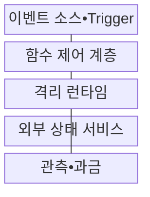
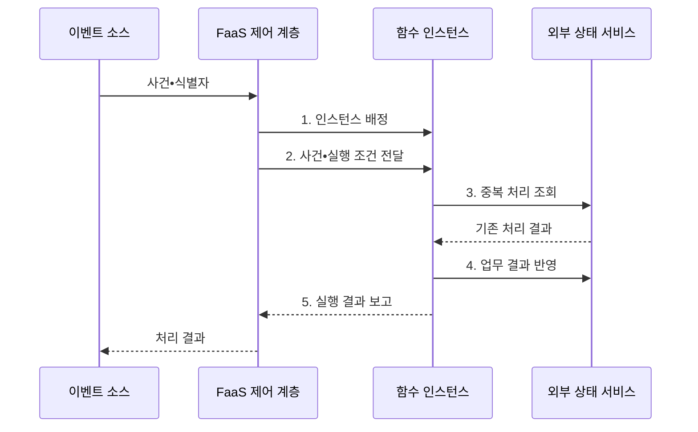

---
sidebar:
  order: 159
  label: "159. 서버리스 컴퓨팅•FaaS (Serverless Computing•FaaS)"
  badge:
    text: "기출 • 30%"
    variant: note
title: "서버리스 컴퓨팅•FaaS (Serverless Computing•FaaS)"
date: "2026-08-03T08:48:47+09:00"
tags:
  - "notes-software"
weight: 159
extra:
  question_no: "159"
  source_status: "기출"
  source_history: "120회, 122회"
  priority: 30
  priority_note: "이벤트 실행과 콜드 스타트는 기존 출제 범위임"
---

## Ⅰ. 개요

핵심 용어

- **서버리스•서비스형 함수(Serverless•Function as a Service, FaaS)**: 서버리스는 인프라 운영을 플랫폼에 맡기는 상위 실행 모델이고, FaaS는 이벤트마다 함수 인스턴스를 할당•확장•회수하는 구현 형태이다.

- 정의/개념: 플랫폼이 이벤트마다 함수 인스턴스를 할당•확장•회수하는 **서버리스 FaaS 실행 모델**
- 배경/필요성: 상시 서버 방식은 간헐 작업에도 **유휴 용량 비용 발생**

#### 한줄 요약
- 사진 업로드처럼 사건이 생길 때만 함수 인스턴스가 열리고 처리가 끝나면 플랫폼이 회수하므로 상시 서버를 준비할 필요가 줄어든다.

## Ⅱ. 특징

핵심 용어

- **Event ID•외부 상태**: 재시도되는 이벤트는 Event ID로 중복을 식별하고 상태는 함수 밖의 영속 저장소에서 관리해야 한다.
- **이벤트 식별자(Event Identifier, Event ID)**: 재전달된 같은 사건을 구분해 중복 처리를 막는 고유 식별값이다.
- **트리거(Trigger)•함수 버전**: 사건을 함수 호출로 연결하는 조건과 실행할 함수 코드 판본이다.
- **멱등 실행**: 같은 사건을 여러 번 처리해도 최종 업무 결과가 한 번 처리한 것과 같게 유지되는 실행 방식이다.

- **Trigger•함수 버전** 기반 이벤트 구동
- **자동 초기화•확장•회수** 기반 수명주기
- **Event ID•외부 상태** 기반 멱등 실행

#### 한줄 요약
- 서버 수를 직접 정하지 않는 대신 새 실행 환경이 열리는 시간과 같은 사건이 다시 도착하는 상황을 함수 설계가 흡수해야 한다.

## Ⅲ. 구조 및 구성요소

핵심 용어

- **함수 제어 계층**: 함수 제어 계층은 이벤트 수신, 인스턴스 확장, 실행 배정, 재시도와 수명주기를 관리한다.
- **이벤트 소스•트리거(Event Source•Trigger)**: 사건을 수신하고 호출할 함수와 버전을 결정하는 구성요소이다.
- **격리 런타임**: 함수 실행 환경을 새로 초기화하거나 기존 웜 인스턴스를 재사용하는 구성요소이다.
- **외부 상태 서비스**: 함수 인스턴스가 회수되어도 상태•이벤트 식별자•처리 결과를 보존하는 구성요소이다.
- **관측•과금**: 실행 시간•오류•호출량과 사용 비용을 기록하는 구성요소이다.

| 구성요소 | 책임 |
|:---|:---|
| 이벤트 소스•Trigger | 사건 수신•**호출 경로 결정** |
| 함수 제어 계층 | 버전•권한•**동시성 관리** |
| 격리 런타임 | **웜 재사용•콜드 초기화** |
| 외부 상태 서비스 | 상태•식별자•**결과 보존** |
| 관측•과금 | 실행•오류•**비용 기록** |

#### 한줄 요약

- 트리거가 작업 접수, 제어 계층이 좌석 배정, 런타임이 작업 공간, 외부 상태 서비스가 함수가 사라져도 남는 장부 역할을 한다.

## Ⅳ. 흐름도

핵심 용어

- **3. 중복 처리 조회**: 함수는 Event ID의 처리 이력을 조회해 이미 완료된 이벤트의 중복 실행을 막는다.
- **서비스형 함수(Function as a Service, FaaS) 제어 계층**: 함수 인스턴스의 할당•확장•회수와 실행 조건을 관리하는 계층이다.
- **1. 인스턴스 배정**: 기존 웜 환경을 재사용하거나 새 실행 환경을 초기화하는 단계이다.
- **2. 사건•실행 조건 전달**: 함수 버전•권한•시간 한도와 사건 정보를 실행 환경에 제공하는 단계이다.
- **4. 업무 결과 반영**: 조건부 쓰기로 같은 사건의 결과가 중복 저장되지 않게 하는 단계이다.
- **5. 실행 결과 보고**: 성공•실패와 재시도 필요 상태를 제어 계층에 전달하는 단계이다.

**동작 원리**

1. **인스턴스 배정**: 웜 재사용 또는 콜드 초기화
2. **사건•실행 조건 전달**: 버전•권한•시간 한도 적용
3. **중복 처리 조회**: 식별자•업무 키의 기존 결과 확인
4. **업무 결과 반영**: 조건부 쓰기로 업무 결과의 중복 반영 방지
5. **실행 결과 보고**: 성공•실패와 재시도 상태 전달

#### 한줄 요약

- 같은 파일 업로드 사건이 다시 전달돼도 외부 장부에서 식별자를 확인한 뒤 한 번만 결과를 쓰면 재시도가 중복 파일을 만들지 않는다.

## Ⅴ. 종류 및 비교

핵심 용어

- **서비스형 함수(Function as a Service, FaaS)**: 이벤트에 반응하는 짧은 함수를 필요할 때 실행하고 사용량에 따라 확장하는 서비스 모델이다.
- **관리형 컨테이너 서비스(Managed Container Service)**: 플랫폼이 기반 운영을 맡되 사용자가 장기 실행 컨테이너의 배포와 런타임을 제어하는 모델이다.

| 실행 모델 | FaaS | 관리형 컨테이너 서비스 |
|:---|:---|:---|
| 적용 기준 | **간헐 이벤트•단기 작업** | **지속 트래픽•긴 연결** |
| 핵심 특징 | 함수 호출•**플랫폼 인스턴스 회수** | 장기 컨테이너•**사용자 배포 제어** |
| 한계 | **콜드 스타트•실행 한도**•재시도 | **유휴 비용•용량•배포 운영** |

#### 한줄 요약
- 짧고 간헐적인 사건은 FaaS가 인스턴스를 회수해 유휴 비용을 줄이고 지속 연결과 긴 작업은 컨테이너가 실행 제어를 유지한다.

## Ⅵ. 실무 고려사항 및 대책

핵심 용어

- **콜드 스타트 지연**: 콜드 스타트 지연은 유휴 상태에서 새 실행 환경을 준비하느라 첫 요청 응답이 늦어지는 현상이다.
- **동시성 상한•대기열•역압**: 함수 실행 수를 제한하고 초과 사건을 대기시켜 하위 서비스 처리량을 보호하는 통제이다.
- **조건부 쓰기**: 기존 처리 여부나 버전 조건을 만족할 때만 결과를 저장해 중복 반영을 막는 방식이다.
- **상태 기계(State Machine)**: 긴 작업을 여러 단계와 상태 전이로 분할해 재시도•시간 제한을 관리하는 구조이다.

| 문제 | 대책 | 효과 |
|:---|:---|:---|
| **콜드 스타트 지연** | 패키지 최소화•**초기화 축소•예열** | **꼬리 지연 감소** |
| 급증 호출의 **DB 압박** | 동시성 상한•**대기열•역압** 적용 | 하위 서비스 **과부하 방지** |
| **사건 재전달** | 식별자•업무 키•**조건부 쓰기** | 업무 결과의 **중복 반영 방지** |
| **긴 실행 시간** | 작업 분할•**상태 기계•컨테이너 전환** | **실행 시간 초과 방지** |
| 인스턴스 **내부 상태** | **외부 상태•비밀 저장소** 사용 | 회수 시 **상태 손실 방지** |

#### 한줄 요약
- 이미지 업로드가 폭증해도 함수 동시성을 데이터베이스 처리량 아래로 제한하고 식별자로 중복을 막아 미리보기를 하나만 남겨야 한다.

## Ⅶ. 결론

핵심 용어

- **컨테이너**: 컨테이너는 장기 실행과 세밀한 런타임 제어가 필요한 워크로드에 적합한 배포 단위다.

- 짧고 재처리 가능한 사건은 **FaaS**, 지속 연결•긴 작업은 **컨테이너** 선택

#### 한줄 요약
- 짧고 재처리 가능한 사건은 FaaS로, 지속 연결이나 긴 상태 작업은 관리형 컨테이너로 나눠 실행 모델을 선택해야 한다.
