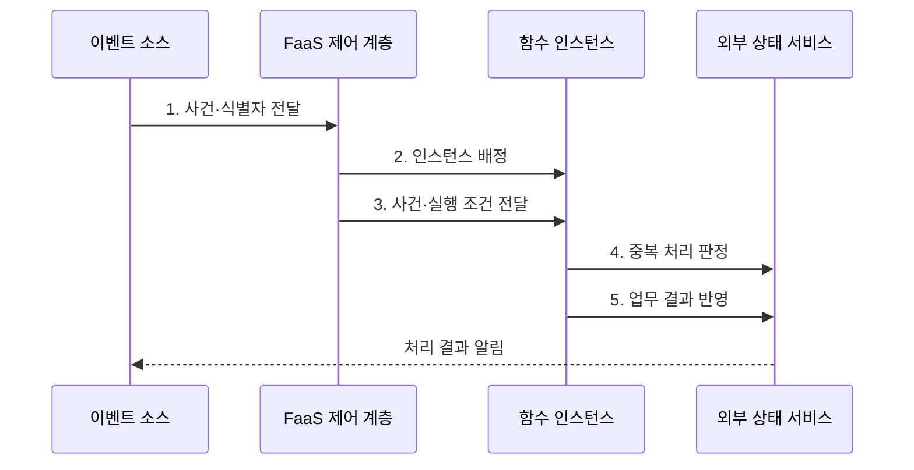

---
sidebar:
  order: 159
  label: "159. 서버리스 컴퓨팅·FaaS (Serverless Computing·FaaS)"
  badge:
    text: "기출 · 30%"
    variant: note
title: "서버리스 컴퓨팅·FaaS (Serverless Computing·FaaS)"
date: "2026-07-30T20:00:00+09:00"
tags:
  - "notes-software"
weight: 159
extra:
  question_no: "159"
  source_status: "기출"
  source_history: "120회, 122회"
  priority: 30
  priority_note: "이벤트 실행과 콜드 스타트는 기존 출제 범위임"
---

## 미리 알고가기

- **서버리스 컴퓨팅(Serverless Computing)**: 인프라 프로비저닝·확장·회수를 플랫폼에 맡기고 실행량만큼 자원을 쓰는 모델
- **서비스형 함수(Function as a Service, FaaS)**: 이벤트를 함수에 연결하고 호출량에 따라 실행 인스턴스를 배정하는 서버리스 유형
- **콜드·웜 스타트(Cold·Warm Start)**: 콜드 스타트는 새 런타임 초기화 지연이고 웜 스타트는 남은 인스턴스를 재사용하는 실행
- **트리거(Trigger)**: 웹 요청·메시지·파일·일정 사건을 특정 함수 호출로 연결하는 규칙
- **함수 인스턴스(Function Instance)**: 함수 코드와 런타임을 격리해 한 개 이상의 호출을 처리하는 실행 환경
- **동시성(Concurrency)**: 같은 시점에 실행하거나 한 인스턴스가 함께 처리하는 함수 호출 수
- **무상태(Stateless)**: 실행 인스턴스 내부에 다음 호출이 반드시 필요로 하는 상태를 남기지 않는 성질
- **멱등성(Idempotency)**: 같은 이벤트를 여러 번 처리해도 업무 결과가 한 번 처리한 것과 같은 성질
- **외부 상태 서비스(External State Service)**: 데이터베이스·객체 저장소처럼 함수 수명과 분리해 상태를 보존하는 서비스
- **응용 프로그래밍 인터페이스(Application Programming Interface, API)**: 함수가 외부 서비스의 기능·데이터를 호출하는 계약
- **이벤트 식별자(Event Identifier, Event ID)**: 재전달된 같은 사건을 판별해 중복 처리를 막는 값
- **역압(Backpressure)**: 하위 시스템의 처리 속도에 맞춰 새 요청 유입을 늦추는 제어

## Ⅰ. 개요

- 정의/개념: 플랫폼 관리형 **이벤트·함수 실행 모델**
- 배경/필요성: 간헐·급변 작업의 **유휴 용량·운영 부담 절감**

### 쉽게 이해하기 (학습용)
- 사진 업로드처럼 사건이 생길 때만 함수 인스턴스가 열리고 처리가 끝나면 플랫폼이 회수하므로 상시 서버를 준비할 필요가 줄어든다.

## Ⅱ. 특징

- **Trigger·함수 버전** 기반 이벤트 구동
- **자동 초기화·확장·회수** 기반 수명주기
- **Event ID·외부 상태** 기반 멱등 실행

### 쉽게 이해하기 (학습용)
- 서버 수를 직접 정하지 않는 대신 새 실행 환경이 열리는 시간과 같은 사건이 다시 도착하는 상황을 함수 설계가 흡수해야 한다.

## Ⅲ. 구조 및 구성요소

| 구성요소 | 책임 |
|:---|:---|
| 이벤트 소스·Trigger | 사건 수신·**호출 경로 결정** |
| 함수 제어 계층 | 버전·권한·**동시성 관리** |
| 격리 런타임 | **웜 재사용·콜드 초기화** |
| 외부 상태 서비스 | 상태·식별자·**결과 보존** |
| 관측·과금 | 실행·오류·**비용 기록** |

### 쉽게 이해하기 (학습용)

- 트리거가 작업 접수, 제어 계층이 좌석 배정, 런타임이 작업 공간, 외부 상태 서비스가 함수가 사라져도 남는 장부 역할을 한다.

## Ⅳ. 흐름도

**동작 원리**

1. **사건·식별자 전달**: 트리거 조건과 업무 입력 제공
2. **인스턴스 배정**: 웜 재사용 또는 콜드 초기화
3. **사건·실행 조건 전달**: 버전·권한·시간 한도 적용
4. **중복 처리 판정**: 식별자·업무 키의 기존 결과 조회
5. **업무 결과 반영**: 조건부 쓰기 기반 단일 효과 보존

### 쉽게 이해하기 (학습용)

- 같은 파일 업로드 사건이 다시 전달돼도 외부 장부에서 식별자를 확인한 뒤 한 번만 결과를 쓰면 재시도가 중복 파일을 만들지 않는다.

## Ⅴ. 종류 및 비교

| 실행 모델 | FaaS | 관리형 컨테이너 서비스 |
|:---|:---|:---|
| 적용 기준 | **간헐 이벤트·단기 작업** | **지속 트래픽·긴 연결** |
| 핵심 특징 | 함수 호출·**플랫폼 인스턴스 회수** | 장기 컨테이너·**사용자 배포 제어** |
| 한계 | **콜드 스타트·실행 한도**·재시도 | **유휴 비용·용량·배포 운영** |

### 쉽게 이해하기 (학습용)
- 짧고 간헐적인 사건은 FaaS가 인스턴스를 회수해 유휴 비용을 줄이고 지속 연결과 긴 작업은 컨테이너가 실행 제어를 유지한다.

## Ⅵ. 실무 고려사항 및 대책

| 고려사항 | 대책 | 효과 |
|:---|:---|:---|
| **콜드 스타트 지연** | 패키지 최소화·**초기화 축소·예열** | **꼬리 지연 감소** |
| 급증 호출의 **DB 압박** | 동시성 상한·**대기열·역압** 적용 | 하위 서비스 **과부하 방지** |
| **사건 재전달** | 식별자·업무 키·**조건부 쓰기** | 중복 업무 **효과 방지** |
| **긴 실행 시간** | 작업 분할·**상태 기계·컨테이너 전환** | 시간 제한 **중단 예방** |
| 인스턴스 **내부 상태** | **외부 상태·비밀 저장소** 사용 | 회수 시 **상태 손실 방지** |

### 쉽게 이해하기 (학습용)
- 이미지 업로드가 폭증해도 함수 동시성을 데이터베이스 처리량 아래로 제한하고 식별자로 중복을 막아 미리보기를 하나만 남겨야 한다.

## Ⅶ. 결론

- **호출 지속성·지연 목표·재처리 위험**으로 FaaS·컨테이너 결정

### 쉽게 이해하기 (학습용)
- 짧고 재처리 가능한 사건은 FaaS로, 지속 연결이나 긴 상태 작업은 관리형 컨테이너로 나눠 실행 모델을 선택해야 한다.
