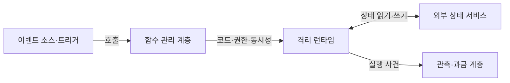
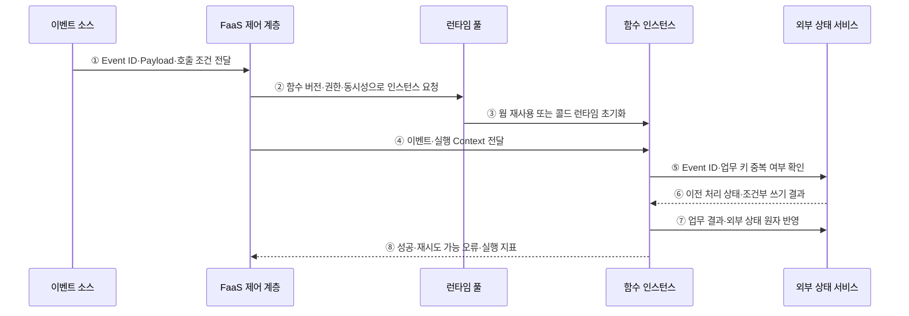

---
sidebar:
  order: 159
  label: "159. 서버리스 컴퓨팅·FaaS (Serverless Computing·FaaS)"
  badge:
    text: "기출 · 30%"
    variant: note
title: "서버리스 컴퓨팅·FaaS (Serverless Computing·FaaS)"
date: "2026-07-27T23:59:59+09:00"
tags:
  - "notes-software"
weight: 159
extra:
  question_no: "159"
  source_status: "기출"
  source_history: "120회, 122회"
  priority: 30
  priority_note: "이벤트 실행과 콜드 스타트는 기존 출제 범위임"
---

## 미리 알고가기

- **서버리스 컴퓨팅(Serverless Computing)**: 인프라 프로비저닝·확장·회수를 플랫폼에 맡기고 실행량만큼 자원을 쓰는 모델
- **서비스형 함수(Function as a Service, FaaS·에프에이에스)**: 영문 핵심 단어의 머리글자를 딴 표기이며, 이벤트를 함수에 연결하고 호출량에 따라 실행 인스턴스를 배정하는 서버리스 유형
- **콜드·웜 스타트(Cold·Warm Start)**: 콜드 스타트는 새 런타임 초기화 지연이고 웜 스타트는 남은 인스턴스를 재사용하는 실행
- **트리거(Trigger)**: 에이치티티피로 읽는 HTTP(Hypertext Transfer Protocol, 하이퍼텍스트 전송 규약)·메시지·파일·스케줄 사건을 특정 함수 호출로 연결하는 규칙
- **함수 인스턴스(Function Instance)**: 함수 코드와 런타임을 격리해 한 개 이상의 호출을 처리하는 실행 환경
- **동시성(Concurrency)**: 같은 시점에 실행하거나 한 인스턴스가 함께 처리하는 함수 호출 수
- **무상태(Stateless)**: 실행 인스턴스 내부에 다음 호출이 반드시 필요로 하는 상태를 남기지 않는 성질
- **멱등성(Idempotency)**: 같은 이벤트를 여러 번 처리해도 업무 결과가 한 번 처리한 것과 같은 성질
- **외부 상태 서비스(External State Service)**: 데이터베이스·객체 저장소처럼 함수 수명과 분리해 상태를 보존하는 서비스
- **서비스형 백엔드(Backend as a Service, BaaS·비에이에스)**: 영문 핵심 단어의 머리글자를 딴 표기이며, 인증·데이터 API 같은 백엔드 기능을 관리형으로 제공하는 서비스
- **응용 프로그래밍 인터페이스(Application Programming Interface, API·에이피아이)**: 영문 각 단어의 머리글자를 딴 표기이며, 함수가 외부 서비스의 기능·데이터를 호출하는 계약
- **이벤트 식별자(Event Identifier, Event ID·이벤트 아이디)**: Identifier를 ID로 줄인 표기이며, 재전달된 같은 사건을 판별해 중복 처리를 막는 값

## Ⅰ. 개요

- 서버리스 컴퓨팅은 인프라 프로비저닝·확장·회수를 플랫폼에 맡기는 운영 모델이고 FaaS는 HTTP·메시지·파일·스케줄 이벤트를 짧은 함수 실행에 연결하는 대표 형태이다.
- 간헐적·급변 작업의 상시 서버 유휴와 용량 계획 부담을 줄이는 대신 실행 한도·콜드 스타트·재시도·상태 외부화·플랫폼 종속을 관리한다.

### 쉽게 이해하기 (학습용)
- 일이 들어올 때만 작업 공간을 배정하고 끝나면 플랫폼이 회수한다.

## Ⅱ. 특징

- **이벤트 구동**: Trigger가 HTTP·Queue·파일·스케줄 사건을 함수 버전과 호출 규칙에 연결한다.
- **자동 자원 수명주기**: 플랫폼이 호출량에 따라 격리 인스턴스를 초기화·재사용·확장·회수한다.
- **사용량 기반 비용**: 호출 수·실행 시간·할당 자원으로 과금해 간헐 부하에 유리하지만 고정 고부하에는 불리할 수 있다.
- **무상태 실행**: 인스턴스 로컬 상태의 지속을 기대하지 않고 공유 상태·결과·체크포인트를 외부 서비스에 보존한다.
- **재전달 대응**: 이벤트 전달과 함수 실행은 중복될 수 있으므로 Event ID·조건부 쓰기·업무 키로 멱등성을 보장한다.

### 쉽게 이해하기 (학습용)
- 서버 관리는 줄지만 새 작업 공간을 여는 지연과 중복 호출을 고려해야 한다.

## Ⅲ. 아키텍처 및 구성요소

**도표안 A — 구조도**

**도표안 B — sequenceDiagram**

| 설계 요소 | 설명 |
|:---|:---|
| 이벤트 소스·Trigger | 사건 수신과 대상 함수·Batch·재시도·실패 경로 결정 |
| 함수 제어 계층 | 코드 버전·환경·권한·동시성·시간·배포 정책 관리 |
| 격리 런타임 | 웜 인스턴스 재사용 또는 콜드 환경 초기화·회수 |
| 함수 코드 | 제한된 실행 시간 안에 입력 검증·멱등 업무 처리 |
| 외부 상태 서비스 | 공유 상태·Event ID·결과·체크포인트 영속화 |
| 관측·과금 | 호출·초기화·실행·오류·재시도·비용 기록 |

**동작 원리**

- ① 이벤트 소스가 Event ID·Payload·Trigger 조건을 FaaS 제어 계층에 전달한다.
- ② 제어 계층이 함수 버전·실행 역할·동시성 한도를 확인해 런타임 풀에 인스턴스를 요청한다.
- ③ 런타임 풀이 남은 웜 인스턴스를 재사용하거나 코드·런타임·의존성을 로드하는 콜드 초기화를 수행한다.
- ④ 제어 계층이 선택한 함수 인스턴스에 이벤트와 마감 시각·요청 ID 같은 실행 Context를 전달한다.
- ⑤ 함수가 Event ID와 업무 키로 외부 상태 서비스에서 이전 처리 여부를 확인한다.
- ⑥ 상태 서비스가 이전 결과 또는 새 처리를 선점한 조건부 쓰기 결과를 반환한다.
- ⑦ 함수가 재실행돼도 한 번의 업무 효과만 남도록 결과와 상태를 원자적·조건부 방식으로 반영한다.
- ⑧ 함수가 성공·재시도 가능 오류·실행 시간·초기화 여부를 플랫폼에 반환해 재시도·실패 경로·과금에 사용한다.

### 쉽게 이해하기 (학습용)

- 일이 오면 남은 작업 공간을 쓰거나 새로 열고, 외부 장부로 중복을 막아 결과를 남긴다.

## Ⅳ. 종류 및 비교

| 비교 항목 | FaaS | 관리형 컨테이너 서비스 |
|:---|:---|:---|
| 실행 단위 | 함수·Event 호출 | 장기 실행 컨테이너·Service |
| 자원 수명 | 플랫폼이 호출량에 따라 생성·회수 | 최소 인스턴스·배포·확장을 사용자가 더 직접 설정 |
| 적합 부하 | 간헐 이벤트·병렬 단기 작업·Glue Logic | 지속 트래픽·긴 연결·복잡한 런타임 |
| 상태 | 외부화가 사실상 필수 | 외부화 권장, 프로세스 메모리 활용 범위 큼 |
| 제어 | 실행 시간·런타임·네트워크·동시성 제약 큼 | 이미지·프로세스·자원·네트워크 제어 넓음 |
| 주요 부담 | 콜드 스타트·재시도·한도·호출/종속 비용 | 유휴 비용·용량·패치·배포 운영 |

> 서버리스는 “서버가 없음”이 아니라 서버 운영 책임과 용량 수명주기를 공급자에게 추상화한 모델이다.

### 쉽게 이해하기 (학습용)
- FaaS는 짧은 호출, 컨테이너 서비스는 오래 살아 있는 처리에 더 맞는다.

## Ⅴ. 실무 고려사항 및 대책

| 고려사항 | 위험 | 대책 |
|:---|:---|:---|
| 콜드 스타트 | 지연 민감 요청의 꼬리 지연 증가 | 패키지 최소화·초기화 축소·예열/최소 인스턴스 |
| 동시성 | 급증이 DB·API를 압도 | 예약/최대 동시성·Queue·Backpressure |
| 재시도 | 중복 결제·파일·메시지 | Event ID·업무 키·조건부 쓰기·Outbox |
| 실행 한도 | 긴 작업·큰 Payload·연결 중단 | 작업 분할·Workflow·객체 참조·컨테이너 전환 |
| 상태·비밀 | 로컬 상태 손실·환경 변수 노출 | 외부 상태·비밀 저장소·짧은 자격 |
| 관측·비용 | 분산 호출과 관리형 서비스 비용 누락 | Trace ID·콜드/웜·재시도·단위 비용 |

> **적용 사례**: 이미지 업로드 이벤트는 객체 키와 Event ID만 함수에 전달하고 썸네일 키를 조건부 기록해 재전달에도 한 결과만 남긴다.

### 쉽게 이해하기 (학습용)
- 이미지가 올 때만 실행하되 같은 알림이 다시 와도 미리보기는 하나만 남긴다.

## Ⅵ. 결론

- FaaS의 핵심은 이벤트와 짧은 함수 실행을 연결하고 인스턴스 수명주기와 확장을 플랫폼에 맡기는 데 있다.
- 콜드 스타트·동시성·재전달 멱등성·외부 상태·실행 한도·관리형 서비스 비용을 검증해 짧고 재시도 가능한 작업에 적용해야 한다.

### 쉽게 이해하기 (학습용)
- 오래 연결하거나 계속 실행해야 하면 컨테이너 서비스가 더 단순할 수 있다.
