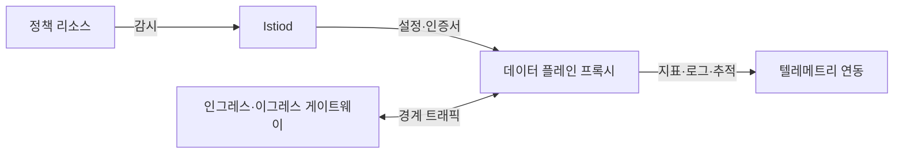
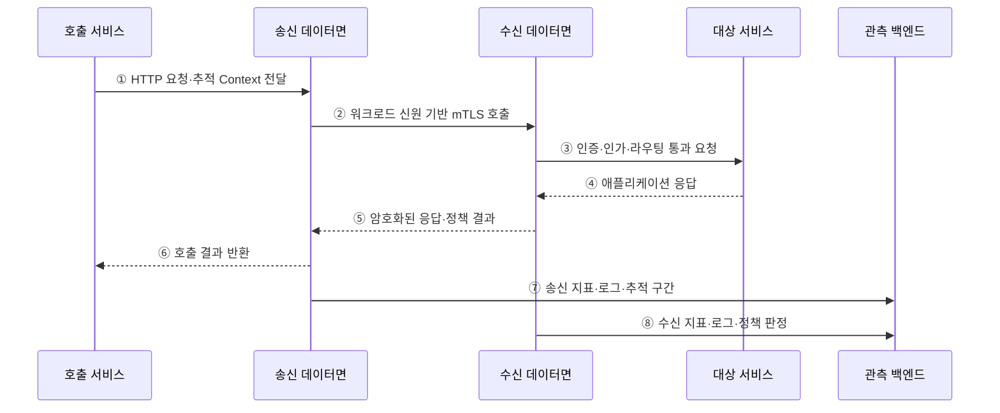

---
sidebar:
  order: 160
  label: "160. 서비스 메시 Istio (Service Mesh Istio)"
  badge:
    text: "기출 · 85%"
    variant: note
title: "서비스 메시 Istio (Service Mesh Istio)"
date: "2026-07-27T23:59:59+09:00"
tags:
  - "notes-software"
weight: 160
extra:
  question_no: "160"
  source_status: "기출"
  source_history: "123회, 138회"
  priority: 85
  priority_note: "데이터면·제어면과 트래픽 통제가 최근 출제됨"
---

## 미리 알고가기

- **서비스 메시(Service Mesh)**: 서비스 간 통신의 라우팅·보안·관측을 응용 코드와 분리한 인프라 계층
- **이스티오(Istio)**: 그리스어로 돛을 뜻하는 공식 프로젝트명이며, 제어면과 프록시 데이터면으로 Kubernetes 서비스 통신 정책을 구현하는 서비스 메시
- **쿠버네티스(Kubernetes)**: 그리스어로 조타수·항해사를 뜻하는 공식 프로젝트명이며, 컨테이너화한 서비스의 배포·확장·복구를 자동화하는 플랫폼
- **데이터 플레인(Data Plane)**: 서비스 트래픽을 중계하며 라우팅·보안 정책과 텔레메트리를 처리하는 프록시 계층
- **제어 플레인(Control Plane)**: 서비스·정책 정보를 데이터 플레인 프록시에 배포하는 관리 계층
- **이스티오디(Istiod)**: Istio에 데몬(Daemon)을 뜻하는 d를 붙인 공식 구성요소명이며, 서비스 발견·정책을 프록시 설정으로 변환하고 워크로드 인증서를 배포하는 제어면
- **사이드카 모드(Sidecar Mode)**: 워크로드마다 프록시를 배치해 L4·L7 트래픽을 처리하는 방식
- **앰비언트 모드(Ambient Mode)**: 노드 단위 L4 프록시와 선택적 L7 웨이포인트를 사용하는 방식
- **전송·응용 계층(Layer 4·Layer 7, L4·L7·엘포·엘세븐)**: 계층 번호 앞에 Layer의 L을 붙인 표기이며, L4는 연결·포트, L7은 HTTP 요청 내용을 기준으로 통신을 제어함
- **상호 전송 계층 보안(Mutual Transport Layer Security, mTLS·엠티엘에스)**: 상호 인증을 뜻하는 mutual의 m을 TLS 앞에 붙인 표기이며, 통신 양쪽의 신원을 인증하고 서비스 간 트래픽을 암호화하는 규약
- **하이퍼텍스트 전송 규약(Hypertext Transfer Protocol, HTTP·에이치티티피)**: 영문 각 단어의 머리글자를 딴 표기이며, L7에서 요청 메서드·경로·헤더를 전달하는 웹 통신 규약
- **응용 프로그래밍 인터페이스(Application Programming Interface, API·에이피아이)**: 영문 각 단어의 머리글자를 딴 표기이며, 서비스가 기능·데이터를 요청하는 호출 계약
- **텔레메트리(Telemetry)**: 요청의 지표·로그·추적 정보를 수집해 관측 시스템으로 전달하는 데이터
- **문맥 전파(Context Propagation)**: 추적·요청 식별자를 서비스 호출 헤더에 이어 보내 호출 관계를 연결하는 동작
- **카나리 배포(Canary Deployment)**: 새 버전에 일부 트래픽만 보내 위험을 확인한 뒤 비율을 늘리는 배포 방식

## Ⅰ. 개요

- 서비스 메시는 서비스 간 통신의 신원·암호화·인가·라우팅·복구·관측을 애플리케이션 코드와 분리해 데이터면 프록시에서 일관되게 처리하는 인프라 계층이다.
- Istio는 Istiod 제어면이 서비스·정책·인증서 정보를 프록시에 배포하고 Sidecar 또는 Ambient 데이터면이 실제 트래픽에서 정책을 집행한다.

### 쉽게 이해하기 (학습용)
- 앱 사이의 통신 규칙을 각 앱 코드가 아니라 공통 교통 계층에서 처리한다.

## Ⅱ. 특징

- **제어면·데이터면 분리**: Istiod가 발견·정책·인증서를 설정으로 만들고 프록시가 호출 경로에서 집행한다.
- **통신 보안**: 워크로드 신원과 mTLS로 상호 인증·암호화하고 L4/L7 AuthorizationPolicy로 접근을 제한한다.
- **트래픽 관리**: 버전·가중치·헤더 기반 라우팅, Timeout·Retry·Circuit Breaking을 서비스 코드 밖에서 적용한다.
- **통합 관측**: 프록시가 연결·요청 지표와 Access Log를 만들지만 분산 추적의 Context는 애플리케이션이 전달해야 한다.
- **데이터면 선택**: Sidecar는 워크로드별 프록시, Ambient는 노드별 ztunnel L4와 선택적 Waypoint L7로 기능과 비용을 분리한다.

### 쉽게 이해하기 (학습용)
- 프록시는 통신을 관찰하지만 추적 번호를 다음 호출에 넘기는 일은 앱이 맡는다.

## Ⅲ. 아키텍처 및 구성요소

**도표안 A — 구조도**

**도표안 B — sequenceDiagram**

| 설계 요소 | 설명 |
|:---|:---|
| Istiod | 서비스 발견·정책을 프록시 설정으로 변환하고 워크로드 인증서 배포 |
| Sidecar 데이터면 | 워크로드마다 Envoy를 두어 L4·L7 통신 중계 |
| Ambient 데이터면 | 노드별 ztunnel이 L4 보안, 선택적 Waypoint가 L7 정책 처리 |
| Gateway | 메시 경계의 Ingress·Egress 트래픽에 라우팅·보안 적용 |
| 정책 리소스 | 라우팅·Timeout·Retry·인증·인가·텔레메트리 조건 선언 |
| 관측 연동 | 프록시 지표·Access Log·Trace Span을 백엔드에 전달 |

**동작 원리**

- ① 호출 서비스가 HTTP 요청과 동일 호출망을 잇는 추적 Context를 송신 데이터면에 전달한다.
- ② 송신 프록시 또는 ztunnel이 Istiod가 배포한 신원·인증서·라우팅 설정으로 수신 데이터면에 mTLS 연결을 맺는다.
- ③ 수신 Sidecar 또는 Ambient Waypoint/ztunnel이 인증·인가·라우팅 정책을 적용하고 허용 요청을 대상 서비스에 전달한다.
- ④ 대상 서비스가 업무를 처리해 응답을 수신 데이터면에 반환한다.
- ⑤ 수신 데이터면이 응답 정책과 텔레메트리를 적용해 암호화된 연결로 송신 데이터면에 반환한다.
- ⑥ 송신 데이터면이 Timeout·Retry·Circuit 상태를 반영한 최종 호출 결과를 애플리케이션에 제공한다.
- ⑦ 송신 데이터면이 목적지·지연·오류·재시도와 추적 구간을 관측 백엔드에 보낸다.
- ⑧ 수신 데이터면도 출발 신원·인가 결과·응답 상태를 기록해 양쪽 호출을 연결한다.

### 쉽게 이해하기 (학습용)

- 양쪽 검문소가 신분과 경로를 확인하고 통신을 암호화하며 통행 기록을 남긴다.

## Ⅳ. 종류 및 비교

| 비교 항목 | Sidecar 모드 | Ambient 모드 |
|:---|:---|:---|
| 기본 프록시 | 워크로드 Pod마다 Envoy | 노드마다 공유 ztunnel |
| L4 기능 | Sidecar가 mTLS·L4 정책·Telemetry 처리 | ztunnel이 mTLS·신원·L4 정책·Telemetry 처리 |
| L7 기능 | 각 Sidecar가 HTTP 라우팅·인가·관측 처리 | 필요한 범위에 Waypoint를 배치해 처리 |
| 운영 단위 | Pod 주입·재시작·프록시 버전 동기화 | Namespace/워크로드 참여와 공유 프록시 관리 |
| 자원·격리 | 워크로드별 자원·장애 경계, 프록시 수 많음 | 공유 L4로 프록시 수 감소, L7은 선택 비용 |
| 적합 기준 | 워크로드별 완전한 L7·성숙한 운영 요구 | L4 보안부터 점진 도입·선택적 L7 요구 |

> Ambient의 ztunnel은 L4에 한정되므로 HTTP 경로·헤더 기반 정책과 라우팅에는 Waypoint가 필요하다.

### 쉽게 이해하기 (학습용)
- Sidecar는 전담 검문소, Ambient는 공유 L4 검문소와 필요한 곳의 L7 검문소이다.

## Ⅴ. 실무 고려사항 및 대책

| 고려사항 | 위험 | 대책 |
|:---|:---|:---|
| 적용 범위 | 일부 워크로드 우회·정책 공백 | 참여 Label·주입·트래픽 경로 검증 |
| mTLS 전환 | Strict 적용 전 비메시 호출 차단 | Peer 상태 관찰·점진 전환·예외 만료 |
| Retry·Timeout | 중복 업무·호출 폭증·꼬리 지연 | 멱등성·Retry Budget·전체 시간 예산 |
| L7 정책 | Ambient ztunnel만으로 HTTP 정책 기대 | Waypoint 배치·경로 검증·기능 행렬 |
| 관측 | 프록시 Span만 있고 서비스 간 Trace 단절 | 앱의 Context 전파·샘플링·공통 ID |
| 자원·장애 | 프록시 지연·CPU·설정 폭증 | 부하 시험·설정 범위 축소·용량·롤백 |

> **적용 사례**: 카나리 버전에 5% 요청을 보내되 오류율·지연·Retry 증폭을 함께 보고, 결제처럼 비멱등 호출에는 안전한 재시도 조건을 둔다.

### 쉽게 이해하기 (학습용)
- 새 버전에 조금만 보내고 오류·지연·중복 효과가 안전할 때 비율을 늘린다.

## Ⅵ. 결론

- Istio의 핵심은 서비스 통신 정책을 Istiod가 데이터면 설정으로 배포하고 실제 프록시가 각 호출에서 집행·관측하는 데 있다.
- 필요한 L4/L7 기능·신뢰 경계·프록시 자원·지연·재시도 안전성·운영 성숙도를 검토해 Sidecar·Ambient·Waypoint 범위를 선택해야 한다.

### 쉽게 이해하기 (학습용)
- 모든 호출에 전담 L7 프록시가 필요하지 않다면 공유 L4부터 적용할 수 있다.
