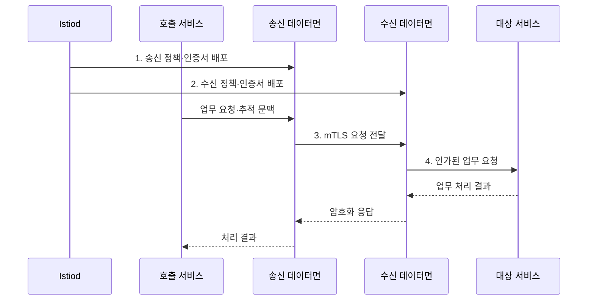

---
sidebar:
  order: 160
  label: "160. 서비스 메시 Istio (Service Mesh Istio)"
  badge:
    text: "기출 · 85%"
    variant: note
title: "서비스 메시 Istio (Service Mesh Istio)"
date: "2026-08-02T23:30:00+09:00"
tags:
  - "notes-software"
weight: 160
extra:
  question_no: "160"
  source_status: "기출"
  source_history: "123회, 138회"
  priority: 85
  priority_note: "데이터면·제어면과 트래픽 통제가 최근 출제됨"
---

## Ⅰ. 개요

핵심 용어

- **이스티오 서비스 메시(Istio Service Mesh)**: 서비스 간 통신의 보안·관찰·트래픽 제어를 애플리케이션 밖 데이터면 프록시와 제어면 정책으로 제공하는 인프라 계층이다.

- 정의/개념: 데이터면 프록시와 제어면으로 서비스 통신 정책을 애플리케이션 코드에서 분리하는 **서비스 메시 인프라 계층**
- 배경/필요성: 서비스별 통신 코드로는 **정책 일관성·변경 통제 곤란**

#### 한줄 요약

- 각 서비스가 인증서와 재시도 코드를 따로 만들지 않고 통신 전담 프록시가 동일한 보안·경로 규칙을 적용하도록 책임을 옮긴다.

## Ⅱ. 특징

핵심 용어

- **제어면·데이터면 분리**: 제어면은 정책과 구성을 배포하고 데이터면은 실제 요청 경로에서 이를 집행한다.
- **상호 전송 계층 보안(Mutual Transport Layer Security, mTLS)**: 통신 양쪽이 인증서를 제시해 서로의 신원을 확인하고 트래픽을 암호화하는 방식이다.
- **라우팅·복구·텔레메트리**: 요청 경로 선택, 장애 대응, 지표·로그·추적 수집을 통신 계층에서 제공하는 기능이다.

- **제어면·데이터면 분리** 기반 정책 집행
- **워크로드 신원·mTLS** 기반 통신 보안
- **라우팅·복구·텔레메트리** 기반 통신 운영

#### 한줄 요약

- Istiod는 교통 규칙을 배포하고 데이터면 프록시는 각 통신 지점에서 신원 확인, 경로 선택, 기록 생성을 수행한다.

## Ⅲ. 구조 및 구성요소

핵심 용어

- **Istiod**: Istiod는 서비스 발견 정보, 인증서, 트래픽 정책을 프록시 데이터면에 배포하는 제어면 구성요소다.
- **사이드카(Sidecar)·앰비언트(Ambient) 데이터면**: 워크로드별 프록시 또는 노드 공유 계층에서 전송·응용 계층 트래픽 정책을 집행하는 구성요소이다.
- **게이트웨이(Gateway)**: 메시 안팎으로 드나드는 경계 트래픽의 라우팅·보안 정책을 집행하는 구성요소이다.
- **정책 리소스**: 서비스 통신의 라우팅·인증·인가 조건을 선언하는 구성요소이다.
- **관측 연동**: 데이터면에서 생성한 지표·로그·분산 추적 정보를 관측 시스템에 전달하는 구성요소이다.

| 구성요소 | 책임 |
| --- | --- |
| Istiod | 발견·정책·**인증서 배포** |
| Sidecar·Ambient 데이터면 | **L4·L7 트래픽** 집행 |
| Gateway | **메시 경계 트래픽** 제어 |
| 정책 리소스 | **라우팅·인증·인가** 선언 |
| 관측 연동 | **지표·로그·추적** 전달 |

#### 한줄 요약

- Istiod가 관제실이라면 데이터면은 도로의 검문소, Gateway는 도시 경계의 관문, 관측 연동은 전체 이동 기록을 모으는 장치다.

## Ⅳ. 흐름도

핵심 용어

- **3. mTLS 요청 전달**: 데이터면 프록시는 상호 인증서를 사용해 mTLS로 요청을 안전하게 전달한다.
- **1. 송신 정책·인증서 배포**: 이스티오드가 호출 경로와 송신 워크로드 신원 자료를 제공하는 단계이다.
- **2. 수신 정책·인증서 배포**: 이스티오드가 접근 권한과 수신 워크로드 신원 자료를 제공하는 단계이다.
- **상호 전송 계층 보안(Mutual Transport Layer Security, mTLS) 요청 전달**: 양쪽 워크로드 신원을 인증하고 요청을 암호화해 전달하는 단계이다.
- **4. 인가된 업무 요청**: 신원·접근·경로 정책을 모두 통과한 호출을 대상 서비스에 중계하는 단계이다.

**동작 원리**

1. **송신 정책·인증서 배포**: 호출 경로와 신원 자료 제공
2. **수신 정책·인증서 배포**: 접근 권한과 신원 자료 제공
3. **mTLS 요청 전달**: 양쪽 워크로드 신원 인증·암호화
4. **인가된 업무 요청**: 접근·경로 정책을 통과한 호출 중계

#### 한줄 요약

- 주문 서비스의 요청은 양쪽 프록시가 신원을 확인하고 허용 경로를 고른 뒤 결제 서비스로 전달되며 같은 지점에서 지연과 오류도 기록된다.

## Ⅴ. 종류 및 비교

핵심 용어

- **Ambient**: Ambient 모드는 사이드카 없이 노드 수준과 선택적 L7 프록시 계층으로 메시 기능을 제공한다.
- **사이드카(Sidecar)**: 각 파드에 엔보이 프록시를 함께 배치해 응용 계층(Layer 7, L7)까지 트래픽을 제어하는 데이터면 방식이다.
- **앰비언트(Ambient)**: 노드별 제트터널(ztunnel)에서 전송 계층(Layer 4, L4)을 처리하고 필요한 경로에만 웨이포인트(Waypoint)를 두는 방식이다.

| 데이터면 방식 | Sidecar | Ambient |
| --- | --- | --- |
| 적용 기준 | **워크로드별 완전한 L7** | **L4 우선·선택적 L7** |
| 핵심 특징 | **Pod별 Envoy** | **노드별 ztunnel·Waypoint** |
| 한계 | 프록시 수·**주입·사용량 증가** | L7에 **Waypoint 필요** |

#### 한줄 요약

- Sidecar는 파드마다 Envoy를 두어 L7 기능을 바로 제공하고 Ambient는 노드 L4를 공유한 뒤 필요한 경로에만 Waypoint를 추가한다.

## Ⅵ. 실무 고려사항 및 대책

핵심 용어

- **재시도 폭주**: 재시도 폭주는 여러 계층의 중첩 재시도가 장애 서비스에 요청을 증폭해 복구를 늦추는 문제다.
- **재시도 예산·시간 제한**: 전체 호출에서 허용할 재시도 비율과 각 시도가 사용할 수 있는 시간을 제한하는 통제이다.
- **허용 모드·강제 적용**: 평문과 암호화 호출을 함께 허용해 미대응 대상을 찾은 뒤 상호 인증을 의무화하는 전환 절차이다.
- **표본율·보존 기간·마스킹**: 텔레메트리 수집 비율과 저장 기간을 제한하고 민감정보를 가리는 비용·보안 통제이다.

| 문제 | 대책 | 효과 |
| --- | --- | --- |
| 전면 도입 **장애 확산** | 비핵심 서비스부터 **단계 확대** | 변경 **영향 범위 축소** |
| mTLS 전환 중 **단절** | 허용 모드 관찰 후 **강제 적용** | 미대응 호출 **사전 발견** |
| 중첩 **재시도 폭주** | 재시도 예산·**시간 제한 연계** | **장애 증폭 억제** |
| L7 **경로·인가 충돌** | 정책 정적 검사·**통합 시험** | 설정 충돌 **조기 발견** |
| 텔레메트리 **비용 증가** | 표본율·보존 기간·**마스킹 설정** | 비용·**정보 노출 통제** |

#### 한줄 요약

- 일부 서비스에서 암호화 전환과 재시도 정책을 먼저 관찰하면 숨은 평문 호출과 애플리케이션 재시도의 중첩을 전체 적용 전에 찾을 수 있다.

## Ⅶ. 결론

핵심 용어

- **Sidecar**: Sidecar 방식은 각 워크로드 파드에 프록시를 함께 배치해 서비스 간 트래픽을 가로채고 제어한다.

- 전면 L7은 **Sidecar**, L4 중심은 **Ambient**, 선택 L7에 Waypoint 배치

#### 한줄 요약

- 모든 워크로드에 L7 통제가 필요하면 Sidecar를, L4 암호화가 중심이면 Ambient를 기준으로 삼고 필요한 경로에만 Waypoint를 배치해야 한다.
