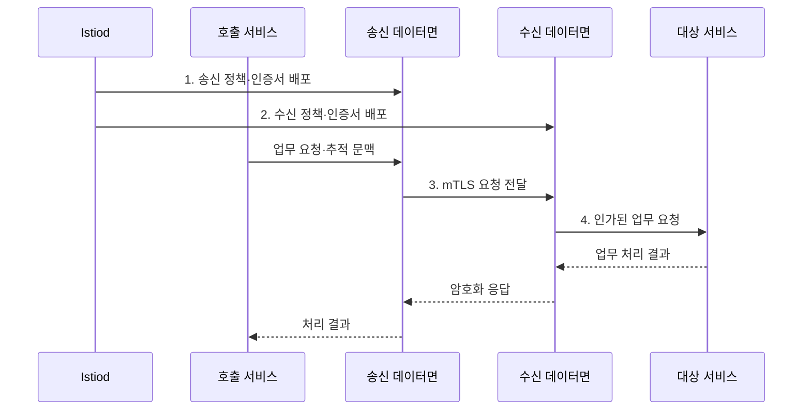

---
sidebar:
  order: 160
  label: "160. 서비스 메시 Istio (Service Mesh Istio)"
  badge:
    text: "기출 · 85%"
    variant: note
title: "서비스 메시 Istio (Service Mesh Istio)"
date: "2026-07-31T10:45:24+09:00"
tags:
  - "notes-software"
weight: 160
extra:
  question_no: "160"
  source_status: "기출"
  source_history: "123회, 138회"
  priority: 85
  priority_note: "데이터면·제어면과 트래픽 통제가 최근 출제됨"
---

## 미리 알고가기

- **서비스 메시(Service Mesh)**: 서비스 간 통신의 라우팅·보안·관측을 응용 코드와 분리한 인프라 계층
- **이스티오(Istio)**: 제어면과 프록시 데이터면으로 Kubernetes 서비스 통신 정책을 구현하는 서비스 메시
- **데이터 플레인(Data Plane)**: 트래픽을 중계하며 라우팅·보안 정책과 텔레메트리를 처리하는 프록시 계층
- **제어 플레인(Control Plane)**: 서비스·정책 정보를 데이터 플레인 프록시에 배포하는 관리 계층
- **사이드카 모드(Sidecar Mode)**: 워크로드마다 프록시를 배치해 L4·L7 트래픽을 처리하는 방식
- **앰비언트 모드(Ambient Mode)**: 노드 단위 L4 프록시와 선택적 L7 웨이포인트를 사용하는 방식
- **상호 전송 계층 보안(Mutual TLS, mTLS)**: 통신 양쪽의 신원을 인증하고 트래픽을 암호화하는 규약
- **Istiod**: 서비스 발견, 정책, 인증서를 데이터면에 배포하는 Istio 제어면
- **Envoy**: 사이드카 모드에서 워크로드별 트래픽을 처리하는 프록시
- **ztunnel·Waypoint**: 앰비언트 모드에서 각각 노드 L4 통신과 선택적 L7 정책을 처리하는 프록시
- **텔레메트리(Telemetry)**: 통신 상태를 분석하기 위한 지표·로그·분산 추적 데이터
- **Gateway**: 서비스 메시 경계의 인바운드·아웃바운드 트래픽을 제어하는 구성요소
- **쿠버네티스(Kubernetes)**: 컨테이너화한 워크로드의 배포·확장·복구를 자동화하는 플랫폼
- **4계층·7계층(Layer 4·Layer 7, L4·L7)**: 전송 계층과 응용 계층에서 트래픽을 처리하는 통신 계층
- **파드(Pod)**: 쿠버네티스에서 하나 이상의 컨테이너를 함께 실행하는 최소 배포 단위
- **재시도 예산(Retry Budget)**: 전체 요청 중 재시도에 허용할 비율이나 횟수의 한도
- **표본율(Sampling Rate)**: 전체 관측 사건 중 실제 수집·저장하는 데이터의 비율

> **키워드:** 서비스 메시 Istio (Service Mesh Istio)

## Ⅰ. 개요

- 정의/개념: 서비스 통신 정책을 코드에서 분리하는 **인프라 계층**
- 배경/필요성: 서비스별 통신 코드로는 **정책 일관성·변경 통제 곤란**

### 쉽게 이해하기 (학습용)

- 각 서비스가 인증서와 재시도 코드를 따로 만들지 않고 통신 전담 프록시가 동일한 보안·경로 규칙을 적용하도록 책임을 옮긴다.

## Ⅱ. 특징

- **제어면·데이터면 분리** 기반 정책 집행
- **워크로드 신원·mTLS** 기반 통신 보안
- **라우팅·복구·텔레메트리** 기반 통신 운영

### 쉽게 이해하기 (학습용)

- Istiod는 교통 규칙을 배포하고 데이터면 프록시는 각 통신 지점에서 신원 확인, 경로 선택, 기록 생성을 수행한다.

## Ⅲ. 구조 및 구성요소

| 구성요소 | 책임 |
| --- | --- |
| Istiod | 발견·정책·**인증서 배포** |
| Sidecar·Ambient 데이터면 | **L4·L7 트래픽** 집행 |
| Gateway | **메시 경계 트래픽** 제어 |
| 정책 리소스 | **라우팅·인증·인가** 선언 |
| 관측 연동 | **지표·로그·추적** 전달 |

### 쉽게 이해하기 (학습용)

- Istiod가 관제실이라면 데이터면은 도로의 검문소, Gateway는 도시 경계의 관문, 관측 연동은 전체 이동 기록을 모으는 장치다.

## Ⅳ. 흐름도

**동작 원리**

1. **송신 정책·인증서 배포**: 호출 경로와 신원 자료 제공
2. **수신 정책·인증서 배포**: 접근 권한과 신원 자료 제공
3. **mTLS 요청 전달**: 양쪽 워크로드 신원 인증·암호화
4. **인가된 업무 요청**: 접근·경로 정책을 통과한 호출 중계

### 쉽게 이해하기 (학습용)

- 주문 서비스의 요청은 양쪽 프록시가 신원을 확인하고 허용 경로를 고른 뒤 결제 서비스로 전달되며 같은 지점에서 지연과 오류도 기록된다.

## Ⅴ. 종류 및 비교

| 데이터면 방식 | Sidecar | Ambient |
| --- | --- | --- |
| 적용 기준 | **워크로드별 완전한 L7** | **L4 우선·선택적 L7** |
| 핵심 특징 | **Pod별 Envoy** | **노드별 ztunnel·Waypoint** |
| 한계 | 프록시 수·**주입·사용량 증가** | L7에 **Waypoint 필요** |

### 쉽게 이해하기 (학습용)

- Sidecar는 파드마다 Envoy를 두어 L7 기능을 바로 제공하고 Ambient는 노드 L4를 공유한 뒤 필요한 경로에만 Waypoint를 추가한다.

## Ⅵ. 실무 고려사항 및 대책

| 고려사항 | 대책 | 효과 |
| --- | --- | --- |
| 전면 도입 **장애 확산** | 비핵심 서비스부터 **단계 확대** | 변경 **영향 범위 축소** |
| mTLS 전환 중 **단절** | 허용 모드 관찰 후 **강제 적용** | 미대응 호출 **사전 발견** |
| 중첩 **재시도 폭주** | 재시도 예산·**시간 제한 연계** | **장애 증폭 억제** |
| L7 **경로·인가 충돌** | 정책 정적 검사·**통합 시험** | 설정 충돌 **조기 발견** |
| 텔레메트리 **비용 증가** | 표본율·보존 기간·**마스킹 설정** | 비용·**정보 노출 통제** |

### 쉽게 이해하기 (학습용)

- 일부 서비스에서 암호화 전환과 재시도 정책을 먼저 관찰하면 숨은 평문 호출과 애플리케이션 재시도의 중첩을 전체 적용 전에 찾을 수 있다.

## Ⅶ. 결론

- 전면 L7은 **Sidecar**, L4 중심은 **Ambient**, 선택 L7에 Waypoint 배치

### 쉽게 이해하기 (학습용)

- 모든 워크로드에 L7 통제가 필요하면 Sidecar를, L4 암호화가 중심이면 Ambient를 기준으로 삼고 필요한 경로에만 Waypoint를 배치해야 한다.
