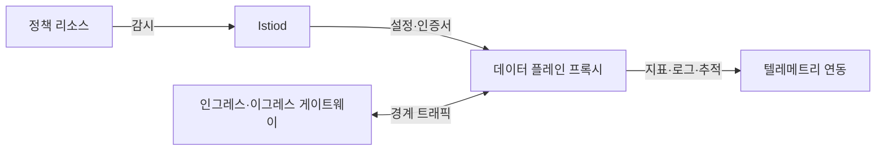
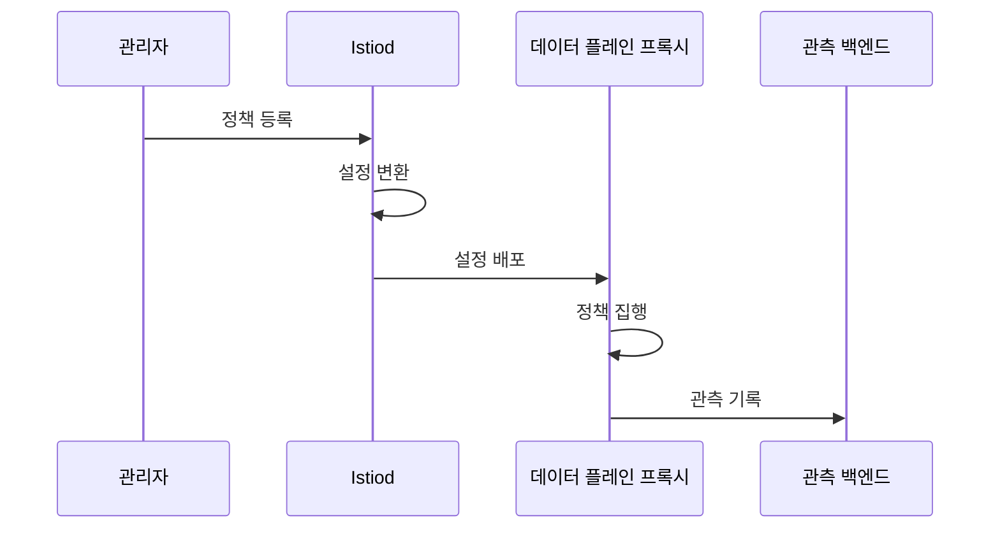

---
sidebar:
  order: 160
  label: "160. 서비스 메시 Istio (Service Mesh Istio)"
  badge:
    text: "기출 · 85%"
    variant: note
title: "서비스 메시 Istio (Service Mesh Istio)"
date: "2026-07-27T23:59:59+09:00"
tags:
  - "notes-software"
weight: 160
extra:
  question_no: "160"
  source_status: "기출"
  source_history: "123회, 138회"
  priority: 85
  priority_note: "데이터면·제어면과 트래픽 통제가 최근 출제됨"
---

## 미리 알고가기

- **서비스 메시(Service Mesh)**: 서비스 간 통신의 라우팅·보안·관측을 응용 코드와 분리한 인프라 계층
- **이스티오(Istio)**: 그리스어로 돛을 뜻하는 공식 프로젝트명이며, 제어면과 프록시 데이터면으로 Kubernetes 서비스 통신 정책을 구현하는 서비스 메시
- **쿠버네티스(Kubernetes)**: 그리스어로 조타수·항해사를 뜻하는 공식 프로젝트명이며, 컨테이너화한 서비스의 배포·확장·복구를 자동화하는 플랫폼
- **데이터 플레인(Data Plane)**: 서비스 트래픽을 중계하며 라우팅·보안 정책과 텔레메트리를 처리하는 프록시 계층
- **제어 플레인(Control Plane)**: 서비스·정책 정보를 데이터 플레인 프록시에 배포하는 관리 계층
- **이스티오디(Istiod)**: Istio에 데몬(Daemon)을 뜻하는 d를 붙인 공식 구성요소명이며, 서비스 발견·정책을 프록시 설정으로 변환하고 워크로드 인증서를 배포하는 제어면
- **사이드카 모드(Sidecar Mode)**: 워크로드마다 프록시를 배치해 L4·L7 트래픽을 처리하는 방식
- **앰비언트 모드(Ambient Mode)**: 노드 단위 L4 프록시와 선택적 L7 웨이포인트를 사용하는 방식
- **전송·응용 계층(Layer 4·Layer 7, L4·L7·엘포·엘세븐)**: 계층 번호 앞에 Layer의 L을 붙인 표기이며, L4는 연결·포트, L7은 HTTP 요청 내용을 기준으로 통신을 제어함
- **상호 전송 계층 보안(Mutual Transport Layer Security, mTLS·엠티엘에스)**: 상호 인증을 뜻하는 mutual의 m을 TLS 앞에 붙인 표기이며, 통신 양쪽의 신원을 인증하고 서비스 간 트래픽을 암호화하는 규약
- **하이퍼텍스트 전송 규약(Hypertext Transfer Protocol, HTTP·에이치티티피)**: 영문 각 단어의 머리글자를 딴 표기이며, L7에서 요청 메서드·경로·헤더를 전달하는 웹 통신 규약
- **응용 프로그래밍 인터페이스(Application Programming Interface, API·에이피아이)**: 영문 각 단어의 머리글자를 딴 표기이며, 서비스가 기능·데이터를 요청하는 호출 계약
- **텔레메트리(Telemetry)**: 요청의 지표·로그·추적 정보를 수집해 관측 시스템으로 전달하는 데이터
- **문맥 전파(Context Propagation)**: 추적·요청 식별자를 서비스 호출 헤더에 이어 보내 호출 관계를 연결하는 동작
- **카나리 배포(Canary Deployment)**: 새 버전에 일부 트래픽만 보내 위험을 확인한 뒤 비율을 늘리는 배포 방식

## Ⅰ. 개요

- 정의/개념: 프록시 데이터면에서 **서비스 통신 정책 집행**
- 기존 한계: 서비스별 횡단 통신 코드의 **중복·정책 불일치**

### 쉽게 이해하기 (학습용)
- 앱 외부 프록시 계층에서 통신 정책을 처리함

## Ⅱ. 특징

- 정책 변경과 응용 배포를 독립 수행한다.
- 프록시 지연·자원 비용이 모든 호출에 추가한다.
- 상호 인증·인가·재시도를 코드 없이 일관 적용한다.
- 사이드카와 앰비언트는 격리 수준·L7 기능·자원 비용이 다르다.

### 쉽게 이해하기 (학습용)
- 통신은 프록시가 맡고 문맥 전파는 앱이 담당함

## Ⅲ. 아키텍처 및 구성요소

| 설계 요소 | 설명 |
|:---|:---|
| Istiod | 정책을 프록시 설정과 인증서로 배포함 |
| 데이터 플레인 프록시 | 사이드카와 공유 프록시로 트래픽을 처리함 |
| 인그레스·이그레스 게이트웨이 | 경계의 외부 유입 및 유출 트래픽에 정책 적용함 |
| 정책 리소스 | 라우팅·복구·인증·인가 조건을 선언함 |
| 텔레메트리 연동 | 지표·로그·추적을 관측 백엔드로 전달 |

> 요약: 정책을 배포하고 호출 경로에서 집행을 처리함

### 쉽게 이해하기 (학습용)
- 정책 규칙을 배포하고 프록시가 실제 집행함

## Ⅳ. 원리 및 절차 흐름도

| 절차 | 설명 |
|:---|:---|
| 정책 등록 | 라우팅·인증·인가 정책 선언 |
| 설정 변환 | 정책을 대상별 프록시 설정으로 변환 |
| 설정 배포 | 설정·인증서를 대상 프록시에 전달 |
| 정책 집행 | 요청 인증·인가·라우팅 적용 |
| 관측 기록 | 요청 결과를 텔레메트리로 전송 |

> 요약: 선언된 정책이 프록시 설정으로 전환되어 집행됨

### 쉽게 이해하기 (학습용)
- 정책 선언부터 프록시 배포·요청 판정·관측까지 이어짐

## Ⅴ. 종류 및 비교

| Istio 데이터면 | 사이드카 모드 | 앰비언트 모드 |
|:---|:---|:---|
| 적용 기준 | 워크로드별 **L4·L7 격리** | 공유 L4·**선택적 L7** |
| 핵심 특징 | 파드별 **전용 프록시** | 노드 프록시·**웨이포인트 분리** |
| 한계 | 파드 자원·**업그레이드 부담** | 공유 장애·**기능 편차** |

> 요약: 사이드카는 개별 프록시, 앰비언트는 공유함

### 쉽게 이해하기 (학습용)
- 전자는 전담 프록시, 후자는 공유 L4 구조임

## Ⅵ. 실무 사례

1. 카나리 버전에 5% 트래픽만 가중치 라우팅

### 쉽게 이해하기 (학습용)
- 새 버전은 일부 요청만 보내 오류가 없을 때 비율을 늘린다.

## Ⅶ. 결론

- 세밀한 L7 통제는 사이드카, L4 공유는 앰비언트 선택

### 쉽게 이해하기 (학습용)
- 요청별 프록시가 필요하지 않으면 공유 L4 경로로 자원 비용을 줄인다.
