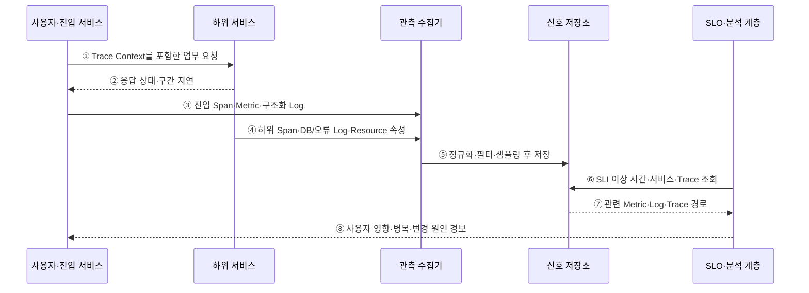

---
sidebar:
  order: 161
  label: "161. 클라우드 네이티브 관측성 (Cloud Native Observability)"
  badge:
    text: "기출 · 70%"
    variant: note
title: "클라우드 네이티브 관측성 (Cloud Native Observability)"
date: "2026-07-27T23:59:59+09:00"
tags:
  - "notes-software"
weight: 161
extra:
  question_no: "161"
  source_status: "기출"
  source_history: "135회"
  priority: 70
  priority_note: "로그·지표·추적의 연계가 최근 출제됨"
---

## 미리 알고가기

- **관측성(Observability)**: 시스템이 내보낸 신호로 내부 상태와 알려지지 않은 문제 원인을 질의·추론할 수 있는 성질
- **메트릭(Metric)**: 일정 구간의 수치 상태를 집계해 비율·추세·임계값을 나타내는 시계열 신호
- **로그(Log)**: 특정 시점에 발생한 사건과 처리 문맥을 기록한 신호
- **트레이스·스팬(Trace·Span)**: 트레이스는 한 요청의 전체 호출 경로이고 스팬은 그 안의 개별 작업 구간
- **트레이스 식별자(Trace Identifier, Trace ID·트레이스 아이디)**: Identifier를 ID로 줄인 표기이며, 여러 서비스의 스팬과 로그를 같은 요청으로 연결하는 식별값
- **서비스 수준 지표(Service Level Indicator, SLI·에스엘아이)**: 영문 각 단어의 머리글자를 딴 표기이며, 사용자 관점의 가용성·지연 같은 실제 서비스 성능 측정값
- **서비스 수준 목표(Service Level Objective, SLO·에스엘오)**: 영문 각 단어의 머리글자를 딴 표기이며, 일정 기간에 SLI가 달성해야 할 목표 수준
- **리소스 속성(Resource Attribute)**: 서비스·파드(Pod)·노드·클러스터처럼 신호 생성 대상을 식별하는 정보
- **응용 프로그래밍 인터페이스(Application Programming Interface, API·에이피아이)**: 영문 각 단어의 머리글자를 딴 표기이며, 서비스 기능을 호출하는 규약이자 관측 대상 요청의 경계
- **데이터베이스(Database, DB·디비)**: 영문 단어의 앞 글자를 딴 표기이며, 서비스 데이터와 관측 대상 질의 결과를 저장하는 시스템
- **카디널리티(Cardinality)**: 속성값 조합의 수로 저장·조회 비용과 신호 상세도를 좌우하는 값
- **샘플링(Sampling)**: 전체 사건 중 일부 트레이스·로그만 선택해 저장·분석하는 처리
- **문맥 전파(Context Propagation)**: Trace ID 같은 요청 문맥을 서비스 호출에 이어 보내 신호를 연결하는 동작

## Ⅰ. 개요

- 클라우드 네이티브 관측성은 분산 시스템이 내보낸 Metric·Log·Trace와 공통 Context를 질의해 사용자 영향과 내부 상태, 미리 알지 못한 문제 원인을 추론할 수 있는 성질이다.
- 짧게 교체되는 Pod와 여러 서비스에 흩어진 요청을 Trace ID·Resource Attribute·시간으로 연결해 장애 위치와 변화 원인을 좁힌다.

### 쉽게 이해하기 (학습용)
- 겉으로 보이는 증상에서 여러 기록을 연결해 내부 원인을 찾는 능력이다.

## Ⅱ. 특징

- **목적 중심 계측**: SLI·위험·진단 질문에서 필요한 신호와 속성을 정하고 “모든 데이터 수집”을 목표로 삼지 않는다.
- **상관 가능한 문맥**: Trace ID·Span ID·서비스·버전·Pod·지역·배포 정보를 호출과 신호에 일관되게 전파한다.
- **신호별 역할**: Metric은 추세와 경보, Log는 사건 문맥, Trace는 요청의 호출 관계와 구간 지연을 보여 준다.
- **고카디널리티 통제**: 사용자 ID·요청 ID 같은 무한 속성을 Metric Label로 쓰지 않고 Trace·Log 조회로 이동한다.
- **비용·판별력 절충**: Filter·Aggregation·Sampling·Retention을 조정하되 오류·느린 요청·희귀 사건의 진단 가능성을 보존한다.

### 쉽게 이해하기 (학습용)
- 세 신호가 같은 요청과 서비스 버전을 가리켜야 함께 원인을 설명한다.

## Ⅲ. 아키텍처 및 구성요소

**도표안 A — 구조도**

**도표안 B — sequenceDiagram**

| 설계 요소 | 설명 |
|:---|:---|
| 계측 지점 | 앱·Proxy·Runtime·Node에서 Metric·Log·Trace 생성 |
| Context 전파 | Trace/Span ID와 서비스·버전·환경·자원 속성 연결 |
| 수집·처리 계층 | 수신·Buffer·정규화·Filter·Sampling·Routing 수행 |
| 신호 저장소 | 시계열·Log Index·Trace 구조에 맞춰 보존·조회 |
| SLI·분석·경보 | 사용자 영향 탐지·상관 조회·대시보드·Runbook 연결 |
| 비용·보안 통제 | Cardinality·Retention·민감정보·접근·수집량 관리 |

**동작 원리**

- ① 진입 서비스가 생성하거나 받은 Trace Context를 하위 서비스 호출에 전달한다.
- ② 하위 서비스가 같은 Trace의 응답 상태와 처리 구간 지연을 진입 서비스에 반환한다.
- ③ 진입 서비스가 요청 수·지연 Metric, 진입 Span, Trace ID가 포함된 구조화 Log를 수집기에 보낸다.
- ④ 하위 서비스도 같은 Context와 서비스 버전·Pod·DB 호출·오류 정보를 신호로 보낸다.
- ⑤ 수집기가 신호를 정규화하고 민감정보 제거·Filter·Sampling·Routing 후 목적별 저장소에 보존한다.
- ⑥ 분석 계층이 SLI 이상이 발생한 시간·서비스·버전에서 대표 Trace와 관련 Log를 조회한다.
- ⑦ 저장소가 Metric의 이상 구간, Trace 호출 경로, 같은 ID의 Log·변경 정보를 연결해 반환한다.
- ⑧ 분석 계층이 사용자 영향·병목 구간·관련 배포나 자원 변화를 경보와 Runbook에 제공한다.

### 쉽게 이해하기 (학습용)

- 이상 그래프에서 느린 요청 하나를 골라 같은 번호의 호출 경로와 사건 기록을 따라간다.

## Ⅳ. 종류 및 비교

| 비교 항목 | Metric | Log | Trace |
|:---|:---|:---|:---|
| 기본 형태 | 시간·수치·제한된 Label | 시각·메시지·구조화 Field | Trace 안의 부모-자식 Span |
| 주요 질문 | 언제 얼마나 나빠졌는가 | 그 시점에 무슨 사건이 있었는가 | 어느 호출 구간이 느리거나 실패했는가 |
| 강점 | 저비용 추세·집계·경보 | 풍부한 오류·업무·실행 문맥 | 분산 요청 관계·구간별 지연 |
| 대표 위험 | Cardinality 폭증·평균의 꼬리 은폐 | 비정형·민감정보·Index/저장 비용 | Context 누락·Sampling 편향·비용 |
| 연결 키 | 시간·서비스·버전·Exemplar | Trace ID·요청 ID·Resource | Trace/Span ID·서비스·Resource |

> 세 신호를 모두 많이 모으는 것이 관측성이 아니라 필요한 질문에 답하도록 공통 Context와 품질을 유지하는 것이 관측성이다.

### 쉽게 이해하기 (학습용)
- Metric은 이상 시점, Log는 사건, Trace는 요청 경로를 보여 준다.

## Ⅴ. 실무 고려사항 및 대책

| 고려사항 | 위험 | 대책 |
|:---|:---|:---|
| SLI | 내부 CPU만 보고 사용자 실패 누락 | 성공률·지연·신선도 등 사용자 관점 지표 |
| Context | 비동기·외부 호출에서 Trace 단절 | 표준 Header·메시지 속성·경계 시험 |
| Cardinality | ID·URL·오류 문자열 Label 폭증 | 제한 Vocabulary·정규화·Log/Trace 이동 |
| Sampling | 희귀 오류·느린 요청이 탈락 | Tail/조건 Sampling·오류 우선·대표성 검증 |
| 민감정보 | Log·Span에 토큰·개인정보 노출 | 수집 전 Redaction·허용 Field·접근·보존 |
| 경보 | 증상마다 경보해 폭주·피로 | SLO 기반 경보·중복 억제·소유자·Runbook |

> **적용 사례**: 결제 지연 SLI에서 대표 Trace를 열고 가장 느린 DB Span의 Trace ID를 DB 오류 Log와 같은 배포 버전에 연결한다.

### 쉽게 이해하기 (학습용)
- 느린 결제 요청에서 가장 오래 걸린 구간과 같은 번호의 DB 오류를 함께 찾는다.

## Ⅵ. 결론

- 관측성의 핵심은 신호량이 아니라 사용자 영향에서 시작해 Metric·Log·Trace와 변화를 연결하여 내부 원인을 설명하는 능력이다.
- SLI·Context 전파·Cardinality·Sampling·민감정보·신호 품질과 비용을 함께 관리해 실제 진단 질문에 답하는 신호만 계측해야 한다.

### 쉽게 이해하기 (학습용)
- 원인을 좁히지 못하면서 비싼 신호는 줄이고 필요한 연결 정보는 지켜야 한다.
