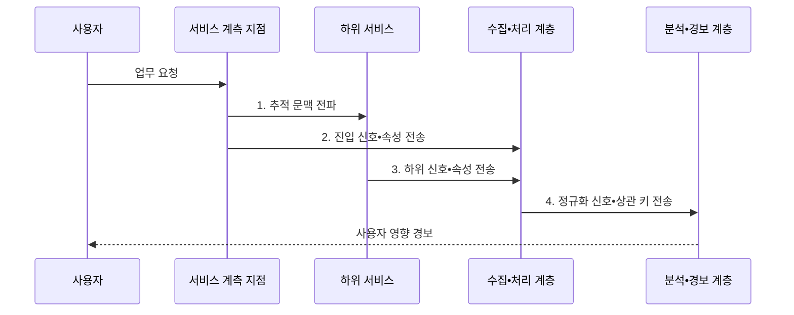

---
sidebar:
  order: 161
  label: "161. 클라우드 네이티브 관측성 (Cloud Native Observability)"
  badge:
    text: "기출 • 70%"
    variant: note
title: "클라우드 네이티브 관측성 (Cloud Native Observability)"
date: "2026-08-05T01:12:49+09:00"
tags:
  - "notes-software"
weight: 161
extra:
  question_no: "161"
  source_status: "기출"
  source_history: "135회"
  priority: 70
  priority_note: "로그•지표•추적의 연결 구조 출제"
---

## Ⅰ. 개요

<details>
<summary>핵심 용어</summary>

- **클라우드 네이티브 관측성(Cloud Native Observability)**: 메트릭•로그•추적을 연결해 외부 신호로 분산 시스템 내부 상태와 장애 원인을 추론하는 성질이다.

</details>

- 정의/개념: **메트릭(Metric)•로그(Log)•추적(Trace)** 신호를 연결해 내부 상태와 원인을 추론하는 성질
- 배경/필요성: 개별 신호만으로는 분산 요청의 **경로•장애 원인을 연결하기 어려움**

#### 한줄 요약

- 결제 지연 그래프에서 느린 요청 하나를 골라 호출 경로와 같은 식별자의 오류 기록을 따라가면 어느 서비스에서 왜 늦어졌는지 좁힐 수 있다.

## Ⅱ. 특징

<details>
<summary>핵심 용어</summary>

- **서비스 수준 지표(Service Level Indicator, SLI)**: 사용자 관점의 성공률•지연처럼 서비스 품질을 실제로 측정하는 지표이다.
- **추적 식별자(Trace Identifier, Trace ID)**: 서로 다른 신호를 같은 요청으로 연결하는 상관 키이다.
- **리소스 속성**: 신호를 서비스•버전•실행 환경에 연결하는 정보이다.
- **카디널리티**: 관측 속성값 조합의 개수이다.
- **샘플링**: 전체 신호 중 저장할 일부를 선택하는 통제이다.

</details>

- **SLI•진단 질문** 기반 목적 중심 계측
- **Trace ID•리소스 속성** 기반 신호 연결
- **카디널리티•샘플링** 기반 비용 통제

#### 한줄 요약

- 모든 기록을 모으는 대신 사용자가 겪은 실패를 어떤 신호로 찾고 어떤 공통 키로 원인까지 이동할지 먼저 정하는 방식이다.

## Ⅲ. 구조 및 구성요소

<details>
<summary>핵심 용어</summary>

- **수집 계층**: 관측 신호를 받아 처리 계층으로 전달한다.
- **처리 계층**: 신호를 정규화•필터링•샘플링하는 계층이다.
- **계측 지점**: 애플리케이션•프록시•런타임에서 메트릭•로그•추적을 생성하는 위치이다.
- **문맥 전파**: 호출 경계를 넘어 요청 식별자와 속성을 전달해 분산 요청을 하나로 연결하는 기능이다.
- **신호 저장소**: 신호별 보존 정책을 적용하고 상관 키 기반 조회를 제공하는 구성요소이다.
- **분석 계층**: 신호를 연결해 사용자 영향과 장애 원인을 분석한다.
- **경보 계층**: 분석 조건을 만족한 장애 알림을 생성한다.

</details>

```text
                         [문맥 전파]
                              |
                              |
[계측 지점] -------- [수집•처리 계층] -------- [신호 저장소] -------- [분석•경보 계층]
```

선의 의미: 계측 지점과 문맥 전파의 선은 요청 식별자•속성을 관측 신호에 연결하는 관계, 계측 지점과 수집•처리 계층의 선은 Metric•Log•Trace 전달 관계, 수집•처리 계층과 신호 저장소의 선은 정규화•필터•샘플링된 신호 보존 관계, 신호 저장소와 분석•경보 계층의 선은 상관 조회를 통한 사용자 영향•원인 분석 관계를 뜻한다.

| 구성요소 | 책임 |
|:---|:---|
| 계측 지점 | **Metric•Log•Trace** 생성 |
| 문맥 전파 | **요청 식별자•속성** 연결 |
| 수집•처리 계층 | **정규화•필터•샘플링** |
| 신호 저장소 | 신호별 **보존•상관 조회** |
| 분석•경보 계층 | **사용자 영향•원인** 분석 |

#### 한줄 요약

- 각 서비스가 단서를 만들고 문맥 전파가 같은 사건 번호를 붙이면 수집기와 저장소를 거쳐 분석 화면에서 하나의 장애 이야기로 재구성된다.

## Ⅳ. 흐름도

<details>
<summary>핵심 용어</summary>

- **4. 정규화 신호•상관 키 전송**: 정규화된 신호와 상관 키를 분석 계층에 전송하면 시간•서비스•식별자를 기준으로 원인을 연결할 수 있다.
- **1. 추적 문맥 전파**: 하위 호출에 같은 추적 식별자를 전달해 동일 업무 요청으로 연결하는 단계이다.
- **2. 진입 신호•속성 전송**: 최초 요청의 지표•로그•스팬과 서비스 속성을 수집 계층에 보내는 단계이다.
- **3. 하위 신호•속성 전송**: 각 호출 구간의 지연•오류•버전 정보를 수집 계층에 보내는 단계이다.

</details>



**동작 원리**

1. **추적 문맥 전파**: 하위 호출을 동일 요청으로 연결
2. **진입 신호•속성 전송**: 진입 지표•로그•스팬 수집
3. **하위 신호•속성 전송**: 구간 지연•오류•버전 수집
4. **정규화 신호•상관 키 전송**: 시간•서비스•식별자 기반 연결

#### 한줄 요약

- 주문 요청이 결제와 재고를 거치는 동안 같은 추적 식별자를 전달하면 세 서비스의 지연과 오류가 한 호출 경로로 묶인다.

## Ⅴ. 종류 및 비교

<details>
<summary>핵심 용어</summary>

- **메트릭(Metric)**: 시간에 따른 수치 변화를 집계해 추세•경보•서비스 목표를 측정하는 관측 신호이다.
- **로그(Log)**: 특정 시점의 사건•메시지•구조화 필드를 기록해 실행 문맥을 확인하는 신호이다.
- **추적(Trace)**: 부모•자식 스팬으로 분산 요청의 호출 경로와 구간별 지연을 표현하는 신호이다.

</details>

| 관측 신호 | Metric | Log | Trace |
|:---|:---|:---|:---|
| 적용 기준 | **추세•경보•목표 측정** | **사건•실행 문맥 확인** | **분산 호출•구간 분석** |
| 핵심 특징 | 시간•수치•**제한 속성** | 시각•메시지•**구조 필드** | **부모•자식 스팬 경로** |
| 한계 | **고카디널리티 비용** | **민감정보•저장 비용** | **문맥 누락•샘플 편향** |

#### 한줄 요약

- Metric으로 언제 나빠졌는지 찾고 Trace로 느린 구간을 고른 뒤 Log에서 그 시점의 오류와 입력 문맥을 확인한다.

## Ⅵ. 실무 고려사항 및 대책

<details>
<summary>핵심 용어</summary>

- **추적 단절**: 추적 단절은 호출 경계에서 문맥이 이어지지 않아 하나의 요청 경로가 여러 조각으로 분리되는 문제다.
- **서비스 수준 목표(Service Level Objective, SLO)**: 서비스 수준 지표가 일정 기간 달성해야 할 목표값이다.
- **꼬리 기반 샘플링**: 요청이 끝난 뒤 오류•지연 같은 결과를 보고 추적의 보존 여부를 결정하는 방식이다.

</details>

| 문제 | 대책 | 효과 |
|:---|:---|:---|
| **내부 지표만 사용** | 성공률•지연 **SLI•SLO 정의** | 사용자 영향 **중심 경보** |
| 비동기 호출 **추적 단절** | 메시지 속성에 **문맥 전파** | 서비스 간 **경로 연결** |
| 식별자 **속성 폭증** | 제한 속성•**로그 조회 분리** | **메트릭 비용 통제** |
| 희귀 오류 **샘플 탈락** | 꼬리 기반•**오류 우선 보존** | 장애 원인 **단서 확보** |
| 로그의 **개인정보 노출** | 수집 전 제거•**접근•보존 통제** | 정보 **노출 범위 축소** |

#### 한줄 요약

- 사용자 식별자를 Metric 속성으로 모두 넣지 말고 오류 요청의 Trace와 Log에서만 찾도록 나누면 경보 비용과 진단 단서를 함께 관리할 수 있다.

## Ⅶ. 결론

<details>
<summary>핵심 용어</summary>

- **진단 질문**: 관측 신호로 답해야 할 장애 분석 질문이다.
- **신호 비용**: 관측 데이터를 수집•저장•조회하는 비용이다.

</details>

- **사용자 영향•진단 질문•신호 비용** 으로 계측•연결•보존 범위 결정

#### 한줄 요약

- SLO 이상에서 대표 Trace와 같은 식별자의 Log까지 이동할 수 있는 신호만 남기고 원인 분석에 쓰이지 않는 수집량은 줄여야 한다.
