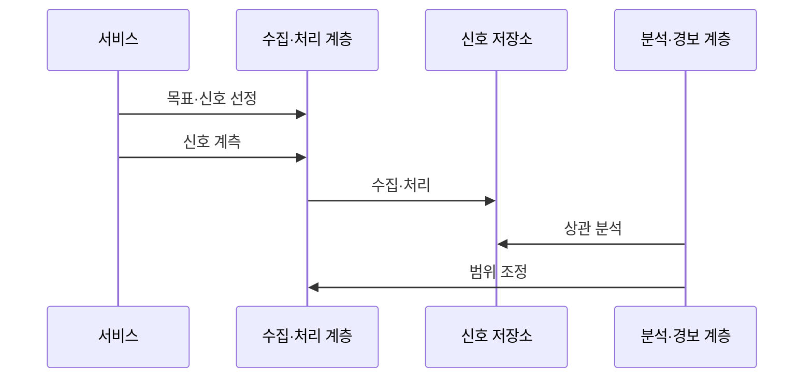

---
sidebar:
  order: 161
  label: "161. 클라우드 네이티브 관측성 (Cloud Native Observability)"
  badge:
    text: "기출 · 70%"
    variant: note
title: "클라우드 네이티브 관측성 (Cloud Native Observability)"
date: "2026-07-27T23:59:59+09:00"
tags:
  - "notes-software"
weight: 161
extra:
  question_no: "161"
  source_status: "기출"
  source_history: "135회"
  priority: 70
  priority_note: "로그·지표·추적의 연계가 최근 출제됨"
---

## 미리 알고가기

- **관측성(Observability)**: 시스템이 내보낸 신호로 내부 상태와 알려지지 않은 문제 원인을 질의·추론할 수 있는 성질
- **메트릭(Metric)**: 일정 구간의 수치 상태를 집계해 비율·추세·임계값을 나타내는 시계열 신호
- **로그(Log)**: 특정 시점에 발생한 사건과 처리 문맥을 기록한 신호
- **트레이스·스팬(Trace·Span)**: 트레이스는 한 요청의 전체 호출 경로이고 스팬은 그 안의 개별 작업 구간
- **트레이스 식별자(Trace Identifier, Trace ID·트레이스 아이디)**: Identifier를 ID로 줄인 표기이며, 여러 서비스의 스팬과 로그를 같은 요청으로 연결하는 식별값
- **서비스 수준 지표(Service Level Indicator, SLI·에스엘아이)**: 영문 각 단어의 머리글자를 딴 표기이며, 사용자 관점의 가용성·지연 같은 실제 서비스 성능 측정값
- **서비스 수준 목표(Service Level Objective, SLO·에스엘오)**: 영문 각 단어의 머리글자를 딴 표기이며, 일정 기간에 SLI가 달성해야 할 목표 수준
- **리소스 속성(Resource Attribute)**: 서비스·파드(Pod)·노드·클러스터처럼 신호 생성 대상을 식별하는 정보
- **응용 프로그래밍 인터페이스(Application Programming Interface, API·에이피아이)**: 영문 각 단어의 머리글자를 딴 표기이며, 서비스 기능을 호출하는 규약이자 관측 대상 요청의 경계
- **데이터베이스(Database, DB·디비)**: 영문 단어의 앞 글자를 딴 표기이며, 서비스 데이터와 관측 대상 질의 결과를 저장하는 시스템
- **카디널리티(Cardinality)**: 속성값 조합의 수로 저장·조회 비용과 신호 상세도를 좌우하는 값
- **샘플링(Sampling)**: 전체 사건 중 일부 트레이스·로그만 선택해 저장·분석하는 처리
- **문맥 전파(Context Propagation)**: Trace ID 같은 요청 문맥을 서비스 호출에 이어 보내 신호를 연결하는 동작

## Ⅰ. 개요

- **정의/개념**: 세 신호를 연결해 **내부 상태·원인을 추론**하는 성질
- **기존 한계**: 분산 요청의 **장애 위치·호출 관계 파악 곤란**

### 쉽게 이해하기 (학습용)
- 신호를 연결하여 내부 원인을 찾는 능력임

## Ⅱ. 특징

- 공통 Trace ID·리소스 속성으로 신호 상관분석한다.
- 카디널리티·샘플링이 상세도와 관측 비용 결정한다.

### 쉽게 이해하기 (학습용)
- 세 가지 신호를 같은 문맥으로 연결해야 함

## Ⅲ. 아키텍처 및 구성요소

| 설계 요소 | 설명 |
|:---|:---|
| 계측 지점 | 앱과 노드에서 메트릭·로그·트레이스를 생성함 |
| 문맥 전파 | 식별자를 전파하고 속성을 신호에 부여함 |
| 수집·처리 계층 | 신호를 수신하고 필터링과 샘플링을 함 |
| 신호 저장소 | 신호를 조회 특성에 맞춰 안전하게 보존함 |
| 분석·경보 계층 | 대시보드·경보로 이상과 원인 제시 |

> 요약: 계측 신호는 공통 문맥을 거쳐 분석됨

### 쉽게 이해하기 (학습용)
- 계측기와 수집기가 신호를 같은 문맥으로 묶음

## Ⅳ. 원리 및 절차 흐름도

| 절차 | 설명 |
|:---|:---|
| 목표·신호 선정 | SLI와 원인 규명에 필요한 신호 결정 |
| 신호 계측 | 메트릭·로그·트레이스에 문맥 부여 |
| 수집·처리 | 필터·샘플링 후 저장소 전달 |
| 상관 분석 | 이상 구간의 Trace ID·자원 연결 |
| 범위 조정 | 원인 판별력과 수집 비용 비교 |

> 요약: 신호에서 출발해 문맥을 찾고 결과를 측정함

### 쉽게 이해하기 (학습용)
- 이상 발생 시 동일 문맥 경로를 추적함

## Ⅴ. 종류 및 비교

| 관측 신호 | 메트릭 | 로그 | 트레이스 |
|:---|:---|:---|:---|
| 적용 기준 | 상태 추세·**경보 판정** | 사건 상세·**오류 원인 확인** | 요청 경로·**병목 분석** |
| 핵심 특징 | 구간 집계·**시계열 수치** | 시점 사건·**상세 문맥** | 호출 관계·**구간 지연** |
| 한계 | 고카디널리티·**집계 왜곡** | 저장 비용·**민감정보 노출** | 샘플링·**문맥 전파 누락** |

> 요약: 메트릭은 추세, 로그는 사건, 추적은 경로임

### 쉽게 이해하기 (학습용)
- 지표는 이상을, 로그는 사건 상세를 제공함

## Ⅵ. 실무 사례

1. 결제 API 지연 스팬을 Trace ID로 DB 로그와 연결
2. 메모리 경보를 Pod 로그·노드 메트릭과 연결

### 쉽게 이해하기 (학습용)
- 느린 결제 요청의 호출 구간과 같은 요청의 DB 오류를 함께 찾는다.
- 메모리 경보가 나면 어느 Pod와 노드에서 증가했는지 로그·지표로 좁힌다.

## Ⅶ. 결론

- SLI 이상을 원인 경로까지 잇는 신호만 계측

### 쉽게 이해하기 (학습용)
- 원인을 좁히지 못하는 고비용 속성은 삭제하거나 샘플링한다.
