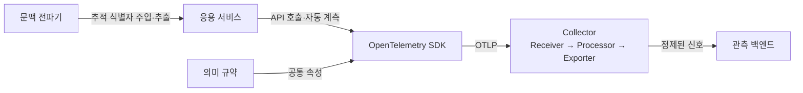
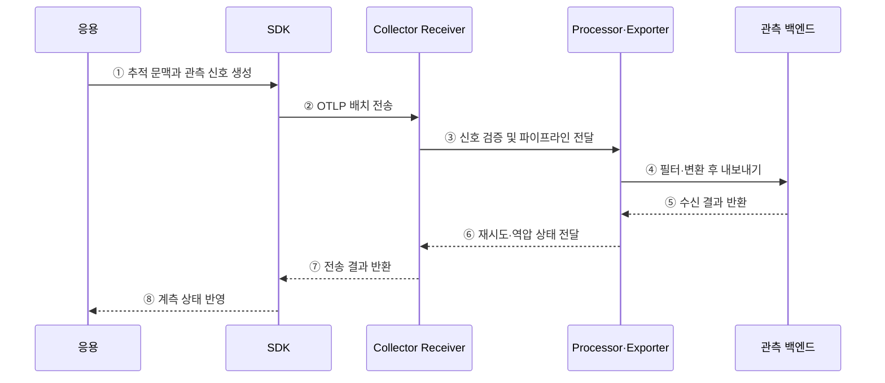

---
sidebar:
  order: 162
  label: "162. OpenTelemetry (OpenTelemetry)"
  badge:
    text: "기출 · 70%"
    variant: note
title: "OpenTelemetry (OpenTelemetry)"
date: "2026-07-27T23:59:59+09:00"
tags:
  - "notes-software"
weight: 162
extra:
  question_no: "162"
  source_status: "기출"
  source_history: "135회"
  priority: 70
  priority_note: "관측 신호 수집 표준은 최근 출제 답안의 핵심임"
---

## 미리 알고가기

- **오픈텔레메트리(OpenTelemetry)**: 추적·메트릭·로그의 생성과 전달 방식을 통일하는 벤더 중립 관측 프레임워크
- **응용 프로그래밍 인터페이스(Application Programming Interface, API·에이피아이)**: 응용 코드가 스팬·메트릭·로그를 만드는 호출 규약
- **소프트웨어 개발 키트(Software Development Kit, SDK·에스디케이)**: 샘플링·집계·배치·내보내기를 수행하는 언어별 계측 라이브러리
- **자동 계측(Auto-instrumentation)**: 응용 코드의 수정 없이 런타임이나 프레임워크에 계측 기능을 삽입하는 방식
- **오픈텔레메트리 프로토콜(OpenTelemetry Protocol, OTLP·오티엘피)**: SDK·Collector·백엔드 사이에서 텔레메트리를 전달하는 표준 프로토콜
- **의미 규약(Semantic Conventions)**: HTTP·데이터베이스·메시징 작업의 속성 이름과 의미를 통일한 규칙
- **문맥 전파기(Context Propagator)**: 서비스 호출에 추적 식별자를 넣고 수신 서비스에서 꺼내는 구성요소
- **컬렉터 파이프라인(Collector Pipeline)**: 리시버(Receiver)가 신호를 받고 프로세서(Processor)가 가공한 뒤 익스포터(Exporter)가 내보내는 중계 경로
- **관측 백엔드(Observability Backend)**: 텔레메트리를 저장·조회·시각화하고 이상을 경보하는 시스템

## Ⅰ. 개요

- 오픈텔레메트리는 관측 신호의 **생성·전파·수집·전송을 표준화**한다.
- 언어와 관측 도구마다 다른 계측 형식으로 발생하는 **중복 개발과 벤더 종속**을 줄인다.
- 자체 저장·분석 백엔드가 아니라, 관측 데이터를 백엔드까지 연결하는 **계측 표준**이다.

### 쉽게 이해하기 (학습용)
- 여러 언어의 관측 데이터를 같은 규격으로 포장해 원하는 분석 도구로 보냄

## Ⅱ. 특징

- **벤더 중립성**: 특정 관측 백엔드에 종속되지 않는 API·SDK·프로토콜을 제공한다.
- **신호 연계성**: 공통 리소스와 추적 문맥으로 추적·메트릭·로그를 연결한다.
- **의미 일관성**: 의미 규약으로 서비스마다 다른 속성 이름과 뜻을 통일한다.
- **처리 분리**: Collector가 배치·필터·재시도·라우팅을 응용에서 분리한다.

### 쉽게 이해하기 (학습용)
- 계측 규격을 통일하고 수집 처리는 응용 밖으로 분리함

## Ⅲ. 아키텍처 및 구성요소

**도표안 A — 구조도**

**도표안 B — sequenceDiagram**

| 구성요소 | 역할 |
|:---|:---|
| API·자동 계측 | 응용 동작에서 스팬·메트릭·로그를 생성 |
| SDK | 신호 처리·샘플링·집계·배치·내보내기 수행 |
| 문맥 전파기 | 서비스 간 추적 식별자의 연속성 유지 |
| 의미 규약 | 리소스·작업·속성의 공통 이름과 의미 정의 |
| OTLP | SDK·Collector·백엔드 간 신호 전송 |
| Collector | Receiver·Processor·Exporter 파이프라인으로 신호 중계 |
| 관측 백엔드 | 신호 저장·분석·시각화·경보 |

**동작 원리**

- ① 응용의 요청 처리 지점에서 추적 문맥과 관측 신호를 생성한다.
- ② SDK가 신호를 샘플링·집계·배치해 OTLP로 전송한다.
- ③ Receiver가 신호를 수신·검증하고 지정된 파이프라인으로 넘긴다.
- ④ Processor가 필터·변환·배치하고 Exporter가 백엔드로 보낸다.
- ⑤ 백엔드는 수신 성공이나 일부 거부 결과를 반환한다.
- ⑥ Processor·Exporter는 실패 신호의 재시도와 역압 상태를 Receiver에 알린다.
- ⑦ Receiver는 파이프라인의 전송 결과를 SDK에 반환한다.
- ⑧ SDK는 실패·유실·지연 상태를 계측 진단 정보에 반영한다.

### 쉽게 이해하기 (학습용)
- SDK가 만든 관측 신호를 Collector가 정리해 분석 저장소로 전달함

## Ⅳ. 종류 및 비교

| 구분 | SDK 직접 전송 | Collector 경유 전송 |
|:---|:---|:---|
| 경로 | SDK → 백엔드 | SDK → Collector → 백엔드 |
| 장점 | 구성 단순, 중계 비용 없음 | 배치·필터·재시도·다중 전송 중앙화 |
| 단점 | 응용의 전송 부담·자격증명 노출 | Collector 운영과 병목 관리 필요 |
| 적용 | 소규모·단일 백엔드 | 대규모·다중 백엔드·통합 정책 |

| Collector 배치 | 배치 위치 | 적용 목적 |
|:---|:---|:---|
| 에이전트(Agent) | 호스트·파드 인접 위치 | 로컬 수집, 응용의 전송 부담 완화 |
| 게이트웨이(Gateway) | 중앙 수집 계층 | 정책 통합, 라우팅, 다중 백엔드 전송 |
| 에이전트-게이트웨이 | 로컬과 중앙의 2단계 | 로컬 안정성과 중앙 통제를 함께 확보 |

### 쉽게 이해하기 (학습용)
- 단순 환경은 직접 보내고 통합 처리가 필요하면 Collector를 거침

## Ⅴ. 실무 고려사항 및 대책

| 고려사항 | 위험 | 대책 |
|:---|:---|:---|
| 속성 일관성 | 서비스별 이름 차이로 검색·집계 실패 | 의미 규약과 조직 공통 속성 사전 적용 |
| 민감정보 | URL·헤더·사용자 속성 유출 | Collector에서 삭제·마스킹·허용 목록 적용 |
| 신호량 | 고비용 속성·과도한 추적으로 비용 증가 | 샘플링·집계·배치·속성 수 제한 |
| 전송 장애 | 큐 적체·메모리 고갈·데이터 유실 | 메모리 제한·재시도·영속 큐·역압 감시 |
| 꼬리 샘플링 | 한 추적의 스팬 분산으로 판단 불가 | 동일 추적을 같은 샘플러로 라우팅 |
| Collector 가용성 | 중앙 장애가 전체 관측 공백으로 확대 | 수평 확장·부하 분산·자체 상태 감시 |

### 쉽게 이해하기 (학습용)
- 사례: 개인정보는 전송 전에 지우고, 신호 폭증은 샘플링과 큐 제한으로 통제함

## Ⅵ. 결론

- 오픈텔레메트리의 핵심은 **벤더 중립 계측과 표준 전송**이다.
- 의미 규약으로 데이터의 뜻을 맞추고 Collector로 처리 정책을 분리해야 한다.
- 신호량·민감정보·전송 실패·Collector 병목을 함께 관리해야 안정적인 관측 체계를 확보할 수 있다.

### 쉽게 이해하기 (학습용)
- 관측 데이터의 공용 규격을 만들고 중앙 수집기로 품질과 전송을 관리함
