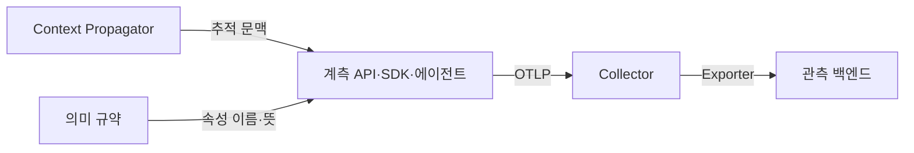
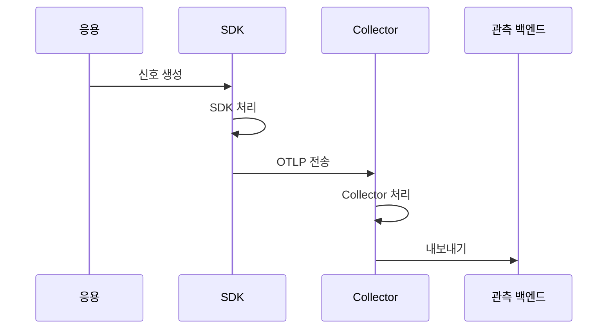

---
sidebar:
  order: 162
  label: "162. OpenTelemetry (OpenTelemetry)"
  badge:
    text: "기출 · 70%"
    variant: note
title: "OpenTelemetry (OpenTelemetry)"
date: "2026-07-27T23:59:59+09:00"
tags:
  - "notes-software"
weight: 162
extra:
  question_no: "162"
  source_status: "기출"
  source_history: "135회"
  priority: 70
  priority_note: "관측 신호 수집 표준은 최근 출제 답안의 핵심임"
---

## 미리 알고가기

- **오픈텔레메트리(OpenTelemetry)**: Open과 Telemetry를 결합한 공식 프로젝트명이며, 텔레메트리 생성·수집·전송을 위한 벤더 중립 API·SDK·도구·규약
- **응용 프로그래밍 인터페이스(Application Programming Interface, API·에이피아이)**: 영문 각 단어의 머리글자를 딴 표기이며, 응용 코드가 스팬·메트릭·로그를 생성하는 계측 호출 규약
- **소프트웨어 개발 키트(Software Development Kit, SDK·에스디케이)**: 영문 각 단어의 머리글자를 딴 표기이며, 샘플링·집계·배치·내보내기를 구현하는 언어별 계측 라이브러리
- **자동 계측(Auto-instrumentation)**: 런타임·프레임워크 훅으로 응용 수정 범위를 줄여 신호를 생성하는 방식
- **오픈텔레메트리 프로토콜(OpenTelemetry Protocol, OTLP·오티엘피)**: OpenTelemetry와 Protocol의 핵심 글자를 딴 공식 표기이며, SDK·Collector·백엔드 사이에서 텔레메트리를 전달하는 규약
- **의미 규약(Semantic Conventions)**: 에이치티티피로 읽는 HTTP(Hypertext Transfer Protocol, 하이퍼텍스트 전송 규약)·데이터베이스·메시징 작업과 속성 이름·뜻을 공통 정의한 규칙
- **문맥 전파기(Context Propagator)**: 서비스 호출에 추적 식별자를 주입하고 수신 측에서 추출하는 구성요소
- **컬렉터 파이프라인(Collector Pipeline)**: 리시버(Receiver)가 신호를 받고 프로세서(Processor)가 가공하며 익스포터(Exporter)가 백엔드로 보내는 중계 경로
- **관측 백엔드(Observability Backend)**: 텔레메트리를 저장·조회·시각화·경보하는 시스템

## Ⅰ. 개요

- 정의/개념: 관측 신호의 **생성·전파·수집 표준** 프레임워크
- 기존 한계: 언어·도구별 계측의 **형식 차이·벤더 종속**

### 쉽게 이해하기 (학습용)
- 언어와 도구에 상관없이 통일된 방식으로 신호를 전달함

## Ⅱ. 특징

- 의미 규약으로 언어별 신호 속성의 뜻 통일한다.
- Collector가 응용과 백엔드 자격증명·처리를 분리한다.

### 쉽게 이해하기 (학습용)
- Collector로 앱과 백엔드 처리를 분리함

## Ⅲ. 아키텍처 및 구성요소

| 설계 요소 | 설명 |
|:---|:---|
| 계측 API·SDK·에이전트 | 동작을 신호로 변환하고 샘플링해 전송함 |
| Context Propagator | 호출에 추적 문맥을 주입 및 추출함 |
| 의미 규약 | 리소스·작업·속성의 공통 이름과 의미를 정의함 |
| OTLP | 신호를 SDK·Collector·백엔드 사이에 전달함 |
| Collector | Receiver·Processor·Exporter로 중계 |

> 요약: 문맥에 맞춰 신호를 만들고 수집기로 전달함

### 쉽게 이해하기 (학습용)
- 규약과 수집기가 표준 텔레메트리 경로를 형성함

## Ⅳ. 원리 및 절차 흐름도

| 절차 | 설명 |
|:---|:---|
| 신호 생성 | API가 스팬·메트릭·로그 생성 |
| SDK 처리 | 샘플링·집계·배치 적용 |
| OTLP 전송 | 표준 형식으로 Collector에 전달 |
| Collector 처리 | 필터·속성·큐·재시도 적용 |
| 내보내기 | 대상 백엔드 형식으로 전달 |

> 요약: 계측 신호가 파이프라인을 거쳐 백엔드로 전송됨

### 쉽게 이해하기 (학습용)
- 신호 생성부터 전파 및 최종 결과를 확인함

## Ⅴ. 종류 및 비교

| 신호 전송 방식 | SDK 직접 전송 | Collector 경유 전송 |
|:---|:---|:---|
| 적용 기준 | 단일 백엔드·**단순 전송** | 필터링·**다중 백엔드** |
| 핵심 특징 | SDK의 **백엔드 직접 전송** | 수집기의 **처리·라우팅 분리** |
| 한계 | 자격증명 노출·**전송 유실** | 수집기 병목·**큐 적체** |

> 요약: 수집기를 경유해 처리를 앱에서 분리함

### 쉽게 이해하기 (학습용)
- 직접 전송은 단순하나 수집기 경유가 통제에 유리함

## Ⅵ. 실무 사례

1. 다중 언어 서비스는 HTTP 의미 규약으로 속성 통일
2. Collector는 민감 속성 삭제 후 두 백엔드로 전송

### 쉽게 이해하기 (학습용)
- 언어가 달라도 같은 HTTP 속성 이름을 써서 한 기준으로 조회한다.
- 응용은 한곳에 보내고 Collector가 민감정보를 지운 뒤 저장소별로 나눈다.

## Ⅶ. 결론

- 다중 백엔드·중앙 통제가 필요하면 Collector 경유

### 쉽게 이해하기 (학습용)
- 단순 단일 전송이면 직접 보내고 중앙 필터·재시도가 필요하면 Collector를 둔다.
