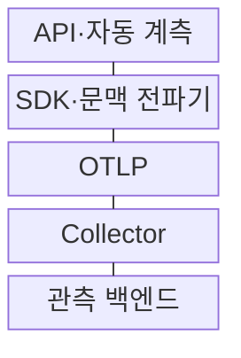
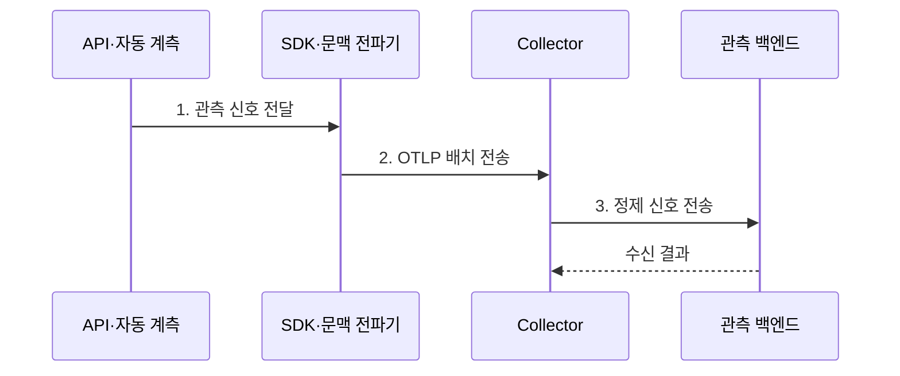

---
sidebar:
  order: 162
  label: "162. OpenTelemetry (OpenTelemetry)"
  badge:
    text: "기출 · 70%"
    variant: note
title: "OpenTelemetry (OpenTelemetry)"
date: "2026-08-02T12:00:00+09:00"
tags:
  - "notes-software"
weight: 162
extra:
  question_no: "162"
  source_status: "기출"
  source_history: "135회"
  priority: 70
  priority_note: "관측 신호 수집 표준의 구조와 적용 출제"
---

## Ⅰ. 개요

핵심 용어

- **벤더 중립 프레임워크**: OpenTelemetry는 관측 신호의 생성과 전달을 특정 분석 제품에 종속되지 않게 표준화한 벤더 중립 프레임워크다.

- 정의/개념: 관측 신호의 생성·전파·수집을 통일하는 **벤더 중립 프레임워크**
- 배경/필요성: 언어·도구별 계측 중복과 **백엔드 종속 완화**

### 쉽게 이해하기 (학습용)

- 여러 언어가 서로 다른 상자에 담던 관측 데이터를 같은 규격으로 포장하면 분석 도구를 바꿔도 애플리케이션 계측을 다시 만들 필요가 줄어든다.

## Ⅱ. 특징

핵심 용어

- **API·SDK·OTLP**: API는 신호 생성 규약, SDK는 처리 기능, OTLP는 구성요소 사이의 표준 전송 규약을 제공한다.

- **API·SDK·OTLP** 기반 벤더 중립성
- **문맥 전파·공통 속성** 기반 신호 연결
- **Collector 파이프라인** 기반 처리 분리

### 쉽게 이해하기 (학습용)

- 애플리케이션은 표준 신호만 만들고 필터, 배치, 재시도, 다중 백엔드 전송은 Collector에 맡겨 업무 코드와 전송 정책을 분리한다.

## Ⅲ. 구조 및 구성요소

핵심 용어

- **Collector**: Collector는 관측 신호를 수신하고 가공한 뒤 하나 이상의 백엔드로 내보내는 중계 구성요소다.

| 구성요소 | 책임 |
|:---|:---|
| API·자동 계측 | **스팬·메트릭·로그** 생성 |
| SDK·문맥 전파기 | 신호 처리·**추적 연결** |
| OTLP | **표준 형식 신호** 전송 |
| Collector | **수신·가공·다중 전송** |
| 관측 백엔드 | 저장·조회·**시각화·경보** |

### 쉽게 이해하기 (학습용)

- 계측기가 화물을 만들고 SDK가 포장하면 OTLP라는 운송 규격으로 Collector 물류센터를 거쳐 분석 저장소에 도착한다.

## Ⅳ. 흐름도

핵심 용어

- **2. OTLP 배치 전송**: SDK는 생성된 신호를 샘플링하거나 집계한 뒤 OTLP 형식의 배치로 Collector에 전송한다.

**동작 원리**

1. **관측 신호 전달**: API가 만든 스팬·메트릭·로그 인계
2. **OTLP 배치 전송**: SDK 샘플링·집계 후 송신
3. **정제 신호 전송**: 수신·필터·변환 후 백엔드 전달

### 쉽게 이해하기 (학습용)

- 결제 서비스의 추적과 로그는 SDK에서 묶여 Collector로 가고 그곳에서 개인정보가 제거된 뒤 추적·로그 저장소에 각각 전달된다.

## Ⅴ. 종류 및 비교

핵심 용어

- **Collector 경유**: Collector 경유 방식은 필터, 재시도, 다중 목적지 전송을 애플리케이션 밖에서 통합 관리한다.

| 전송 방식 | SDK 직접 전송 | Collector 경유 |
|:---|:---|:---|
| 적용 기준 | **소규모·단일 백엔드** | **대규모·통합 처리** |
| 핵심 특징 | 짧은 경로·**단순 구성** | **필터·재시도·다중 전송** |
| 한계 | **응용 부담·접속 정보 노출** | **중계 병목·운영 필요** |

### 쉽게 이해하기 (학습용)

- 단일 분석 도구의 작은 환경은 직접 전송이 단순하지만 여러 팀의 정책과 목적지를 통일하려면 Collector 경유가 변경 범위를 줄인다.

## Ⅵ. 실무 고려사항 및 대책

핵심 용어

- **전송 장애**: 전송 장애가 발생하면 재시도와 영속 큐를 사용하되 메모리 상한을 두어 신호 유실과 자원 고갈을 함께 제한한다.

| 문제 | 대책 | 효과 |
|:---|:---|:---|
| 서비스별 **속성 불일치** | 의미 규약·**공통 속성 사전 적용** | 신호 검색·**집계 일관성** |
| 헤더·사용자 **정보 노출** | Collector **허용 목록·마스킹** | 민감정보 **외부 전송 차단** |
| 과도한 **추적·속성** | 샘플링·집계·**속성 수 제한** | 저장·조회 **비용 절감** |
| 백엔드 **전송 장애** | 재시도·영속 큐·**메모리 상한** | 신호 유실·**메모리 고갈 완화** |
| 중앙 Collector **장애** | 수평 확장·**부하 분산·자체 감시** | 전체 **관측 공백 축소** |

### 쉽게 이해하기 (학습용)

- 백엔드가 멈췄을 때 Collector의 대기열이 무한히 메모리를 쓰지 않도록 상한과 디스크 보존을 두고 자체 상태도 별도 경보로 감시해야 한다.

## Ⅶ. 결론

핵심 용어

- **신호량·보안 경계·목적지 수**: 신호량, 보안 경계, 전송 목적지 수를 기준으로 SDK 직접 전송과 Collector 경유 방식을 선택한다.

- **신호량·보안 경계·목적지 수**로 직접·Collector 전송 결정

### 쉽게 이해하기 (학습용)

- 작은 단일 환경은 SDK 직접 전송으로 시작하되 공통 처리와 다중 목적지가 필요해지면 Collector를 이중화해 계측 코드와 전송 정책을 분리해야 한다.
