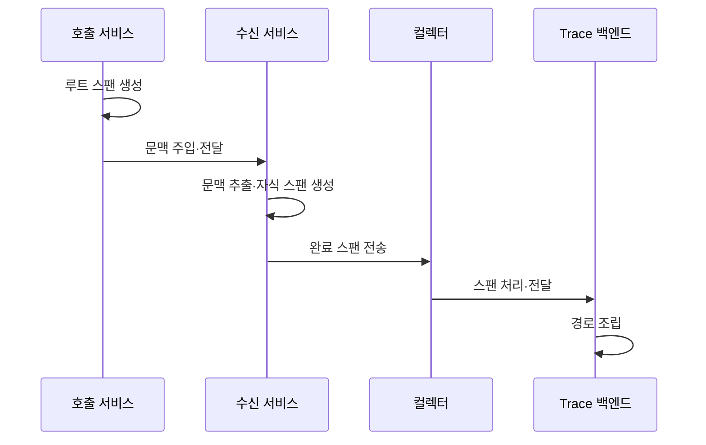

---
sidebar:
  order: 163
  label: "163. 분산 추적 (Distributed Tracing)"
  badge:
    text: "기출 · 50%"
    variant: note
title: "분산 추적 (Distributed Tracing)"
date: "2026-07-27T23:59:59+09:00"
tags:
  - "notes-software"
weight: 163
extra:
  question_no: "163"
  source_status: "기출"
  source_history: "135회"
  priority: 50
  priority_note: "호출 경로와 지연 원인 추적은 관측성 하위축임"
---

## 미리 알고가기

- **트레이스(Trace)**: 하나의 요청이 분산 시스템에서 수행한 전체 작업 경로
- **스팬(Span)**: 트레이스 안의 개별 작업 구간이며 시작·종료 시각과 속성·상태를 기록하는 단위
- **분산 추적(Distributed Tracing)**: 서비스별 스팬을 연결해 한 요청의 처리 경로와 지연을 분석하는 기법
- **트레이스 식별자(Trace Identifier, Trace ID·트레이스 아이디)**: Identifier를 ID로 줄인 표기이며, 한 요청에 속한 모든 스팬을 묶는 식별자
- **스팬 식별자(Span Identifier, Span ID·스팬 아이디)**: 개별 작업 구간을 식별하며, 부모 Span ID는 직전 호출 구간을 가리켜 호출 관계를 구성하는 값
- **트레이스 컨텍스트(Trace Context)**: World·Wide·Web의 세 W를 W3으로 줄이고 Consortium의 C를 붙여 더블유쓰리씨로 읽는 W3C 규격이며, `traceparent`와 `tracestate`라는 표준 헤더 필드로 요청 문맥을 서비스 사이에 전달
- **트레이서·문맥 전파기(Tracer·Propagator)**: Tracer는 스팬을 생성하고 Propagator는 통신 헤더에 추적 문맥을 주입·추출하는 구성요소
- **컬렉터·백엔드(Collector·Backend)**: Collector는 스팬을 수집·처리하고 백엔드는 이를 저장·조회하는 구성요소
- **스팬 링크(Span Link)**: 부모·자식 관계가 아닌 메시지·배치 작업의 연관 스팬 문맥을 연결하는 참조
- **헤드 샘플링**: 요청 시작 시 수집 여부를 결정하고 테일 샘플링은 완료된 Trace를 보고 결정함
- **고카디널리티 속성**: 값의 종류가 많아 저장·조회 비용을 높이는 Span 속성임

## Ⅰ. 개요

- 정의/개념: 서비스별 스팬을 연결해 **요청 경로·지연을 분석**
- 기존 한계: 다중 서비스 호출의 **지연 구간·원인 식별 곤란**

### 쉽게 이해하기 (학습용)
- 동일 Trace ID로 여러 서비스 구간을 연결함

## Ⅱ. 특징

- 추적 ID가 서비스별 구간을 한 요청으로 연결한다.
- Span과 Link가 호출 및 메시지 관계를 표현한다.
- 시작 시각과 속성으로 처리 시간과 오류를 기록한다.
- 문맥 누락과 오차가 품질 및 비용을 좌우한다.

### 쉽게 이해하기 (학습용)
- 호출 경계에서 문맥이 끊기면 경로 복원이 불가함

## Ⅲ. 아키텍처 및 구성요소

| 설계 요소 | 설명 |
|:---|:---|
| 호출·수신 서비스·트레이서 | 작업 시작과 종료 시 스팬과 속성을 생성함 |
| 문맥 전파기 | 통신 헤더에 추적 문맥을 주입하고 추출함 |
| Trace Context | 식별자와 샘플링 정보를 서비스에 전달함 |
| 컬렉터 | 수신된 스팬을 처리해 백엔드로 전송함 |
| 트레이스 저장·조회 | 관계를 조립해 시각화와 구간 시간을 제공함 |

> 요약: 호출 경계를 지나며 동일 Trace ID로 연결됨

### 쉽게 이해하기 (학습용)
- 식별자와 부모 관계가 요청 경로를 재구성함

## Ⅳ. 원리 및 절차 흐름도

| 절차 | 설명 |
|:---|:---|
| **루트 스팬 생성** | 첫 진입 시 Trace와 루트 Span 생성함 |
| **문맥 주입·전달** | 헤더에 식별자와 Span ID를 넣어 호출함 |
| **문맥 추출·자식 스팬 생성** | 수신 문맥을 읽고 부모 관계를 이어 감 |
| **완료 스팬 전송** | 처리 결과·시간·속성을 컬렉터로 보냄 |
| **스팬 처리·전달** | 컬렉터가 스팬을 가공해 백엔드로 보냄 |
| **경로 조립** | 백엔드에서 관계를 연결해 경로를 조립함 |

> 요약: 문맥을 전파해 백엔드에서 경로를 조립함

### 쉽게 이해하기 (학습용)
- 문맥을 이어 보내야 전체 호출 경로를 조립함

## Ⅴ. 종류 및 비교

| 추적 샘플링 | 헤드 샘플링 | 테일 샘플링 |
|:---|:---|:---|
| 적용 기준 | 시작 조건으로 **수집량 제한** | 오류·지연 요청을 **선별 보존** |
| 핵심 특징 | 요청 시작 시 **수집 여부 결정** | 요청 종료 후 **결과 기반 결정** |
| 한계 | 희귀 장애·**추적 누락** | 버퍼 메모리·**판정 지연** |

> 요약: 헤드는 시작 시점에, 테일은 종료 후에 결정함

### 쉽게 이해하기 (학습용)
- 헤드는 즉시 선택하며 테일은 결과를 확인 후 선택함

## Ⅵ. 실무 사례

1. 결제 API는 Span을 연결해 지연을 확인함

### 쉽게 이해하기 (학습용)
- 결제 API는 부모 Span별 지연 구간을 찾음

## Ⅶ. 결론

- 모든 호출 경계에 문맥 전파 여부를 검증함

### 쉽게 이해하기 (학습용)
- 끊긴 호출 경계를 찾아야 지연 원인을 특정함
