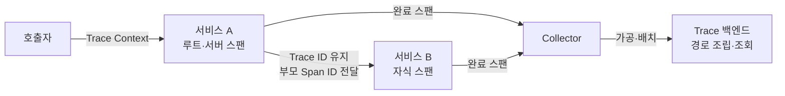
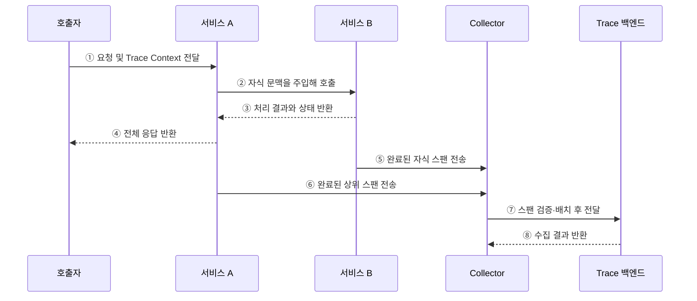

---
sidebar:
  order: 163
  label: "163. 분산 추적 (Distributed Tracing)"
  badge:
    text: "기출 · 50%"
    variant: note
title: "분산 추적 (Distributed Tracing)"
date: "2026-07-27T23:59:59+09:00"
tags:
  - "notes-software"
weight: 163
extra:
  question_no: "163"
  source_status: "기출"
  source_history: "135회"
  priority: 50
  priority_note: "호출 경로와 지연 원인 추적은 관측성 하위축임"
---

## 미리 알고가기

- **트레이스(Trace)**: 하나의 요청이 분산 시스템에서 거친 전체 작업 경로
- **스팬(Span)**: 트레이스 안의 개별 작업 구간으로, 시작·종료 시각과 속성·상태를 기록하는 단위
- **분산 추적(Distributed Tracing)**: 서비스별 스팬을 연결해 한 요청의 처리 경로와 지연 원인을 분석하는 기법
- **트레이스 식별자(Trace Identifier, Trace ID·트레이스 아이디)**: 한 요청에 속한 모든 스팬을 묶는 식별자
- **스팬 식별자(Span Identifier, Span ID·스팬 아이디)**: 개별 스팬을 구분하는 식별자이며, 부모 Span ID로 호출 관계를 표현
- **트레이스 컨텍스트(Trace Context)**: `traceparent`와 `tracestate` 헤더로 추적 식별자와 상태를 전달하는 W3C 표준
- **트레이서·문맥 전파기(Tracer·Propagator)**: 트레이서는 스팬을 만들고, 문맥 전파기는 통신 헤더에 추적 문맥을 주입·추출
- **스팬 링크(Span Link)**: 부모·자식 관계로 표현하기 어려운 메시지·배치 작업의 연관 스팬을 연결하는 참조
- **헤드 샘플링(Head Sampling)**: 요청 시작 시 추적 저장 여부를 결정하는 방식
- **테일 샘플링(Tail Sampling)**: 요청 완료 후 오류·지연 등 전체 결과를 보고 저장 여부를 결정하는 방식
- **카디널리티(Cardinality)**: 속성값의 고유한 종류 수로, 높을수록 저장·조회 비용이 증가

## Ⅰ. 개요

- 분산 추적은 서비스별 스팬을 **Trace ID와 부모·자식 관계로 연결**해 요청 경로를 복원한다.
- 단일 로그만으로 찾기 어려운 **서비스 간 병목·오류 전파·의존 관계**를 분석한다.
- 마이크로서비스와 비동기 메시징처럼 호출 경계가 많은 환경의 핵심 관측 기법이다.

### 쉽게 이해하기 (학습용)
- 한 요청에 같은 추적 번호를 붙여 서비스별 이동 경로를 이어 봄

## Ⅱ. 특징

- **경로 연결**: Trace ID가 여러 서비스의 스팬을 하나의 요청으로 묶는다.
- **구간 분석**: Span ID와 부모 Span ID가 호출 순서와 구간별 소요 시간을 표현한다.
- **문맥 전파**: 동기 호출은 헤더, 비동기 처리는 메시지 속성으로 추적 문맥을 전달한다.
- **상관 분석**: 공통 리소스·속성으로 추적을 로그·메트릭과 연결한다.
- **선별 수집**: 샘플링으로 분석 가치와 저장 비용을 조절한다.

### 쉽게 이해하기 (학습용)
- 추적 번호가 호출 경계에서 끊기지 않아야 전체 경로를 복원할 수 있음

## Ⅲ. 아키텍처 및 구성요소

**도표안 A — 구조도**

**도표안 B — sequenceDiagram**

| 구성요소 | 역할 |
|:---|:---|
| 트레이서 | 작업 시작·종료 시 스팬과 속성 생성 |
| 문맥 전파기 | 통신 헤더·메시지에 추적 문맥 주입·추출 |
| Trace Context | Trace ID·상위 Span ID·추적 상태 전달 |
| 스팬 | 작업 시간·상태·이벤트·속성 기록 |
| Collector | 스팬 수신·검증·가공·배치·전송 |
| Trace 백엔드 | 스팬 관계 조립·저장·검색·시각화 |

**동작 원리**

- ① 호출자가 Trace Context를 전달하면 서비스 A가 문맥을 추출해 상위 스팬을 시작한다.
- ② 서비스 A는 같은 Trace ID와 자신의 Span ID를 담은 자식 문맥으로 서비스 B를 호출한다.
- ③ 서비스 B는 자식 스팬에 처리 상태를 기록하고 결과를 서비스 A에 반환한다.
- ④ 서비스 A는 상위 스팬에 전체 결과를 기록하고 호출자에게 응답한다.
- ⑤ 서비스 B의 자식 스팬이 종료되어 Collector로 전송된다.
- ⑥ 서비스 A의 상위 스팬도 종료되어 Collector로 전송된다.
- ⑦ Collector는 스팬을 검증·가공·배치해 Trace 백엔드로 보낸다.
- ⑧ 백엔드는 Trace ID와 부모 관계로 스팬을 조립하고 수집 결과를 반환한다.

### 쉽게 이해하기 (학습용)
- 같은 Trace ID와 부모 스팬 정보를 따라 흩어진 작업 구간을 한 경로로 조립함

## Ⅳ. 종류 및 비교

| 구분 | 헤드 샘플링 | 테일 샘플링 |
|:---|:---|:---|
| 결정 시점 | 요청 시작 전후 | 요청 완료 후 |
| 판단 기준 | 확률·서비스·초기 속성 | 오류·지연·전체 경로 |
| 장점 | 낮은 지연·단순한 자원 관리 | 희귀 오류와 느린 요청 보존 |
| 한계 | 결과를 몰라 중요 추적 누락 가능 | 전체 스팬 버퍼와 판정 지연 필요 |
| 적용 | 대량 트래픽의 기본 수집률 제어 | 장애·성능 분석용 선별 보존 |

| 관계 표현 | 부모·자식 | Span Link |
|:---|:---|:---|
| 연결 형태 | 한 작업에서 이어진 직접 호출 | 여러 작업·메시지와의 비계층 관계 |
| 대표 사례 | 동기 서비스 호출 | 메시지 소비·배치·팬인 |

### 쉽게 이해하기 (학습용)
- 헤드는 시작할 때 뽑고, 테일은 결과를 본 뒤 중요한 요청을 남김

## Ⅴ. 실무 고려사항 및 대책

| 고려사항 | 위험 | 대책 |
|:---|:---|:---|
| 문맥 단절 | 서비스 경계 뒤의 스팬이 별도 Trace로 분리 | 모든 HTTP·RPC·메시지 경계에서 주입·추출 검증 |
| 비동기 처리 | 생산·소비 작업의 부모 관계 왜곡 | 메시지 문맥과 Span Link로 인과관계 표현 |
| 샘플링 불일치 | 하위 서비스만 기록되거나 중요 Trace 누락 | 일관된 샘플링 플래그와 중앙 정책 적용 |
| 시간 오차 | 구간 순서·지연 계산 왜곡 | 시간 동기화와 상대 소요 시간 병행 분석 |
| 고카디널리티 | 저장 비용·검색 부하 급증 | 사용자 ID·원문 URL 제한, 속성 허용 목록 적용 |
| 민감정보 | 헤더·쿼리·오류 내용 유출 | 수집 전 마스킹·삭제·접근 통제 |

### 쉽게 이해하기 (학습용)
- 사례: 결제 지연은 서비스별 스팬 시간을 비교해 가장 오래 걸린 호출 구간을 찾음

## Ⅵ. 결론

- 분산 추적의 핵심은 **Trace Context를 끊김 없이 전파하고 스팬 관계를 정확히 기록**하는 것이다.
- 호출 경계·비동기 관계·샘플링·시간 오차가 추적 품질을 결정한다.
- 중요 추적의 보존과 속성 비용·개인정보 통제를 함께 설계해야 운영 가능한 분석 체계가 된다.

### 쉽게 이해하기 (학습용)
- 추적 번호를 끝까지 이어야 요청의 병목과 오류 전파 경로를 정확히 찾음
