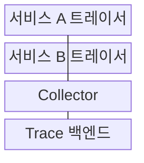
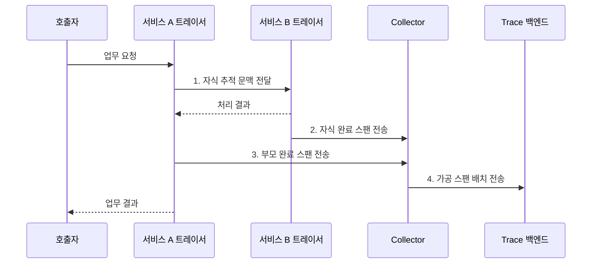

---
sidebar:
  order: 163
  label: "163. 분산 추적 (Distributed Tracing)"
  badge:
    text: "기출 · 50%"
    variant: note
title: "분산 추적 (Distributed Tracing)"
date: "2026-08-02T12:00:00+09:00"
tags:
  - "notes-software"
weight: 163
extra:
  question_no: "163"
  source_status: "기출"
  source_history: "135회"
  priority: 50
  priority_note: "호출 경로와 지연 원인 추적 구조 출제"
---

## Ⅰ. 개요

핵심 용어

- **요청 경로·지연 원인**: 분산 추적은 서비스별 스팬을 연결해 전체 요청 경로와 구간별 지연 원인을 분석한다.

- 정의/개념: 서비스별 스팬을 연결해 **요청 경로·지연 원인을 분석하는 기법**
- 배경/필요성: 서비스별 기록만으로는 전체 요청의 **병목·오류 전파를 식별하기 어려움**

### 쉽게 이해하기 (학습용)

- 주문 하나에 같은 추적 번호를 붙이면 결제와 재고 서비스에 흩어진 처리 기록을 한 이동 경로로 이어 가장 오래 멈춘 구간을 찾을 수 있다.

## Ⅱ. 특징

핵심 용어

- **헤드·테일 샘플링**: 헤드 샘플링은 요청 시작 시, 테일 샘플링은 요청 완료 후 결과를 보고 보존 여부를 결정한다.

- **Trace ID·부모 관계** 기반 경로 조립
- **호출·메시지 문맥 전파** 기반 연결 유지
- **헤드·테일 샘플링** 기반 보존량 조절

### 쉽게 이해하기 (학습용)

- 같은 추적 번호만으로는 순서를 알 수 없으므로 각 스팬의 부모 정보를 함께 기록하고 비동기 작업은 스팬 링크로 인과관계를 남긴다.

## Ⅲ. 구조 및 구성요소

핵심 용어

- **Trace 백엔드**: Trace 백엔드는 식별자와 부모 관계를 이용해 스팬 경로를 조립하고 검색·시각화한다.

| 구성요소 | 책임 |
|:---|:---|
| 서비스 A 트레이서 | 부모 스팬·**추적 문맥** 생성 |
| 서비스 B 트레이서 | 자식 스팬·**문맥 추출** |
| Collector | 스팬 **수신·가공·배치** |
| Trace 백엔드 | **경로 조립·검색·시각화** |

### 쉽게 이해하기 (학습용)

- 트레이서가 구간 영수증을 만들고 문맥 전파기가 같은 주문 번호와 이전 구간 번호를 넘기면 백엔드가 영수증을 전체 동선으로 조립한다.

## Ⅳ. 흐름도

핵심 용어

- **1. 자식 추적 문맥 전달**: 호출자는 동일 Trace ID와 자신의 Span ID를 부모 정보로 넣어 하위 서비스에 전달한다.

**동작 원리**

1. **자식 추적 문맥 전달**: 동일 Trace ID·부모 Span ID 주입
2. **자식 완료 스팬 전송**: 하위 구간의 상태·소요 시간 확정
3. **부모 완료 스팬 전송**: 상위 구간과 자식 호출 관계 확정
4. **가공 스팬 배치 전송**: 식별자·부모 관계 기반 경로 조립

### 쉽게 이해하기 (학습용)

- 서비스 A가 자신의 스팬 번호를 부모로 넣어 B를 호출하면 두 서비스가 따로 보낸 기록도 백엔드에서 A 다음 B 순서로 연결된다.

## Ⅴ. 종류 및 비교

핵심 용어

- **테일 샘플링**: 테일 샘플링은 전체 요청의 오류와 지연 결과를 확인한 뒤 중요한 추적을 우선 보존한다.

| 샘플링 방식 | 헤드 샘플링 | 테일 샘플링 |
|:---|:---|:---|
| 적용 기준 | **대량 트래픽 기본 비율** | **오류·지연 추적 우선 보존** |
| 핵심 특징 | 요청 시작 시 **즉시 결정** | 전체 결과 후 **중앙 판정** |
| 한계 | 중요 결과 **사전 식별 불가** | **스팬 버퍼·판정 지연** 필요 |

### 쉽게 이해하기 (학습용)

- 헤드 샘플링은 입장할 때 임의 관객을 고르고 테일 샘플링은 공연이 끝난 뒤 사고나 지연이 있던 관객 기록을 남기는 차이다.

## Ⅵ. 실무 고려사항 및 대책

핵심 용어

- **문맥 단절**: 문맥 단절은 서비스 호출 경계에서 추적 식별자가 전파되지 않아 전체 요청 경로를 연결하지 못하는 문제다.

| 문제 | 대책 | 효과 |
|:---|:---|:---|
| 서비스 경계 **문맥 단절** | 웹·원격 호출 **주입·추출 시험** | 단일 요청 **경로 유지** |
| 비동기 **부모 관계 왜곡** | 메시지 문맥·**스팬 링크** 적용 | 생산·소비 **인과관계 보존** |
| 희귀 오류 **추적 누락** | 테일·**오류 우선 샘플링** | 장애 분석 **표본 확보** |
| 노드 **시간 오차** | 시간 동기화·**상대 시간 병행** | 구간 순서·**지연 왜곡 완화** |
| 사용자 속성의 **고카디널리티** | 속성 허용 목록·**민감값 제거** | 비용·**개인정보 노출 축소** |

### 쉽게 이해하기 (학습용)

- 메시지 생산과 소비는 실행 시점이 떨어져 직접 부모 관계가 왜곡될 수 있으므로 전달 문맥과 스팬 링크를 함께 남겨야 한다.

## Ⅶ. 결론

핵심 용어

- **호출 경계·비동기 관계·오류 희소성**: 문맥 전파와 샘플링 방식은 호출 경계, 비동기 인과관계, 오류의 희소성을 기준으로 결정해야 한다.

- **호출 경계·비동기 관계·오류 희소성**으로 문맥 전파·샘플링 결정

### 쉽게 이해하기 (학습용)

- 동기 호출은 부모·자식 관계를 끝까지 전파하고 비동기 작업은 링크를 사용하며 희귀 장애는 테일 샘플링으로 보존해야 한다.
