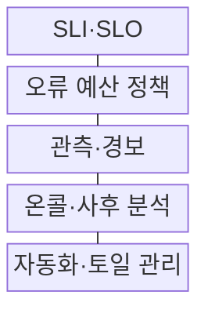
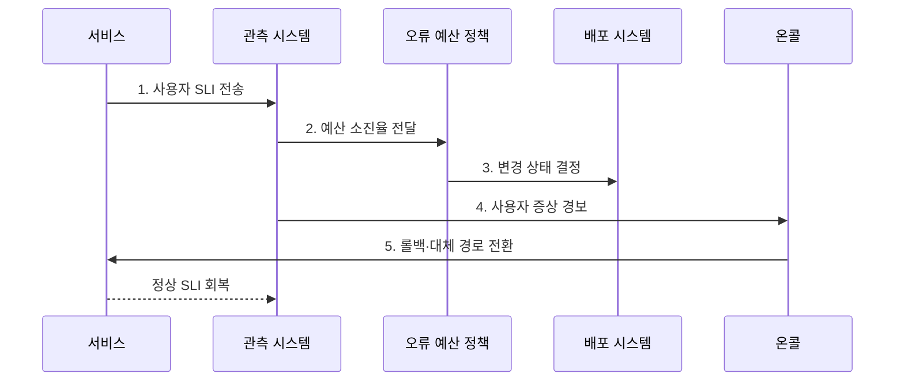

---
sidebar:
  order: 164
  label: "164. SRE 사이트 신뢰성 공학 (Site Reliability Engineering)"
  badge:
    text: "기출 · 70%"
    variant: note
title: "SRE 사이트 신뢰성 공학 (Site Reliability Engineering)"
date: "2026-08-02T12:00:00+09:00"
tags:
  - "notes-software"
weight: 164
extra:
  question_no: "164"
  source_status: "기출"
  source_history: "137회"
  priority: 70
  priority_note: "신뢰성 목표와 운영 자동화의 연결 구조 출제"
---

## Ⅰ. 개요

핵심 용어

- **신뢰성·운영 자동화 체계**: SRE는 소프트웨어 공학을 운영에 적용해 서비스 신뢰성과 반복 운영의 자동화를 함께 관리하는 체계다.

- 정의/개념: 소프트웨어 공학 기반 **신뢰성·운영 자동화 체계**
- 배경/필요성: 무조건적 장애 억제로는 **신뢰성·변경 속도 균형 판단 불가**

#### 한줄 요약

- 무조건 장애를 없애려는 대신 사용자가 허용할 실패량을 정하고 남은 여유에 따라 기능 배포와 안정화 작업의 순서를 바꾼다.

## Ⅱ. 특징

핵심 용어

- **오류 예산 소진율**: 오류 예산 소진율은 허용된 실패량이 소비되는 속도를 나타내며 변경과 안정화의 우선순위를 정하는 기준이다.

- **사용자 관점 SLI·SLO** 기반 신뢰성 정의
- **오류 예산 소진율** 기반 변경 판단
- **토일 감축·사후 분석** 기반 반복 개선

#### 한줄 요약

- 서버 한 대의 CPU가 아니라 결제 성공률과 지연을 보고 약속 위반 속도가 빨라지면 새 배포보다 복구와 재발 방지를 먼저 수행한다.

## Ⅲ. 구조 및 구성요소

핵심 용어

- **오류 예산 정책**: 오류 예산 정책은 예산 상태에 따라 배포 지속, 변경 제한, 복구와 안정화 전환 조건을 정한다.

| 구성요소 | 책임 |
|:---|:---|
| SLI·SLO | 서비스 수준 **측정·목표 정의** |
| 오류 예산 정책 | **변경·안정화 기준** 결정 |
| 관측·경보 | 소진율·**사용자 증상 탐지** |
| 온콜·사후 분석 | **피해 완화·재발 방지** |
| 자동화·토일 관리 | 반복 운영 **측정·코드화** |

#### 한줄 요약

- SLO가 약속, 오류 예산이 남은 실패 쿠폰, 경보가 사용 알림, 온콜이 긴급 대응, 자동화가 같은 사고를 줄이는 개선 장치다.

## Ⅳ. 흐름도

핵심 용어

- **3. 변경 상태 결정**: 오류 예산의 잔여량과 소진율을 기준으로 배포를 지속할지 제한하거나 안정화할지 결정한다.

**동작 원리**

1. **사용자 SLI 전송**: 성공률·지연의 실제 수준 측정
2. **예산 소진율 전달**: 목표 대비 허용 실패 소비 계산
3. **변경 상태 결정**: 배포 지속·제한·안정화 전환
4. **사용자 증상 경보**: 실행 가능한 온콜 호출
5. **롤백·대체 경로 전환**: 장애 영향을 줄인 뒤 정상 수준 회복

#### 한줄 요약

- 결제 실패가 오류 예산을 빠르게 소비하면 배포 시스템이 변경을 제한하고 온콜은 롤백으로 사용자의 피해부터 줄인다.

## Ⅴ. 종류 및 비교

핵심 용어

- **SRE**: SRE는 사용자 관점의 지표와 정량 정책을 활용하고 토일을 자동화하는 운영 방식이다.

| 운영 방식 | SRE | 절차 중심 운영 |
|:---|:---|:---|
| 적용 기준 | **사용자 SLI·오류 예산** | **장비 상태·승인 절차** |
| 핵심 특징 | **정량 판단·자동화·학습** | **경험 판단·수동 절차** |
| 한계 | 목표 오설정 시 **판단 왜곡** | **변경 지연·반복 작업 증가** |

#### 한줄 요약

- SRE는 장비가 켜졌는지가 아니라 사용자가 약속한 성공률과 지연을 받았는지로 변경 가능 여부를 판단한다.

## Ⅵ. 실무 고려사항 및 대책

핵심 용어

- **온콜 작업 증가**: 온콜 작업 증가를 줄이려면 반복 작업량을 측정하고 빈도가 높은 토일부터 자동화해야 한다.

| 문제 | 대책 | 효과 |
|:---|:---|:---|
| 내부 지표 중심 **SLI** | 핵심 **사용자 여정 직접 측정** | 실제 서비스 **영향 반영** |
| 과도하게 높은 **SLO** | 사업 영향·기대·**비용 공동 검토** | 변경 정체·**비용 증가 방지** |
| 짧은 장애 **탐지 누락** | 단기·장기 **소진율 동시 경보** | 급격·지속 악화 **조기 탐지** |
| 예산 소진 시 **일괄 배포 중단** | 예외·승인·**안정화 정책 합의** | **기계적 의사결정 방지** |
| 반복 **온콜 작업 증가** | 작업량 측정·**고빈도 토일 자동화** | 대응 시간·**운영 부담 감소** |

#### 한줄 요약

- 월간 목표만 보면 짧고 큰 장애를 늦게 찾을 수 있으므로 한 시간과 한 달의 소진율을 함께 보고 빠른 사고와 누적 악화를 나눠 대응한다.

## Ⅶ. 결론

핵심 용어

- **사용자 가치·예산 소진·변경 위험**: 배포와 안정화의 우선순위는 사용자 가치, 오류 예산 소진 상태, 변경 위험을 함께 고려해 결정한다.

- **사용자 가치·예산 소진·변경 위험**으로 배포·안정화 결정

#### 한줄 요약

- 오류 예산에 여유가 있으면 변경을 진행하고 빠르게 소진되면 배포를 줄여 복구와 토일 자동화에 먼저 투자해야 한다.
