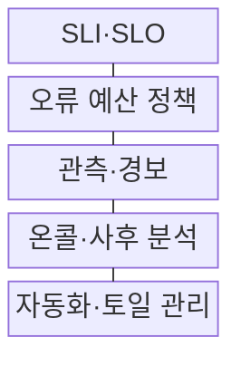
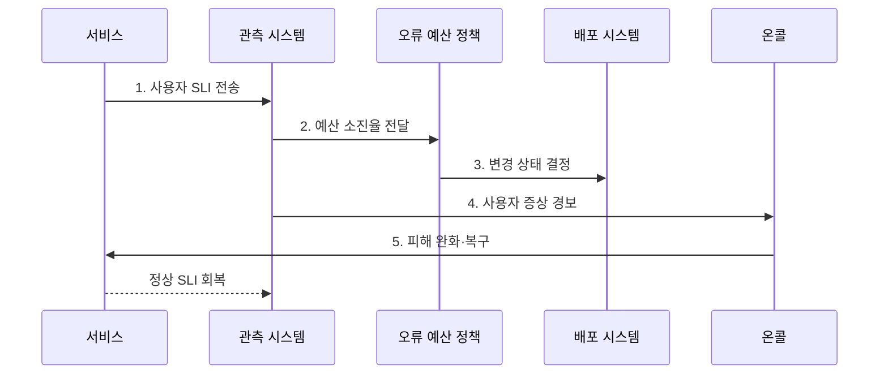

---
sidebar:
  order: 164
  label: "164. SRE 사이트 신뢰성 공학 (Site Reliability Engineering)"
  badge:
    text: "기출 · 70%"
    variant: note
title: "SRE 사이트 신뢰성 공학 (Site Reliability Engineering)"
date: "2026-07-30T20:00:00+09:00"
tags:
  - "notes-software"
weight: 164
extra:
  question_no: "164"
  source_status: "기출"
  source_history: "137회"
  priority: 70
  priority_note: "신뢰성 목표와 운영 자동화의 연결 구조 출제"
---

## 미리 알고가기

- **사이트 신뢰성 공학(Site Reliability Engineering, SRE)**: 소프트웨어 공학을 운영에 적용해 서비스 신뢰성과 변경 속도를 함께 관리하는 방식
- **서비스 수준 지표(Service Level Indicator, SLI)**: 성공률·지연처럼 사용자가 체감하는 서비스 수준의 측정값
- **서비스 수준 목표(Service Level Objective, SLO)**: 일정 기간에 SLI가 달성해야 하는 목표치
- **오류 예산(Error Budget)**: SLO가 허용한 실패량으로 변경과 안정화 판단에 사용하는 여유
- **오류 예산 소진율(Burn Rate)**: 정해진 기간의 오류 예산이 소비되는 속도
- **토일(Toil)**: 수동·반복적이고 자동화할 수 있으며 서비스 성장에 비례해 늘어나는 운영 작업
- **온콜(On-call)**: 정해진 시간에 경보를 받아 장애의 초기 판단과 복구를 담당하는 당직 체계
- **증상 기반 경보(Symptom-based Alert)**: 내부 원인보다 사용자에게 나타난 오류·지연을 기준으로 호출하는 경보
- **사후 분석(Postmortem)**: 개인 비난 없이 장애의 원인·영향·대응·재발 방지책을 기록하는 활동

## Ⅰ. 개요

- 정의/개념: 소프트웨어 공학 기반 **신뢰성·운영 자동화 체계**
- 배경/필요성: 신뢰성과 변경 속도의 **정량적 균형 관리**

### 쉽게 이해하기 (학습용)

- 무조건 장애를 없애려는 대신 사용자가 허용할 실패량을 정하고 남은 여유에 따라 기능 배포와 안정화 작업의 순서를 바꾼다.

## Ⅱ. 특징

- **사용자 관점 SLI·SLO** 기반 신뢰성 정의
- **오류 예산 소진율** 기반 변경 판단
- **토일 감축·사후 분석** 기반 반복 개선

### 쉽게 이해하기 (학습용)

- 서버 한 대의 CPU가 아니라 결제 성공률과 지연을 보고 약속 위반 속도가 빨라지면 새 배포보다 복구와 재발 방지를 먼저 수행한다.

## Ⅲ. 구조 및 구성요소

| 구성요소 | 책임 |
|:---|:---|
| SLI·SLO | 서비스 수준 **측정·목표 정의** |
| 오류 예산 정책 | **변경·안정화 기준** 결정 |
| 관측·경보 | 소진율·**사용자 증상 탐지** |
| 온콜·사후 분석 | **피해 완화·재발 방지** |
| 자동화·토일 관리 | 반복 운영 **측정·코드화** |

### 쉽게 이해하기 (학습용)

- SLO가 약속, 오류 예산이 남은 실패 쿠폰, 경보가 사용 알림, 온콜이 긴급 대응, 자동화가 같은 사고를 줄이는 개선 장치다.

## Ⅳ. 흐름도

**동작 원리**

1. **사용자 SLI 전송**: 성공률·지연의 실제 수준 측정
2. **예산 소진율 전달**: 목표 대비 허용 실패 소비 계산
3. **변경 상태 결정**: 배포 지속·제한·안정화 전환
4. **사용자 증상 경보**: 실행 가능한 온콜 호출
5. **피해 완화·복구**: 롤백·우회 후 정상 수준 회복

### 쉽게 이해하기 (학습용)

- 결제 실패가 오류 예산을 빠르게 소비하면 배포 시스템이 변경을 제한하고 온콜은 롤백으로 사용자의 피해부터 줄인다.

## Ⅴ. 종류 및 비교

| 운영 방식 | SRE | 절차 중심 운영 |
|:---|:---|:---|
| 적용 기준 | **사용자 SLI·오류 예산** | **장비 상태·승인 절차** |
| 핵심 특징 | **정량 판단·자동화·학습** | **경험 판단·수동 절차** |
| 한계 | 목표 오설정 시 **판단 왜곡** | **변경 지연·반복 작업 증가** |

### 쉽게 이해하기 (학습용)

- SRE는 장비가 켜졌는지가 아니라 사용자가 약속한 성공률과 지연을 받았는지로 변경 가능 여부를 판단한다.

## Ⅵ. 실무 고려사항 및 대책

| 고려사항 | 대책 | 효과 |
|:---|:---|:---|
| 내부 지표 중심 **SLI** | 핵심 **사용자 여정 직접 측정** | 실제 서비스 **영향 반영** |
| 과도하게 높은 **SLO** | 사업 영향·기대·**비용 공동 검토** | 변경 정체·**비용 증가 방지** |
| 짧은 장애 **탐지 누락** | 단기·장기 **소진율 동시 경보** | 급격·지속 악화 **조기 탐지** |
| 예산 소진 시 **일괄 배포 중단** | 예외·승인·**안정화 정책 합의** | **기계적 의사결정 방지** |
| 반복 **온콜 작업 증가** | 작업량 측정·**고빈도 토일 자동화** | 대응 시간·**운영 부담 감소** |

### 쉽게 이해하기 (학습용)

- 월간 목표만 보면 짧고 큰 장애를 늦게 찾을 수 있으므로 한 시간과 한 달의 소진율을 함께 보고 빠른 사고와 누적 악화를 나눠 대응한다.

## Ⅶ. 결론

- **사용자 가치·예산 소진·변경 위험**으로 배포·안정화 결정

### 쉽게 이해하기 (학습용)

- 오류 예산에 여유가 있으면 변경을 진행하고 빠르게 소진되면 배포를 줄여 복구와 토일 자동화에 먼저 투자해야 한다.
