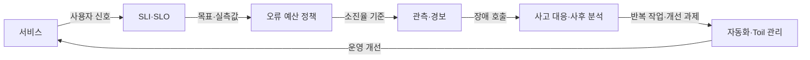
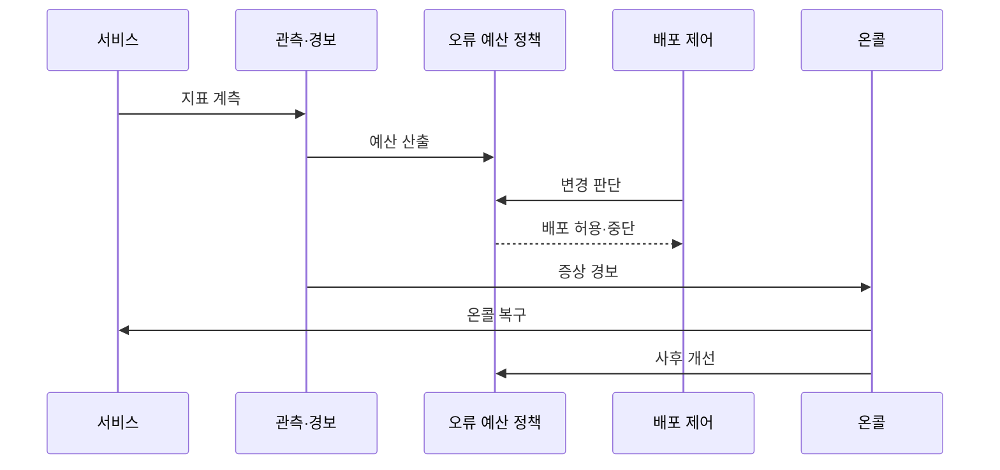

---
sidebar:
  order: 164
  label: "164. SRE 사이트 신뢰성 공학 (Site Reliability Engineering)"
  badge:
    text: "기출 · 70%"
    variant: note
title: "SRE 사이트 신뢰성 공학 (Site Reliability Engineering)"
date: "2026-07-27T23:59:59+09:00"
tags:
  - "notes-software"
weight: 164
extra:
  question_no: "164"
  source_status: "기출"
  source_history: "137회"
  priority: 70
  priority_note: "신뢰성 목표와 운영 자동화가 최근 출제됨"
---

## 미리 알고가기

- **사이트 신뢰성 공학(Site Reliability Engineering, SRE·에스알이)**: 영문 각 단어의 머리글자를 딴 표기이며, 소프트웨어 공학 기법을 서비스 운영에 적용해 신뢰성과 변경 속도를 함께 관리하는 방식
- **서비스 수준 지표(Service Level Indicator, SLI·에스엘아이)**: 영문 각 단어의 머리글자를 딴 표기이며, 사용자 관점의 가용성·지연 같은 서비스 동작을 측정한 값
- **서비스 수준 목표(Service Level Objective, SLO·에스엘오)**: 영문 각 단어의 머리글자를 딴 표기이며, 일정 기간에 SLI가 달성해야 할 목표 수준
- **오류 예산(Error Budget)**: SLO가 허용한 실패량이며, 변경과 신뢰성 작업의 우선순위를 조정하는 공통 기준
- **토일(Toil)**: 고된 일을 뜻하는 영단어를 SRE 운영 용어로 사용한 표기이며, 수동·반복·자동화 가능하고 서비스 성장에 비례해 늘어나는 운영 작업
- **온콜(On-call)**: 정해진 시간에 경보를 받고 장애의 첫 판단과 복구를 맡는 당직 체계
- **평균 복구 시간(Mean Time to Recovery, MTTR·엠티티알)**: 영문 각 단어의 머리글자를 딴 표기이며, 장애 발생부터 정상 서비스 복구까지 걸린 평균 시간
- **증상 기반 경보(Symptom-based Alert)**: 사용자 영향이 발생한 SLI·오류 예산 소진율을 기준으로 온콜을 호출하는 경보
- **사후 분석(Postmortem)**: 개인을 비난하지 않고 사건 원인·영향·재발 완화 조치를 기록하는 활동
- **응용 프로그래밍 인터페이스(Application Programming Interface, API·에이피아이)**: 영문 각 단어의 머리글자를 딴 표기이며, 서비스 기능을 호출하는 계약이자 SLI 측정 대상 경계

## Ⅰ. 개요

- **정의/개념**: 소프트웨어 공학 기반 **서비스 신뢰성 운영**
- **기존 한계**: 수동·사후 운영은 **반복 장애·변경 지연** 발생

### 쉽게 이해하기 (학습용)
- 실패 한도를 계산해 운영 순서를 정하는 방식임

## Ⅱ. 특징

- **SLI·SLO**로 사용자 관점 신뢰성 수치화
- **오류 예산·소진율**로 배포·복구 우선순위 결정
- **자동화·증상 경보·사후 분석**으로 Toil 감소

### 쉽게 이해하기 (학습용)
- 허용 실패량이 거의 소진되면 배포를 늦추고 복구·자동화를 우선한다.

## Ⅲ. 아키텍처 및 구성요소

| 설계 요소 | 설명 |
|:---|:---|
| SLI·SLO | **사용자 신뢰성 지표·목표** 정의 |
| 오류 예산 정책 | 소진 상태별 **배포·복구 조건** 정의 |
| 관측·경보 | 사용자 영향으로 **온콜 호출** |
| 사고 대응·사후 분석 | **피해 완화·원인·재발 방지** 수행 |
| 자동화·Toil 관리 | **반복 운영 작업** 자동화·추적 |

> 요약: 오류 예산이 변경 판단과 개선에 반영됨

### 쉽게 이해하기 (학습용)
- 허용량이 운영 결정을 내리고 개선을 유도함

## Ⅳ. 원리 및 절차 흐름도

| 절차 | 설명 |
|:---|:---|
| 지표 계측 | 사용자 관점의 **성공·지연** 측정 |
| 예산 산출 | 목표 기간의 **허용 실패량** 계산 |
| 변경 판단 | 예산 상태로 **배포 여부** 판단 |
| 배포 허용·중단 | 소진율 기준으로 **변경 통제** |
| 증상 경보 | 사용자 영향 임계 시 **온콜 호출** |
| 온콜 복구 | 피해 완화와 **정상 상태 확인** |
| 사후 개선 | 원인 분석과 **재발 방지 과제** 반영 |

> 요약: 오류 예산으로 변경을 제어하고 개선함

### 쉽게 이해하기 (학습용)
- 예산 상태에 맞춰 배포하고 코드를 고침

## Ⅴ. 종류 및 비교

| 서비스 운영 방식 | SRE | 절차 중심 운영 |
|:---|:---|:---|
| 적용 기준 | 변경 속도·**신뢰성 균형** 요구 | 안정적·저변경 **정형 업무** |
| 핵심 특징 | SLO·오류 예산의 **정량 판단** | 가동 여부·**수동 절차** 중심 |
| 한계 | 부적절한 SLO·**예산 오용** | 반복 작업·**변경 지연** |

> 요약: 예산을 공통 기준으로 삼아 운영을 조정함

### 쉽게 이해하기 (학습용)
- 실패량을 보고 배포와 자동화를 조율함

## Ⅵ. 실무 사례

1. API는 **오류 예산 소진율**로 배포 속도 제어
2. 온콜은 **복구 자동화**로 MTTR·Toil 감소

### 쉽게 이해하기 (학습용)
- API는 예산 소진율이 높으면 배포를 늦춤
- 온콜은 반복 복구를 자동화해 MTTR을 줄임

## Ⅶ. 결론

- 예산 여유 시 **배포**, 소진 시 **복구** 우선

### 쉽게 이해하기 (학습용)
- 실패 여유가 줄면 신규 배포를 멈추고 복구함
