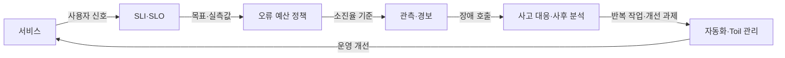
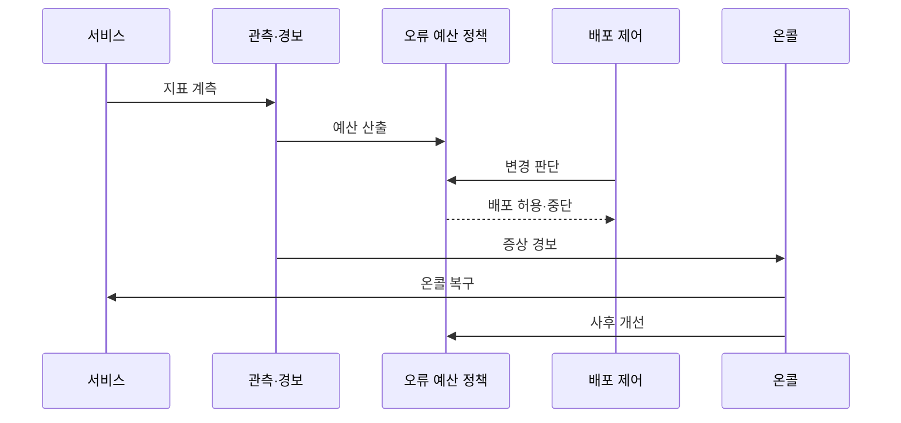

---
sidebar:
  order: 164
  label: "164. SRE 사이트 신뢰성 공학 (Site Reliability Engineering)"
  badge:
    text: "기출 · 70%"
    variant: note
title: "SRE 사이트 신뢰성 공학 (Site Reliability Engineering)"
date: "2026-07-25T00:40:00+09:00"
tags:
  - "notes-software"
weight: 164
extra:
  question_no: "164"
  source_status: "기출"
  source_history: "137회"
  priority: 70
  priority_note: "신뢰성 목표와 운영 자동화가 최근 출제됨"
---

## 미리 알고가기

- **사이트 신뢰성 공학(Site Reliability Engineering, SRE·에스알이)**: 영문 각 단어의 머리글자를 딴 표기이며, 소프트웨어 공학 기법을 서비스 운영에 적용해 신뢰성과 변경 속도를 함께 관리하는 방식
- **서비스 수준 지표(Service Level Indicator, SLI·에스엘아이)**: 영문 각 단어의 머리글자를 딴 표기이며, 사용자 관점의 가용성·지연 같은 서비스 동작을 측정한 값
- **서비스 수준 목표(Service Level Objective, SLO·에스엘오)**: 영문 각 단어의 머리글자를 딴 표기이며, 일정 기간에 SLI가 달성해야 할 목표 수준
- **오류 예산(Error Budget)**: SLO가 허용한 실패량이며, 변경과 신뢰성 작업의 우선순위를 조정하는 공통 기준
- **토일(Toil)**: 고된 일을 뜻하는 영단어를 SRE 운영 용어로 사용한 표기이며, 수동·반복·자동화 가능하고 서비스 성장에 비례해 늘어나는 운영 작업
- **온콜(On-call)**: 정해진 시간에 경보를 받고 장애의 첫 판단과 복구를 맡는 당직 체계
- **평균 복구 시간(Mean Time to Recovery, MTTR·엠티티알)**: 영문 각 단어의 머리글자를 딴 표기이며, 장애 발생부터 정상 서비스 복구까지 걸린 평균 시간
- **증상 기반 경보(Symptom-based Alert)**: 사용자 영향이 발생한 SLI·오류 예산 소진율을 기준으로 온콜을 호출하는 경보
- **사후 분석(Postmortem)**: 개인을 비난하지 않고 사건 원인·영향·재발 완화 조치를 기록하는 활동
- **응용 프로그래밍 인터페이스(Application Programming Interface, API·에이피아이)**: 영문 각 단어의 머리글자를 딴 표기이며, 서비스 기능을 호출하는 계약이자 SLI 측정 대상 경계

## Ⅰ. 개요

- **정의/개념**: 신뢰성 목표를 운영·개발 결정에 적용
- **배경/필요성**: 신뢰성·변경 속도 상충으로 SLO 운영 필요

### 쉽게 이해하기 (학습용)
- 실패 한도를 계산해 운영 순서를 정하는 방식임

## Ⅱ. 특징

- SLI와 SLO를 활용해 신뢰성을 수치화한다.
- 오류 예산·소진율로 배포 지속·중단 조건을 정한다.
- 반복 작업은 자동화하고 Toil 비율을 관리한다.
- 증상 기반 경보로 온콜 피드백을 연결한다.

### 쉽게 이해하기 (학습용)
- 허용 실패량이 거의 소진되면 배포를 늦추고 복구·자동화를 우선한다.

## Ⅲ. 아키텍처 및 구성요소

| 설계 요소 | 설명 |
|:---|:---|
| SLI·SLO | 사용자 관점의 성공 수준과 목표를 정의함 |
| 오류 예산 정책 | 소진 상태에 따른 작업 조건을 정의함 |
| 관측·경보 | 사용자 영향에 따라 온콜을 호출함 |
| 사고 대응·사후 분석 | 복구 절차를 수행하고 사후 분석을 함 |
| 자동화·Toil 관리 | 반복 작업을 자동화하고 비율을 추적함 |

> 요약: 오류 예산이 변경 판단과 개선에 반영됨

### 쉽게 이해하기 (학습용)
- 허용량이 운영 결정을 내리고 개선을 유도함

## Ⅳ. 원리 및 절차 흐름도

| 절차 | 설명 |
|:---|:---|
| **지표 계측** | 사용자 관점의 성공 및 지연을 측정함 |
| **예산 산출** | 목표 기간 동안 허용 실패율을 산출함 |
| **변경 판단** | 예산 상태에 기반해 배포 여부를 결정함 |
| **배포 허용·중단** | 소진율 기준으로 변경 진행 여부를 통제함 |
| **증상 경보** | 사용자 영향이 임계치를 넘으면 온콜을 호출함 |
| **온콜 복구** | 피해를 완화하고 서비스 정상 상태를 확인함 |
| **사후 개선** | 사고 원인을 분석하고 재발 방지 과제를 반영함 |

> 요약: 오류 예산으로 변경을 제어하고 개선함

### 쉽게 이해하기 (학습용)
- 예산 상태에 맞춰 배포하고 코드를 고침

## Ⅴ. 종류 및 비교

| 비교축 | SRE | 절차 중심 운영 |
|:---|:---|:---|
| 핵심 특징 | 사용자 목표와 예산으로 위험을 판단함 | 가동 여부와 일정으로 변경을 결정함 |
| 적용 기준 | 배포 속도와 안정성 균형이 필요할 때 | 가동 시간과 수동 절차 중심일 때 |
| 주요 위험 | 잘못된 SLO·오류 예산 오용 | 반복 작업·변경 지연 |

> 요약: 예산을 공통 기준으로 삼아 운영을 조정함

### 쉽게 이해하기 (학습용)
- 실패량을 보고 배포와 자동화를 조율함

## Ⅵ. 실무 사례

1. API 배포는 소진율로 배포 속도를 제어함
2. 온콜은 복구를 자동화하고 MTTR·Toil 확인

### 쉽게 이해하기 (학습용)
- API는 예산 소진율이 높으면 배포를 늦춤
- 온콜은 반복 복구를 자동화해 MTTR을 줄임

## Ⅶ. 결론

- 오류 예산 소진 시 배포보다 복구를 우선함

### 쉽게 이해하기 (학습용)
- 실패 여유가 줄면 신규 배포를 멈추고 복구함
