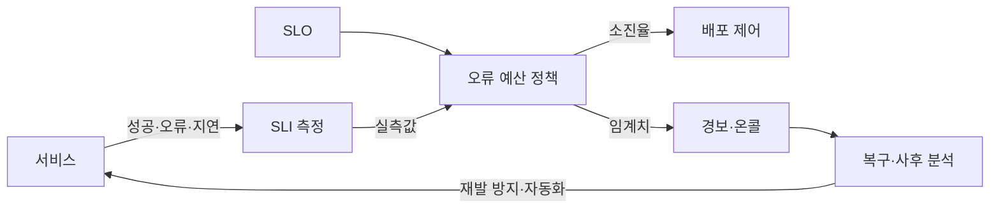
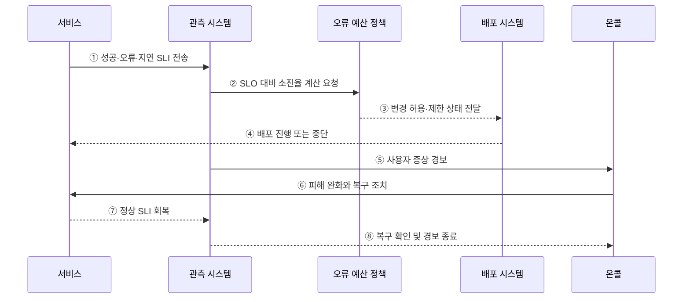

---
sidebar:
  order: 164
  label: "164. SRE 사이트 신뢰성 공학 (Site Reliability Engineering)"
  badge:
    text: "기출 · 70%"
    variant: note
title: "SRE 사이트 신뢰성 공학 (Site Reliability Engineering)"
date: "2026-07-27T23:59:59+09:00"
tags:
  - "notes-software"
weight: 164
extra:
  question_no: "164"
  source_status: "기출"
  source_history: "137회"
  priority: 70
  priority_note: "신뢰성 목표와 운영 자동화가 최근 출제됨"
---

## 미리 알고가기

- **사이트 신뢰성 공학(Site Reliability Engineering, SRE·에스알이)**: 소프트웨어 공학을 운영에 적용해 서비스 신뢰성과 변경 속도를 함께 관리하는 방식
- **서비스 수준 지표(Service Level Indicator, SLI·에스엘아이)**: 성공률·지연처럼 사용자가 체감하는 서비스 수준의 측정값
- **서비스 수준 목표(Service Level Objective, SLO·에스엘오)**: 일정 기간에 SLI가 달성해야 하는 목표치
- **오류 예산(Error Budget)**: SLO가 허용한 실패량으로, `1 - SLO`에 해당하는 운영 여유
- **오류 예산 소진율(Burn Rate)**: 정해진 기간의 오류 예산이 얼마나 빠르게 소비되는지를 나타내는 비율
- **토일(Toil)**: 수동·반복적이고 자동화할 수 있으며 서비스 성장에 비례해 늘어나는 운영 작업
- **온콜(On-call)**: 정해진 시간에 경보를 받아 장애의 초기 판단과 복구를 담당하는 당직 체계
- **증상 기반 경보(Symptom-based Alert)**: 내부 원인보다 사용자에게 나타난 오류·지연을 기준으로 호출하는 경보
- **사후 분석(Postmortem)**: 개인을 비난하지 않고 장애의 원인·영향·대응·재발 방지책을 기록하는 활동

## Ⅰ. 개요

- SRE는 운영 문제를 **측정·자동화 가능한 소프트웨어 문제**로 다룬다.
- SLI·SLO로 신뢰성을 정의하고 오류 예산으로 **변경 속도와 안정성의 균형**을 조정한다.
- 수동·사후 대응 중심 운영의 반복 장애와 배포 지연을 줄이는 것이 목적이다.

### 쉽게 이해하기 (학습용)
- 허용 실패량을 정하고 남은 여유에 따라 배포와 안정화의 우선순위를 바꿈

## Ⅱ. 특징

- **사용자 중심 측정**: 서버 가동 여부가 아니라 성공률·지연 등 사용자 경험을 SLI로 측정한다.
- **정량 목표**: SLO로 필요한 신뢰성 수준과 평가 기간을 명시한다.
- **공동 의사결정**: 오류 예산을 개발·운영 조직의 배포와 안정화 기준으로 사용한다.
- **자동화 우선**: 반복되는 토일을 코드와 도구로 줄여 확장 가능한 운영을 만든다.
- **학습 중심 대응**: 증상 기반 경보·신속한 복구·비난 없는 사후 분석으로 재발을 줄인다.

### 쉽게 이해하기 (학습용)
- 감이 아니라 목표와 실패 여유를 보고 운영 결정을 내림

## Ⅲ. 아키텍처 및 구성요소

**도표안 A — 구조도**

**도표안 B — sequenceDiagram**

| 구성요소 | 역할 |
|:---|:---|
| SLI | 성공률·지연 등 사용자 관점의 실제 서비스 수준 측정 |
| SLO | 평가 기간과 목표 서비스 수준 정의 |
| 오류 예산 정책 | 허용 실패량과 소진율에 따른 조치 기준 결정 |
| 관측·경보 | SLI 수집과 사용자 증상 기반 온콜 호출 |
| 배포 제어 | 오류 예산 상태에 따라 변경 진행·제한 |
| 온콜·사후 분석 | 피해 완화·복구·원인 분석·재발 방지 수행 |
| 자동화·토일 관리 | 반복 운영을 코드화하고 작업량 추적 |

**동작 원리**

- ① 서비스의 성공·오류·지연을 사용자 관점의 SLI로 수집한다.
- ② 관측 시스템이 실측 SLI를 SLO와 비교해 오류 예산 소진율을 계산한다.
- ③ 오류 예산 정책이 소진 상태에 따른 변경 허용·제한 조건을 배포 시스템에 전달한다.
- ④ 배포 시스템은 예산 여유 시 변경하고 급격한 소진 시 배포를 제한한다.
- ⑤ 사용자 영향이 임계치를 넘으면 관측 시스템이 온콜을 호출한다.
- ⑥ 온콜은 롤백·우회·용량 확장 등으로 먼저 피해를 완화하고 서비스를 복구한다.
- ⑦ 서비스가 정상화되면 SLI가 목표 범위로 회복된다.
- ⑧ 관측 시스템이 회복을 확인해 경보를 종료하고 사후 분석으로 개선 과제를 남긴다.

### 쉽게 이해하기 (학습용)
- 서비스 상태를 재고 실패 여유에 따라 배포하거나 복구함

## Ⅳ. 종류 및 비교

| 구분 | SRE | 전통적 절차 중심 운영 |
|:---|:---|:---|
| 신뢰성 기준 | 사용자 SLI·SLO | 장비 가동·절차 준수 |
| 변경 판단 | 오류 예산 기반 정량 판단 | 승인과 경험 기반 판단 |
| 장애 경보 | 사용자 증상·예산 소진율 | 개별 자원 임계치 |
| 반복 작업 | 자동화와 토일 감축 | 수동 절차 수행 |
| 개선 방식 | 사후 분석과 코드 개선 | 장애 복구와 보고 중심 |
| 한계 | 잘못된 SLO·예산의 기계적 적용 | 변경 지연·반복 작업·경보 과다 |

### 쉽게 이해하기 (학습용)
- SRE는 가동 여부보다 사용자가 약속한 서비스를 받았는지로 운영함

## Ⅴ. 실무 고려사항 및 대책

| 고려사항 | 위험 | 대책 |
|:---|:---|:---|
| SLI 선정 | 내부 지표만 좋아도 사용자 장애를 놓침 | 사용자 여정의 성공·지연·품질을 직접 측정 |
| SLO 수준 | 지나치게 높으면 변경이 멈추고 비용 증가 | 사업 영향·사용자 기대·비용으로 현실적 목표 설정 |
| 평가 구간 | 짧은 장애나 장기 악화 왜곡 | 단기·장기 소진율을 함께 경보 |
| 오류 예산 정책 | 예산 소진을 무조건 배포 중단으로 오용 | 예외·승인·안정화 조치를 사전에 합의 |
| 경보 품질 | 원인 지표 경보 과다로 온콜 피로 | 사용자 증상과 실행 가능한 조치 중심 경보 |
| 토일 관리 | 자동화 자체가 새로운 운영 부담 생성 | 작업량 측정 후 반복·고빈도 작업부터 자동화 |
| 사후 분석 | 개인 비난으로 문제 은폐 | 사실·기여 요인·담당자·기한이 있는 개선 과제 기록 |

### 쉽게 이해하기 (학습용)
- 사례: 결제 API의 예산이 빠르게 줄면 신규 배포를 늦추고 오류율 복구를 우선함

## Ⅵ. 결론

- SRE의 핵심은 **SLI·SLO·오류 예산을 하나의 운영 의사결정 체계로 연결**하는 것이다.
- 경보는 사용자 증상에 집중하고, 장애는 신속히 완화한 뒤 사후 분석과 자동화로 재발을 줄여야 한다.
- 신뢰성을 무조건 높이는 것이 아니라 사용자 가치·변경 속도·운영 비용의 균형을 지속적으로 조정해야 한다.

### 쉽게 이해하기 (학습용)
- 실패 여유가 줄면 기능 개발보다 복구와 안정화에 먼저 투자함
