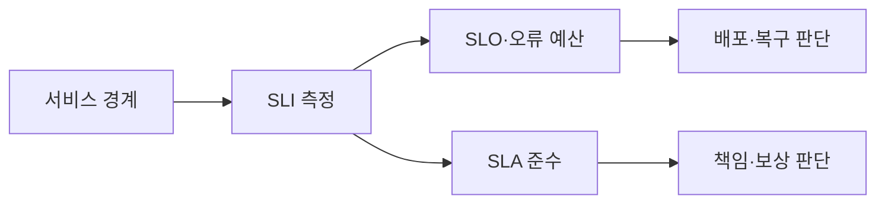

---
sidebar:
  order: 165
  label: "165. SLO·SLA·SLI (SLO·SLA·SLI)"
  badge:
    text: "기출 · 70%"
    variant: note
title: "SLO·SLA·SLI (SLO·SLA·SLI)"
date: "2026-07-25T00:40:00+09:00"
tags:
  - "notes-software"
weight: 165
extra:
  question_no: "165"
  source_status: "기출"
  source_history: "123회, 137회"
  priority: 70
  priority_note: "지표·목표·계약의 구분이 반복 출제 기반임"
---

## 미리 알고가기

- **서비스 수준 지표 SLI(에스엘아이, Service Level Indicator)**: 영어 세 낱말의 첫 글자를 쓴 표기로 사용자가 경험한 성공률·지연·신선도 같은 서비스 동작을 측정한 값임
- **서비스 수준 목표 SLO(에스엘오, Service Level Objective)**: 영어 세 낱말의 첫 글자를 쓴 표기로 정한 기간에 SLI가 달성해야 할 내부 신뢰성 목표임
- **서비스 수준 협약 SLA(에스엘에이, Service Level Agreement)**: 영어 세 낱말의 첫 글자를 쓴 표기로 제공자와 고객이 서비스 수준과 미달 시 책임·보상을 합의한 계약임
- **좋은 이벤트와 유효 이벤트**: 좋은 이벤트는 기준을 지킨 요청이고, 유효 이벤트는 측정 대상인 전체 요청임
- **오류 예산의 `1−SLO`(일 마이너스 에스엘오)**: 전체 비율 1에서 목표 비율 SLO를 뺀 표기로 허용 실패 비율을 나타내며 내부 배포·복구 판단에 사용함
- **측정 위치**: 사용자 경로에서 멀면 실제 사용자 경험과 SLI가 달라질 수 있음
- **신선도**: 데이터가 생성된 뒤 사용자에게 제공되기까지의 최신성 지표임
- **서비스 크레딧**: SLA 미달 시 고객에게 제공하는 요금 감면이나 보상임

## Ⅰ. 개요

- **정의/개념**: 지표를 바탕으로 내부 목표와 외부 계약을 관리함
- **배경/필요성**: 기대·목표·계약 혼동으로 지표 계층 분리 필요

### 쉽게 이해하기 (학습용)
- SLI는 눈금, SLO는 합격선, SLA는 계약 약속임

## Ⅱ. 특징

- SLI는 기준을 만족한 좋은 이벤트 비율로 계산한다.
- SLO는 목표 비율과 기간을 함께 정해야 판정한다.
- SLA는 측정 방식과 미달 시 보상 조건을 명시한다.
- 내부 목표를 계약보다 높여 대응 여지를 둔다.

### 쉽게 이해하기 (학습용)
- 실제 경험을 재고 계약보다 내부 목표를 빡빡하게 잡음

## Ⅲ. 아키텍처 및 구성요소

| 설계 요소 | 설명 |
|:---|:---|
| 서비스 경계 | 사용자 요청과 측정 대상·제외 범위를 정함 |
| SLI 명세 | 좋은 이벤트와 측정 위치를 명확히 정의함 |
| SLO 문서 | 목표 비율과 기간 및 예산 계산법을 기록함 |
| 오류 예산 정책 | 미달 위험에 따른 배포와 복구 조건을 정함 |
| SLA 계약 | 고객 범위와 측정 자료 및 보상 기준을 합의함 |

> 요약: 측정값은 내부 목표와 외부 계약 판단에 사용됨

### 쉽게 이해하기 (학습용)
- 하나의 측정값으로 배포 판단과 보상에 활용함

## Ⅳ. 원리 및 절차 흐름도

| 절차 | 설명 |
|:---|:---|
| **경계정의** | 사용자 요청과 측정 대상을 획정함 |
| **지표명세** | 좋은 이벤트와 측정 위치를 정의함 |
| **목표설정** | 내부 목표와 외부 계약 수준을 합의함 |
| **지표집계** | 대상 기간 동안의 측정 지표를 수집함 |
| **준수판정** | 오류 예산과 보상 기준을 판단함 |

> 요약: 경계와 지표 정의 후 목표와 계약을 판정함

### 쉽게 이해하기 (학습용)
- 합격선과 약속선에 대어 조치와 책임을 판단함

## Ⅴ. 종류 및 비교

| 비교축 | SLI | SLO | SLA |
|:---|:---|:---|:---|
| 핵심 특징 | 성공률과 지연 등의 동작을 측정함 | 지표의 임계값과 목표 기간을 정함 | 목표와 제외 및 보상 조건을 합의함 |
| 적용 기준 | 서비스 동작의 현재 상태를 정량 측정 시 | 내부적인 서비스 품질 목표 수준 설정 시 | 비즈니스 관점의 계약적 책임을 합의 시 |
| 주요 위험 | 측정 편향·사용자 경험 불일치 | 과도한 목표·오류 예산 왜곡 | 보상 조건 누락·계약 분쟁 |

> 요약: 지표를 측정하고 목표를 정하며 계약을 함

### 쉽게 이해하기 (학습용)
- SLI는 점수, SLO는 목표, SLA는 책임임

## Ⅵ. 실무 사례

1. API는 성공 비율을 재고 예산 소진율을 확인함
2. 데이터 처리는 신선도를 재고 지연을 확인함

### 쉽게 이해하기 (학습용)
- API는 성공 요청 비율로 오류 예산을 계산함
- 데이터 처리는 신선도 미달 시간을 확인함

## Ⅶ. 결론

- 사용자 경계에서 SLI를 재고 SLO와 SLA를 판정함

### 쉽게 이해하기 (학습용)
- 같은 측정값으로 내부 조치와 외부 보상을 나눔
