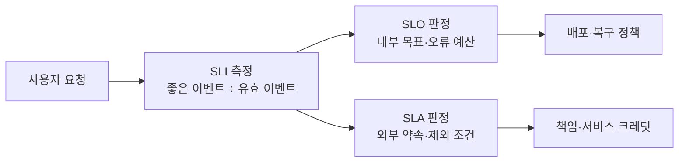
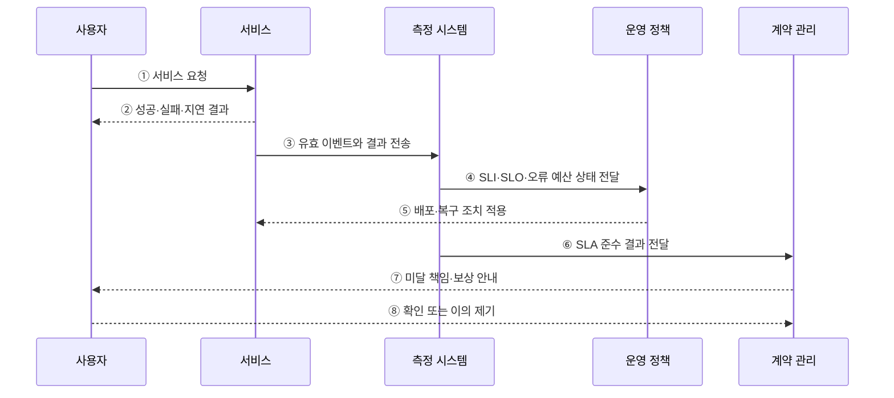

---
sidebar:
  order: 165
  label: "165. SLO·SLA·SLI (SLO·SLA·SLI)"
  badge:
    text: "기출 · 70%"
    variant: note
title: "SLO·SLA·SLI (SLO·SLA·SLI)"
date: "2026-07-27T23:59:59+09:00"
tags:
  - "notes-software"
weight: 165
extra:
  question_no: "165"
  source_status: "기출"
  source_history: "123회, 137회"
  priority: 70
  priority_note: "지표·목표·계약의 구분이 반복 출제 기반임"
---

## 미리 알고가기

- **서비스 수준 지표(Service Level Indicator, SLI·에스엘아이)**: 성공률·지연·신선도처럼 사용자가 경험한 서비스 수준의 측정값
- **서비스 수준 목표(Service Level Objective, SLO·에스엘오)**: 정해진 기간에 SLI가 달성해야 하는 내부 목표
- **서비스 수준 협약(Service Level Agreement, SLA·에스엘에이)**: 제공자와 고객이 서비스 수준과 미달 시 책임·보상을 합의한 계약
- **좋은 이벤트(Good Event)**: 성공·지연 기준 등 SLI의 정상 조건을 충족한 요청
- **유효 이벤트(Valid Event)**: 제외 조건을 뺀 SLI 측정 대상 전체 요청
- **오류 예산(Error Budget)**: SLO가 허용한 실패량으로, 비율은 `1 - SLO`
- **신선도(Freshness)**: 데이터 생성 시점과 사용자 제공 시점의 차이로 측정하는 최신성
- **서비스 크레딧(Service Credit)**: SLA 미달 시 고객에게 제공하는 요금 감면이나 보상

## Ⅰ. 개요

- SLI·SLO·SLA는 서비스 수준을 **측정값·내부 목표·외부 계약**으로 구분하는 체계다.
- SLI를 근거로 SLO의 오류 예산과 SLA의 책임 여부를 각각 판단한다.
- 세 개념을 혼용하면 운영 우선순위가 흔들리고 고객 보상 분쟁이 발생한다.

### 쉽게 이해하기 (학습용)
- SLI는 점수, SLO는 내부 합격선, SLA는 고객과 약속한 책임선임

## Ⅱ. 특징

- **SLI**: 사용자 경계에서 실제 서비스 수준을 정량 측정한다.
- **SLO**: SLI의 목표 비율·평가 기간·허용 실패량을 정한다.
- **SLA**: 적용 고객·측정 방식·제외 조건·미달 책임·보상을 계약한다.
- 일반적으로 내부 대응 여유를 확보하도록 **SLO를 SLA보다 엄격하게** 설정한다.
- 동일한 측정 근거를 사용하되 운영 정책과 계약 책임은 분리한다.

### 쉽게 이해하기 (학습용)
- 고객 약속을 어기기 전에 대응하도록 내부 목표를 더 엄격하게 잡음

## Ⅲ. 아키텍처 및 구성요소

**도표안 A — 구조도**

**도표안 B — sequenceDiagram**

| 구성요소 | 역할 |
|:---|:---|
| 서비스 경계 | 측정 대상·사용자·기능·제외 범위 정의 |
| SLI 명세 | 좋은 이벤트·유효 이벤트·측정 위치·집계식 정의 |
| SLO 문서 | 목표 비율·평가 기간·오류 예산 정의 |
| 오류 예산 정책 | 예산 상태별 배포·복구·승인 조건 정의 |
| SLA 계약 | 대상 고객·서비스 수준·제외 조건·책임·보상 합의 |
| 측정 시스템 | 동일 원천 데이터로 SLO와 SLA 준수 여부 산출 |

**동작 원리**

- ① 사용자가 계약과 측정 범위에 포함된 서비스를 요청한다.
- ② 서비스는 성공·실패·지연 등 사용자가 체감한 결과를 반환한다.
- ③ 서비스 경계에서 유효 이벤트와 좋은 이벤트 여부를 측정 시스템에 기록한다.
- ④ 측정 시스템은 `좋은 이벤트 ÷ 유효 이벤트`로 SLI를 계산하고 SLO·오류 예산 상태를 운영 정책에 전달한다.
- ⑤ 운영 정책은 오류 예산의 여유와 소진 속도에 따라 배포·복구 조치를 적용한다.
- ⑥ 측정 시스템은 계약의 기간·제외 조건을 적용한 SLA 준수 결과를 계약 관리에 전달한다.
- ⑦ 계약 관리는 SLA 미달 시 약정된 책임과 서비스 크레딧을 고객에게 안내한다.
- ⑧ 고객의 확인이나 이의 제기를 계약 근거와 측정 원본으로 처리한다.

### 쉽게 이해하기 (학습용)
- 하나의 실제 점수를 내부 운영 기준과 외부 계약 기준에 각각 대어 판단함

## Ⅳ. 종류 및 비교

| 구분 | SLI | SLO | SLA |
|:---|:---|:---|:---|
| 의미 | 서비스 수준 실측값 | 내부 신뢰성 목표 | 외부 서비스 계약 |
| 주체 | 운영·관측 조직 | 개발·운영·제품 조직 | 제공자·고객 |
| 핵심 내용 | 성공률·지연·신선도 | 목표치·기간·오류 예산 | 수준·제외·책임·보상 |
| 용도 | 상태 측정 | 배포·복구 우선순위 | 준수·분쟁·보상 판단 |
| 예시 | 월간 성공률 99.96% | 월간 성공률 99.95% 이상 | 월간 99.9% 미달 시 보상 |
| 주요 위험 | 측정 위치 편향 | 과도하거나 느슨한 목표 | 모호한 조건과 책임 범위 |

### 쉽게 이해하기 (학습용)
- SLI로 재고 SLO로 운영하며 SLA로 고객 책임을 정함

## Ⅴ. 실무 고려사항 및 대책

| 고려사항 | 위험 | 대책 |
|:---|:---|:---|
| 사용자 관점 | 서버 지표와 실제 경험 불일치 | 사용자 요청 경계에서 SLI 측정 |
| 분모 정의 | 재시도·봇·점검 요청으로 결과 왜곡 | 유효 이벤트와 제외 조건 명시 |
| 측정 위치 | 내부 성공 뒤 네트워크 실패 누락 | 클라이언트·게이트웨이 관측 병행 |
| 집계 방식 | 평균이 느린 요청을 숨김 | 성공 비율과 지연 임계 비율 사용 |
| 목표 수준 | 과도한 신뢰성 비용 또는 품질 저하 | 사용자 기대·사업 영향·비용으로 조정 |
| SLO·SLA 차이 | 내부 대응 전에 계약 위반 | SLO를 SLA보다 엄격하게 설정 |
| 증빙 관리 | 보상 이의와 측정 분쟁 | 원천 데이터·계산식·변경 이력 보존 |

### 쉽게 이해하기 (학습용)
- 사례: API 성공 요청을 전체 유효 요청으로 나눠 SLI를 계산하고 오류 예산을 판단함

## Ⅵ. 결론

- SLI·SLO·SLA의 핵심은 **측정·목표·계약을 구분하면서 같은 근거로 연결**하는 것이다.
- SLI는 사용자 경험을 대표해야 하며, SLO는 내부 조치를 이끌고, SLA는 책임과 보상을 명확히 해야 한다.
- 측정 경계·제외 조건·평가 기간·계산식을 일관되게 관리해야 신뢰성 운영과 계약 분쟁을 함께 줄일 수 있다.

### 쉽게 이해하기 (학습용)
- 정확히 재고 더 엄격한 내부 목표로 관리해 고객 약속을 지킴
