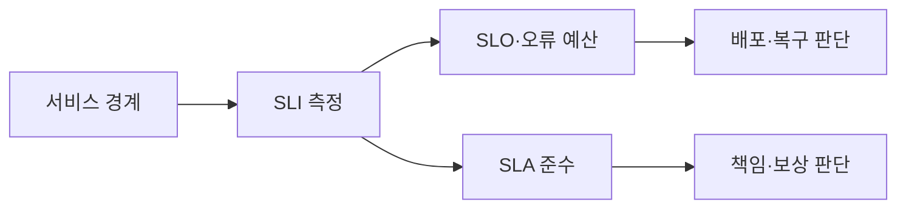
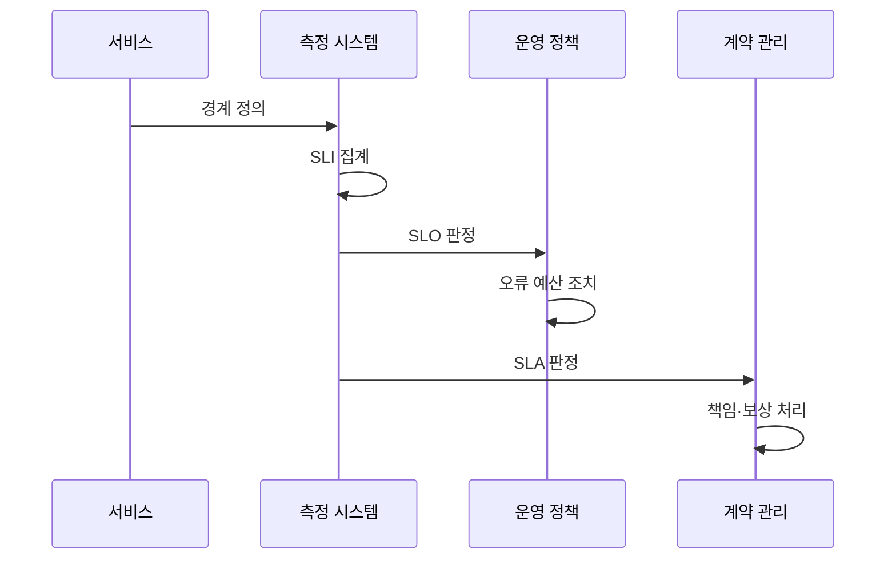

---
sidebar:
  order: 165
  label: "165. SLO·SLA·SLI (SLO·SLA·SLI)"
  badge:
    text: "기출 · 70%"
    variant: note
title: "SLO·SLA·SLI (SLO·SLA·SLI)"
date: "2026-07-27T23:59:59+09:00"
tags:
  - "notes-software"
weight: 165
extra:
  question_no: "165"
  source_status: "기출"
  source_history: "123회, 137회"
  priority: 70
  priority_note: "지표·목표·계약의 구분이 반복 출제 기반임"
---

## 미리 알고가기

- **서비스 수준 지표 SLI(에스엘아이, Service Level Indicator)**: 영어 세 낱말의 첫 글자를 쓴 표기로 사용자가 경험한 성공률·지연·신선도 같은 서비스 동작을 측정한 값임
- **서비스 수준 목표 SLO(에스엘오, Service Level Objective)**: 영어 세 낱말의 첫 글자를 쓴 표기로 정한 기간에 SLI가 달성해야 할 내부 신뢰성 목표임
- **서비스 수준 협약 SLA(에스엘에이, Service Level Agreement)**: 영어 세 낱말의 첫 글자를 쓴 표기로 제공자와 고객이 서비스 수준과 미달 시 책임·보상을 합의한 계약임
- **좋은 이벤트와 유효 이벤트**: 좋은 이벤트는 기준을 지킨 요청이고, 유효 이벤트는 측정 대상인 전체 요청임
- **오류 예산의 `1−SLO`(일 마이너스 에스엘오)**: 전체 비율 1에서 목표 비율 SLO를 뺀 표기로 허용 실패 비율을 나타내며 내부 배포·복구 판단에 사용함
- **측정 위치**: 사용자 경로에서 멀면 실제 사용자 경험과 SLI가 달라질 수 있음
- **신선도**: 데이터가 생성된 뒤 사용자에게 제공되기까지의 최신성 지표임
- **서비스 크레딧**: SLA 미달 시 고객에게 제공하는 요금 감면이나 보상임

## Ⅰ. 개요

- 정의/개념: **측정 지표·내부 목표·외부 계약**의 계층
- 기존 한계: 가용성 약속 혼용은 **운영 판단·보상 분쟁** 유발

### 쉽게 이해하기 (학습용)
- SLI는 눈금, SLO는 합격선, SLA는 계약 약속임

## Ⅱ. 특징

- **SLI**는 좋은 이벤트와 유효 이벤트로 측정
- **SLO**는 지표의 목표 비율·측정 기간 설정
- **SLA**는 계약 수준·제외 조건·보상 명시

### 쉽게 이해하기 (학습용)
- 실제 경험을 재고 계약보다 내부 목표를 빡빡하게 잡음

## Ⅲ. 아키텍처 및 구성요소

| 설계 요소 | 설명 |
|:---|:---|
| 서비스 경계 | **측정 대상·제외 범위** 정의 |
| SLI 명세 | **좋은 이벤트·측정 위치** 정의 |
| SLO 문서 | **목표 비율·기간·예산** 기록 |
| 오류 예산 정책 | 미달 위험별 **배포·복구 조건** 정의 |
| SLA 계약 | 고객 범위·**측정·보상 기준** 합의 |

> 요약: 측정값은 내부 목표와 외부 계약 판단에 사용됨

### 쉽게 이해하기 (학습용)
- 하나의 측정값으로 배포 판단과 보상에 활용함

## Ⅳ. 원리 및 절차 흐름도

| 절차 | 설명 |
|:---|:---|
| 경계 정의 | 사용자 요청의 **측정·제외 범위** 정의 |
| SLI 집계 | 좋은 이벤트 비율·**지연 분포** 계산 |
| SLO 판정 | 내부 목표와 **실측 SLI** 비교 |
| 오류 예산 조치 | 예산 상태로 **배포·복구** 결정 |
| SLA 판정 | 계약 수준과 **실측 SLI** 비교 |
| 책임·보상 처리 | 미달 시 **책임·서비스 크레딧** 적용 |

> 요약: 경계와 지표 정의 후 목표와 계약을 판정함

### 쉽게 이해하기 (학습용)
- 합격선과 약속선에 대어 조치와 책임을 판단함

## Ⅴ. 종류 및 비교

| 서비스 수준 체계 | SLI | SLO | SLA |
|:---|:---|:---|:---|
| 적용 기준 | 서비스 상태의 **정량 측정** | 내부 **신뢰성 목표·운영 판단** | 외부 **책임·보상 계약** |
| 핵심 특징 | 성공률·지연 등 **실측값** | 목표 비율·**측정 기간** | 수준·제외·**보상 조건** |
| 한계 | 측정 편향·**경험 불일치** | 과도한 목표·**예산 왜곡** | 조건 누락·**계약 분쟁** |

> 요약: 지표를 측정하고 목표를 정하며 계약을 함

### 쉽게 이해하기 (학습용)
- SLI는 점수, SLO는 목표, SLA는 책임임

## Ⅵ. 실무 사례

1. API는 **성공 요청 비율**로 SLO·예산 판정
2. 데이터 처리는 **신선도 SLI**로 SLA 미달 판정

### 쉽게 이해하기 (학습용)
- API는 성공 요청 비율로 오류 예산을 계산함
- 데이터 처리는 신선도 미달 시간을 확인함

## Ⅶ. 결론

- **SLI 측정**, **SLO 운영**, **SLA 책임**으로 구분

### 쉽게 이해하기 (학습용)
- 같은 측정값으로 내부 조치와 외부 보상을 나눔
