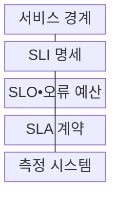
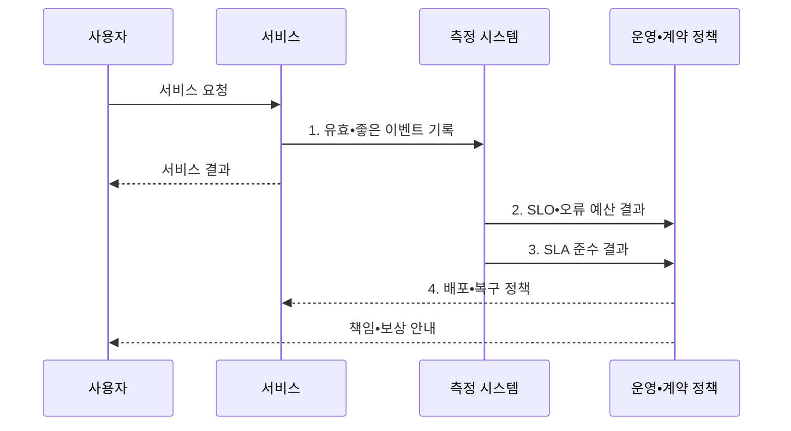

---
sidebar:
  order: 165
  label: "165. SLO•SLA•SLI (SLO•SLA•SLI)"
  badge:
    text: "기출 • 70%"
    variant: note
title: "SLO•SLA•SLI (SLO•SLA•SLI)"
date: "2026-08-03T09:14:20+09:00"
tags:
  - "notes-software"
weight: 165
extra:
  question_no: "165"
  source_status: "기출"
  source_history: "123회, 137회"
  priority: 70
  priority_note: "지표•목표•계약의 역할 구분 출제"
---

## Ⅰ. 개요

핵심 용어

- **서비스 수준 지표(Service Level Indicator, SLI)**: 사용자 관점에서 실제 서비스 품질을 측정한 값이다.
- **서비스 수준 목표(Service Level Objective, SLO)**: 서비스 수준 지표가 일정 기간 달성해야 할 내부 운영 목표이다.
- **서비스 수준 협약(Service Level Agreement, SLA)**: 제공자와 고객이 서비스 수준•제외 조건•미달 시 책임과 보상을 합의한 계약이다.

- 정의/개념: 서비스 수준의 **실측값•내부 목표•외부 계약 체계**
- 배경/필요성: 장비 지표만으로 **사용자 수준•운영 목표•계약 책임 구분 불가**

#### 한줄 요약

- 시험 점수가 SLI, 학교의 내부 합격선이 SLO, 학생과 미리 약속한 보상 기준이 SLA인 것처럼 같은 결과를 서로 다른 목적으로 사용한다.

## Ⅱ. 특징

핵심 용어

- **SLO•오류 예산**: SLO와 오류 예산은 허용 가능한 실패량을 정량화해 내부 배포와 복구 판단에 사용한다.
- **서비스 수준 지표(Service Level Indicator, SLI)**: 성공률•지연•신선도처럼 사용자 경험을 실제로 측정한 값이다.
- **서비스 수준 목표(Service Level Objective, SLO)•오류 예산**: 내부 목표와 목표가 허용하는 실패량으로 변경•복구 우선순위를 정하는 기준이다.
- **서비스 수준 협약(Service Level Agreement, SLA)•보상 조건**: 고객에게 약속한 수준과 미달 시 제공자가 부담할 책임을 정한 계약 기준이다.

- **SLI** 기반 사용자 경험 정량 측정
- **SLO•오류 예산** 기반 내부 운영 판단
- **SLA•보상 조건** 기반 외부 책임 확정

#### 한줄 요약

- 고객 약속을 어긴 뒤 대응하지 않도록 내부 SLO를 SLA보다 엄격하게 두면 오류 예산 소진 단계에서 먼저 복구와 배포 제한을 시작할 수 있다.

## Ⅲ. 구조 및 구성요소

핵심 용어

- **SLI 명세**: SLI 명세는 좋은 이벤트와 유효 이벤트, 측정 위치와 계산식을 명확하게 정의한다.
- **서비스 수준 지표(Service Level Indicator, SLI) 명세**: 좋은 이벤트와 유효 이벤트, 측정 위치와 계산식을 명확히 정의한 규격이다.
- **서비스 수준 목표(Service Level Objective, SLO)•오류 예산**: 내부 신뢰성 목표와 허용 실패량 및 변경 조치 기준을 정한 구성요소이다.
- **서비스 수준 협약(Service Level Agreement, SLA) 계약**: 외부 서비스 수준과 제외 조건•책임•보상을 합의한 구성요소이다.

| 구성요소 | 책임 |
|:---|:---|
| 서비스 경계 | 대상•사용자•**제외 범위 정의** |
| SLI 명세 | 좋은•유효 이벤트와 **측정식 정의** |
| SLO•오류 예산 | 내부 목표•**변경 조치 기준** |
| SLA 계약 | 외부 수준•**책임•보상 합의** |
| 측정 시스템 | 준수 결과•**측정 증빙 산출** |

#### 한줄 요약

- 먼저 어떤 요청을 잴지 정하고 같은 측정 결과를 내부 운영판과 고객 계약판에 각각 대조해야 계산 차이로 인한 분쟁을 막을 수 있다.

## Ⅳ. 흐름도

핵심 용어

- **1. 유효•좋은 이벤트 기록**: 서비스 요청을 유효 이벤트와 좋은 이벤트 기준으로 분류해 서비스 수준 계산의 원천 자료로 기록한다.
- **2. 서비스 수준 목표(Service Level Objective, SLO)•오류 예산 결과**: 내부 목표 대비 허용 실패량의 잔여분과 소진 속도를 계산한 결과이다.
- **3. 서비스 수준 협약(Service Level Agreement, SLA) 준수 결과**: 계약 기간과 제외 조건을 반영해 외부 약속 충족 여부를 판정한 결과이다.
- **4. 배포•복구 정책**: 남은 오류 예산과 소진율에 따라 변경 지속•제한•안정화 방향을 정한 정책이다.

**동작 원리**

1. **유효•좋은 이벤트 기록**: 성공•지연 기준별 결과 분류
2. **SLO•오류 예산 결과**: 내부 목표 대비 실패 여유 계산
3. **SLA 준수 결과**: 계약 기간•제외 조건 반영
4. **배포•복구 정책**: 남은 예산에 따라 변경 방향 결정

#### 한줄 요약

- 결제 요청을 성공과 실패로 기록한 한 자료에서 운영팀은 오류 예산을 계산하고 계약팀은 제외 조건을 적용해 보상 여부를 판단한다.

## Ⅴ. 종류 및 비교

핵심 용어

- **서비스 수준 지표(Service Level Indicator, SLI)**: 사용자 수준의 성공률•지연•신선도를 실제 측정한 값이다.
- **서비스 수준 목표(Service Level Objective, SLO)**: 일정 기간 서비스 수준 지표가 달성해야 할 내부 신뢰성 목표이다.
- **서비스 수준 협약(Service Level Agreement, SLA)**: 제공자와 고객이 서비스 수준, 제외 조건, 미달 시 책임과 보상을 합의한 계약이다.

| 서비스 수준 요소 | 역할 | 산출 결과 |
|:---|:---|:---|
| **SLI** | 성공률•지연•신선도의 **실제 측정** | 기간별 사용자 수준 값 |
| **SLO** | SLI가 달성할 **내부 신뢰성 목표** 설정 | 목표치와 **오류 예산** |
| **SLA** | 고객에게 보장할 수준과 제외 조건 합의 | 미달 시 **책임•보상** |

#### 한줄 요약

- SLI는 현재 상태를 말하고 SLO는 내부 행동을 정하며 SLA는 고객에게 책임질 선을 정하므로 숫자가 같아도 역할은 다르다.

## Ⅵ. 실무 고려사항 및 대책

핵심 용어

- **분모 왜곡**: 분모 왜곡은 재시도, 점검, 봇 요청의 포함 여부가 달라져 같은 서비스의 SLI 결과가 달라지는 문제다.
- **서비스 수준 지표(Service Level Indicator, SLI) 측정**: 사용자 요청 경계에서 좋은 이벤트 수를 유효 이벤트 수로 나눠 품질을 계산하는 활동이다.
- **서비스 수준 협약(Service Level Agreement, SLA) 측정 분쟁**: 원천 자료•계산식•제외 조건 차이로 계약 준수 결과가 달라지는 문제이다.

| 문제 | 대책 | 효과 |
|:---|:---|:---|
| 내부 지표와 **사용자 경험 불일치** | 사용자 요청 경계에서 **SLI 측정** | 실제 **서비스 영향 반영** |
| 재시도•점검의 **분모 왜곡** | 유효 이벤트•**제외 조건 명시** | 측정 결과 **재현성 확보** |
| 평균의 **느린 요청 은폐** | 지연 임계값별 **성공 비율 사용** | 꼬리 지연 **가시성 확보** |
| 과도한 **신뢰성 목표** | 기대•사업 영향•**비용 공동 검토** | 변경 정체•**비용 증가 방지** |
| SLA 미달 **측정 분쟁** | 원천 자료•계산식•**변경 이력 보존** | 보상 판단 **근거 확보** |

#### 한줄 요약

- 봇과 점검 요청을 분모에서 제외했다면 그 조건과 원천 자료를 보존해야 운영 계산과 고객 보상 계산이 같은 결과를 낸다.

## Ⅶ. 결론

핵심 용어

- **사용자 경계•대응 여유•계약 책임**: SLI, SLO, SLA는 사용자 측정 경계, 내부 대응 여유, 외부 계약 책임을 기준으로 일관되게 설정해야 한다.
- **서비스 수준 지표(Service Level Indicator, SLI)•서비스 수준 목표(Service Level Objective, SLO)•서비스 수준 협약(Service Level Agreement, SLA)**: 사용자 측정값, 내부 대응 목표, 외부 계약 책임을 구분한 서비스 수준 체계이다.

- **사용자 경계•대응 여유•계약 책임** 으로 SLI•SLO•SLA 설정

#### 한줄 요약

- 사용자 경험을 대표하는 SLI를 먼저 정하고 SLA 위반 전에 대응할 SLO 여유와 계약상 제외•보상 조건을 같은 측정 근거에 연결해야 한다.
