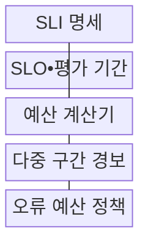
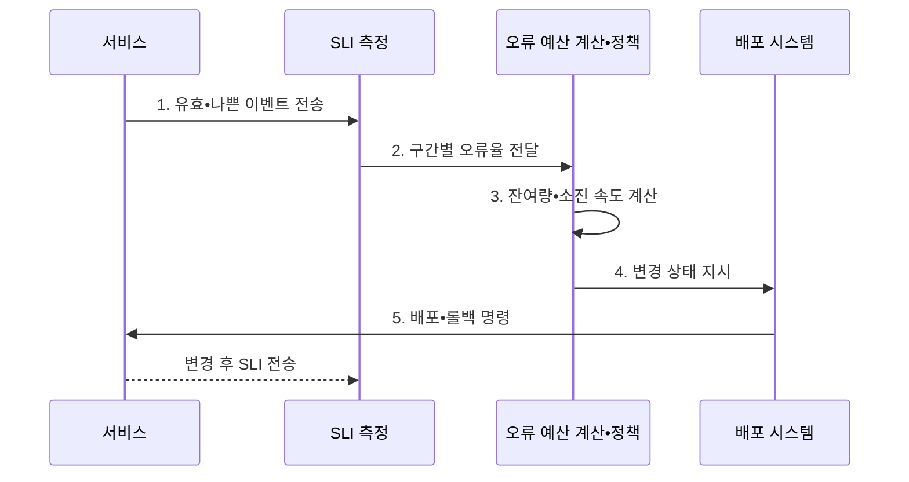

---
sidebar:
  order: 166
  label: "166. 오류 예산 (Error Budget)"
  badge:
    text: "기출 • 50%"
    variant: note
title: "오류 예산 (Error Budget)"
date: "2026-08-03T09:14:20+09:00"
tags:
  - "notes-software"
weight: 166
extra:
  question_no: "166"
  source_status: "기출"
  source_history: "137회"
  priority: 50
  priority_note: "신뢰성 목표와 변경 속도의 운영 판단 출제"
---

## Ⅰ. 개요

핵심 용어

- **오류 예산(Error Budget)**: 서비스 수준 목표가 허용한 실패량을 배포 변경과 안정화 작업의 우선순위 판단에 사용하는 운영 기준이다.
- **서비스 수준 목표(Service Level Objective, SLO)**: 일정 기간 서비스가 달성해야 할 사용자 관점의 신뢰성 목표이다.

- 정의/개념: 서비스 수준 목표(Service Level Objective, SLO)가 허용한 실패량을 변경•안정화 판단에 사용하는 **오류 예산(Error Budget)** 운영 기준
- 배경/필요성: 무장애 추구로는 **신뢰성 비용•변경 정체의 균형 판단 불가**

#### 한줄 요약

- 한 달에 허용할 실패 쿠폰을 정해 두고 빠르게 소비되면 새 기능보다 복구를 먼저 선택하는 운영 기준이다.

## Ⅱ. 특징

핵심 용어

- **단기•장기 소진 속도**: 단기와 장기 소진 속도를 함께 관찰하면 급격한 장애와 지속적인 악화를 구분해 탐지할 수 있다.
- **서비스 수준 지표(Service Level Indicator, SLI)•서비스 수준 목표(Service Level Objective, SLO)**: 실제 측정 품질과 목표 품질을 비교해 허용•사용•잔여 실패량을 계산하는 기준이다.
- **명시적 정책**: 오류 예산 상태별로 배포 지속•제한•롤백•안정화 행동을 미리 합의한 규칙이다.

> 파란 선은 30일을 가정할 때 99.9% SLO가 약 43.2분의 중단을 허용하며 SLO가 높아질수록 오류 예산이 급격히 작아지는 관계를 나타낸다.

- **SLO•실측 SLI** 기반 허용•사용•잔여량 계산
- **단기•장기 소진 속도** 기반 조기 위험 탐지
- **명시적 정책** 기반 배포•복구 우선순위 전환

#### 한줄 요약

- 남은 실패량만 보면 짧은 대형 장애를 늦게 알 수 있으므로 현재 소비 속도까지 함께 봐야 평가 기간이 끝나기 전에 목표 위반을 막을 수 있다.

## Ⅲ. 구조 및 구성요소

핵심 용어

- **예산 계산기**: 예산 계산기는 SLI와 SLO를 바탕으로 허용량, 사용량, 잔여량과 소진 속도를 산출한다.
- **서비스 수준 지표(Service Level Indicator, SLI) 명세**: 유효•좋은 이벤트와 측정 위치•계산식을 정의한 구성요소이다.
- **서비스 수준 목표(Service Level Objective, SLO)•평가 기간**: 목표 수준과 오류 예산을 계산할 시간 범위를 정하는 구성요소이다.
- **다중 구간 경보**: 짧은 구간과 긴 구간의 소진 속도를 함께 보아 급격•지속 악화를 탐지하는 구성요소이다.
- **오류 예산 정책**: 예산 상태에 따른 배포•롤백•안정화 조건을 정하는 구성요소이다.

| 구성요소 | 책임 |
|:---|:---|
| SLI 명세 | 유효•좋은 **이벤트•측정 위치 정의** |
| SLO•평가 기간 | 목표 수준•**오류 예산 범위 설정** |
| 예산 계산기 | 허용•사용•**잔여량•소진 속도 산출** |
| 다중 구간 경보 | 급격•지속 **예산 소진 탐지** |
| 오류 예산 정책 | **배포•롤백•안정화 조건** 결정 |

#### 한줄 요약

- SLI가 사용 내역, SLO가 월간 한도, 계산기가 잔액과 소비 속도, 정책이 잔액 상태별 행동표 역할을 한다.

## Ⅳ. 흐름도

핵심 용어

- **3. 잔여량•소진 속도 전달**: 계산한 누적 잔여량과 현재 소진 속도를 정책 계층에 전달해 목표 위반 위험과 긴급도를 판단한다.
- **1. 유효•나쁜 이벤트 전송**: 사용자 요청 중 측정 대상과 실패 결과를 서비스 수준 지표 측정 계층에 보내는 단계이다.
- **2. 구간별 오류율 전달**: 단기•장기 구간별 실패 비율을 오류 예산 계산 계층에 제공하는 단계이다.
- **4. 변경 상태 지시**: 예산 잔여량과 소진 속도에 따라 배포 지속•감속•안정화 전환을 결정하는 단계이다.
- **5. 배포•롤백 명령**: 정책 판단에 따라 변경을 실행하거나 이전 안정 버전으로 복구하는 단계이다.

**동작 원리**

1. **유효•나쁜 이벤트 전송**: 사용자 경계의 실패 결과 수집
2. **구간별 오류율 전달**: 단기•장기 실패 추세 계산
3. **잔여량•소진 속도 전달**: 누적 상태•긴급도 산출
4. **변경 상태 지시**: 배포 지속•감속•안정화 전환
5. **배포•롤백 명령**: 정책 상태에 따른 변경•복구 실행

#### 한줄 요약

- 최근 배포 뒤 결제 실패 속도가 급증하면 계산기가 조기 위험을 알리고 정책이 신규 배포를 줄인 뒤 이전 버전으로 복구하게 한다.

## Ⅴ. 종류 및 비교

핵심 용어

- **소진 속도**: 소진 속도는 관측 오류율을 SLO의 허용 오류율로 나눠 예산 소비의 현재 긴급도를 나타낸다.
- **소진 비율**: 평가 기간에 허용된 전체 오류 예산 중 현재까지 사용한 누적 비율이다.
- **서비스 수준 목표(Service Level Objective, SLO) 허용 오류율**: 목표 성공률의 여집합으로 계산한 허용 실패 비율이다.

| 예산 지표 | 소진 비율 | 소진 속도 |
|:---|:---|:---|
| 적용 기준 | 평가 기간의 **누적 사용량** | 목표 위반의 **현재 긴급도** |
| 핵심 특징 | 사용 예산•**잔여 예산 계산** | 허용 오류율 대비 **배수 계산** |
| 한계 | 급격한 장애의 **탐지 지연** | 짧은 변동의 **과잉 반응** |

#### 한줄 요약

- 소진 비율은 이번 달에 쓴 쿠폰 수를 보여 주고 소진 속도는 지금 속도로 쓰면 언제 쿠폰이 바닥날지를 알려 준다.

## Ⅵ. 실무 고려사항 및 대책

핵심 용어

- **위험 은폐**: 위험 은폐는 평가 기간이 초기화되면서 반복 장애와 장기 악화 추세가 새 예산 뒤에 가려지는 문제다.
- **이동 구간•장기 추세**: 고정 평가 기간 초기화와 무관하게 최근 일정 구간과 여러 기간의 악화를 연속 관찰하는 기준이다.
- **보안•복구 예외 승인**: 예산 소진 상태에서도 긴급 보안 패치나 장애 복구 변경을 허용하는 명시적 절차이다.

| 문제 | 대책 | 효과 |
|:---|:---|:---|
| 느슨한 SLO의 **장애 정상화** | 기대•사업 영향으로 **목표 검증** | 예산의 **판단력 확보** |
| 트래픽 변화의 **건수 왜곡** | 비율•건수•**영향 사용자 병행** | 실제 **피해 규모 반영** |
| 단일 구간의 **악화 누락** | 단기•장기 **소진 속도 경보 결합** | 급격•지속 **위험 탐지** |
| 예산 소진의 **일괄 변경 차단** | 보안•복구 **예외 승인 명시** | 경직된 **정책 방지** |
| 기간 초기화의 **위험 은폐** | 이동 구간•**장기 추세 병행** | 반복 **장애 누적 확인** |

#### 한줄 요약

- 월초에 예산이 다시 생겼다고 장애 원인이 사라지는 것은 아니므로 이동 구간의 소진 추세와 지난 기간의 반복 원인을 함께 확인해야 한다.

## Ⅶ. 결론

핵심 용어

- **사용자 영향•소진 속도•변경 위험**: 배포, 롤백, 안정화 여부는 사용자 영향, 예산 소진 속도, 변경 위험을 함께 고려해 결정해야 한다.

- **사용자 영향•소진 속도•변경 위험** 으로 배포•롤백•안정화 결정

#### 한줄 요약

- 예산 여유는 반드시 소비할 할당량이 아니며 빠른 소진은 사용자 피해를 줄이는 복구와 안정화로 우선순위를 바꾸는 신호다.
