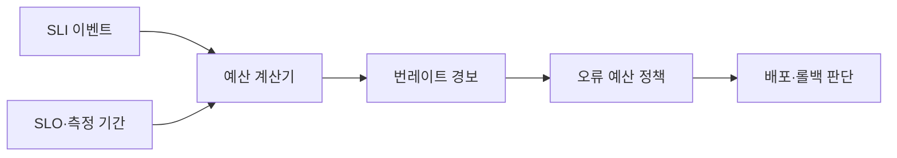
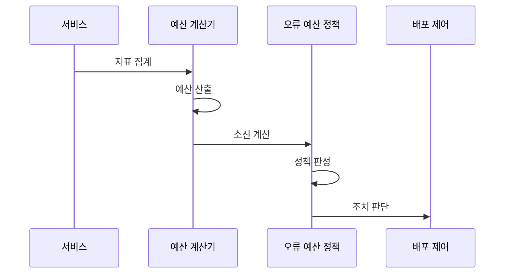

---
sidebar:
  order: 166
  label: "166. 오류 예산 (Error Budget)"
  badge:
    text: "기출 · 50%"
    variant: note
title: "오류 예산 (Error Budget)"
date: "2026-07-27T23:59:59+09:00"
tags:
  - "notes-software"
weight: 166
extra:
  question_no: "166"
  source_status: "기출"
  source_history: "137회"
  priority: 50
  priority_note: "신뢰성 목표와 변경 속도를 잇는 운영 판단임"
---

## 미리 알고가기

- **오류 예산**: 서비스 수준 목표 SLO가 정한 기간에 허용하는 실패 비율 또는 실패 이벤트 수임
- **서비스 수준 목표 SLO(에스엘오, Service Level Objective)**: 영어 세 낱말의 첫 글자를 쓴 표기로 99.9%이면 같은 측정 기간의 오류 예산 비율은 0.1%임
- **서비스 수준 지표 SLI(에스엘아이, Service Level Indicator)**: 영어 세 낱말의 첫 글자를 쓴 표기로 사용자 관점의 성공률·지연 같은 서비스 동작 측정값임
- **`1−SLO`(일 마이너스 에스엘오)**: 전체 비율 1에서 목표 비율 SLO를 뺀 표기로 오류 예산 비율을 산출해 허용 실패량을 정함
- **좋은 이벤트와 나쁜 이벤트**: 기준을 지킨 요청과 기준을 벗어난 요청을 나누어 오류 비율을 셈
- **소진율**: 허용 실패량 중 실제 실패가 사용한 비율임
- **예산 소진 속도(Burn Rate)**: ‘번 레이트’로 읽고 예산이 타서 줄어드는 속도에 빗댄 명칭이며, 관측 구간의 오류 예산 소진 속도를 SLO 허용 속도와 비교한 값
- **오류 예산 정책**: 잔여량·소진 속도에 따른 배포·복구·신뢰성 작업 조건을 정함
- **롤백**: 문제가 생긴 변경을 이전 정상 버전으로 되돌리는 복구 방식임

## Ⅰ. 개요

- **정의/개념**: SLO가 허용한 **실패 비율·이벤트·시간**
- **기존 한계**: 무장애 지향은 **변경 정체·과잉 신뢰성 비용** 유발

### 쉽게 이해하기 (학습용)
- 쓸 수 있는 실패 용돈으로 운영을 제어함

## Ⅱ. 특징

- 오류 예산은 **$1-SLO$·허용 실패량**으로 산출
- **소진율·번레이트**로 사용량·소진 속도 측정
- 예산 상태를 **배포·롤백·복구 전환 조건**으로 사용

### 쉽게 이해하기 (학습용)
- 실패 횟수와 소비 속도를 계산해 관리함

## Ⅲ. 아키텍처 및 구성요소

| 설계 요소 | 설명 |
|:---|:---|
| SLI 이벤트 | **좋은·유효 이벤트·측정 위치** 정의 |
| SLO·측정 기간 | **목표 비율·계산 범위** 설정 |
| 예산 계산기 | **허용 실패량·잔여 예산** 계산 |
| 번레이트 경보 | 소진 속도를 **정책 임계값**과 비교 |
| 오류 예산 정책 | 상태별 **배포·롤백·복구** 결정 |

> 요약: 실패량을 허용량과 비교해 정책을 결정함

### 쉽게 이해하기 (학습용)
- 계량기와 경보 및 규칙이 운영 결정을 내림

## Ⅳ. 원리 및 절차 흐름도

| 절차 | 설명 |
|:---|:---|
| 지표 집계 | 측정 기간의 **유효·실패 이벤트** 집계 |
| 예산 산출 | SLO로 **허용 실패량** 계산 |
| 소진 계산 | **잔여 예산·번레이트** 산출 |
| 정책 판정 | 잔여량·속도를 **정책 임계값**과 비교 |
| 조치 판단 | **배포 지속·중단·롤백** 결정 |

> 요약: 예산 소진 속도를 계산해 변경 정책을 집행함

### 쉽게 이해하기 (학습용)
- 돈이 줄어드는 속도에 맞춰 규칙을 실행함

## Ⅴ. 종류 및 비교

| 오류 예산 상태 | 정상 소진 | 소진 가속 | 예산 소진 |
|:---|:---|:---|:---|
| 적용 기준 | 잔여량·속도가 **정책 범위 이내** | 번레이트가 **경보 임계 초과** | 허용 실패량 **전부 소진** |
| 핵심 특징 | **배포 지속·상시 개선** | **배포 감속·원인 완화** | **신규 배포 중단·복구** |
| 한계 | 예산 과대 설정·**위험 누적** | 늦은 완화·**실패 확대** | 과도한 동결·**기능 전달 지연** |

> 요약: 예산 잔여량과 속도가 우선순위를 결정함

### 쉽게 이해하기 (학습용)
- 용돈이 남으면 배포하고 소진 시 멈춤

## Ⅵ. 실무 사례

1. API는 **번레이트 경보**로 배포 감속·롤백
2. 데이터 처리는 **예산 소진** 시 신규 변경 중단

### 쉽게 이해하기 (학습용)
- API는 번레이트 상승 시 배포를 되돌림
- 데이터 처리는 예산 소진 시 변경을 멈춤

## Ⅶ. 결론

- 예산 정상은 **배포**, 가속은 **감속**, 소진은 **중단**

### 쉽게 이해하기 (학습용)
- 실패가 빨리 늘면 신규 기능보다 복구를 먼저 함
