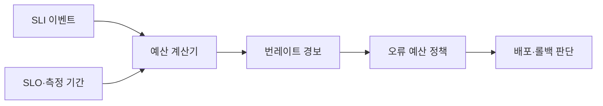

---
sidebar:
  order: 166
  label: "166. 오류 예산 (Error Budget)"
  badge:
    text: "기출 · 50%"
    variant: note
title: "오류 예산 (Error Budget)"
date: "2026-07-25T00:40:00+09:00"
tags:
  - "notes-software"
weight: 166
extra:
  question_no: "166"
  source_status: "기출"
  source_history: "137회"
  priority: 50
  priority_note: "신뢰성 목표와 변경 속도를 잇는 운영 판단임"
---

## 미리 알고가기

- **오류 예산**: 서비스 수준 목표 SLO가 정한 기간에 허용하는 실패 비율 또는 실패 이벤트 수임
- **서비스 수준 목표 SLO(에스엘오, Service Level Objective)**: 영어 세 낱말의 첫 글자를 쓴 표기로 99.9%이면 같은 측정 기간의 오류 예산 비율은 0.1%임
- **서비스 수준 지표 SLI(에스엘아이, Service Level Indicator)**: 영어 세 낱말의 첫 글자를 쓴 표기로 사용자 관점의 성공률·지연 같은 서비스 동작 측정값임
- **`1−SLO`(일 마이너스 에스엘오)**: 전체 비율 1에서 목표 비율 SLO를 뺀 표기로 오류 예산 비율을 산출해 허용 실패량을 정함
- **좋은 이벤트와 나쁜 이벤트**: 기준을 지킨 요청과 기준을 벗어난 요청을 나누어 오류 비율을 셈
- **소진율**: 허용 실패량 중 실제 실패가 사용한 비율임
- **번레이트**: 관측 구간의 오류 예산 소진 속도를 SLO 기간의 허용 속도와 비교한 값임
- **오류 예산 정책**: 잔여량·소진 속도에 따른 배포·복구·신뢰성 작업 조건을 정함
- **롤백**: 문제가 생긴 변경을 이전 정상 버전으로 되돌리는 복구 방식임

## Ⅰ. 개요

- **정의/개념**: 허용 가능한 시스템 장애 시간을 수치화한 지표임
- **배경/필요성**: 배포 속도·신뢰성 상충으로 오류 예산 필요

### 쉽게 이해하기 (학습용)
- 쓸 수 있는 실패 용돈으로 운영을 제어함

## Ⅱ. 특징

- 오류 예산 비율은 $1-SLO$로 계산한다.
- 예산은 실패 비율을 곱해 실패 횟수로 구한다.
- 소진율은 사용량을, 번레이트는 속도를 나타낸다.
- 소진 상태를 배포·복구 전환 조건으로 쓴다.

### 쉽게 이해하기 (학습용)
- 실패 횟수와 소비 속도를 계산해 관리함

## Ⅲ. 아키텍처 및 구성요소

| 설계 요소 | 설명 |
|:---|:---|
| SLI 이벤트 | 좋은 이벤트·유효 이벤트와 측정 위치를 정의함 |
| SLO·측정 기간 | 목표 비율과 예산 계산 범위를 설정함 |
| 예산 계산기 | 허용 실패량과 잔여 예산을 실시간 계산함 |
| 번레이트 경보·보고 | 소진 속도를 정책과 비교하고 상태를 알림 |
| 오류 예산 정책 | 상태별 배포와 롤백 및 신뢰성 작업을 정함 |

> 요약: 실패량을 허용량과 비교해 정책을 결정함

### 쉽게 이해하기 (학습용)
- 계량기와 경보 및 규칙이 운영 결정을 내림

## Ⅳ. 원리 및 절차 흐름도

| 절차 | 설명 |
|:---|:---|
| **지표집계** | 측정 기간 동안의 요청과 성공을 집계함 |
| **예산산출** | 목표율 대비 허용 가능한 실패량을 계산함 |
| **소진계산** | 잔여 예산과 소진 속도를 실시간 산출함 |
| **정책판정** | 예산 잔여량과 변경 적용 정책을 비교함 |
| **조치판단** | 배포를 제한하거나 복구 작업을 결정함 |

> 요약: 예산 소진 속도를 계산해 변경 정책을 집행함

### 쉽게 이해하기 (학습용)
- 돈이 줄어드는 속도에 맞춰 규칙을 실행함

## Ⅴ. 종류 및 비교

| 비교축 | 정상 소진 | 소진 가속 | 예산 소진 |
|:---|:---|:---|:---|
| 핵심 특징 | 잔여량과 속도가 정상 범위에 있음 | 예산이 빠르게 소비되어 임계를 넘음 | 예산이 소진되고 에러 경보가 발생함 |
| 적용 기준 | 실패량 내에서 운영하여 배포할 때 | 장애 증가로 빈도를 줄이고 롤백 시 | 예산 소진으로 신규 배포를 중단할 때 |
| 주요 위험 | 예산 과대 설정·위험 누적 | 늦은 감속·배포 실패 확대 | 과도한 동결·기능 전달 지연 |

> 요약: 예산 잔여량과 속도가 우선순위를 결정함

### 쉽게 이해하기 (학습용)
- 용돈이 남으면 배포하고 소진 시 멈춤

## Ⅵ. 실무 사례

1. API는 예산 번레이트로 배포를 조정함
2. 데이터 처리는 예산 소진 시 변경을 멈춤

### 쉽게 이해하기 (학습용)
- API는 번레이트 상승 시 배포를 되돌림
- 데이터 처리는 예산 소진 시 변경을 멈춤

## Ⅶ. 결론

- 번레이트가 임계를 넘으면 배포를 줄이거나 되돌림

### 쉽게 이해하기 (학습용)
- 실패가 빨리 늘면 신규 기능보다 복구를 먼저 함
