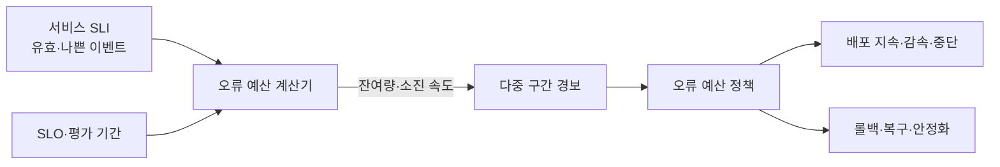
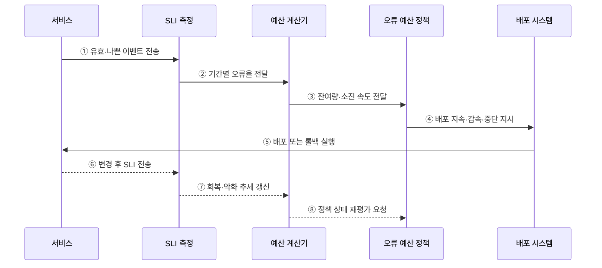

---
sidebar:
  order: 166
  label: "166. 오류 예산 (Error Budget)"
  badge:
    text: "기출 · 50%"
    variant: note
title: "오류 예산 (Error Budget)"
date: "2026-07-27T23:59:59+09:00"
tags:
  - "notes-software"
weight: 166
extra:
  question_no: "166"
  source_status: "기출"
  source_history: "137회"
  priority: 50
  priority_note: "신뢰성 목표와 변경 속도를 잇는 운영 판단임"
---

## 미리 알고가기

- **오류 예산(Error Budget)**: SLO가 정한 기간에 허용하는 실패 비율·이벤트 수·시간
- **서비스 수준 목표(Service Level Objective, SLO·에스엘오)**: 일정 기간에 서비스 수준 지표가 달성해야 하는 목표치
- **서비스 수준 지표(Service Level Indicator, SLI·에스엘아이)**: 성공률·지연처럼 사용자가 체감하는 서비스 수준의 측정값
- **좋은 이벤트·유효 이벤트**: 좋은 이벤트는 목표 기준을 충족한 요청이고, 유효 이벤트는 제외 조건을 뺀 전체 측정 대상 요청
- **소진 비율**: 실제 나쁜 이벤트 수를 허용 나쁜 이벤트 수로 나눈 오류 예산 사용량
- **소진 속도(Burn Rate)**: 관측 오류율을 SLO가 허용한 오류율로 나눈 값
- **오류 예산 정책**: 잔여량·소진 속도에 따른 배포·복구·신뢰성 작업 조건
- **롤백(Rollback)**: 문제가 발생한 변경을 이전 정상 버전으로 되돌리는 복구 방식

## Ⅰ. 개요

- 오류 예산은 SLO가 허용한 실패를 **변경과 신뢰성 투자의 공통 단위**로 바꾼다.
- 오류 예산 비율은 `1 - SLO`, 허용 실패 이벤트 수는 `유효 이벤트 수 × (1 - SLO)`로 계산한다.
- 무조건 무장애를 추구할 때 발생하는 변경 정체와 과잉 신뢰성 비용을 줄인다.

### 쉽게 이해하기 (학습용)
- 목표를 지키면서 사용할 수 있는 실패 여유임

## Ⅱ. 특징

- **정량성**: SLO와 실측 SLI로 허용량·사용량·잔여량을 계산한다.
- **속도성**: 소진 속도로 평가 기간이 끝나기 전의 위반 위험을 조기에 탐지한다.
- **정책성**: 예산 상태를 배포·롤백·안정화 작업의 전환 조건으로 사용한다.
- **균형성**: 예산 여유 시 변경을 허용하고, 급격한 소진 시 신뢰성 회복을 우선한다.
- **공동 책임**: 개발·운영·제품 조직이 같은 수치로 우선순위를 합의한다.

### 쉽게 이해하기 (학습용)
- 실패량뿐 아니라 실패가 늘어나는 속도까지 보고 대응함

## Ⅲ. 아키텍처 및 구성요소

**도표안 A — 구조도**

**도표안 B — sequenceDiagram**

| 구성요소 | 역할 |
|:---|:---|
| SLI 명세 | 좋은 이벤트·유효 이벤트·측정 위치 정의 |
| SLO·평가 기간 | 목표 서비스 수준과 오류 예산 범위 설정 |
| 예산 계산기 | 허용량·사용량·잔여량·소진 속도 산출 |
| 다중 구간 경보 | 짧은 구간의 급격한 소진과 긴 구간의 지속 악화 탐지 |
| 오류 예산 정책 | 상태별 배포·롤백·복구·예외 승인 조건 결정 |
| 배포 시스템 | 정책에 따른 변경 진행·감속·중단·복귀 실행 |

**동작 원리**

- ① 서비스의 유효 이벤트와 목표를 벗어난 나쁜 이벤트를 수집한다.
- ② SLI 측정 계층이 짧은 구간과 긴 구간의 오류율을 예산 계산기에 전달한다.
- ③ 계산기는 허용 오류율과 실측 오류율로 잔여량과 소진 속도를 산출한다.
- ④ 오류 예산 정책은 정상·가속·소진 상태에 맞는 배포 조치를 지시한다.
- ⑤ 배포 시스템은 변경을 진행하거나 감속하고, 필요하면 롤백한다.
- ⑥ 서비스는 변경·복구 이후의 SLI를 다시 전송한다.
- ⑦ 측정 계층은 오류율의 회복 또는 악화 추세를 갱신한다.
- ⑧ 계산 결과를 정책에 다시 반영해 조치의 유지·해제를 결정한다.

### 쉽게 이해하기 (학습용)
- 실패 여유의 잔량과 감소 속도를 계속 재서 배포 정책을 바꿈

## Ⅳ. 종류 및 비교

| 상태 | 정상 소진 | 소진 가속 | 예산 소진 |
|:---|:---|:---|:---|
| 판단 | 잔여량·속도가 정책 범위 이내 | 소진 속도가 경보 임계 초과 | 허용 실패량 대부분 또는 전부 사용 |
| 변경 | 계획된 배포 지속 | 고위험 배포 감속·승인 강화 | 신규 변경 중단 원칙 |
| 신뢰성 작업 | 상시 개선 | 원인 제거·용량·경보 점검 | 복구·롤백·재발 방지 최우선 |
| 위험 | 느슨한 SLO로 위험 누적 | 늦은 대응으로 예산 급감 | 장기 동결로 기능 전달 지연 |

| 지표 | 소진 비율 | 소진 속도 |
|:---|:---|:---|
| 의미 | 허용 실패량 중 이미 사용한 비율 | 허용 속도보다 몇 배 빠르게 실패하는지 |
| 용도 | 평가 기간의 누적 상태 | 조기 경보와 대응 긴급도 |

### 쉽게 이해하기 (학습용)
- 남은 양은 누적 상태를, 줄어드는 속도는 대응 긴급도를 알려 줌

## Ⅴ. 실무 고려사항 및 대책

| 고려사항 | 위험 | 대책 |
|:---|:---|:---|
| SLO 품질 | 느슨한 목표는 장애를 정상으로 취급 | 사용자 기대·사업 영향으로 SLO 검증 |
| 분모 변화 | 트래픽 증감으로 실패 건수 해석 왜곡 | 비율·건수·영향 사용자 수 함께 확인 |
| 단일 구간 경보 | 짧은 급증 또는 느린 악화 누락 | 짧은·긴 관측 구간을 결합한 소진율 경보 |
| 정책 경직성 | 예산 소진 즉시 모든 변경을 차단 | 긴급 보안·복구 변경의 예외와 승인 절차 명시 |
| 책임 편향 | 운영팀만 실패 비용 부담 | 개발·제품 조직과 오류 예산 정책 공동 소유 |
| 예산 초기화 | 기간 경계에서 위험이 사라진 것으로 오인 | 이동 평가 구간과 추세를 함께 확인 |

### 쉽게 이해하기 (학습용)
- 사례: API 오류가 허용 속도보다 급증하면 신규 배포를 멈추고 최근 변경을 롤백함

## Ⅵ. 결론

- 오류 예산의 핵심은 **허용 실패를 잔여량과 소진 속도로 측정해 운영 행동과 연결**하는 것이다.
- 예산 여유는 무조건 사용해야 할 할당량이 아니며, 소진은 모든 변경을 금지하는 절대 규칙도 아니다.
- 사용자 영향·복구 가능성·변경 위험을 함께 검토하는 명시적 정책이 신뢰성과 전달 속도의 균형을 만든다.

### 쉽게 이해하기 (학습용)
- 실패 여유가 빠르게 줄면 새 기능보다 복구와 안정화를 먼저 함
