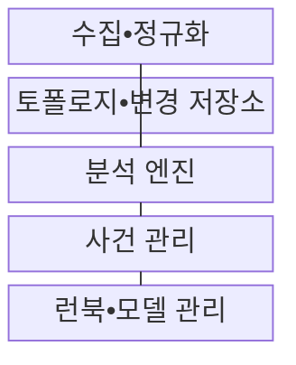
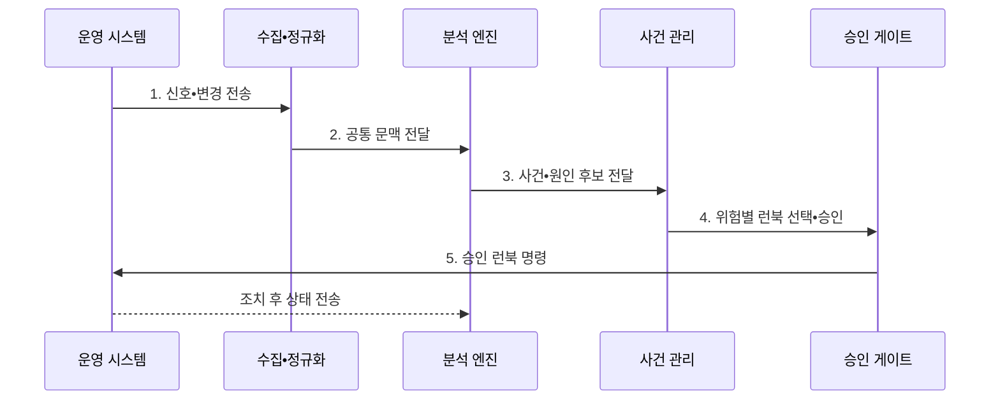

---
sidebar:
  order: 167
  label: "167. AIOps (Artificial Intelligence for IT Operations)"
  badge:
    text: "기출 • 70%"
    variant: note
title: "AIOps (Artificial Intelligence for IT Operations)"
date: "2026-08-04T14:38:47+09:00"
tags:
  - "notes-software"
weight: 167
extra:
  question_no: "167"
  source_status: "기출"
  source_history: "137회"
  priority: 70
  priority_note: "이상 탐지•사건 상관•자동 대응 구조 출제"
---

## Ⅰ. 개요

핵심 용어

- **인공지능 기반 정보기술 운영(Artificial Intelligence for IT Operations, AIOps)**: 운영 신호를 분석해 이상 상태•연관 사건•원인과 대응 후보를 도출하는 운영 지능화 체계이다.

- 정의/개념: 운영 신호를 분석해 **이상•사건•대응 후보를 도출하는 운영 지능화 체계**
- 배경/필요성: 개별 임계치•수동 분석으로는 **경보 폭주의 공통 원인 식별 지연**

#### 한줄 요약

- 배포 직후 여러 파드에서 경보가 쏟아지면 공통 변경과 의존 관계를 보고 하나의 장애 사건으로 묶어 먼저 확인할 원인과 조치를 제시한다.

## Ⅱ. 특징

핵심 용어

- **분석 신뢰도**: 원인과 조치 후보가 맞을 확률을 나타내는 값이다.
- **조치 위험**: 자동 조치 실패 시 발생할 사용자 영향이다.
- **다중 운영 신호**: 로그•지표•추적•변경 사건을 결합한 입력이다.
- **공통 문맥**: 신호를 시간•자원•서비스 관계로 정렬한 정보이다.
- **이상 탐지**: 정상 패턴에서 벗어난 운영 신호를 찾는 분석이다.
- **상관 분석**: 여러 신호의 동시 변화 관계를 찾는 분석이다.
- **토폴로지 분석**: 서비스 의존 관계로 원인 후보를 줄이는 분석이다.

- **다중 운영 신호•공통 문맥** 기반 분석
- **이상•상관•토폴로지** 기반 원인 후보 압축
- **신뢰도•조치 위험** 기반 단계 자동화

#### 한줄 요약

- AI가 확정 원인을 선언하는 것이 아니라 시간, 대상, 변경 관계가 맞는 증거를 모아 운영자가 볼 후보 수를 줄이는 방식이다.

## Ⅲ. 구조 및 구성요소

핵심 용어

- **분석 엔진**: 분석 엔진은 정규화된 신호와 토폴로지•변경 정보를 결합해 이상, 사건, 원인 후보를 산출한다.
- **수집 계층**: 운영 신호를 분석 계층으로 가져오는 구성요소이다.
- **정규화 계층**: 신호 형식•시간•자원 식별자를 통일하는 구성요소이다.
- **토폴로지 저장소**: 서비스 의존 관계를 보존하는 구성요소이다.
- **변경 저장소**: 배포•설정 변경 이력을 보존하는 구성요소이다.
- **사건 관리**: 사용자 영향과 분석 신뢰도로 사건의 대응 우선순위를 결정하는 구성요소이다.
- **런북 관리**: 승인된 대응 절차와 실행 결과를 관리하는 구성요소이다.
- **모델 관리**: 학습 피드백과 모델 판본을 관리하는 구성요소이다.

| 구성요소 | 책임 |
|:---|:---|
| 수집•정규화 | 신호 형식•시간•**자원 식별자 통일** |
| 토폴로지•변경 저장소 | **서비스 의존성•변경 이력** 제공 |
| 분석 엔진 | 이상•상관•**원인 후보 산출** |
| 사건 관리 | 영향•신뢰도•**대응 우선순위 결정** |
| 런북•모델 관리 | 대응 실행•**결과 피드백•검증** |

#### 한줄 요약

- 수집 계층이 서로 다른 경보의 주소를 맞추고 분석 엔진이 관계를 묶으면 사건 관리가 사용자 영향에 따라 순서를 정하고 런북이 제한된 조치를 실행한다.

## Ⅳ. 흐름도

핵심 용어

- **5. 승인 런북 명령**: 승인된 런북으로 가역 조치를 실행한 뒤 서비스 회복과 부작용 여부를 다시 검증한다.
- **1. 신호•변경 전송**: 로그•지표•추적과 배포•설정 변경 사건을 수집 계층에 보내는 단계이다.
- **2. 공통 문맥 전달**: 시간•자원 식별자•토폴로지를 정렬한 분석 입력을 제공하는 단계이다.
- **3. 사건•원인 후보 전달**: 이상•중복•변경 관계를 분석해 압축한 사건과 원인 후보를 사건 관리에 넘기는 단계이다.
- **4. 위험별 런북 선택•승인**: 사용자 영향•분석 신뢰도•조치 가역성으로 실행 수준을 정하는 단계이다.

**동작 원리**

1. **신호•변경 전송**: 로그•지표•추적•배포 사건 수집
2. **공통 문맥 전달**: 시간•자원•토폴로지 정렬
3. **사건•원인 후보 전달**: 이상•중복•변경 관계 분석
4. **위험별 런북 선택•승인**: 영향•신뢰도 기반 실행 단계 결정
5. **승인 런북 명령**: 가역 조치 후 회복•부작용 검증

#### 한줄 요약

- 새 버전 배포 뒤 오류와 지연이 함께 늘면 하나의 사건으로 묶고 신뢰도가 높을 때만 승인된 롤백 런북을 실행한 뒤 회복 여부를 다시 측정한다.

## Ⅴ. 종류 및 비교

핵심 용어

- **학습 기반 분석**: 패턴•상관•토폴로지로 낯선 관계를 탐색하는 방식이다.
- **규칙 기반 분석(Rule-Based Analysis)**: 고정 임계값과 명시 조건으로 이미 알려진 장애 패턴을 탐지하는 방식이다.

| 운영 분석 방식 | 규칙 기반 | AIOps |
|:---|:---|:---|
| 적용 기준 | 알려진 장애•**안전 조건** | 대량 신호•**낯선 관계 탐색** |
| 핵심 특징 | 고정 임계치•**명시 규칙** | 학습 패턴•**상관•토폴로지** |
| 한계 | 규칙 증가•**환경 변화 누락** | 편향•드리프트•**설명 부족** |

#### 한줄 요약

- 규칙은 이미 아는 온도선을 넘었는지 찾고 AIOps는 여러 신호가 함께 변한 패턴과 최근 변경을 조합해 낯선 사건을 찾는다.

## Ⅵ. 실무 고려사항 및 대책

핵심 용어

- **모델 드리프트**: 모델 드리프트는 환경과 데이터 분포의 변화로 기존 모델의 오탐과 미탐이 증가하는 현상이다.
- **자원 식별자(Resource Identifier, Resource ID)**: 서로 다른 운영 신호가 같은 인프라•서비스 대상을 가리키도록 통일한 식별값이다.
- **가역 조치**: 오판이나 부작용이 생겨도 이전 상태로 되돌릴 수 있는 재시작•롤백 같은 대응이다.
- **라벨 품질 검사**: 운영자 판정이 학습 정답으로 적절한지 다중 검토와 일관성 기준으로 확인하는 활동이다.

| 문제 | 대책 | 효과 |
|:---|:---|:---|
| 시간•식별자의 **데이터 불일치** | 스키마 검증•**시간•자원 ID 통일** | 잘못된 **사건 상관 감소** |
| 환경 변화의 **모델 드리프트** | 기준 성능 감시•**주기 검증•재학습** | **오탐•미탐** 증가 억제 |
| 근거 없는 **원인 추천** | 관련 신호•변경•**토폴로지 제시** | 운영자 **판단 신뢰 확보** |
| 오판 자동화의 **장애 확산** | 고신뢰•저위험•**가역 조치 우선** | 자동화 **피해 범위 축소** |
| 운영자 판정의 **피드백 편향** | 다중 검토•**라벨 품질 검사** | 잘못된 **학습 누적 방지** |

#### 한줄 요약

- 모델 신뢰도가 높아도 데이터베이스 삭제처럼 되돌리기 어려운 조치는 추천에 머물고 재시작이나 롤백처럼 복구 가능한 조치부터 자동화해야 한다.

## Ⅶ. 결론

핵심 용어

- **자동화 수준**: 영향•신뢰도•가역성에 따른 추천•승인•자동 실행 단계이다.

- **영향•신뢰도•가역성** 으로 추천•승인•자동 실행 결정

#### 한줄 요약

- AIOps는 증거가 있는 원인 후보를 압축하고 고신뢰•저위험•가역 조치만 제한적으로 자동 실행하며 결과를 다시 검증해야 한다.
