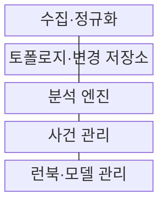
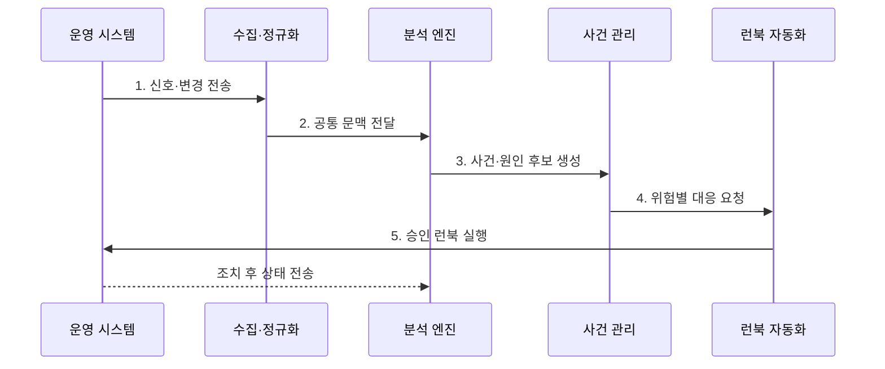

---
sidebar:
  order: 167
  label: "167. AIOps (Artificial Intelligence for IT Operations)"
  badge:
    text: "기출 · 70%"
    variant: note
title: "AIOps (Artificial Intelligence for IT Operations)"
date: "2026-07-30T20:00:00+09:00"
tags:
  - "notes-software"
weight: 167
extra:
  question_no: "167"
  source_status: "기출"
  source_history: "137회"
  priority: 70
  priority_note: "이상 탐지·사건 상관·자동 대응 구조 출제"
---

## 미리 알고가기

- **인공지능 기반 IT 운영(Artificial Intelligence for IT Operations, AIOps)**: 기계학습과 데이터 분석으로 운영 이상·사건 관계·대응 후보를 찾는 체계
- **이상 탐지(Anomaly Detection)**: 학습한 정상 범위나 임계치를 벗어난 시계열·로그·이벤트를 식별하는 분석
- **이벤트 상관(Event Correlation)**: 시간·서비스 의존성·공통 변경으로 여러 경보를 하나의 사건 후보로 묶는 분석
- **토폴로지(Topology)**: 서비스·파드·노드·데이터베이스 사이의 의존 관계
- **변경 이벤트(Change Event)**: 배포·설정·용량 변경처럼 장애 원인 후보가 될 수 있는 운영 기록
- **런북(Runbook)**: 확인·완화·복구 절차와 실행 조건을 정리한 운영 절차서
- **모델 드리프트(Model Drift)**: 운영 환경이나 데이터 분포가 변해 모델의 탐지 성능이 낮아지는 현상
- **오탐·미탐(False Positive·False Negative)**: 정상 상태를 이상으로 판단하는 오류와 실제 이상을 놓치는 오류
- **가역 조치(Reversible Action)**: 예상과 다른 결과가 나면 이전 상태로 되돌릴 수 있는 대응

## Ⅰ. 개요

- 정의/개념: 운영 신호 기반 **이상·사건·대응 후보 분석**
- 배경/필요성: 경보 폭주와 수동 원인 분석의 **대응 지연 축소**

### 쉽게 이해하기 (학습용)

- 배포 직후 여러 파드에서 경보가 쏟아지면 공통 변경과 의존 관계를 보고 하나의 장애 사건으로 묶어 먼저 확인할 원인과 조치를 제시한다.

## Ⅱ. 특징

- **다중 운영 신호·공통 문맥** 기반 분석
- **이상·상관·토폴로지** 기반 원인 후보 압축
- **신뢰도·조치 위험** 기반 단계 자동화

### 쉽게 이해하기 (학습용)

- AI가 확정 원인을 선언하는 것이 아니라 시간, 대상, 변경 관계가 맞는 증거를 모아 운영자가 볼 후보 수를 줄이는 방식이다.

## Ⅲ. 구조 및 구성요소

| 구성요소 | 책임 |
|:---|:---|
| 수집·정규화 | 신호 형식·시간·**자원 식별자 통일** |
| 토폴로지·변경 저장소 | **서비스 의존성·변경 이력** 제공 |
| 분석 엔진 | 이상·상관·**원인 후보 산출** |
| 사건 관리 | 영향·신뢰도·**대응 우선순위 결정** |
| 런북·모델 관리 | 대응 실행·**결과 피드백·검증** |

### 쉽게 이해하기 (학습용)

- 수집 계층이 서로 다른 경보의 주소를 맞추고 분석 엔진이 관계를 묶으면 사건 관리가 사용자 영향에 따라 순서를 정하고 런북이 제한된 조치를 실행한다.

## Ⅳ. 흐름도

**동작 원리**

1. **신호·변경 전송**: 로그·지표·추적·배포 사건 수집
2. **공통 문맥 전달**: 시간·자원·토폴로지 정렬
3. **사건·원인 후보 생성**: 이상·중복·변경 관계 분석
4. **위험별 대응 요청**: 영향·신뢰도 기반 실행 단계 결정
5. **승인 런북 실행**: 가역 조치 후 회복·부작용 검증

### 쉽게 이해하기 (학습용)

- 새 버전 배포 뒤 오류와 지연이 함께 늘면 하나의 사건으로 묶고 신뢰도가 높을 때만 승인된 롤백 런북을 실행한 뒤 회복 여부를 다시 측정한다.

## Ⅴ. 종류 및 비교

| 운영 분석 방식 | 규칙 기반 | AIOps |
|:---|:---|:---|
| 적용 기준 | 알려진 장애·**안전 조건** | 대량 신호·**낯선 관계 탐색** |
| 핵심 특징 | 고정 임계치·**명시 규칙** | 학습 패턴·**상관·토폴로지** |
| 한계 | 규칙 증가·**환경 변화 누락** | 편향·드리프트·**설명 부족** |

### 쉽게 이해하기 (학습용)

- 규칙은 이미 아는 온도선을 넘었는지 찾고 AIOps는 여러 신호가 함께 변한 패턴과 최근 변경을 조합해 낯선 사건을 찾는다.

## Ⅵ. 실무 고려사항 및 대책

| 고려사항 | 대책 | 효과 |
|:---|:---|:---|
| 시간·식별자의 **데이터 불일치** | 스키마 검증·**시간·자원 ID 통일** | 잘못된 **사건 상관 감소** |
| 환경 변화의 **모델 드리프트** | 기준 성능 감시·**주기 검증·재학습** | 오탐·미탐 증가 억제 |
| 근거 없는 **원인 추천** | 관련 신호·변경·**토폴로지 제시** | 운영자 **판단 신뢰 확보** |
| 오판 자동화의 **장애 확산** | 고신뢰·저위험·**가역 조치 우선** | 자동화 **피해 범위 축소** |
| 운영자 판정의 **피드백 편향** | 다중 검토·**라벨 품질 검사** | 잘못된 학습 누적 방지 |

### 쉽게 이해하기 (학습용)

- 모델 신뢰도가 높아도 데이터베이스 삭제처럼 되돌리기 어려운 조치는 추천에 머물고 재시작이나 롤백처럼 복구 가능한 조치부터 자동화해야 한다.

## Ⅶ. 결론

- **영향·신뢰도·가역성**으로 추천·승인·자동 실행 결정

### 쉽게 이해하기 (학습용)

- AIOps는 증거가 있는 원인 후보를 압축하고 고신뢰·저위험·가역 조치만 제한적으로 자동 실행하며 결과를 다시 검증해야 한다.
