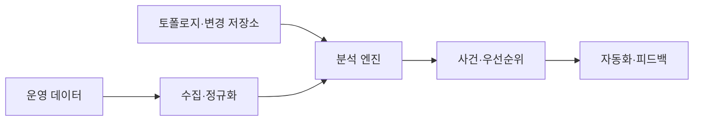
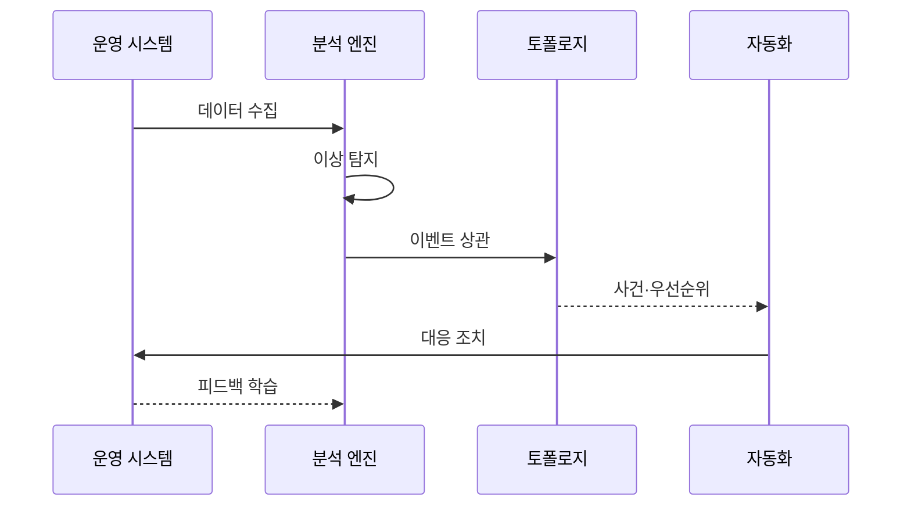

---
sidebar:
  order: 167
  label: "167. AIOps (Artificial Intelligence for IT Operations)"
  badge:
    text: "기출 · 70%"
    variant: note
title: "AIOps (Artificial Intelligence for IT Operations)"
date: "2026-07-27T23:59:59+09:00"
tags:
  - "notes-software"
weight: 167
extra:
  question_no: "167"
  source_status: "기출"
  source_history: "137회"
  priority: 70
  priority_note: "이상 탐지·원인 분석·자동 대응이 최근 출제됨"
---

## 미리 알고가기

- **인공지능 기반 IT 운영(Artificial Intelligence for IT Operations, AIOps)**: ‘에이아이옵스’로 읽고 AI와 Operations를 결합한 명칭이며, 운영 데이터의 이상·사건 관계·대응 후보를 분석하는 체계
- **정보기술(Information Technology, IT)**: ‘아이티’로 읽고 영문 첫 글자를 딴 약어이며, AIOps가 감시·분석·자동화하는 시스템 운영 영역
- **파드·노드(Pod·Node)**: 파드는 하나 이상의 컨테이너를 묶은 실행 단위이고 노드는 파드가 실행되는 서버
- **쿠버네티스(Kubernetes)**: 컨테이너화된 응용의 배포·확장·복구를 자동화하며 AIOps가 파드·노드·배포 신호를 분석하는 운영 플랫폼
- **이상 탐지**: 과거 또는 동적 기준에서 벗어난 시계열·로그·이벤트를 식별함
- **이벤트 상관**: 시간·서비스 의존성·공통 변경을 기준으로 여러 경보를 하나의 사건 후보로 묶음
- **토폴로지**: 서비스·Pod·노드·데이터베이스의 의존 관계와 변경 영향을 나타냄
- **런북(Runbook)**: ‘실행하다’와 ‘절차서’를 결합한 영문 운영 용어이며, 확인·완화·복구 동작과 승인 조건을 정의한 절차
- **마스킹·스키마 검증**: 민감값을 가리고 데이터 필드와 형식이 규칙에 맞는지 확인함
- **모델 드리프트**: 운영 환경 변화로 학습 모델의 탐지 정확도가 낮아지는 현상임
- **학습 데이터 편향과 서비스 변경**: 오탐·미탐을 만들 수 있어 피드백과 모델 검증이 필요함

## Ⅰ. 개요

- 정의/개념: AI 기반 **운영 이상·사건 상관·대응 자동화**
- 기존 한계: 규칙·수동 분석은 **경보 폭주·원인 식별 지연**

### 쉽게 이해하기 (학습용)
- 경보들을 하나로 묶어 우선순위를 알림

## Ⅱ. 특징

- **다종 운영 데이터 정규화**로 공통 분석 문맥 구성
- **동적 이상 탐지·토폴로지 상관**으로 사건 추론
- **신뢰도 기반 자동화·피드백**으로 대응 개선

### 쉽게 이해하기 (학습용)
- 기록 시간을 맞춰 묶고 위험 조치 범위를 제한

## Ⅲ. 아키텍처 및 구성요소

| 설계 요소 | 설명 |
|:---|:---|
| 수집·정규화 계층 | 로그·지표·이벤트의 **형식·시간 정렬** |
| 토폴로지·변경 저장소 | **서비스 의존성·배포 이력** 제공 |
| 분석 엔진 | **이상 탐지·이벤트 상관** 수행 |
| 사건·우선순위 계층 | 경보를 사건화하고 **영향도 정렬** |
| 자동화·피드백 | 실행 결과를 **모델·규칙 개선**에 반영 |

> 요약: 운영 신호를 결합해 대응 우선순위를 생성함

### 쉽게 이해하기 (학습용)
- 신호를 맞추고 의존 관계를 분석해 순서를 찾음

## Ⅳ. 원리 및 절차 흐름도

| 절차 | 설명 |
|:---|:---|
| 데이터 수집 | 운영 데이터를 **수집·정규화** |
| 이상 탐지 | 동적 기준으로 **이상 신호 식별** |
| 이벤트 상관 | 의존성·변경으로 **관련 경보 묶음** |
| 사건·우선순위 | 사용자 영향으로 **사건 정렬** |
| 대응 조치 | 신뢰도별 **승인·런북 실행** |
| 피드백 학습 | 조치 결과로 **모델·규칙 갱신** |

> 요약: 신호를 분석해 사건 후보를 만들고 조치함

### 쉽게 이해하기 (학습용)
- 관련된 경보를 묶어 조치하고 결과를 배움

## Ⅴ. 종류 및 비교

| 운영 분석 방식 | 규칙 기반 분석 | AIOps |
|:---|:---|:---|
| 적용 기준 | 예측 가능한 **명확한 임계 조건** | 대규모 신호의 **패턴·원인 추론** |
| 핵심 특징 | **고정 임계치·명시 규칙** | **학습 패턴·토폴로지 상관** |
| 한계 | 규칙 누적·**환경 변화 누락** | 드리프트·오탐·**자동화 오작동** |

> 요약: 신호를 연결해 사건 후보를 만들고 검증함

### 쉽게 이해하기 (학습용)
- 규칙은 선을 알리고, AIOps는 연계해 배움

## Ⅵ. 실무 사례

1. Kubernetes는 **배포·경보 상관**으로 사건 통합

### 쉽게 이해하기 (학습용)
- Kubernetes는 같은 배포의 경보를 사건으로 묶음

## Ⅶ. 결론

- 신뢰도 높으면 **자동 실행**, 낮으면 **사람 승인**

### 쉽게 이해하기 (학습용)
- 원인 확신이 낮을 때 사람이 조치를 확인해야 함
