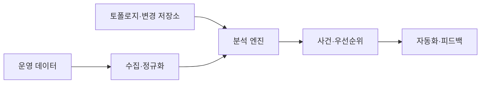

---
sidebar:
  order: 167
  label: "167. AIOps (Artificial Intelligence for IT Operations)"
  badge:
    text: "기출 · 70%"
    variant: note
title: "AIOps (Artificial Intelligence for IT Operations)"
date: "2026-07-25T00:40:00+09:00"
tags:
  - "notes-software"
weight: 167
extra:
  question_no: "167"
  source_status: "기출"
  source_history: "137회"
  priority: 70
  priority_note: "이상 탐지·원인 분석·자동 대응이 최근 출제됨"
---

## 미리 알고가기

- **인공지능 기반 IT 운영(Artificial Intelligence for IT Operations, AIOps)**: 이상·사건 관계·대응 후보를 제시함
- **Pod·노드**: Pod는 컨테이너 실행 단위이고 노드는 Pod가 실행되는 서버임
- **이상 탐지**: 과거 또는 동적 기준에서 벗어난 시계열·로그·이벤트를 식별함
- **이벤트 상관**: 시간·서비스 의존성·공통 변경을 기준으로 여러 경보를 하나의 사건 후보로 묶음
- **토폴로지**: 서비스·Pod·노드·데이터베이스의 의존 관계와 변경 영향을 나타냄
- **Runbook**: 확인·완화·복구 동작과 승인 조건을 정의한 운영 절차임
- **마스킹·스키마 검증**: 민감값을 가리고 데이터 필드와 형식이 규칙에 맞는지 확인함
- **모델 드리프트**: 운영 환경 변화로 학습 모델의 탐지 정확도가 낮아지는 현상임
- **학습 데이터 편향과 서비스 변경**: 오탐·미탐을 만들 수 있어 피드백과 모델 검증이 필요함

## Ⅰ. 개요

- **정의/개념**: AI 기술을 적용하여 원인을 분석하고 복구함
- **배경/필요성**: 중복 경보·의존 관계로 자동 상관 분석 필요

### 쉽게 이해하기 (학습용)
- 경보들을 하나로 묶어 우선순위를 알림

## Ⅱ. 특징

- 운영 데이터를 공통 문맥으로 정규화한다.
- 시계열과 패턴의 동적 기준으로 이상을 탐지한다.
- 토폴로지 관계로 경보를 묶어 영향 범위를 낸다.
- 신뢰도에 따라 자동 실행하고 조치를 피드백한다.
- 수집 전 민감정보를 마스킹해 분석 노출을 줄인다.
- 필드·형식 편차는 스키마 검증으로 정규화 오류를 차단한다.

### 쉽게 이해하기 (학습용)
- 기록 시간을 맞춰 묶고 위험 조치 범위를 제한

## Ⅲ. 아키텍처 및 구성요소

| 설계 요소 | 설명 |
|:---|:---|
| 수집·정규화 계층 | 데이터를 수집하고 시간과 누락을 정리함 |
| 토폴로지·변경 저장소 | 서비스 의존 관계와 배포 이력을 제공함 |
| 분석 엔진 | 이상 탐지와 이벤트 상관 및 분석을 수행함 |
| 사건·우선순위 계층 | 경보를 묶고 사용자 영향으로 정렬함 |
| 자동화·피드백 | 실행 결과를 모델 및 규칙 개선에 반영함 |

> 요약: 운영 신호를 결합해 대응 우선순위를 생성함

### 쉽게 이해하기 (학습용)
- 신호를 맞추고 의존 관계를 분석해 순서를 찾음

## Ⅳ. 원리 및 절차 흐름도

| 절차 | 설명 |
|:---|:---|
| **데이터수집** | 운영 데이터를 수집하고 정규화함 |
| **이상탐지** | 분석 엔진으로 이상 신호를 식별함 |
| **이벤트상관** | 리소스 의존성과 변경 묶음을 분석함 |
| **대응조치** | 자동 실행을 수행하고 승인을 획득함 |
| **피드백학습** | 조치 결과와 변경 적용 정책을 학습함 |

> 요약: 신호를 분석해 사건 후보를 만들고 조치함

### 쉽게 이해하기 (학습용)
- 관련된 경보를 묶어 조치하고 결과를 배움

## Ⅴ. 종류 및 비교

| 비교축 | 규칙 기반 운영 분석 | AIOps |
|:---|:---|:---|
| 핵심 특징 | 고정 임계치로 경보를 판정함 | 학습 패턴과 토폴로지로 사건을 추정함 |
| 적용 기준 | 예측 가능한 장애 알림을 설정 시 | 패턴 분석으로 원인을 추론할 때 |
| 주요 위험 | 규칙 누적·환경 변화 누락 | 드리프트·오탐·자동화 오작동 |

> 요약: 신호를 연결해 사건 후보를 만들고 검증함

### 쉽게 이해하기 (학습용)
- 규칙은 선을 알리고, AIOps는 연계해 배움

## Ⅵ. 실무 사례

1. Kubernetes는 배포 변경으로 사건을 묶음
2. 스토리지는 복구 성공률과 오탐률을 확인함

### 쉽게 이해하기 (학습용)
- Kubernetes는 같은 배포의 경보를 사건으로 묶음
- 스토리지는 복구 성공률로 자동화를 검증함

## Ⅶ. 결론

- 오탐률이 높으면 자동 복구 대신 승인을 거침

### 쉽게 이해하기 (학습용)
- 원인 확신이 낮을 때 사람이 조치를 확인해야 함
