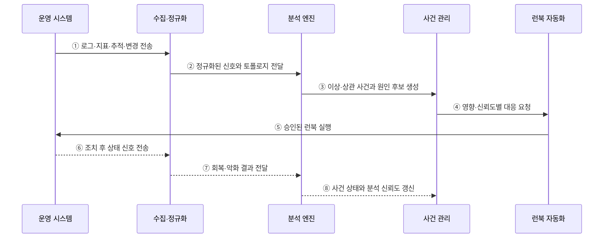

---
sidebar:
  order: 167
  label: "167. AIOps (Artificial Intelligence for IT Operations)"
  badge:
    text: "기출 · 70%"
    variant: note
title: "AIOps (Artificial Intelligence for IT Operations)"
date: "2026-07-27T23:59:59+09:00"
tags:
  - "notes-software"
weight: 167
extra:
  question_no: "167"
  source_status: "기출"
  source_history: "137회"
  priority: 70
  priority_note: "이상 탐지·원인 분석·자동 대응이 최근 출제됨"
---

## 미리 알고가기

- **인공지능 기반 IT 운영(Artificial Intelligence for IT Operations, AIOps·에이아이옵스)**: 기계학습과 데이터 분석으로 운영 이상·사건 관계·대응 후보를 찾는 체계
- **이상 탐지(Anomaly Detection)**: 고정 임계치나 학습한 정상 범위를 벗어난 시계열·로그·이벤트를 식별하는 분석
- **이벤트 상관(Event Correlation)**: 시간·서비스 의존성·공통 변경을 기준으로 여러 경보를 하나의 사건 후보로 묶는 분석
- **토폴로지(Topology)**: 서비스·파드·노드·데이터베이스 사이의 의존 관계
- **변경 이벤트(Change Event)**: 배포·설정·용량 변경처럼 장애 원인 후보가 될 수 있는 운영 기록
- **런북(Runbook)**: 확인·완화·복구 절차와 실행 조건을 정리한 운영 절차서
- **모델 드리프트(Model Drift)**: 운영 환경이나 데이터 분포가 변해 모델의 탐지 성능이 낮아지는 현상
- **오탐·미탐(False Positive·False Negative)**: 정상 상태를 이상으로 판단하는 오류와 실제 이상을 놓치는 오류
- **가역 조치(Reversible Action)**: 실패하거나 예상과 다른 결과가 나면 이전 상태로 되돌릴 수 있는 대응

## Ⅰ. 개요

- AIOps는 대량의 운영 데이터를 분석해 **이상 탐지·경보 통합·원인 후보·대응 우선순위**를 제공한다.
- 고정 임계치와 수동 분석만으로 감당하기 어려운 경보 폭주와 원인 식별 지연을 줄인다.
- 사람의 운영 판단을 대체하기보다 반복 분석과 저위험 대응을 보조·자동화하는 체계다.

### 쉽게 이해하기 (학습용)
- 흩어진 경보를 관련 사건끼리 묶고 먼저 볼 문제를 추천함

## Ⅱ. 특징

- **다중 데이터 결합**: 로그·메트릭·추적·이벤트·변경 이력을 공통 시간과 자원 문맥으로 정렬한다.
- **동적 탐지**: 시간대·계절성·서비스별 정상 범위를 학습해 이상을 찾는다.
- **관계 분석**: 토폴로지와 변경 이력으로 연관 경보와 원인 후보를 좁힌다.
- **우선순위화**: 사용자 영향·범위·심각도·신뢰도로 사건 대응 순서를 정한다.
- **통제된 자동화**: 신뢰도와 위험도에 따라 추천·승인·자동 실행 단계를 나눈다.
- **지속 개선**: 운영자 판정과 조치 결과를 규칙·모델 개선에 반영한다.

### 쉽게 이해하기 (학습용)
- 신호의 시간·대상·변경 관계를 맞춰 하나의 장애 후보로 압축함

## Ⅲ. 아키텍처 및 구성요소

**도표안 A — 구조도**

**도표안 B — sequenceDiagram**

| 구성요소 | 역할 |
|:---|:---|
| 데이터 수집·정규화 | 형식·시간·자원 식별자를 통일하고 품질 검증 |
| 토폴로지·변경 저장소 | 서비스 의존성과 배포·설정 이력 제공 |
| 분석 엔진 | 이상 탐지·중복 제거·이벤트 상관·원인 후보 산출 |
| 사건 관리 | 사용자 영향·범위·심각도·신뢰도로 우선순위 결정 |
| 런북 자동화 | 추천·승인·자동 실행과 실패 시 복귀 수행 |
| 피드백·모델 관리 | 운영자 판정·조치 결과·드리프트를 학습과 검증에 반영 |

**동작 원리**

- ① 운영 시스템이 로그·메트릭·추적·경보·변경 이벤트를 수집 계층에 보낸다.
- ② 수집 계층이 형식·시간·자원 식별자를 맞추고 토폴로지를 결합해 분석 엔진에 전달한다.
- ③ 분석 엔진이 이상을 찾고 관련 경보를 묶어 원인 후보와 신뢰도를 생성한다.
- ④ 사건 관리가 사용자 영향과 분석 신뢰도에 따라 런북의 추천·승인·자동 실행을 요청한다.
- ⑤ 런북 자동화는 승인된 재시작·확장·롤백 같은 조치를 운영 시스템에 실행한다.
- ⑥ 운영 시스템은 조치 이후의 성능·오류·상태 신호를 다시 보낸다.
- ⑦ 수집 계층은 회복 여부와 부작용을 분석 엔진에 전달한다.
- ⑧ 분석 엔진은 사건 상태와 신뢰도를 갱신하고 결과를 향후 분석에 반영한다.

### 쉽게 이해하기 (학습용)
- 이상을 찾고 관련 경보를 묶은 뒤 안전한 조치 결과까지 다시 학습함

## Ⅳ. 종류 및 비교

| 구분 | 규칙 기반 운영 분석 | AIOps |
|:---|:---|:---|
| 판단 기준 | 고정 임계치·명시 조건 | 학습 패턴·상관관계·토폴로지 |
| 강점 | 동작이 명확하고 설명하기 쉬움 | 대량·다변량 신호와 변화하는 기준 처리 |
| 적합 대상 | 알려진 장애·안전 규칙 | 경보 통합·이상 탐지·원인 후보 탐색 |
| 한계 | 규칙 증가·환경 변화 누락 | 데이터 편향·드리프트·설명 부족 |
| 자동화 | 사전 정의 조건 충족 시 실행 | 신뢰도·위험도 기반 추천·승인·실행 |

| 자동화 수준 | 적용 조건 | 처리 방식 |
|:---|:---|:---|
| 추천 | 신뢰도 낮음·영향 큼 | 원인·조치 후보만 제공 |
| 승인 후 실행 | 신뢰도 중간·가역 조치 | 운영자 확인 뒤 런북 실행 |
| 자동 실행 | 신뢰도 높음·저위험·가역 | 제한된 범위에서 실행 후 결과 검증 |

### 쉽게 이해하기 (학습용)
- 규칙은 아는 조건을 찾고 AIOps는 여러 신호에서 낯선 패턴과 관계를 찾음

## Ⅴ. 실무 고려사항 및 대책

| 고려사항 | 위험 | 대책 |
|:---|:---|:---|
| 데이터 품질 | 누락·시간 오차·식별자 불일치로 잘못된 상관 | 스키마 검증·시간 동기화·공통 자원 ID 적용 |
| 민감정보 | 로그·이벤트의 개인정보·비밀 유출 | 수집 전 마스킹·최소 수집·접근 통제 |
| 모델 드리프트 | 배포·트래픽 변화 후 오탐·미탐 증가 | 기준 성능 감시·주기 검증·재학습 |
| 설명 가능성 | 근거 없는 원인 추천으로 신뢰 저하 | 관련 신호·토폴로지·변경 근거 함께 제시 |
| 자동화 위험 | 오판 조치가 장애 범위 확대 | 고신뢰·저위험·가역 조치부터 단계 적용 |
| 피드백 편향 | 잘못된 운영자 판정이 모델에 누적 | 다중 검토·라벨 품질 검사·변경 이력 관리 |
| 효과 측정 | 도구 도입이 운영 개선으로 이어지지 않음 | 경보 감소율·탐지 시간·복구 시간·재발률 측정 |

### 쉽게 이해하기 (학습용)
- 사례: 쿠버네티스 배포 직후 여러 파드 경보가 나면 같은 변경 사건으로 묶어 롤백을 제안함

## Ⅵ. 결론

- AIOps의 핵심은 **운영 데이터를 공통 문맥으로 연결해 사건과 대응 후보로 압축**하는 것이다.
- 분석 결과는 확정 원인이 아니라 증거와 신뢰도를 가진 후보로 다뤄야 한다.
- 데이터 품질·드리프트·설명 가능성을 관리하고 고신뢰·저위험·가역 조치부터 자동화해야 한다.

### 쉽게 이해하기 (학습용)
- AI가 원인 후보를 좁히되 위험한 조치는 사람이 근거를 확인함
