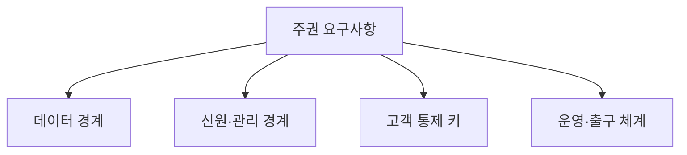

---
sidebar:
  order: 168
  label: "168. 소버린 클라우드 (Sovereign Cloud)"
  badge:
    text: "기출 · 70%"
    variant: note
title: "소버린 클라우드 (Sovereign Cloud)"
date: "2026-07-25T00:40:00+09:00"
tags:
  - "notes-software"
weight: 168
extra:
  question_no: "168"
  source_status: "기출"
  source_history: "138회"
  priority: 70
  priority_note: "데이터 주권과 운영 통제권이 최근 직접 출제됨"
---

## 미리 알고가기

- **데이터 레지던시**: 데이터가 저장·처리되는 물리적 위치를 제한함
- **법적·관할 주권**: 서비스와 데이터가 적용받는 법률·외국 기관 요구·권리 집행 범위를 다룸
- **운영 주권**: 정한 관할의 인력과 조직이 서비스 운영·지원·복구를 통제하는 능력임
- **기술 주권**: 개방성·상호운용성·감사 가능성과 특정 공급자 종속 범위를 다룸
- **암호키 통제**: 키 생성·보관·사용·폐기 권한과 운영자 접근 경계를 포함함
- **출구 전략**: 데이터·이미지·설정·로그를 다른 환경으로 이전하고 기존 사본을 폐기하는 계획임
- **롤백**: 이전 검증 실패 시 기존 정상 환경으로 되돌리는 복구임

## Ⅰ. 개요

- **정의/개념**: 국가 규제에 맞춰 데이터·제어권을 독자 통제
- **배경/필요성**: 외국 관할·기술 종속으로 주권 통제 필요

### 쉽게 이해하기 (학습용)
- 물리적 위치를 넘어 운영과 암호키 통제권을 가짐

## Ⅱ. 특징

- 지리적 경계와 처리 경로를 제한한다.
- 운영 인력 관할과 데이터 접근을 제한한다.
- 암호키 소유권과 감사 증적을 보유한다.
- 공급망과 출구 전략의 실행 가능성을 검증한다.

### 쉽게 이해하기 (학습용)
- 운영 주체와 암호키 소유 및 기술 종속을 점검함

## Ⅲ. 아키텍처 및 구성요소

| 설계 요소 | 설명 |
|:---|:---|
| 주권 요구사항 | 적용 법률과 허용 지역을 정의함 |
| 데이터 경계 | 저장·처리·백업 이동을 제한함 |
| 관리 경계 | 위치·승인·비상 접근을 통제함 |
| 고객 통제 키 | 키 생성·보관·사용 권한을 관리함 |
| 운영·출구 체계 | 관할 내 사고 대응과 이전을 검증함 |

> 요약: 주권 요구사항이 각 경계별 통제로 구현됨

### 쉽게 이해하기 (학습용)
- 통제 수준을 정하고 경계별로 맞춘 뒤 검증함

## Ⅳ. 원리 및 절차 흐름도

| 절차 | 설명 |
|:---|:---|
| 통제적용 | 주권 법률과 암호키 통제 적용함 |
| 배치거부 | 비인가 관할 자원 생성을 차단함 |
| 무단차단 | 비인가 관리자의 접근을 차단함 |
| 이전검증 | 출구 전략 자산 이전을 검증함 |
| 실패롤백 | 검증 실패 시 기존 상태 복구함 |

> 요약: 요구를 관할 및 키 통제로 구현하고 검증함

### 쉽게 이해하기 (학습용)
- 관할과 이동 경로를 정하고 종속성을 확인함

## Ⅴ. 종류 및 비교

| 비교축 | 데이터 레지던시 | 소버린 클라우드 |
|:---|:---|:---|
| 핵심 특징 | 데이터 위치 저장 제한 | 법적 관할과 전체 통제 |
| 적용 기준 | 저장 위치 규제만 충족 | 관할·접근·키·운영 통제 필요 |
| 주요 위험 | 운영자·키 통제 누락 | 공급자 종속·이전 검증 실패 |

> 요약: 단순 저장 위치를 넘어 관할과 키를 통제함

### 쉽게 이해하기 (학습용)
- 저장 위치를 넘어 법과 암호키 통제권을 다룸

## Ⅵ. 실무 사례

1. 공공 업무는 관할 인력과 키 소유 확인함
2. 규제 시스템은 지역 복제와 이전 전략 검증함

### 쉽게 이해하기 (학습용)
- 공공 업무는 관할 인력과 키 소유자를 확인함
- 규제 시스템은 지역 복제와 이전을 검증함

## Ⅶ. 결론

- 관할·키·이전 증적이 모두 충족될 때 채택함

### 쉽게 이해하기 (학습용)
- 저장 지역뿐 아니라 운영자와 키 소유자도 확인함
